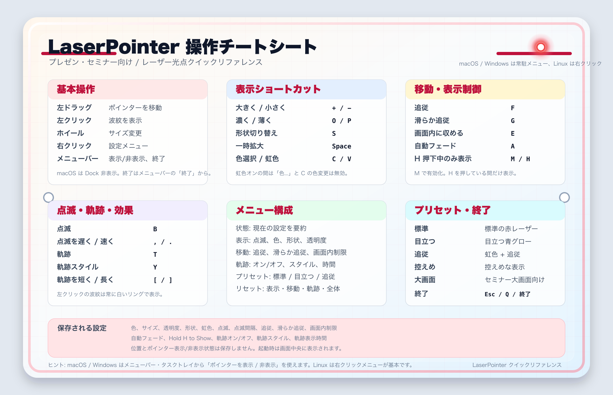

# LaserPointer

日本語 | [English](README.en.md)

LaserPointer は、画面上にレーザー光点を重ねて表示する Qt Widgets アプリケーションです。
プレゼンテーション、セミナー、画面共有中に注目してほしい場所を示せます。

光点を左ドラッグで任意の位置に置けるほか、マウスポインターへの追従も選べます。

## 主な機能

- 透明背景・フレームレス・最前面表示のポインター
- サイズ、色、透明度、形状（Glow / Ring / Cross / Star）の変更
- 点滅、虹色、クリック時の白い波紋、Space キーによる一時拡大
- マウスポインター追従、滑らか追従、画面内制限
- 軌跡（Glow / Dots）、自動フェード、H キーを押している間だけ表示するモード
- 用途別プリセットと `QSettings` による設定の保存
- macOS のメニューバー、Windows のタスクトレイからの操作

メニューとヘルプは、システム言語が日本語の場合は日本語、それ以外は英語で表示します。

## ビルド

必要なものは CMake 3.16 以上、C++17 対応コンパイラー、Qt 6 Widgets です。
`qt_standard_project_setup()` が利用できる Qt 環境を使用してください。
現在のプロジェクトバージョンは `CMakeLists.txt` の `1.0.0` です。

この `LaserPointer/` ディレクトリーで実行します。

```sh
cmake -S . -B build
cmake --build build --config Release
```

Qt を検出できない場合は、構成時にインストール先を指定します。

```sh
cmake -S . -B build -DCMAKE_PREFIX_PATH=/path/to/Qt/6.x/platform
```

macOS では、アーキテクチャーを指定しなければ arm64 / x86_64 の universal binary を構成します。

## 起動

macOS:

```sh
open build/LaserPointer.app
```

Linux:

```sh
./build/LaserPointer
```

Windows（複数構成ジェネレーターの Release ビルド）:

```powershell
.\build\Release\LaserPointer.exe
```

生成先は CMake ジェネレーターによって異なります。単一構成では `build/LaserPointer.exe`、
macOS の複数構成では `build/Release/LaserPointer.app` などになります。
macOS / Windows では常駐アイコンから表示・非表示を切り替えられます。
Linux ではポインターの右クリックメニューを使います。

## 基本操作

| 操作 | 内容 |
|---|---|
| 左ドラッグ | 光点を移動（追従オフ時） |
| 左クリック | 白い波紋を表示 |
| マウスホイール / `+` / `-` | サイズ変更 |
| 右クリック | 設定メニューを開く |
| `F` | マウスポインター追従を切り替え |
| `T` | 軌跡を切り替え |
| `Space` | 押している間だけ拡大 |
| `R` | すべての設定をリセット |
| `Esc` / `Q` | 終了 |

初回は赤色、サイズ96、透明度100%、軌跡オフ、追従オフで起動します。
設定は次回起動時に復元されますが、位置は保存せず画面中央に表示します。

## 関連文書

- [利用ガイド](USER_GUIDE.md)：設定、全ショートカット、トラブルシュート
- [利用ガイド PDF](USER_GUIDE.pdf)
- [操作チートシート PNG](laserpointer-cheatsheet.png) / [SVG](laserpointer-cheatsheet.svg)


