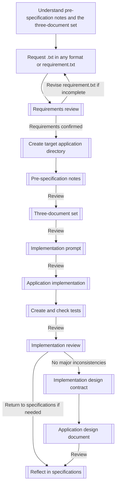
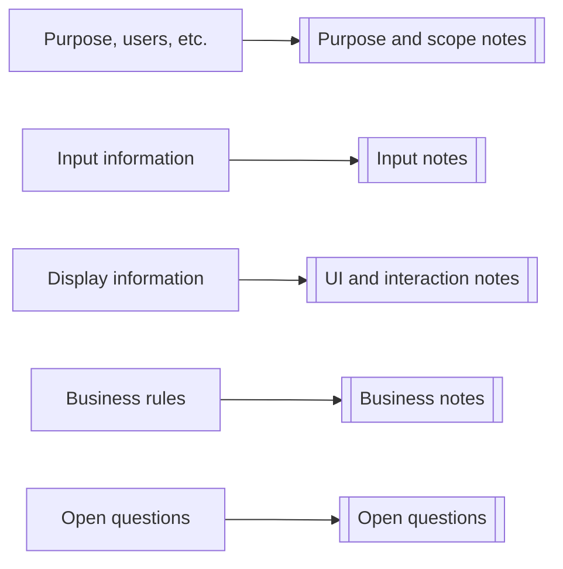
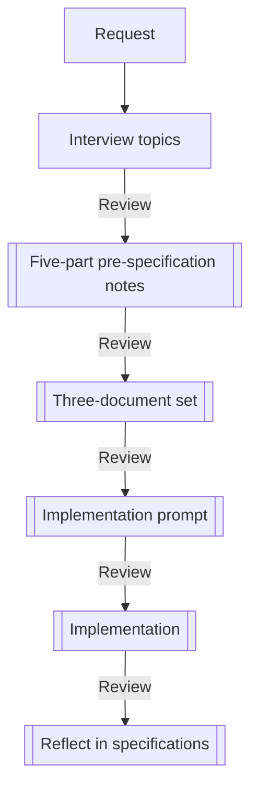
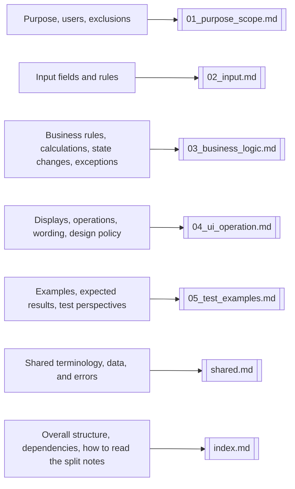
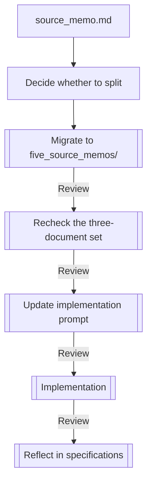
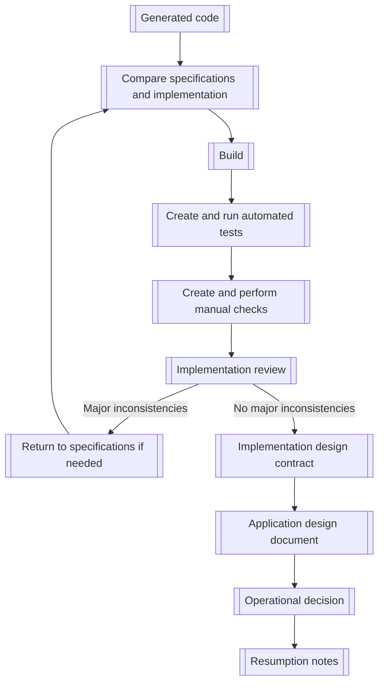
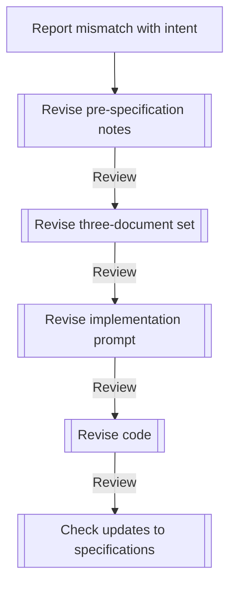

---
genpdf:
  format: book
  title: Application Generation Workflow Guide
  subtitle: Creating applications with pre-specification notes
  author: SRA, Inc.
  version: 0.2.2
  date: 2026-06-23
  font_size: 12pt
  page_numbers: true
  copyright: 2026 SRA, Inc. All rights reserved.
  table:
    header_background: "#e8f1ff"
    header_color: "#1f2937"
    border_color: "#cbd5e1"
    border_width: "1px"
    stripe: true
    stripe_background: "#f8fafc"
    cell_padding: "0.45em 0.65em"
    font_size: "0.95em"
    compact: false
    align: left
    header_align: center
    cell_align: left
---

# User Guide

This guide is for people creating applications with `app-generation-workflow`.

The workflow does not begin with implementation. First, gather material from a
request `.txt` in any format into pre-specification notes. Build a three-document
specification set from those notes, then choose an implementation approach and
create the application. To reduce unresolved questions, start by organizing the
request with the recommended `templates/requirement.txt` template.

This guide is the user entry point. `three_key_documents_workflow.md` is the
authoritative procedure; consult it when detailed decisions are unclear.

Refer only to the workflow copied into the user's workspace, not copies in other
locations. Treat that copy as a template and do not put application-specific content into it.

## What to Read First

Read this guide, followed by the authoritative procedure:

- `three_key_documents_workflow.md`

To give an AI the working context, use an instruction like:

```text
Read app-generation-workflow/three_key_documents_workflow.md.
```

## Understanding Roles

The AI drafts, identifies issues, checks correspondence, and assists reviews.
People do not automatically accept AI output as official specifications or
implementation: they decide what to adopt, business policy, safety, exclusions,
and which earlier stage to return to.

| Label | Meaning |
| --- | --- |
| Human-led | A person decides, adopts, modifies, or approves |
| AI-led | AI is asked to draft, identify issues, cross-check, or assist review |
| Joint | AI proposes candidates and questions; a person decides whether to adopt them |

## Basic Flow



Roles by stage, first half:

| Stage | Lead | Human decision |
| --- | --- | --- |
| Requirements review | Joint | Identify missing information and adopt additions |
| Pre-specification notes | Joint | Open questions, exclusions, adoption decisions |
| Three-document set | AI-led, human-reviewed | Whether the specifications are correct |
| Implementation prompt | AI-led, human-reviewed | Approach, exclusions, open questions |
| Application implementation | AI-led | Whether the generated result is acceptable |

<div class="page-break"></div>

Second half:

| Stage | Lead | Human decision |
| --- | --- | --- |
| Generated-code inspection | Human-led, AI-assisted | Which stage to return to |
| Test creation and checking | Joint | Whether expected values come from specifications |
| Implementation review | Joint | Whether to proceed to design documentation |
| Implementation design contract | AI-led, human-reviewed | Whether specification-to-code mappings are correct |
| Application design document | AI-led, human-reviewed | Whether the design can be finalized |

Each relevant section starts with its **Output**.

## 1. Create Pre-Specification Notes

Lead: Joint. AI helps identify gaps and draft notes; people decide requirements,
open questions, exclusions, and what to adopt.
Output: `requirement.txt`, `source_memo.md`.

User requests arrive as `.txt` files in any format. They are raw input, not
implementation specifications.

To reduce open questions, copy this recommended template as `requirement.txt`.
Any request format is acceptable, but this template helps reveal gaps before
writing pre-specification notes:

```text
app-generation-workflow/templates/requirement.txt
```

After receiving a request `.txt` or `requirement.txt`, the AI reviews the
requirements. It checks whether there is enough material for pre-specification
notes: purpose, users, application type, inputs, displays, operations,
state-specific operations, interaction conflicts, OS/input-device differences,
rules, exclusions, exceptions, representative examples, and open questions.

If information is missing, the AI presents questions for the user, proposed
additions to `requirement.txt`, and areas it might otherwise fill by inference.
Proposals are recommendations, not official requirements until the user adopts
them. If gaps affect implementation or the three-document set, revise
`requirement.txt` before proceeding. Stopping here is correct: it prevents
plausible-looking specifications or code from being built on ambiguous requirements.

After requirements review passes, create a new target-application directory.
Keep all pre-specification notes, specifications, implementation prompts, and
source code under it.

Copy this template into that directory:

```text
app-generation-workflow/templates/source_memo.md
```

Example destination:

```text
my-app/source_memo.md
```

Populate the copied `source_memo.md` with:

- Application purpose
- Users
- Application type
- What users want to do
- Input information
- Information to display
- Rules to follow
- States and processing flow
- Operations by state, interaction conflicts, and categories of operation targets
- Round-trip operations and OS/input-device differences
- Representative examples and expected results
- Features not to build
- Undecided matters

Choose the closest application type first. If several apply, select one primary
purpose and record the others as notes. A provisional choice is acceptable.

Main types:

- Input / calculation / result-display application
- Data management application
- Viewer
- Editor
- Conversion tool
- Game / interactive application
- Other

Do not write application-specific content into the original templates or modify
the copied workflow itself.

For each open question, add one line naming where the decision will be recorded:

```text
- Open question: Choose JSON, SQLite, or CSV for storage. Record the decision in: States and processing flow, Input rules, and Implementation approach if needed.
```

If the first notes contain open questions, decide them in response to the AI's
questions. If the user decides there are none to retain, write `- None` in that
section. Otherwise, the AI presents recommendations. Once a recommendation is
adopted or amended, remove it from open questions and move the decision into the
appropriate section.

Check that the notes cover the entire request `.txt` and clearly organize open
questions and exclusions. AI-generated notes are drafts; a person must review
them before proceeding to the three-document set.

### 1.1 Notes for Reverse-Generation Review

When reconstructing notes from existing implementation, a generated specification
set, or code, use this instead of the normal `templates/source_memo.md`:

```text
app-generation-workflow/templates/source_memo_reverse_review.md
```

Place the copy as `source_memo.md`, as for normal notes:

```text
my-app/source_memo.md
```

Observed implementation behavior is not necessarily the correct specification.
Separate observed behavior, behavior adopted as specification, and possible bugs
or items requiring confirmation.

Key checks:

- Has observed behavior been copied directly into official specifications?
- Have possible bugs or incidental behavior been adopted as requirements?
- Have people approved expected results for boundaries and representative examples?
- Are unresolved questions incorrectly stated as settled specifications in the body?

## 2. Create the Three-Document Set

Lead: AI-led, human-reviewed. AI drafts the set; a person checks whether it can
be adopted as the specification.
Output: `specs/01_usecase_spec.md`, `specs/02_ui_spec.md`, `specs/03_business_spec.md`.

Create the following from the pre-specification notes:

```text
my-app/specs/01_usecase_spec.md
my-app/specs/02_ui_spec.md
my-app/specs/03_business_spec.md
```

Templates:

```text
app-generation-workflow/templates/01_usecase_spec.md
app-generation-workflow/templates/02_ui_spec.md
app-generation-workflow/templates/03_business_spec.md
```

Roles:

- Use case specification: User goals, scenarios, success conditions, exceptions.
- UI specification: Screens, input fields, displays, operations, error messages.
- Business-layer specification: UI-independent data, validation, calculations, saving, updating, deletion, and state changes.

Carry forward the application type selected in `source_memo.md`. It is a guide
to relevant perspectives, not a fixed requirement. Games and interactive apps
emphasize state transitions and termination conditions; conversion tools
emphasize parsing, transformation, output, and failure conditions.

Use optional template patterns only when needed. If the application does not
need management screens, add/delete operations, state management, aggregation,
or save/load features, mark them as out of scope or none.

### 2.1 Review the Three-Document Set

Review before implementation. AI-generated specifications remain drafts until a
person reviews them and necessary corrections are applied. Do not create
implementation prompts or source code from an unreviewed set.

Choose a lightweight, standard, or focused review according to scale and risk.

Lightweight review:

- Small applications, prototypes, or changes with limited impact.
- Check blanks, open questions, and obvious contradictions.

Standard review:

- Normal new applications, feature additions, or specification changes.
- Check correspondence among the three documents and with the notes, exclusions, and test perspectives.

Focused review:

- Reverse generation from existing code, language ports, business-rule-heavy apps, or features with significant failure impact.
- Check saving, deletion, billing, personal data, permissions, integrations, safety, and porting risks.
- Check that possible bugs or incidental behavior are not adopted as official specifications.

Use AI to list formatting issues, blanks, contradictions, omissions, assumptions,
open questions, and possible bugs. People use that list to decide adoption,
business policy, safety, exclusions, and porting policy.

## 3. Splitting Pre-Specification Notes

Lead: Joint. AI proposes the split and identifies migration gaps or duplication;
people decide the split and switch the authoritative source.
Output: Split notes under `five_source_memos/`.

Normally, start with one `source_memo.md`. Use five-part notes when:

1. The project is known to be large from the start.
2. A project that began with one note grows too large.

### 3.1 Large from the Start

If many screens, use cases, business rules, input fields, or exception conditions
are expected, create `five_source_memos/` directly. The split notes, rather than
`source_memo.md`, become the authoritative source.

Example layout:

```text
five_source_memos/
├─ index.md
├─ shared.md
├─ 01_purpose_scope.md
├─ 02_input.md
├─ 03_business_logic.md
├─ 04_ui_operation.md
└─ 05_test_examples.md
```

Mapping the nine interview topics:

In the diagram, “Purpose, etc.” includes purpose, users, application type,
desired activities, and excluded features.



Workflow:



### 3.2 Growing During Development

Starting with one `source_memo.md` is fine. Move to `five_source_memos/` when it
becomes too difficult to navigate.

Do not discard the original immediately. Create the split directory first and
move content by responsibility.

Destinations:



Workflow:



After migration, the split notes are authoritative. Subsequent corrections,
specification generation, and prompt updates refer to `five_source_memos/`, not
the old single note.

Even after splitting, corrections to misunderstood intent begin with the
relevant notes, followed by specifications, implementation prompts, and code.
Do not jump directly to specifications or code.

Check for missing or duplicated content, changed meaning, lost open questions,
consistent terminology, and the switch of authoritative source.

## 4. Create the Implementation Prompt

Lead: AI-led, human-reviewed. AI drafts; people check implementation approach,
exclusions, and open questions.
Output: `prompts/implementation_prompt.md`.

Choose an implementation approach after checking the reviewed specification set.
Do not generate a prompt from an unreviewed AI draft, a set with unresolved
questions, or a reverse-generated set whose adoption decisions are incomplete.

Examples:

- Qt desktop application
- Web application
- CLI tool
- Mobile application
- API server

Copy this template for the target application:

```text
app-generation-workflow/templates/implementation_prompt.md
```

If shared implementation constraints cover build compatibility, code-generation
policy, portability, or similar matters across the split workflow, copy this
template into the target directory. Keep these separate from the specification
set and consult them when creating prompts. Input rules in the notes should
contain business and input constraints, not build or code-generation policies.

```text
app-generation-workflow/templates/implementation_constraints.md
```

Example destination:

```text
my-app/prompts/implementation_prompt.md
my-app/implementation_constraints.md
```

State that the reviewed three-document set is the higher-level specification.
Set the working directory to the target application's directory and resolve
`source_memo.md`, `specs/`, and `implementation_constraints.md` from there.
If the constraints file exists, reference it as project-wide implementation constraints.

Check that the prompt references reviewed specifications and includes the
implementation, build, and test approaches, exclusions, and open questions.
By default, the prompt does not request test-code generation. It should require
UI-independent business logic so automated tests can be added after code generation.

Do not implement until `implementation_prompt.md` is usable. List missing items
as warnings if it is absent, contains blanks, references incomplete specifications,
lacks an implementation approach, or has questions that must be settled before implementation.

## 5. Implement the Application

Lead: AI-led, human-checked. AI writes source code; people check unrequested
features, provisional decisions, and structure.
Output: Target application source code.

Treat the specifications and implementation prompt as higher-level requirements.

Principles:

- Separate UI from business logic.
- Put validation and business rules in the business layer.
- Let the UI handle input, interaction, display, and error presentation.
- Structure code so tests can be added after generation.
- Do not invent features absent from the specifications.
- Resolve implementation-affecting open questions before implementation.
- Do not proceed with an unusable `implementation_prompt.md`.

After implementation, check conformance to the prompt and specifications.
Look for unrequested features, unapproved provisional decisions, missing error
conditions, insufficient tests, and decisions not reflected back into specifications.

Detailed post-generation procedure:

```text
docs/post_generation_workflow.md
```

## 6. Inspect Generated Code

Lead: Human-led, AI-assisted. AI helps compare and identify inconsistencies;
people decide which stage to return to.
Output: Specification-to-implementation comparison and inconsistency list.

Code generation is not completion. Review code, specifications, tests, manual
checks, and operating procedures in order before treating the implementation
as authoritative in later documents.



First check the structure: the target directory should contain `include/`,
`src/`, `prompts/implementation_prompt.md`, and the three specifications.
Excessive mixing of UI, application control, business logic, and data processing
makes subsequent reviews less effective.

Then check the chain: decisions in `source_memo.md` or `five_source_memos/`
appear in the specifications, those specifications appear in the prompt, and
the prompt's instructions appear in code. Check that reference images, external
assets, wording, and manual-check targets that are hard to reconstruct from
code have not been lost.

Do not fix only code when inconsistencies appear. Return to notes for missing
specification decisions, to the three documents for incomplete specifications,
or inspect prompt-to-code correspondence for missing implementation.

## 7. Build, Create Tests, Run Automated Tests, and Check Manually

Lead: Joint. AI proposes tests and manual checks; people validate expected
results and execute checks.
Output: Build results, automated tests, manual-check items, and results.

Build in the target directory after inspecting generated code. Procedures vary
by project; record actual commands, environment variables, dependencies, and
toolchain settings in `README.md`.

Example:

```sh
cmake -S . -B build
cmake --build build
```

After a successful build, create automated tests and manual-check items from the
specifications, prompt, and code. Do not derive expected values solely from code.
If implementation conflicts with specifications, list the inconsistency instead
of fixing the behavior in place through tests.

Automated tests should cover validation, normalization, key business rules,
boundaries, exceptions/errors, state transitions, and regression-prone calculations
or decisions. Run them after creation. Do not proceed to the design contract or
application design document while tests fail.

Example:

```sh
ctest --test-dir build --output-on-failure
```

Check what automated tests cannot guarantee using the manual-check list. As
needed, people inspect appearance, interaction, broken layouts, device differences,
external integrations, correspondence with reference images, and loading of
external assets. Check initial display, main operations, representative success
cases, invalid inputs, and situations that must retain the previous state.

Keep results somewhere traceable. Carry automated-test coverage, manually checked
items, unchecked items, and known differences into the design contract and application design document.

## 8. Review the Implementation

Lead: Joint. AI identifies contradictions, omissions, and unrequested additions;
people decide adoption, fixes, exclusions, and remaining risks.
Output: Implementation review results.

Review after building, automated testing, and manual checks. This is the gate
for creating the implementation design contract or application design document.

Check:

- Consistency among notes, specifications, prompt, and code.
- Implementation of all specified behavior.
- No unrequested convenience features.
- No unilateral provisional decisions on open questions.
- Error messages and exception conditions match specifications.
- Tests created after code generation are derivable from specifications.
- Reference images, external assets, and manual-check targets can be carried into later documents.
- Decisions made during implementation have been reflected back into specifications.

AI can list contradictions, omissions, extras, untested items, and known
differences. People decide whether to adopt a difference as specification, fix
the code, or record it as out of scope or a remaining risk.

Do not create the contract or design document while major inconsistencies,
missing specification updates, or unresolved provisional decisions remain.
First reconcile the notes, specifications, prompt, and code.

## 9. Return to Specifications When Inconsistencies Appear

Lead: Human-led, AI-assisted. AI suggests causes and destinations; people decide
where and how to correct them.
Output: Corrected notes, specifications, prompt, code, and tests.

| Inconsistency | Update destination |
| --- | --- |
| Missing specification decision | `source_memo.md` or `five_source_memos/` |
| Incorrect use cases or state transitions | `specs/01_usecase_spec.md` |
| Incorrect screens, displays, operations, or wording | `specs/02_ui_spec.md` |
| Incorrect business rules, calculations, validation, or normalization | `specs/03_business_spec.md` |
| Outdated implementation instructions | `prompts/implementation_prompt.md` |
| Code does not satisfy specifications or instructions | `include/`, `src/`, `tests/` |
| Outdated operating procedure | `README.md` |
| Outdated resumption notes | Target project's resumption notes |

After correction, repeat the build, automated tests, necessary manual checks,
and implementation review. Do not mark later design documents complete while
major inconsistencies remain unresolved.

## 10. Create the Implementation Design Contract

Lead: AI-led, human-reviewed. AI maps specifications to code; people check the
mapping and unresolved matters.
Output: `implementation_design_contract.md`.

After review confirms no major inconsistencies, create this document as needed
to trace correspondence between the specification set and code.

Include at least:

- Referenced specifications and code
- Specification items mapped to implementation locations
- Responsibilities of classes, modules, functions, and tests
- Implementation of validation, state transitions, business rules, and error handling
- Specification rationale that is hard to reconstruct from code
- Reference images, external assets, and manual-check targets
- Known differences, untested items, and remaining risks

Do not add specifications absent from the three-document set. If code conflicts
with it, list the inconsistency instead of finalizing a contract. Do not mark
the contract complete with unresolved major inconsistencies.

## 11. Create the Application Design Document

Lead: AI-led, human-reviewed. AI drafts; people decide whether to finalize it.
Output: `app_design.md`.

After the contract, create `app_design.md` from the specifications, contract, and
reviewed code. It records the overall application design established after implementation.

Include at least:

- Purpose and scope
- Referenced specifications, contract, code, and assets
- Screen, interaction, data, and business-rule design
- Module structure and responsibilities
- Error handling
- Test approach and verification status
- Build, execution, and operational notes
- Known differences, untested items, and remaining risks

This is more than a summary of the specifications. Make rationale, implementation
mappings, checked scope, and unchecked scope traceable. List conflicts among the
specifications, contract, and code rather than incorporating them as settled design.

Review that all three sources are represented correctly. This review alone does
not modify `app_design.md` or code. Return to upstream documents or implementation
according to the cause of each problem.

## 12. Record Operational Decisions and Resumption Notes

Lead: Human-led. AI may draft records; people make operational and distribution decisions.
Output: Operational decisions, `README.md`, and project resumption notes.

After building, automated tests, necessary manual checks, and resolution of major
inconsistencies, proceed to the operational stage authorized for the project.
Do not begin production use involving user distribution until the distribution
format, target OS/runtime environment, required runtimes, dependencies, license
conditions, startup procedure, and manual-check results are settled.

Record decisions in traceable project documents such as `app_design.md`,
`implementation_design_contract.md`, or `README.md`. The README should include
build, test, launch, and manual-check procedures.

At the end of work, record the following in the project's resumption notes.
Use `NEXT.md` if it exists in the target directory:

- Current operational stage
- Main deliverables
- Implementation overview
- Verification status
- Update order for specification changes
- Outstanding work

Before committing, exclude build directories, caches, logs, and temporary files.
Do not mix unrelated untracked files into the commit; commit as needed.

## 13. Correct Misunderstood Intent

Lead: Human-led, AI-assisted. People identify the mismatch in intent; AI helps
identify the document to return to.
Output: Corrected notes, specifications, prompt, and code.

Do not immediately change code when the implementation differs from intent.
Do not begin by changing only the specification set either.

Correction order:



Do not:

- Change only code immediately after a mismatch is reported.
- Change only the three-document set without updating `source_memo.md`.
- Change only code without updating the implementation prompt.
- Add unspecified behavior directly to code.
- Leave provisional decisions only in code without reflecting them in specifications.

## Example AI Instructions

Initial reading:

```text
Read app-generation-workflow/three_key_documents_workflow.md.
```

Create pre-specification notes:

```text
Using the request .txt in its supplied format, create the target application's
directory, copy templates/source_memo.md, and write pre-specification notes.
Choose one application type and include representative examples and expected results.
```

Create notes for reverse-generation review:

```text
Using existing implementation, a generated three-document set, or code, copy
templates/source_memo_reverse_review.md to create source_memo.md.
Separate observed implementation behavior, behavior adopted as specification,
and possible bugs or items requiring confirmation.
```

Create the three-document set:

```text
Create use case, UI, and business-layer specifications from source_memo.md.
Carry the application type into all three documents and mark unnecessary optional
patterns as out of scope. Treat the generated set as a draft and review it before
creating an implementation prompt.
```

Create the implementation prompt:

```text
Using the reviewed three-document set as the higher-level specification, create
an implementation prompt for the specified approach. If the prompt is not ready
for use, report the problems and do not proceed to implementation.
```

Correct misunderstood intent:

```text
The implementation differs from my intent. Do not change code directly;
first identify what needs to change in source_memo.md.
```
