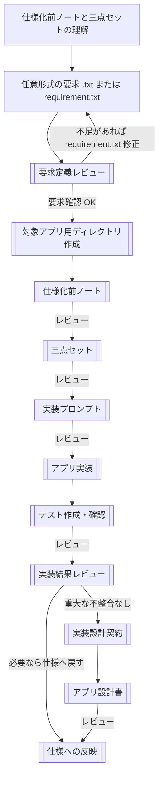
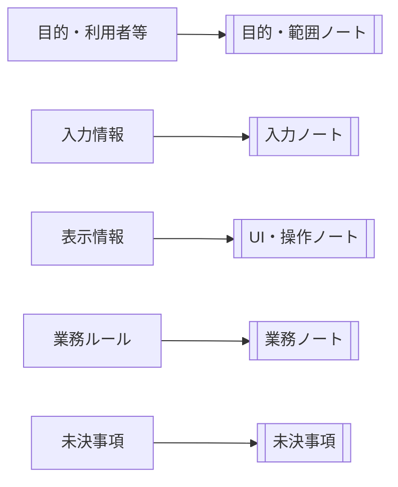
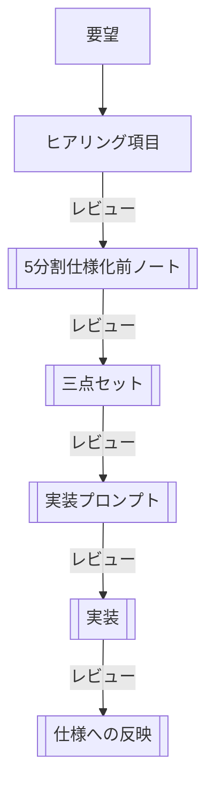
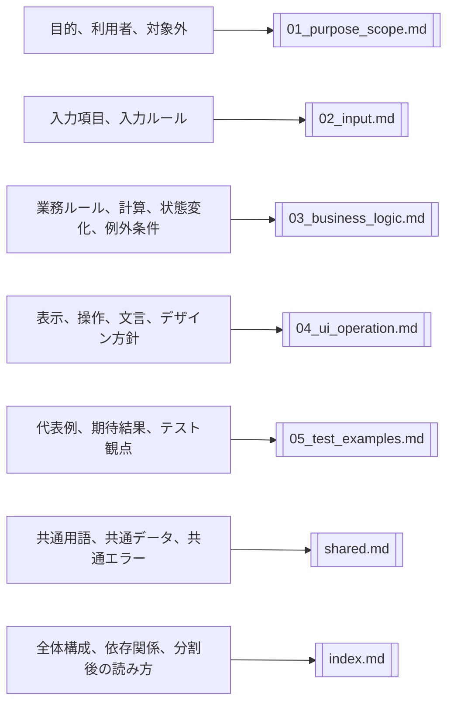
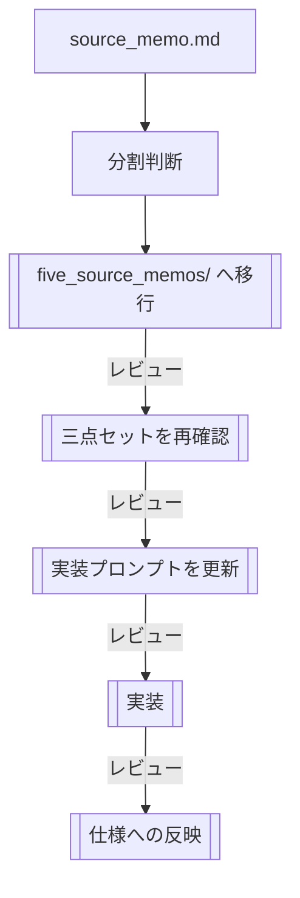
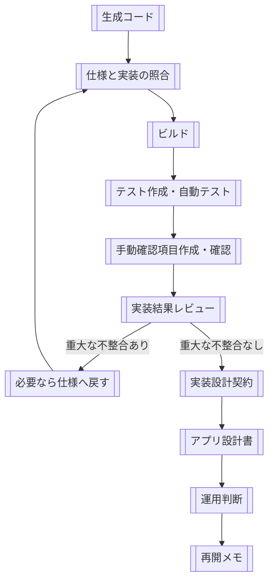
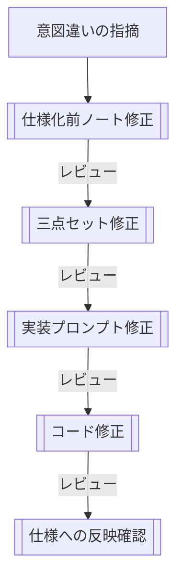

---
genpdf:
  format: book
  title: アプリ生成ワークフローガイド
  subtitle: 仕様化前ノートによるアプリ作成
  author: (株) SRA
  version: 0.2.2
  date: 2026-06-23
  font_size: 12pt
  page_numbers: true
  copyright: 2026 SRA, Inc. All rights reserved.
  table:
    header_background: "#e8f1ff"
    header_color: "#1f2937"
    border_color: "#cbd5e1"
    border_width: "1px"
    stripe: true
    stripe_background: "#f8fafc"
    cell_padding: "0.45em 0.65em"
    font_size: "0.95em"
    compact: false
    align: left
    header_align: center
    cell_align: left
---

# 利用者ガイド

このガイドは、`app-generation-workflow` を使ってアプリを作成する人向けの説明書である。

このワークフローでは、アプリをいきなり実装しない。
まず任意形式の要求 `.txt` から仕様化前ノートに材料を集め、そこから三点セットを作り、最後に実装方式を指定してアプリを作成する。
未決事項を減らしたい場合は、推奨テンプレート `templates/requirement.txt` を使って要求を整理してから始める。

このガイドは利用者向けの入口である。
作業手順の正本は `three_key_documents_workflow.md` とし、詳細な判断に迷った場合はそちらを参照する。

ワークフローは、ユーザーの作業場所にコピー済みのものだけを参照する。
他の場所にあるワークフローは参照しない。
コピー済みワークフローはテンプレートとして扱い、対象アプリ固有の内容を書き込まない。

## まず読むもの

最初にこのガイドを読む。
次に、作業手順の正本として次の文書を読む。

- `three_key_documents_workflow.md`

AI に作業前提を理解させる場合も、次のように指示する。

```text
app-generation-workflow/three_key_documents_workflow.md を読んでください。
```

## 役割の読み方

このワークフローでは、AI が草案作成、洗い出し、照合、レビュー補助を行う。
人は、AI の出力をそのまま正式な仕様や実装として扱わず、採用判断、業務判断、安全性、対象外、戻り先を決める。

各工程の主体は、次の意味で読む。

| 表記 | 意味 |
| --- | --- |
| 人主体 | 人が判断、採用、修正、承認する作業 |
| AI主体 | AI に草案作成、洗い出し、照合、レビュー補助を依頼する作業 |
| 共同 | AI が候補や確認事項を出し、人が採否を判断する作業 |

## 基本の流れ



工程ごとの主体:

前半:

| 工程 | 主体 | 人が判断すること |
| --- | --- | --- |
| 要求定義レビュー | 共同 | 不足確認、追記内容の採用 |
| 仕様化前ノート作成 | 共同 | 未決事項、対象外、採用判断 |
| 三点セット作成 | AI主体、人レビュー | 仕様として正しいか |
| 実装プロンプト作成 | AI主体、人レビュー | 実装方式、対象外、未決事項 |
| アプリ実装 | AI主体 | 生成結果を受け入れてよいか |

<div class="page-break"></div>

後半:

| 工程 | 主体 | 人が判断すること |
| --- | --- | --- |
| 生成コード確認 | 人主体、AI補助 | どこへ戻すか |
| テスト作成・確認 | 共同 | 期待値が仕様由来か |
| 実装結果レビュー | 共同 | 設計文書へ進めるか |
| 実装設計契約作成 | AI主体、人レビュー | 仕様とコードの対応が正しいか |
| アプリ設計書作成 | AI主体、人レビュー | 設計として確定してよいか |

各工程の出力は、該当する章の冒頭に `出力:` として示す。

## 1. 仕様化前ノートを作る

主体: 共同。AI が不足確認と草案作成を補助し、人が要求、未決事項、対象外、採用判断を決める。
出力: `requirement.txt`、`source_memo.md`。

ユーザー要求は、任意形式の `.txt` ファイルとして受け取る。
要求 `.txt` は生の入力であり、実装用の仕様書ではない。

未決事項を減らしたい場合は、次の推奨テンプレートをコピーして `requirement.txt` として使う。
任意形式の要求でもよいが、`requirement.txt` を使うと、仕様化前ノートを作る前に不足を見つけやすい。

```text
app-generation-workflow/templates/requirement.txt
```

要求 `.txt` または `requirement.txt` を受け取ったら、AI が要求定義レビューを行う。
仕様化前ノートを作れるだけの材料があるか、目的、利用者、アプリ種別、入力、表示、操作、状態ごとの操作、操作衝突、OS差分・入力デバイス差分、ルール、対象外、例外、代表例、未決事項が読み取れるかを確認する。

要求定義レビューで不足が見つかった場合、AI はユーザーへ確認した方がよい点、`requirement.txt` への追記候補、推測で補いそうな箇所を提示する。
AI の追記候補は推薦案であり、ユーザーが採用するまで正式な要求として扱わない。
不足が実装や三点セット生成に影響する場合は、仕様化前ノートや三点セットへ進まず、`requirement.txt` を修正する。
ここで止まることは、曖昧な要求からそれらしい仕様やコードを作らないための正しい挙動である。

要求定義レビューを通ったら、対象アプリ用の新しいディレクトリを作成する。
以後、仕様化前ノート、三点セット、実装プロンプト、ソースコードは、すべて対象アプリ用ディレクトリ配下に置く。

対象アプリの作業ディレクトリへ、次のテンプレートをコピーする。

```text
app-generation-workflow/templates/source_memo.md
```

コピー先の例:

```text
my-app/source_memo.md
```

コピーした `source_memo.md` に、次の項目を反映する。

- 作りたいアプリの目的
- 利用者
- アプリ種別
- やりたいこと
- 入力する情報
- 表示したい情報
- 守るべきルール
- 状態、処理の流れ
- 状態ごとの操作、操作衝突、操作対象の分類
- 往復操作、OS差分・入力デバイス差分
- 代表例、期待結果
- 作らない機能
- まだ決めていないこと

アプリ種別は、最初に最も近いものを1つ選ぶ。
複数の性質がある場合は主目的を1つ選び、補足に残す。
最初から正確に分類できない場合は仮選択でよい。

主な種別:

- 入力・計算・結果表示アプリ
- データ管理アプリ
- ビューアアプリ
- エディタアプリ
- 変換ツール
- ゲーム / インタラクティブアプリ
- その他

テンプレート本体には、対象アプリ固有の内容を書き込まない。
コピー済みワークフロー本体も変更しない。

未決事項を書く場合は、決定後にどこへ移すか分かるように、各項目へ反映先を1行で付ける。

```text
- 未決事項: 保存方式を JSON、SQLite、CSV のどれにするかを決める。決定後の反映先: 状態・処理の流れ、入力ルール、必要に応じて実装方式
```

最初に作成した仕様化前ノートに未決事項がある場合は、AI の確認内容に従って判断する。
ユーザーが未決事項を「なしにする」と判断した場合は、未決事項欄へ `- なし` と記載する。
ユーザーが「なしにしない」と判断した場合は、AI が推薦案を提示する。
推薦案が採用または修正された場合は、未決事項欄から削除し、該当する章へ決定内容を移す。

仕様化前ノートを作成したら、要求 `.txt` の内容が漏れなく反映されているか、未決事項と対象外が整理されているかを確認する。
AI が作成した仕様化前ノートは草案として扱い、人が確認してから三点セットへ進む。

### 1.1 逆生成レビュー用の仕様化前ノート

既存実装、生成済み三点セット、またはコードから仕様化前ノートを再構成する場合は、通常の `templates/source_memo.md` ではなく、次のテンプレートを使う。

```text
app-generation-workflow/templates/source_memo_reverse_review.md
```

コピー先では、通常の仕様化前ノートと同じように `source_memo.md` として配置する。

```text
my-app/source_memo.md
```

逆生成では、実装から読み取れる挙動が正しい仕様とは限らない。
そのため、現行実装から読み取れる挙動、仕様として採用する挙動、バグ候補・要確認事項を分けて整理する。

主に確認すること:

- 実装由来の挙動を、そのまま正式仕様として書いていないか。
- バグ候補や偶然の挙動を、仕様として採用していないか。
- 境界値や代表例の期待結果に、人の採用判断があるか。
- 未決事項が本文で断定仕様として書かれていないか。

## 2. 三点セットを作る

主体: AI主体、人レビュー。AI が三点セットの草案を作り、人が仕様として採用できるか確認する。
出力: `specs/01_usecase_spec.md`、`specs/02_ui_spec.md`、`specs/03_business_spec.md`。

仕様化前ノートをもとに、次の三点セットを作成する。

```text
my-app/specs/01_usecase_spec.md
my-app/specs/02_ui_spec.md
my-app/specs/03_business_spec.md
```

使用するテンプレート:

```text
app-generation-workflow/templates/01_usecase_spec.md
app-generation-workflow/templates/02_ui_spec.md
app-generation-workflow/templates/03_business_spec.md
```

三点セットの役割:

- UC仕様書: 利用者の目的、利用シナリオ、成功条件、例外条件を整理する。
- UI仕様書: 画面、入力項目、表示項目、操作、エラー表示を整理する。
- ビジネスレイヤー仕様書: UIに依存しないデータ、入力検証、計算、保存、更新、削除、状態変更を整理する。

三点セットでは、`source_memo.md` で選んだアプリ種別を引き継ぐ。
アプリ種別は固定仕様ではなく、書くべき観点を選ぶための目印である。
たとえば、ゲーム / インタラクティブアプリでは状態遷移や終了条件を重視し、変換ツールでは入力解析、変換、出力、失敗条件を重視する。

テンプレート内の任意パターンは、必要な場合だけ使う。
管理画面、追加・削除、状態管理、集計、保存・読み込みが不要なアプリでは「対象外」または「なし」と記載する。

### 2.1 三点セットをレビューする

実装に進む前に、三点セットをレビューする。
AI が生成した三点セットは、生成直後は草案として扱う。
人がレビューし、必要な修正を反映した後にだけ、レビュー済み三点セットとして扱う。
レビュー済みでない三点セットから、実装プロンプトやソースコードを作成しない。

レビューは、アプリの規模とリスクに応じて軽量レビュー、標準レビュー、重点レビューを使い分ける。

軽量レビュー:

- 小さいアプリ、試作、影響範囲が狭い変更で使う。
- 空欄、未決事項、明らかな矛盾を確認する。

標準レビュー:

- 通常の新規アプリ、機能追加、仕様変更で使う。
- 三点セット間の対応、仕様化前ノートとの対応、対象外、テスト観点を確認する。

重点レビュー:

- 既存コードからの逆生成、別言語移植、業務ルールが重いアプリ、失敗時の影響が大きい機能で使う。
- 保存、削除、課金、個人情報、権限、外部連携、安全性、移植リスクを確認する。
- バグ候補や偶然の挙動を正式仕様として採用していないかを確認する。

レビューでは、AI による補助確認を使う。
AI には、形式、空欄、矛盾、抜け、推測、未決事項、バグ候補の列挙を行わせる。
人は、AI が列挙した確認事項をもとに、採用判断、業務判断、安全性、対象外、移植方針を決める。

## 3. 仕様化前ノートを分割する場合

主体: 共同。AI が分割案、移行漏れ、重複を洗い出し、人が分割判断と正本の切り替えを決める。
出力: `five_source_memos/` 配下の分割ノート群。

通常は、単一の `source_memo.md` から始める。
ただし、次のどちらかに当てはまる場合は、5分割仕様化前ノートを使う。

1. 最初から規模が大きいと分かっている場合。
2. 単一 `source_memo.md` で始めたが、途中で大きくなった場合。

### 3.1 最初から規模が大きい場合

最初から画面数、ユースケース、業務ルール、入力項目、例外条件が多いと分かっている場合は、単一 `source_memo.md` を作らず、最初から `five_source_memos/` を作る。
この場合、ワークフロー上の正本は `source_memo.md` ではなく、`five_source_memos/` 配下の分割ノート群とする。

構成例:

```text
five_source_memos/
├─ index.md
├─ shared.md
├─ 01_purpose_scope.md
├─ 02_input.md
├─ 03_business_logic.md
├─ 04_ui_operation.md
└─ 05_test_examples.md
```

ヒアリング9項目の反映先:

図中の「目的等」は、目的、利用者、アプリ種別、やりたいこと、作らない機能を表す。



この場合の流れ:



### 3.2 途中で大きくなった場合

最初は単一 `source_memo.md` で始めてよい。
ただし、内容が増えて見通しが悪くなった場合は、`five_source_memos/` に移行する。

途中で分割する場合は、既存の `source_memo.md` を直接捨てない。
まず `five_source_memos/` を作り、内容を役割ごとに移す。

移行先:



この場合の流れ:



移行後は、単一 `source_memo.md` を正本として扱わない。
正本は `five_source_memos/` 配下の分割ノート群とする。
以後の修正、三点セット作成、実装プロンプト更新では、`source_memo.md` ではなく `five_source_memos/` を参照する。

分割した場合も、意図違いの修正時に三点セットやコードを直接修正しない。
まず該当する仕様化前ノートを修正し、その後に三点セット、実装プロンプト、コードへ反映する。

5分割仕様化前ノートへ移行したら、移行漏れ、重複、意味の変化、未決事項の消失、共通用語の整理、正本の切り替えを確認する。

## 4. 実装プロンプトを作る

主体: AI主体、人レビュー。AI が実装プロンプトの草案を作り、人が実装方式、対象外、未決事項を確認する。
出力: `prompts/implementation_prompt.md`。

レビュー済み三点セットを確認した後、実装方式を決める。
AI が生成したままの三点セット、未決事項が残る三点セット、採用判断が終わっていない逆生成三点セットからは、実装プロンプトを作成しない。

例:

- Qt デスクトップアプリ
- Web アプリ
- CLI ツール
- モバイルアプリ
- API サーバー

次のテンプレートをコピーして、対象アプリ用の実装プロンプトを作成する。

```text
app-generation-workflow/templates/implementation_prompt.md
```

分割した仕様化ワークフロー全体に共通するビルド互換性、コード生成方針、移植性などの実装制約がある場合は、次のテンプレートを対象アプリ用ディレクトリへコピーして使う。
この内容は三点セットへ混ぜず、実装プロンプト作成時に参照する。
仕様化前ノートの入力ルールには、業務上の制約や入力制約を記載し、ビルド互換性やコード生成方針のような実装制約は混ぜない。

```text
app-generation-workflow/templates/implementation_constraints.md
```

コピー先の例:

```text
my-app/prompts/implementation_prompt.md
my-app/implementation_constraints.md
```

実装プロンプトには、三点セットを上位仕様として扱うことを明記する。
ここで参照する三点セットは、レビュー済みである必要がある。
実装時の作業ディレクトリは対象アプリ用ディレクトリとし、`source_memo.md`、`specs/`、`implementation_constraints.md` をその作業ディレクトリから参照する。
`implementation_constraints.md` が存在する場合は、プロジェクト共通の実装制約として実装プロンプトへ参照を記載する。

実装プロンプトを作成したら、レビュー済み三点セットを参照しているか、実装方式、ビルド方式、テスト方式、対象外、未決事項が揃っているかを確認する。
実装プロンプトでは、標準ではテストコード生成を指示しない。
コード生成後に自動テストを追加できるよう、ビジネスロジックを UI に依存しない形にする指示を入れる。

`implementation_prompt.md` が使える状態になっていない場合は、実装へ進まない。
未作成、空欄あり、参照先の仕様不足、実装方式未記入、実装前に確認すべき未決事項あり、のいずれかに当てはまる場合は、不足している内容を警告として列挙する。

## 5. アプリを実装する

主体: AI主体、人確認。AI がソースコードを作成し、人が仕様外追加、未決事項の仮決め、構成を確認する。
出力: 対象アプリのソースコード。

実装では、三点セットと実装プロンプトを上位仕様として扱う。

実装時の原則:

- UI とビジネスロジックを分離する。
- 入力検証や業務ルールはビジネスレイヤーに置く。
- UI は入力、操作、表示、エラー表示を担当する。
- コード生成後にテストを追加しやすい構造にする。
- 三点セットにない仕様を勝手に追加しない。
- 未決事項が実装に影響する場合は、実装前に確認する。
- `implementation_prompt.md` が使える状態でない場合は、実装へ進まない。

実装後は、実装結果が実装プロンプトと三点セットに従っているかを確認する。
仕様外の機能追加、未決事項の仮決め、エラー条件の抜け、テスト不足、仕様への反映漏れがないかを見る。

コード生成後の詳細手順は、次の文書を参照する。

```text
docs/post_generation_workflow.md
```

## 6. コード生成後に確認する

主体: 人主体、AI補助。AI は照合や不整合の洗い出しを補助し、人が戻り先を判断する。
出力: 仕様と実装の照合結果、不整合一覧。

コード生成後は、いきなり完了扱いにしない。
生成コード、仕様、テスト、手動確認、運用手順を順に確認し、実装結果を後続文書で正として固定してよい状態か判断する。



最初に、生成コードの構成を確認する。
対象アプリ用ディレクトリに `include/`、`src/`、`prompts/implementation_prompt.md`、三点セットが揃っているかを見る。
UI、アプリケーション制御、ビジネスロジック、データ処理の責務が混ざりすぎている場合は、後続のレビューで問題が見えにくくなる。

次に、仕様と実装を照合する。
`source_memo.md` または `five_source_memos/` の仕様判断が三点セットへ反映され、三点セットの内容が実装プロンプトへ反映され、その実装プロンプトの指示がコードへ反映されているかを確認する。
参照画像、外部参照資産、文言、手動確認対象など、コードだけでは復元しにくい情報が落ちていないかも確認する。

この段階で不整合が見つかった場合は、コードだけを直接直さない。
仕様判断が不足しているなら仕様化前ノートへ戻り、仕様書の不足なら三点セットへ戻り、実装漏れなら実装プロンプトとコードの対応を確認する。

## 7. ビルド、テスト作成、自動テスト、手動確認を行う

主体: 共同。AI がテスト案と手動確認項目を作り、人が期待値の妥当性を確認して実行する。
出力: ビルド結果、自動テスト、手動確認項目、確認結果。

生成コードを確認したら、対象アプリ用ディレクトリでビルドする。
ビルド手順はプロジェクトにより異なるため、実際に使ったコマンド、環境変数、依存関係、ツールチェーン指定は `README.md` へ残す。

例:

```sh
cmake -S . -B build
cmake --build build
```

ビルドが成功したら、三点セット、実装プロンプト、実装コードを参照して自動テストと手動確認項目を作成する。
コードだけから期待値を作らない。
実装コードが仕様と違う場合は、テストに合わせて固定せず、不整合として列挙する。

自動テストでは、入力検証、データ正規化、主要な業務ルール、境界値、例外またはエラーケース、状態遷移、回帰しやすい計算や判定を確認する。
テストを作成したら、自動テストを実行する。
自動テストが失敗している場合は、実装設計契約やアプリ設計書へ進まない。

例:

```sh
ctest --test-dir build --output-on-failure
```

自動テストで保証できないものは、作成した手動確認項目に従って確認する。
UI の見た目、操作感、表示崩れ、端末差、外部連携、参照画像との対応、外部参照資産の読み込みは、必要に応じて人が確認する。
手動確認では、初期表示、主要操作、正常系の代表例、入力エラーなどの異常系、直前状態を保持すべき場面を確認する。

確認結果は、後で追える場所に残す。
自動テストの対象、手動確認した項目、未確認の項目、既知差分は、実装設計契約やアプリ設計書へ反映する。

## 8. 実装結果をレビューする

主体: 共同。AI が矛盾、抜け、仕様外追加を洗い出し、人が採用、修正、対象外、残リスクを判断する。
出力: 実装結果レビューの結果。

ビルド、自動テスト、手動確認の後、実装結果レビューを行う。
このレビューは、実装設計契約やアプリ設計書を作ってよいかを判断するための関門である。

レビューでは、次を確認する。

- 仕様化前ノート、三点セット、実装プロンプト、コードの間に矛盾がないか。
- 三点セットに書かれた仕様が実装されているか。
- 三点セットにない便利機能を勝手に追加していないか。
- 未決事項を勝手に仮決めしていないか。
- エラー表示や例外条件が仕様と合っているか。
- コード生成後に作成したテストが仕様から導ける内容になっているか。
- 参照画像、外部参照資産、手動確認対象が後続文書で落ちない状態か。
- 実装中に決めたことを仕様へ戻しているか。

AI には、矛盾、抜け、仕様外追加、未テスト項目、既知差分の洗い出しを依頼できる。
人は、その差分を仕様として採用するのか、コードを直すのか、対象外または残リスクとして記録するのかを判断する。

重大な不整合、仕様への反映漏れ、未解決の仮決めがある場合は、実装設計契約やアプリ設計書を作らない。
先に仕様化前ノート、三点セット、実装プロンプト、コードへ戻して整合させる。

## 9. 不整合があれば仕様へ戻す

主体: 人主体、AI補助。AI が原因候補と反映先を提示し、人が実際の戻り先と修正内容を決める。
出力: 修正された仕様化前ノート、三点セット、実装プロンプト、コード、テスト。

不整合が見つかった場合は、原因に応じて戻す場所を分ける。

| 不整合 | 反映先 |
| --- | --- |
| 仕様判断が不足している | `source_memo.md` または `five_source_memos/` |
| ユースケース、状態遷移が違う | `specs/01_usecase_spec.md` |
| 画面、表示、操作、文言が違う | `specs/02_ui_spec.md` |
| 業務ルール、計算、検証、正規化が違う | `specs/03_business_spec.md` |
| 実装指示が古い | `prompts/implementation_prompt.md` |
| コードが仕様または実装指示を満たしていない | `include/`、`src/`、`tests/` |
| 運用手順が古い | `README.md` |
| 再開メモが古い | 対象プロジェクトの再開メモ |

修正後は、ビルド、自動テスト、必要な手動確認、実装結果レビューを再実行する。
未解決の重大な不整合がある間は、後続の設計文書を完成扱いにしない。

## 10. 実装設計契約を作る

主体: AI主体、人レビュー。AI が仕様とコードの対応表を作り、人が対応の正しさと未解決事項の有無を確認する。
出力: `implementation_design_contract.md`。

実装結果レビューで重大な不整合がないことを確認した後、必要に応じて `implementation_design_contract.md` を作成する。
これは、三点セットと実装コードの対応を追跡するための文書である。

実装設計契約には、少なくとも次を含める。

- 参照した仕様文書とコード。
- 仕様項目と実装箇所の対応。
- クラス、モジュール、関数、テストの責務。
- 入力検証、状態遷移、業務ルール、エラー処理の実装対応。
- コードだけでは復元しにくい仕様根拠。
- 参照画像、外部参照資産、手動確認対象。
- 既知差分、未テスト項目、残リスク。

三点セットにない仕様を追加しない。
コードが三点セットと矛盾している場合は、契約として確定せず、不整合として列挙する。
未解決の重大な不整合がある場合は、`implementation_design_contract.md` を完成扱いにしない。

## 11. アプリ設計書を作る

主体: AI主体、人レビュー。AI が設計書の草案を作り、人が設計として確定してよいか確認する。
出力: `app_design.md`。

`implementation_design_contract.md` 作成後、三点セット、実装設計契約、レビュー済みの実装コードをもとに、`app_design.md` を作成する。
これは、実装後に確定したアプリ全体の設計を記録する文書である。

アプリ設計書には、少なくとも次を含める。

- アプリの目的とスコープ。
- 参照した仕様文書、実装設計契約、コード、参照資産。
- 画面、操作、データ、業務ルールの設計。
- モジュール構成と責務。
- エラー処理。
- テスト方針と検証状況。
- ビルド、実行、運用上の注意。
- 既知差分、未テスト項目、残リスク。

`app_design.md` は、三点セットの単なる要約ではない。
仕様根拠、実装との対応、確認済みの範囲、未確認の範囲を追えるように書く。
三点セット、実装設計契約、コードの間に矛盾がある場合は、設計書へ断定的に取り込まず、不整合として列挙する。

作成後は、三点セット、`implementation_design_contract.md`、実装コードを正しく反映しているかレビューする。
このレビューだけで `app_design.md` やコードを修正しない。
問題があれば、原因に応じて上流文書または実装へ戻す。

## 12. 運用判断と再開メモを残す

主体: 人主体。AI は記録案を補助できるが、運用判断と配布判断は人が行う。
出力: 運用判断、`README.md`、対象プロジェクトの再開メモ。

ビルド、自動テスト、必要な手動確認が完了し、重大な不整合がない場合に、対象プロジェクトで許可された運用段階へ進める。
利用者配布を伴う本番運用は、配布形式、対象 OS または実行環境、必要なランタイム、依存関係、ライセンス条件、起動手順、手動確認結果を確定するまで開始しない。

運用判断は、`app_design.md`、`implementation_design_contract.md`、`README.md` など、対象プロジェクトで後から参照できる文書へ残す。
`README.md` には、ビルド、テスト、起動、手動確認の手順を記載する。

作業終了時は、対象プロジェクトの再開メモに次を保存する。
対象アプリ用ディレクトリに `NEXT.md` がある場合は、その `NEXT.md` を使う。

- 現在の運用段階
- 主要成果物
- 実装概要
- 検証状況
- 仕様変更時の反映順
- 未完了事項

コミット前には、ビルドディレクトリ、キャッシュ、ログ、一時ファイルを含めていないことを確認する。
今回の作業範囲外の未追跡ファイルを混ぜず、必要に応じてコミットする。

## 13. 意図違いを修正する

主体: 人主体、AI補助。人が意図違いを判断し、AI はどの文書へ戻すべきかの整理を補助する。
出力: 修正された仕様化前ノート、三点セット、実装プロンプト、コード。

実装結果が意図と違う場合、いきなりコードを修正しない。
また、三点セットだけを先に修正しない。

修正は次の順番で行う。



禁止する進め方:

- 意図違いを指摘された直後にコードだけを修正する。
- `source_memo.md` を更新せず、三点セットだけを修正する。
- 実装プロンプトを更新せず、コードだけを修正する。
- 三点セットにない仕様をコードへ直接追加する。
- 仮決めを仕様へ戻さず、コードだけに残す。

## AIへの指示例

最初に読ませる:

```text
app-generation-workflow/three_key_documents_workflow.md を読んでください。
```

仕様化前ノートを作る:

```text
任意形式の要求 .txt をもとに、対象アプリ用ディレクトリを作成し、templates/source_memo.md をコピーして仕様化前ノートを作成してください。
アプリ種別を1つ選び、代表例と期待結果も記載してください。
```

逆生成レビュー用の仕様化前ノートを作る:

```text
既存実装、生成済み三点セット、またはコードをもとに、templates/source_memo_reverse_review.md をコピーして source_memo.md を作成してください。
現行実装から読み取れる挙動、仕様として採用する挙動、バグ候補・要確認事項を分けて記載してください。
```

三点セットを作る:

```text
source_memo.md をもとに、UC仕様書、UI仕様書、ビジネスレイヤー仕様書を作成してください。
source_memo.md のアプリ種別を三点セットへ引き継ぎ、不要な任意パターンは対象外として整理してください。
作成した三点セットは草案として扱い、実装プロンプト作成前にレビューしてください。
```

実装プロンプトを作る:

```text
レビュー済み三点セットを上位仕様として、指定した実装方式の実装プロンプトを作成してください。
実装プロンプトが使える状態になっていない場合は、実装へ進まず警告してください。
```

意図違いを修正する:

```text
実装結果が意図と違います。コードを直接修正せず、まず source_memo.md のどこを修正すべきか確認してください。
```
