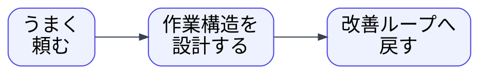
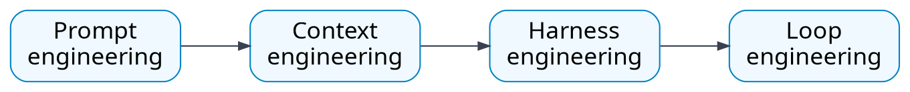
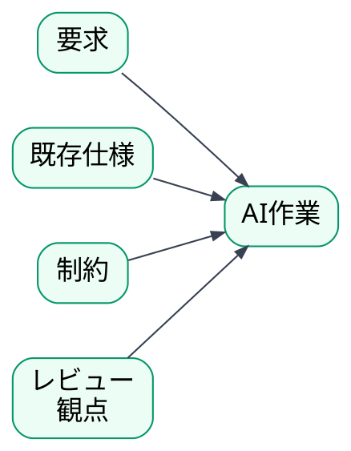
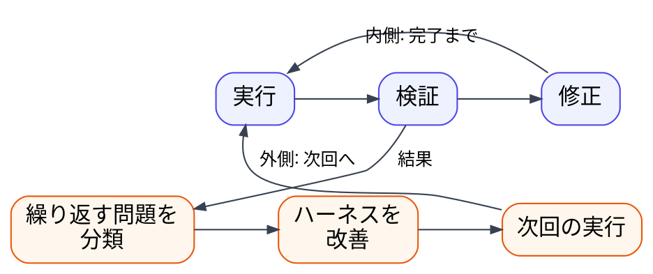
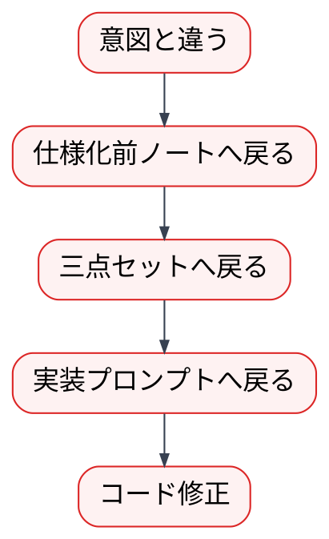
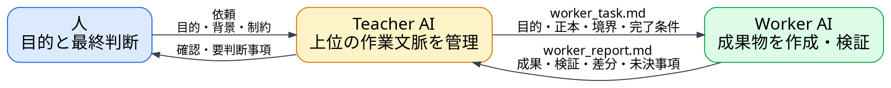

---
genpdf:
  format: slides
  title: 生成AI活用の進化と仕様化
  subtitle: |-
    Prompt engineering から
    Teacher-Worker engineering へ
  author: 杉田研治
  version: 1.0.0
  date: 2026-08-04
  font_size: 20px
  page_numbers: true
  background:
    image: company-footer-logo-seminar-band.svg
    target: all
    size: 100%
    position: bottom center
    repeat: no-repeat
    opacity: 1.00
  table:
    header_background: "#e8f1ff"
    header_color: "#1f2937"
    border_color: "#cbd5e1"
    border_width: "1px"
    stripe: true
    stripe_background: "#f8fafc"
    cell_padding: "0.35em 0.55em"
    font_size: "0.86em"
    compact: true
    align: left
    header_align: center
    cell_align: left
---

<h1 align="center">導入</h1>

今日話すこと: 頼み方から作業構造へ

生成AIに「どう頼むか」だけではなく、

生成AIを使う作業の進め方をどう設計するかを話します。

!dot{scale=0.82}

<h1 align="center">導入</h1>

ゴール: 50分で共有する到達点

50分で次の4点を共有します。

| 観点 | 今日の到達点 |
| --- | --- |
| AI活用の進化 | Prompt から Context、Harness、Loop へ広がる |
| 仕様化 | AIの判断範囲を制御するために行う |
| ワークフロー | 文書群、手順、レビュー観点をハーネスとして扱う |
| 役割分離 | Worker AI と Teacher AI に分ける |

<h1 align="center">導入</h1>

単発利用から作業構造へ: 単発利用の限界を整理する

単発のプロンプトでも効果は出ます。

ただし、業務で繰り返すと、前提や判断基準がぶれやすくなります。

そこで、頼み方だけでなく、作業の進め方を設計します。

| 単発利用で起きること | 作業構造で決めること |
| --- | --- |
| 毎回説明が変わる | 渡す文脈を決める |
| 出力形式が揺れる | 成果物の形を決める |
| レビュー観点が抜ける | 確認観点を決める |
| 失敗がその場限りになる | 戻し先を決める |

<h1 align="center">AI活用の進化</h1>

AI活用の4段階: Prompt から Loop へ

!dot{scale=0.83}

後ろの段階が、前の段階を置き換えるわけではありません。

プロンプトを、文脈、ハーネス、改善ループで支えます。

<h1 align="center">AI活用の進化</h1>

Prompt engineering: 1回の入力を工夫する

1回の入力を工夫する段階。

| 工夫 | 例 |
| --- | --- |
| 条件を明確にする | Qt Widgets で作る |
| 出力形式を指定する | ヘッダーとソースに分ける |
| 役割を与える | レビュアーとして見る |
| 例を示す | 入力例と期待結果を渡す |
| 禁止事項を書く | 保存処理はまだ実装しない |

入口として重要だが、作業全体を安定させるには限界があります。

<h1 align="center">AI活用の進化</h1>

Context engineering: AIに渡す文脈を整える

作業に必要な文脈一式を整えて渡します。

!dot{scale=0.80}

情報を増やすだけでは足りません。

正本、古い判断、変更してよい範囲を構造化します。

<h1 align="center">AI活用の進化</h1>

Harness engineering: 再利用できる作業枠組みを作る

現場で再利用できる作業枠組みを作ります。

| ハーネスに含めるもの | 役割 |
| --- | --- |
| 文書群 | 正本、制約、成果物を分ける |
| テンプレート | 毎回の抜けを減らす |
| 手順 | 作る順番と戻る順番を決める |
| レビュー観点 | AI出力の確認基準にする |
| 完了条件 | どこで作業を止めるか決める |

属人的なプロンプトを、再利用できる作業手順へ変えます。

<h1 align="center">AI活用の進化</h1>

Loop engineering: 実行と改善のループを設計する

AIを使う作業が、実行、検証、修正を停止条件まで繰り返せるようにします。

!dot{scale=0.70}

このセミナーでは、結果を次回のハーネス改善へ戻す
**外側の改善ループ**を重視します。

<h1 align="center">仕様化</h1>

仕様不在による AI コンテキスト劣化: 仕様がないとAIが補完する

仕様や設計意図が残っていないと、
AI は局所的なコード、コメント、命名、会話履歴から目的を推定します。

| 起きること | 結果 |
| --- | --- |
| 仕様がない | AI が目的を補完する |
| コメントが曖昧 | コメントを仕様の断片として扱う |
| 熟練者の暗黙知が失われる | 誤りを補正できない |
| 変換結果にバグが混入する | 実装後の確認で初めて気づく |

AI の誤補完は、仕様の解釈ミスとして実装に入ります。

近い研究・概念:

| 概念 | 関係 |
| --- | --- |
| Context Rot | AI用コンテキスト文書が古くなる問題 |
| Requirement Ambiguity | 曖昧な要求がコード生成品質を下げる問題 |
| Tacit Knowledge Loss | 熟練者の暗黙知が失われる問題 |
| Spec-Driven Development | 仕様を一次成果物として扱う考え方 |

<h1 align="center">仕様化</h1>

なぜ仕様化するのか: AIの補完リスクを抑える

AIは、足りない情報を空白のまま扱わず、
それらしく補完できます。

この補完が、仕様不在の状態ではリスクになります。

| 起きること | リスク |
| --- | --- |
| 未決事項を仮決めする | 人が決めるべき判断が消える |
| 対象外を追加する | 仕様外の便利機能が混ざる |
| 制約を無視する | 実装だけで都合よく進む |
| 既存バグを写す | バグが仕様として固定される |
| コードだけが正本になる | 後から理由を追えない |

<h1 align="center">仕様化</h1>

コードだけを正本にしない: 問題が起きたときの戻り先を残す

コードだけが正本になると、後から理由を追えなくなります。

| 困ること | 戻るべき場所 |
| --- | --- |
| 利用者の目的が違う | 要求、仕様化前ノート |
| 画面や操作が違う | UI仕様書 |
| 計算や検証が違う | ビジネスレイヤー仕様書 |
| 実装方式が違う | 実装プロンプト |
| テスト期待値がコード由来 | 仕様、三点セット |
| コメントが曖昧 | 設計意図、禁止事項、移行ルール |

仕様化により問題が起きたときに、戻り先があります。

<h1 align="center">仕様化</h1>

仕様化の目的: 人が決める範囲とAIに任せる範囲を分ける

仕様化は、AIに作らせるためだけではありません。

AIの判断範囲を制御するために行います。

!dot{scale=0.80}

AIに任せる範囲と、人が判断する範囲を分けます。

<h1 align="center">仕様化</h1>

分けるもの: 要求、仕様、制約、実装、テスト、レビューを分ける

| 分けるもの | 役割 |
| --- | --- |
| 要求 | 利用者が何をしたいか |
| 仕様 | 何を満たせばよいか |
| 制約 | 実装時に守る条件 |
| 実装 | 仕様をどうコードにするか |
| テスト | 仕様どおりかをどう確認するか |
| レビュー | AIの出力をどの観点で確認するか |

混ぜないことで、問題が起きたときの戻り先が分かります。

<h1 align="center">アプリ生成ワークフロー</h1>

全体の流れ: 実装前に仕様、実装後にテスト、レビュー、設計を置く

!dot{scale=0.66}

いきなり実装へ進みません。

仕様、実装、テスト、レビュー、設計をつなげて扱います。

実装設計契約は、仕様とコードの対応を追跡する文書です。

アプリ設計は、レビュー済み実装をもとに全体設計を記録する文書です。

<h1 align="center">アプリ生成ワークフロー</h1>

部分適用: 既存工程へAI活用を差し込む

全体を一度に導入しなくても、部品として使えます。

| 部分適用 | 使いどころ |
| --- | --- |
| 要求定義レビューだけ使う | 曖昧な要求を点検する |
| 仕様化前ノートだけ使う | 要求整理と未決事項の洗い出しに使う |
| 三点セットだけ使う | UIありアプリの仕様とテスト観点を整理する |
| コード生成後レビューだけ使う | AI生成コードの受け入れ可否を判断する |
| 実装設計契約とアプリ設計だけ使う | 生成済みコードを既存の設計成果物へ接続する |

全適用しなくても、既存工程の弱い部分に差し込めます。

<h1 align="center">アプリ生成ワークフロー</h1>

仕様化前ノート: 詳細仕様の前に判断の正本を作る

詳細仕様の前に、判断の正本を軽く作ります。三点セットと論理的に同じ内容で可換です。
三点セットより記述量が行数で約17%、文字数で約30%と少なく、レビューが簡単になります。

| 書くこと | 目的 |
| --- | --- |
| 目的 | 何のためのアプリか |
| 利用者 | 誰が使うか |
| 入力 | 何を受け取るか |
| 表示 | 何を見せるか |
| ルール | 守るべき判断 |
| 対象外 | 作らないもの |
| 未決事項 | AIが勝手に決めないもの |

<h1 align="center">アプリ生成ワークフロー</h1>

三点セット: UIがあるアプリの仕様を3つに分ける

UIがあるアプリの仕様を3つに分けます。

| 文書 | 見るもの |
| --- | --- |
| UC仕様書 | 利用者の目的、操作シナリオ、成功条件 |
| UI仕様書 | 画面、入力、表示、操作、エラー表示 |
| ビジネスレイヤー仕様書 | 検証、計算、保存、状態変更 |

画面の都合と業務ルールを混ぜません。

テスト観点も作りやすくなります。

<h1 align="center">アプリ生成ワークフロー</h1>

重要ロジックは括り出す: UIなしの重要部分は別仕様で守る

ビジネスレイヤー仕様書のレビューで判断します。

三点セットを置き換えず、重要部分だけを別仕様へ昇格させます。

| 重要ロジックの例 | 括り出し先 |
| --- | --- |
| 金額計算 | ヘッダー定義、VDM-SL |
| 状態遷移 | ヘッダー定義、VDM-SL |
| 入力検証、正規化 | ヘッダー定義、VDM-SL |
| 権限判定 | ヘッダー定義、VDM-SL |
| 境界値が多い処理 | ヘッダー定義、VDM-SL |

括り出す判断は、仕様化前ノートへ戻して残します。

<h1 align="center">アプリ生成ワークフロー</h1>

実装プロンプト: レビュー済み仕様をコード生成へ渡す

実装プロンプトは、単なる「コードを書いてください」ではありません。

レビュー済み仕様を、コード生成へ渡す形に変換します。生成コードの精度と品質が上がります。

| 明示すること | 理由 |
| --- | --- |
| 実装方式 | AIの実装判断を制御する |
| ビルド方式 | 実行可能な形にする |
| テスト可能性 | 後から確認できる構造にする |
| 対象外 | 便利機能の追加を防ぐ |
| 未決事項 | 仮決めを防ぐ |

<h1 align="center">アプリ生成ワークフロー</h1>

意図と違うとき: コードだけで直さず上流から整合させる

コードだけを直さないようにします。

どこへ戻すべき問題かを分類します。

!dot{scale=0.82}

上流から整合させます。

<h1 align="center">Teacher-Worker engineering</h1>

近い既存手法: 個別の役割分離を上位構造へつなげる

Teacher-Worker engineering は、既存手法と重なる部分があります。

| 近い手法 | 似ている点 |
| --- | --- |
| Navigator / Driver | 方針を見る役と実装する役を分ける |
| Planner / Executor | 計画する役と実行する役を分ける |
| Supervisor / Worker | 監督する役と作業する役を分ける |
| Critic / Reviewer | 出力を評価する役を分ける |

Teacher-Worker engineering は、これらの役割を Teacher の立場で統合します。

<h1 align="center">Teacher-Worker engineering</h1>

役割分離: 2つの文書で作業指示と完了報告を受け渡す

Loop engineering を安定して回すため、AIの役割を分けます。

!dot{scale=0.82}

人の目的から始め、作業に必要な内容を文書で受け渡します。

<h1 align="center">Teacher-Worker engineering</h1>

一般化: より上位の作業文脈を管理する

Teacher は、作業の方向、境界、評価基準、判断理由を管理します。

| Teacher が取る役割 | Worker に対する働き |
| --- | --- |
| Planner | 三点セットから実装までの工程と順序を決める |
| Navigator | 迷ったとき、修正内容の反映先を案内する |
| Guardian | 仕様、制約、生成対象外の境界を守る |
| Reviewer | 実装結果と作業手順を確認する |
| Mentor | 判断結果だけでなく、その理由を伝える |

これらを状況に応じて統合することが一般化です。

<h1 align="center">Teacher-Worker engineering</h1>

なぜ分けるのか: 成果物を作るAIに境界管理まで任せない

成果物を作るAIに、ハーネス改良まで任せると境界が崩れやすくなります。

| 起きやすいこと | Teacher AI が守ること |
| --- | --- |
| 実装しやすいように仕様を書き換える | 仕様と実装を分ける |
| 制約を緩める | 守る条件を維持する |
| 対象外を実装に含める | 非生成対象を守る |
| コードだけで処理する | 仕様へ戻す |
| 個別修正と手順改善が混ざる | 改善判断を分ける |

<h1 align="center">Teacher-Worker engineering</h1>

生成対象と生成対象外: 上書きしてよいものと守るものを分ける

何度でも上書きしてよいものと、守るものを分けます。

| 分類 | 例 |
| --- | --- |
| 生成対象 | アプリ本体、画面コード、サンプル実装 |
| 生成対象外 | 共通ライブラリ、プラットフォーム適応層 |
| 別仕様で守るもの | 重要ロジックのヘッダー定義、VDM-SL |

生成のたびに失われる知見を、境界の外へ逃がします。

<h1 align="center">Teacher-Worker engineering</h1>

一時的な確認: 作業文脈の外に Consultant AI を置く

現在の作業文脈へ直接含めたくない確認は、別の文脈で行います。

| 役割 | 行うこと | 行わないこと |
| --- | --- | --- |
| Teacher AI | ワークフロー、境界、評価基準を管理する | 成果物を直接作らない |
| Worker AI | 定められた工程で成果物を作る | ワークフローを変更しない |
| Consultant AI | 一時的な調査、事実確認、専門的助言を行う | 成果物やワークフローを直接変更しない |

Consultant AI の回答は人へ返し、必要な内容だけを本作業へ反映します。

**関連研究**

| 研究 | 近い点 | 今回との違い |
| --- | --- | --- |
| Consultant Agent / TB-CSPN | 意味解釈、整理、助言をWorkerと分離する | 恒常的な仲介役として置く |
| KAMAC | 必要時に専門家Agentを追加する | 専門家チーム内で協調する |
| AutoGen | 役割と会話パターンを分けて構成する | Consultant固有の役割名ではない |

<h1 align="center">まとめ</h1>

今日の流れを一枚で振り返る

今日の要点です。

| 要点 | 一言で言うと |
| --- | --- |
| Prompt | 1回の頼み方を工夫する |
| Context | 作業に必要な文脈を渡す |
| Harness | 再利用できる作業枠組みを作る |
| Loop | 実行を反復し、結果を次回の改善へ戻す |
| 仕様化 | AIの判断範囲を制御する |
| Teacher-Worker | 作る役割と守る役割を分ける |

<h1 align="center">参考</h1>

AI活用の段階: 今日の整理に近い既存概念

今日の整理に近い既存概念です。

| 概念 | 位置づけ |
| --- | --- |
| Prompt engineering | 1回の入力や指示を設計する |
| Context engineering | AIに渡す文脈、制約、正本を設計する |
| Harness engineering | AIが動く作業枠組みを設計する |
| Loop engineering | 目標、検証、停止条件、改善のループを設計する |

Harness / Loop は、比較的新しい実務寄りの整理です。

<h1 align="center">参考</h1>

仕様不在と近い研究概念: AIコンテキスト劣化に近い研究概念

仕様不在による AI コンテキスト劣化に近い概念です。

| 概念 | 関係 |
| --- | --- |
| Context Rot | AI用コンテキスト文書が古くなる問題 |
| Requirement Ambiguity | 曖昧な要求がコード生成品質を下げる問題 |
| Tacit Knowledge Loss | 熟練者の暗黙知が失われる問題 |
| Spec-Driven Development | 仕様を一次成果物として扱う考え方 |

ここでの Context Rot は、主に文脈文書が古くなる意味で使います。

<h1 align="center">参考</h1>

一般化した Teacher: 既存の役割分離が持つ機能を統合します

Teacher は、既存の役割分離が持つ機能を状況に応じて包含します。

| 既存の役割分離・機能 | Teacher が取る役割 |
| --- | --- |
| Planner / Executor | Planner: 工程と順序を決める |
| Navigator / Driver | Navigator: 作業の方向や反映先を示す |
| Supervisor / Worker | Guardian: 仕様や生成対象外の境界を守る |
| Critic / Reviewer | Reviewer: 成果物と作業手順を評価する |
| 知識継承・指導 | Mentor: 判断理由を伝える |

各手法全体ではなく、役割分離の機能を Teacher の立場で統合します。

<h1 align="center">参考リンク</h1>

AI活用と仕様: Prompt、Context、Harness、Loop、仕様不在

| 概念 | 出典 |
| --- | --- |
| Prompt engineering | [OpenAI Prompt engineering](https://developers.openai.com/api/docs/guides/prompt-engineering) |
| Context engineering | [Context Engineering](https://arxiv.org/abs/2604.04258) |
| Harness engineering | [AI Harness Engineering](https://arxiv.org/abs/2605.13357) |
| Loop engineering | [Engineering the Loops](https://arxiv.org/abs/2607.00038) |
| Context Rot | [Context Rot in AI-Assisted Software Development](https://arxiv.org/abs/2606.09090) |
| Requirement Ambiguity | [Requirement Ambiguity and LLM Code Generation](https://arxiv.org/abs/2604.21505) |

<h1 align="center">参考リンク</h1>

知識・仕様・役割分離: 暗黙知、仕様、形式手法、役割分離

| 概念 | 出典 |
| --- | --- |
| Tacit Knowledge Loss | [Knowledge Lever Risk Management](https://arxiv.org/abs/2604.23257) |
| Spec-Driven Development | [Spec-Driven Development](https://arxiv.org/abs/2602.00180) |
| VDM-SL / VDM | [Vienna Development Method](https://en.wikipedia.org/wiki/Vienna_Development_Method) |
| Navigator / Driver | [Pair programming](https://en.wikipedia.org/wiki/Pair_programming) |
| Planner / Executor | [Plan-then-Execute LLM Agents](https://arxiv.org/abs/2509.08646) |
| Supervisor / Worker | [Autonoma](https://arxiv.org/abs/2603.19270) |
| Critic / Reviewer | [CRITIC](https://arxiv.org/abs/2305.11738) |
| Consultant Agent | [An organizational theory for multi-agent interactions](https://link.springer.com/article/10.1007/s10791-025-09667-2) |
| Dynamic Expert Recruitment | [KAMAC](https://aclanthology.org/2025.emnlp-main.1699/) |
| Multi-Agent Framework | [AutoGen](https://www.microsoft.com/en-us/research/publication/autogen-enabling-next-gen-llm-applications-via-multi-agent-conversation-framework/) |

<h1 align="center">Q/A</h1>

質疑

質問の観点です。

| 観点 | 例 |
| --- | --- |
| 適用開始 | 自分の業務ではどこから始めるか |
| 任せる範囲 | どこまでAIに任せるか |
| 既存コード | どう仕様へ戻すか |
| レビュー | 人が何を判断するか |
| 運用 | どの粒度でワークフロー化するか |
