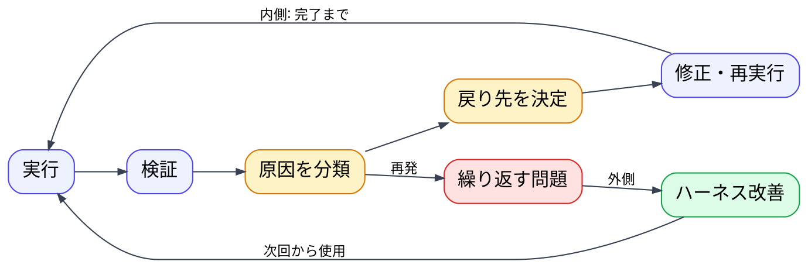

---
genpdf:
  format: slides
  font_size: 20px
  page_numbers: false
  table:
    header_background: "#e8f1ff"
    header_color: "#1f2937"
    border_color: "#cbd5e1"
    border_width: "1px"
    stripe: true
    stripe_background: "#f8fafc"
    cell_padding: "0.35em 0.55em"
    font_size: "0.86em"
    compact: true
    align: left
    header_align: center
    cell_align: left
---

<h1 align="center">アプリ生成ワークフローの Loop engineering 化</h1>

構想: 戻り方を、再現可能な仕組みにする

現在の戻り手順に、開始条件、停止条件、状態管理を加えます。

!dot{scale=0.68}

| 現在 | 仕組み化後 |
| --- | --- |
| 戻り先を手順で示す | 条件から戻り先を決める |
| 人が進行を管理する | 状態を記録して再開できる |
| 完了をレビューで判断する | 停止条件と人への確認条件を明示する |
| 問題ごとに修正する | 繰り返す問題をハーネスへ戻す |

**最初は手動でループ定義を運用し、安定した部分だけを自動化します。**

仕様の採用と重要な業務判断は、人が行います。
