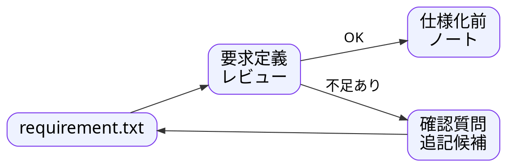
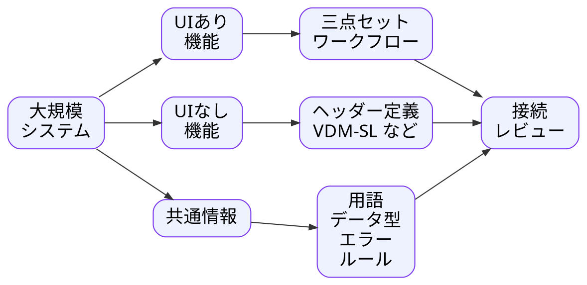

---
genpdf:
  format: slides
  title: Qt 開発への AI 適用ワークフロー
  subtitle: 三点セットを中核に、仕様・適用対象・コード生成を分割する
  author: (株) SRA
  version: 0.1.0
  date: 2026-05-28
  font_size: 20px
  page_numbers: true
  table:
    header_background: "#e8f1ff"
    header_color: "#1f2937"
    border_color: "#cbd5e1"
    border_width: "1px"
    stripe: true
    stripe_background: "#f8fafc"
    cell_padding: "0.35em 0.55em"
    font_size: "0.85em"
    compact: true
    align: left
    header_align: center
    cell_align: left
---

# 1. 今日の結論

Qt 開発へ AI を適用するには、3つを分割する。

!dot{scale=0.88}


大規模システムでは、システム全体に一括適用しない。

レビュー可能な分割単位ごとに、このワークフローを適用する。

UI あり部分は三点セット、UI なし部分は別の仕様化手法を併用する。

<div class="page-break"></div>

# 2. なぜ分割が必要か

AI は、足りないところをそれらしく補完できる。

| Qt 開発で混ざりやすいもの | AI 生成時のリスク |
| --- | --- |
| 画面部品、シグナル・スロット | それらしいが意図と違う UI になる |
| 入力検証、状態変更 | 例外や境界値が抜ける |
| 計算、保存、外部連携 | 未決事項を AI が仮決めする |
| 既存コード由来の挙動 | バグを仕様として固定する |

分割の目的は、AI の出力を人がレビューできる形にすることである。

<div class="page-break"></div>

# 3. 中核は三点セット

三点セットは、UI がある機能の仕様を分けて見るための中核である。

| 文書 | 見るもの | Qt で対応しやすいもの |
| --- | --- | --- |
| UC仕様書 | 利用者の目的、シナリオ、成功条件 | 操作フロー、画面遷移 |
| UI仕様書 | 画面、入力、表示、操作、エラー表示 | Widget、Dialog、Signal/Slot |
| ビジネスレイヤー仕様書 | 検証、計算、保存、状態変更 | Service、Model、Validator |

画面コードと業務処理を分ける根拠になる。

このワークフローは、UI がある Qt アプリを主対象にしている。
UI がないライブラリーや中核ロジックは、別の仕様化手法を併用する。

<div class="page-break"></div>

# 4. UI がない部分は別手法を併用する

三点セットを、すべての仕様に無理に使わない。

| 対象 | 向いている仕様化手法 |
| --- | --- |
| UI がある画面・操作 | 三点セット、仕様化前ノート |
| UI から呼ばれる業務処理 | 三点セットのビジネスレイヤー仕様 |
| UI がないライブラリー | ヘッダー定義、VDM-SL |
| 計算、変換、アルゴリズム | 事前条件、事後条件、不変条件 |
| 境界値が重要な処理 | 代表例、境界値、性質ベースの確認 |

大規模では、分割単位ごとに適切な仕様化手法を選ぶ。

<div class="page-break"></div>

# 5. 三点セットの前に仕様化前ノートを置く

要求から、いきなり三点セットを作ると重い。

!dot{scale=0.86}


仕様化前ノートは、目的、利用者、入力、表示、ルール、対象外、未決事項を軽量に整理する正本である。

<div class="page-break"></div>

# 6. requirement.txt と要求定義レビュー

`requirement.txt` は、要求を最初に整える推奨テンプレートである。

!dot{scale=0.82}


実装や三点セット生成に影響する不足がある場合は、先へ進まない。

<div class="page-break"></div>

# 7. 大きい仕様は5分割仕様化前ノートにする

仕様化前ノートが大きくなる場合は、1つの巨大な文書にしない。

| 分割ノート | 役割 |
| --- | --- |
| `01_purpose_scope.md` | 目的、利用者、範囲、対象外 |
| `02_input.md` | 入力項目、入力ルール |
| `03_business_logic.md` | 業務ルール、計算、状態変化 |
| `04_ui_operation.md` | 画面、表示、操作、文言 |
| `05_test_examples.md` | 代表例、期待結果、境界値 |

分割は目的ではなく、レビュー可能な状態を保つための手段である。

<div class="page-break"></div>

# 8. 大規模システムでは適用対象を分ける

このワークフロー自体も、分割単位ごとに適用する。

| 分割単位 | 例 | ワークフロー適用 |
| --- | --- | --- |
| 業務領域 | 請求、在庫、顧客管理 | 領域の仕様整理 |
| アプリ | 管理画面、利用者画面 | アプリ単位の方針 |
| 画面・画面群 | 検索画面、編集画面 | UIとUCの三点セット |
| UI あり機能 | 検索、編集、集計画面 | 三点セットワークフロー |
| UI なし機能 | ライブラリー、計算、変換 | ヘッダー定義、VDM-SL など |
| バッチ・外部連携 | CSV取込、API連携 | 性質に応じて手法を選ぶ |

システム全体を1つの三点セットにしない。

<div class="page-break"></div>

# 9. UIあり / UIなし / 共通情報の関係

大規模では、対象の性質ごとに仕様化手法を分ける。

!dot{scale=0.84}


手法を分けても、接続は必ずレビューする。

<div class="page-break"></div>

# 10. 分割単位ごとにワークフローを回す

!dot{scale=0.78}


分割単位の外にある共通ルールは、共通情報として分けて管理する。

<div class="page-break"></div>

# 11. AI の介入ポイント

AI は判断者ではなく、作成、変換、列挙、比較を担当する。

| 段階 | AI が行うこと | 人が判断すること |
| --- | --- | --- |
| 要求定義レビュー | 不足、曖昧さ、確認質問を出す | 正式要求にする内容 |
| 仕様化前ノート | 要求を軽量な正本へ整理する | 目的、対象外、未決事項 |
| 三点セット | UC、UI、ビジネス仕様へ展開する | 業務判断、UI方針、安全性 |
| 実装プロンプト | 生成範囲、技術条件を整理する | 実装方式、優先順位 |
| コード生成 | 指定範囲のコードやテストを生成する | 採用、修正、組み込み |
| 生成後レビュー | 差分、未実装、仕様外追加を列挙する | 仕様へ戻すか、削除するか |

採用判断、業務判断、安全性、責任は人が持つ。

<div class="page-break"></div>

# 12. 分割単位間の整合を管理する

大規模では、個別生成よりも整合管理が重要になる。

| 管理するもの | 目的 |
| --- | --- |
| 共通用語 | 同じ言葉を同じ意味で使う |
| 共通UI方針 | 画面ごとのばらつきを減らす |
| 共通エラー | エラー表示と例外処理をそろえる |
| 共通ビジネスルール | 重複実装と矛盾を避ける |
| UI なし仕様との接続 | データ型、エラー、境界条件をそろえる |
| 対応表 | 仕様、コード、テストの対応を追う |

分割しても、仕様のつながりは失わない。

<div class="page-break"></div>

# 13. コード生成も小さく分ける

分割単位の中でも、コード生成はさらに小さく行う。

| 生成単位 | 主に参照する仕様 | 向いている場面 |
| --- | --- | --- |
| 画面単位 | UI仕様書 | 画面構造や操作感を確認する |
| UC単位 | UC仕様書、UI仕様書、ビジネス仕様書 | 一連の操作を動かす |
| ビジネス処理単位 | ビジネスレイヤー仕様書 | 検証、計算、保存を固める |
| UIなし機能単位 | ヘッダー定義、VDM-SL | ライブラリーを生成する |
| テスト単位 | 代表例、期待結果 | 仕様確認を増やす |

生成単位を決めない依頼は危険である。

<div class="page-break"></div>

# 14. 小さく動かし、レビューして広げる

!dot{scale=0.82}


失敗した場合は、コードだけを直さない。

仕様、実装プロンプト、生成単位のどこが大きすぎたかを確認する。

<div class="page-break"></div>

# 15. 生成後レビューと仕様への反映

生成後レビューは、コード品質だけでなく、仕様との整合確認である。

| 観点 | 確認すること |
| --- | --- |
| ビルド、実行、テスト | 確認可能な状態か |
| 仕様化前ノートとの差分 | 目的、対象外、未決事項と矛盾しないか |
| 三点セットとの差分 | UC、UI、ビジネス仕様が反映されているか |
| UIなし仕様との差分 | ヘッダー定義、VDM-SL、境界条件と合うか |
| 仕様外追加 | AI が便利機能を足していないか |
| 実装中の仮決め | 仕様へ戻しているか |

正式採用する変更は、先に仕様へ戻す。

<div class="page-break"></div>

# 16. やってはいけないこと

失敗しやすい進め方を避ける。

| やってはいけないこと | 理由 |
| --- | --- |
| システム全体を1つの三点セットにする | レビューできない |
| 未決事項があるままコード生成する | AI が仮決めする |
| AI の推測を正式仕様にする | 意図違いが固定される |
| UI なしライブラリーを三点セットだけで扱う | 仕様化手法が合わない |
| 生成コードだけを直す | 仕様とコードがずれる |

止める、分ける、仕様へ戻す。

<div class="page-break"></div>

# 17. 応用と限界

この考え方は、新規生成だけではない。

| 応用 | 使い方 |
| --- | --- |
| 既存コード理解 | コードから現行仕様候補を作る |
| 移行 | 三点セットから移行先向け設計へ進む |
| 別言語化 | 仕様を保ったまま実装方式を変える |
| ライブラリー生成 | ヘッダー定義や形式仕様からコード生成する |

限界:

- 実績はまだ小規模中心
- 大規模では分割単位と共通ルール管理が重要
- UI なし機能には別手法を併用する
- バグ候補と採用する仕様を分けるレビューが必要

<div class="page-break"></div>

# 18. この方法で良くなること

分割することで、AI を使う場所と人が判断する場所を分けられる。

| 効果 | 内容 |
| --- | --- |
| AI の推測を見つけやすい | 要求、仕様、生成後レビューで確認できる |
| レビュー対象を小さくできる | 分割単位ごとに確認できる |
| 仕様とコードの対応を追える | 三点セット、プロンプト、テストを対応づける |
| 大規模でも適用できる | システム全体ではなく分割単位に適用する |
| UIあり / UIなしを使い分けられる | 三点セットと別手法を併用できる |

AI の生成力を、管理可能な単位に閉じ込める。

<div class="page-break"></div>

# 19. まとめ

Qt 開発に AI を適用する中核は、分割である。

```text
仕様を分割する
  三点セット、仕様化前ノート、5分割仕様化前ノート

適用対象を分割する
  UIあり、UIなし、業務領域、アプリ、画面、機能

コード生成を分割する
  画面単位、UC単位、ビジネス処理単位、UIなし機能単位、テスト単位
```

UI あり部分は三点セット、UI なし部分はヘッダー定義や VDM-SL などを併用する。
