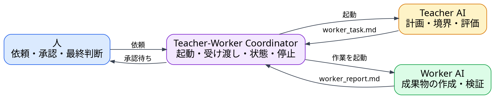

---
genpdf:
  format: slides
  font_size: 20px
  page_numbers: false
  table:
    header_background: "#e8f1ff"
    header_color: "#1f2937"
    border_color: "#cbd5e1"
    border_width: "1px"
    stripe: true
    stripe_background: "#f8fafc"
    cell_padding: "0.35em 0.55em"
    font_size: "0.86em"
    compact: true
    align: left
    header_align: center
    cell_align: left
---

<h1 align="center">Teacher-Worker Coordinator</h1>

構想: 文書の受け渡しを半自動化する

Teacher-Worker の役割分離を、実行可能な仕組みにします。

!dot{scale=0.76}

| 自動化すること | 自動化しないこと |
| --- | --- |
| AIの起動、文書の受け渡し、状態と停止の管理 | 仕様の採用、リスク受容、重要事項の最終判断 |

**近い既存構想**

| 構想 | 近い点 | 今回の違い |
| --- | --- | --- |
| Magentic-One | 計画、割当、進捗を管理する | Teacher と Coordinator を分離する |
| LangGraph | 状態保存、中断、再開、人の承認を扱う | 2つの文書を受け渡しの正本にする |
| OpenAI Agents SDK | Agent の起動、handoff、承認を管理する | 会話履歴全体を Agent 間で共有しない |

**最初は、工程ごとに人が承認する半自動運用から始めます。**
