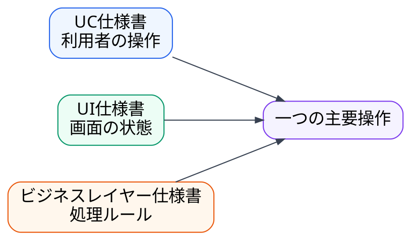
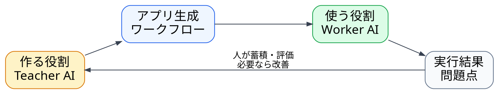

---
genpdf:
  format: slides
  title: |-
    アプリ生成ワークフロー
    (共通版ドラフト)
  subtitle: |-
    要求から動くQtアプリまで
  author: 杉田研治
  version: 0.1.0
  date: 2026-07-17
  font_size: 20px
  page_numbers: true
  background:
    image: company-footer-logo-seminar-band.svg
    target: all
    size: 100%
    position: bottom center
    repeat: no-repeat
    opacity: 1.00
  table:
    header_background: "#e8f1ff"
    header_color: "#1f2937"
    border_color: "#cbd5e1"
    border_width: "1px"
    stripe: true
    stripe_background: "#f8fafc"
    cell_padding: "0.35em 0.55em"
    font_size: "0.86em"
    compact: true
    align: left
    header_align: center
    cell_align: left
---

<h1 align="center">本日の進行</h1>

説明とデモを分けて60分で進める

| 区分 | 時間 | 内容 |
| --- | ---: | --- |
| デモ前の説明 | 8分 | 目的、全体像、三点セット |
| デモ | 30分 | 要求からコード生成、ビルド、実行まで |
| デモ後の説明 | 7分 | 後工程、戻し方、他の適用方法 |
| Q/A | 15分 | プロジェクトへの適用を相談する |

デモでは、要求にある判断が実行結果まで届く過程を追います。

<h1 align="center">今日のゴール</h1>

要求が動くアプリになるまでの判断を追う

今日見るのは、コード生成の速さだけではありません。

要求を段階的に整理し、AIが判断してよい範囲を狭めます。

| 見ること | 到達点 |
| --- | --- |
| 文書の役割 | 仕様化前ノートと三点セットを使い分ける |
| デモ | 要求からコード生成、ビルド、実行まで追う |
| 戻し方 | 意図違いを上位文書へ戻す |
| 適用 | 自分のプロジェクトで始める範囲を考える |

<h1 align="center">直接コードを生成すると推測が仕様になる</h1>

要求にない判断をAIへ任せない

要求に不足があると、AIは実装を進めるために補います。

| 起きること | 結果 |
| --- | --- |
| 入力条件が曖昧 | AIが境界値を決める |
| 対象外がない | 必要以上の機能を作る |
| UIと業務ルールが混在 | 修正先が分からなくなる |
| コードだけを修正 | 次の生成へ判断が残らない |

必要なのは、長いプロンプトではなく、判断を分けて残すことです。

<h1 align="center">要求を段階的に実装へ渡す</h1>

各工程が次の工程の判断範囲を決める

!dot{scale=0.74}

前の工程を飛ばすほど、AIがその場で決める範囲が広がります。

<h1 align="center">三点セットは異なる観点を分ける</h1>

利用者、画面、業務ルールを混ぜない

| 文書 | 主に扱う内容 | デモで見る場所 |
| --- | --- | --- |
| UC仕様書 | 目的、操作、正常系、例外系 | 主要操作と結果 |
| UI仕様書 | 画面、入力、表示、状態、遷移 | 入力状態とエラー表示 |
| ビジネスレイヤー仕様書 | 計算、制約、入力検証、処理 | 業務ルールと境界値 |

三つに分けると、反映漏れと文書間の矛盾をレビューできます。

<h1 align="center">ここから要求を動くアプリへ変える</h1>

デモでは要求からビルド・実行までを扱う

| 順番 | デモで行うこと | 主に見るもの |
| ---: | --- | --- |
| 1 | 要求を確認する | `requirement.txt` |
| 2 | 要求定義レビューを行う | 不足、矛盾、推測、未決事項 |
| 3 | 仕様化前ノートを作る | `source_memo.md` |
| 4 | 三点セットを作る | UC、UI、ビジネスレイヤー仕様書 |
| 5 | 実装プロンプトを作る | `implementation_prompt.md` |
| 6 | コードを生成する | `include/`、`src/` |
| 7 | ビルドして実行する | 画面、操作、結果 |

コードの量ではなく、判断が文書を通って実装へ届く過程を見ます。

<h1 align="center">デモ 1/7　要求を確認する</h1>

【要求】 → レビュー → 仕様化前 → 三点セット → 実装指示 → コード → 実行

| 確認項目 | 内容 |
| --- | --- |
| 今行うこと | `requirement.txt`を開き、要求の全体を確認する |
| 見るもの | 目的、入力、表示、業務ルール、対象外、未決事項 |
| 次へ進む条件 | 実行結果まで追う業務ルールが一つ決まっている |

全文を読まず、デモで追う判断を一つ選びます。

<h1 align="center">デモ 2/7　要求定義レビュー</h1>

要求 → 【レビュー】 → 仕様化前 → 三点セット → 実装指示 → コード → 実行

要求定義レビューでは、次を列挙させます。

| 確認 | 人が判断すること |
| --- | --- |
| 不足 | 実装前に追加するか |
| 矛盾 | どちらを正式な要求にするか |
| 推測 | AIへ決めさせてよいか |
| 未決事項 | 今決めるか、対象外にするか |

AIのレビュー結果は、そのまま採用せず、人が確認して要求へ反映します。

**次へ進む条件:** 三点セットや実装へ影響する不足、矛盾、未決事項が解消している。

<h1 align="center">デモ 3/7　仕様化前ノート</h1>

要求 → レビュー → 【仕様化前】 → 三点セット → 実装指示 → コード → 実行

仕様化前ノートは、正式仕様を書く前の材料置き場です。

| 整理するもの | 役割 |
| --- | --- |
| 目的と利用者 | 何のために作るかを固定する |
| 入力、表示、操作 | アプリの外から見える振る舞いを揃える |
| 業務ルール | 実装へ埋もれさせない |
| 対象外 | 過剰実装を防ぐ |
| 未決事項と反映先 | 決定後に直す場所を残す |

**次へ進む条件:** AIレビュー後に人が確認し、三点セットへ渡す内容が確定している。

<h1 align="center">デモ 4/7　三点セット</h1>

要求 → レビュー → 仕様化前 → 【三点セット】 → 実装指示 → コード → 実行

!dot{scale=0.78}

記述が食い違った場合は、実装へ進まず上位文書へ戻します。

**次へ進む条件:** AIレビュー後に人が確認し、重大な矛盾や未決事項がない。

<h1 align="center">デモ 5/7　実装プロンプト</h1>

要求 → レビュー → 仕様化前 → 三点セット → 【実装指示】 → コード → 実行

| 仕様書 | 実装プロンプト |
| --- | --- |
| 何を満たすかを定義する | どの文書を参照して実装するかを指示する |
| 利用者から見える振る舞いを持つ | 作業ディレクトリと生成対象を指定する |
| 業務ルールを持つ | 実装制約とビルド条件を渡す |

**次へ進む条件:** 実装対象、制約、参照文書、ビルド条件が明確になっている。

<h1 align="center">デモ 6/7　コードを生成する</h1>

要求 → レビュー → 仕様化前 → 三点セット → 実装指示 → 【コード】 → 実行

| 確認項目 | 内容 |
| --- | --- |
| 今行うこと | 実装プロンプトに従ってコードを生成する |
| 見るもの | `include/`、`src/`、UIと業務ロジックの分離、外部依存 |
| 次へ進む条件 | 必要なコードとビルドファイルが生成されている |

仕様にない構造や依存を、生成の都合だけで追加していないか確認します。

<h1 align="center">デモ 7/7　ビルドして実行する</h1>

要求 → レビュー → 仕様化前 → 三点セット → 実装指示 → コード → 【実行】

| 確認項目 | 内容 |
| --- | --- |
| 今行うこと | 構成、ビルド、実行を行う |
| 見るもの | 正常入力、不正入力、業務ルールと境界条件 |
| デモ完了条件 | 要求で決めた判断が実行結果に現れている |

ビルド成功だけでなく、要求から追ってきた判断の到達を確認します。

<h1 align="center">デモで行った作業には役割がある</h1>

実演した操作を再利用できるワークフローとして捉える

| デモで行ったこと | ワークフロー上の意味 |
| --- | --- |
| 要求を確認した | AIの推測範囲を減らす |
| 要求定義レビューを行った | 不足、矛盾、未決事項を人の判断へ戻す |
| 仕様化前ノートを作った | 判断の土台を作る |
| 三点セットを作った | 利用者、UI、業務ルールを分ける |
| 実装プロンプトを作った | レビュー済み仕様を実装へ渡す |
| コードを生成した | 制約に従って成果物を作る |
| ビルド、実行した | 生成結果を受け入れられるか確認する |

ここから、デモで省略した後工程と他の適用方法を説明します。

<h1 align="center">ビルド成功はワークフローの途中</h1>

コード生成後に品質確認と設計文書化が続く

!dot{scale=0.76}

重大な不整合があれば、設計文書化の前に仕様へ戻します。

<h1 align="center">意図違いは判断の発生源へ戻す</h1>

要求を確認し、必要な上位文書から整合させる

!dot{scale=0.72}

要求自体が違えば要求から直し、要求が正しければ仕様化前ノートから直します。

<h1 align="center">対象に合わせて仕様化の形を変える</h1>

一つの文書構成をすべてへ強制しない

| 対象 | 適用方法 |
| --- | --- |
| 小規模アプリ | 文書を短くして一連の流れを維持する |
| 大規模アプリ | 仕様化前ノートと生成単位を分割する |
| 既存コード | 逆生成三点セットから現行挙動を整理する |
| UIのないライブラリ | ヘッダー定義やVDM-SLを併用する |

重要なのは文書量ではなく、判断と戻り先を明確にすることです。

<h1 align="center">既存工程には必要な部分から入れられる</h1>

工程を置き換えず判断が抜ける場所を補う

| 現在の困りごと | 最初に適用する部分 |
| --- | --- |
| 要求の不足が実装中に見つかる | 要求定義レビュー |
| UIと業務ルールが混ざる | 三点セット |
| AIの生成結果がぶれる | 実装プロンプト |
| コードだけが修正される | 意図違いの修正フロー |
| 同じ問題を繰り返す | 実装結果レビューと手順改善 |

全体導入の前に、一つの問題へ部分適用できます。

<h1 align="center">継続運用では作る役割と使う役割を分ける</h1>

必要な文脈と判断基準が異なる

!dot{scale=0.80}

| 役割 | 持つ文脈 | 分ける理由 |
| --- | --- | --- |
| Teacher | 複数の作業で再利用する工程、境界、評価基準 | 個別実装の都合でワークフローを変えない |
| Worker | 対象プロジェクトの要求、仕様、コード | 決められた工程に集中して成果物を作る |

同じ文脈で扱うと、生成時の前提を引き継ぎ、成果物を独立して評価できません。

<h1 align="center">最初は一つの小機能から始める</h1>

判断がぶれる場所へワークフローを適用する

まとめます。

- 要求から直接コードを生成せず、判断を段階的に分ける
- 仕様化前ノートと三点セットで、AIの推測範囲を狭める
- ビルド成功後も、テストと実装結果レビューを行う
- 意図違いは、仕様化前ノートへ戻して上流から直す
- 自分のプロジェクトでは、一つの小機能から試す

成果物だけでなく、判断と戻り先を残すことが再利用につながります。

<h1 align="center">Q/A</h1>

自分のプロジェクトへの適用を考える

今日の内容への質問だけでなく、次の観点でも質問してください。

- どの小機能から始めるか
- 現在の工程のどこへ追加するか
- どこまでAIへ任せるか
- 既存コードをどう仕様へ戻すか
