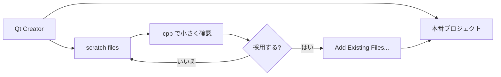
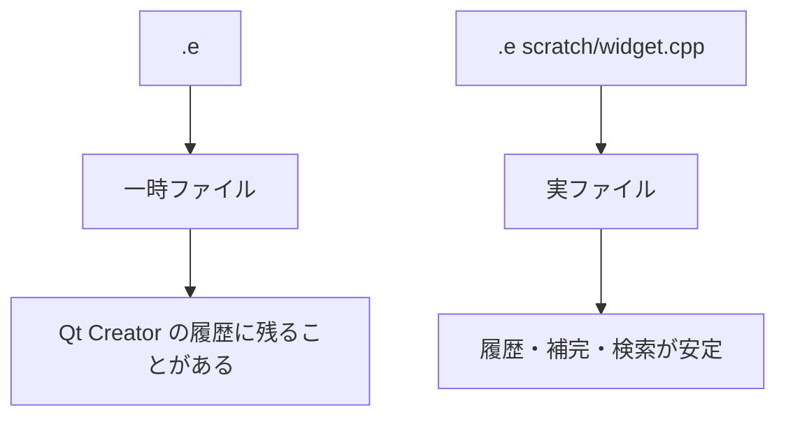
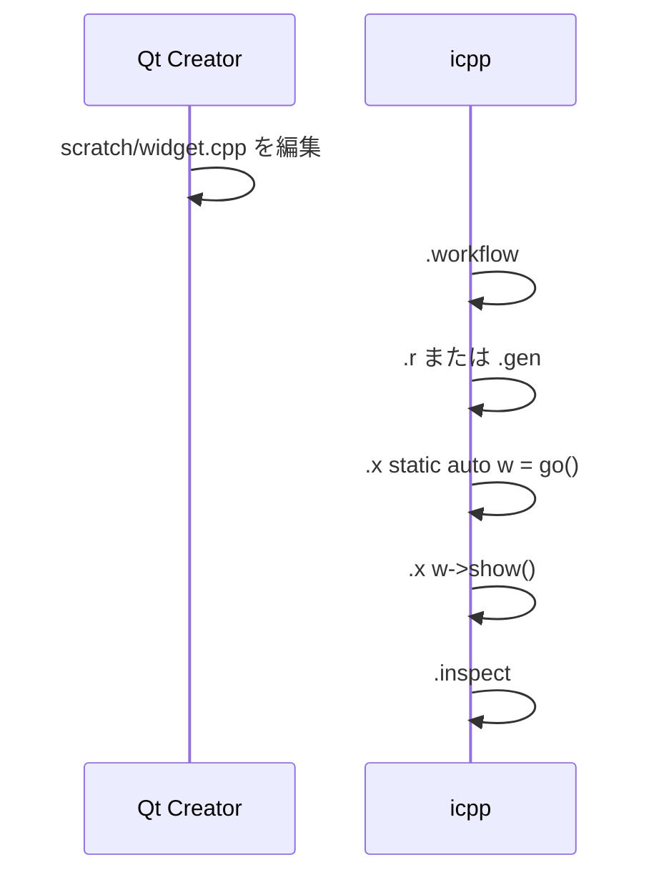

---
genpdf:
  Format: book
  Title: Qt Creator と icpp を併用するガイド
  Subtitle: 本格開発の横で C++ / Qt の小片をすぐ試す
  Author: (株) SRA
  version: 0.3.0
  page_numbers: true
---

<!-- page -->
!toc

<div class="page-break"></div>

<!-- page -->
# 1. このガイドの目的

このガイドは、Qt Creator を主な開発環境として使いながら、`icpp` を小さな C++ / Qt の確認用ワークベンチとして併用するための実践ガイドです。

`icpp` は Qt Creator の代替ではありません。Qt Creator は本番プロジェクトの編集、ビルド、デバッグ、Designer、CMake 管理を担当します。`icpp` は、その横で小さな関数、Qt API、QWidget 部品、`.ui` / `.qrc` / `moc` の流れを素早く確認します。

| 作業 | Qt Creator | icpp |
|---|---|---|
| 本番プロジェクト編集 | 主担当 | 担当外 |
| CMake / kit / build | 主担当 | 担当外 |
| Debugger / breakpoint | 主担当 | 担当外 |
| Designer で UI 設計 | 主担当 | 呼び出しや軽い確認 |
| 小さな Qt API 確認 | 小プロジェクトが必要 | 主担当 |
| QWidget 部品の試作 | 可能 | `go()` + `.x w->show()` |
| `.ui` / `.qrc` / `moc` の軽い確認 | 可能 | `.workflow` / `.gen` |
| 表示中 widget の property 確認 | debugger 中心 | `.inspect` |



# 2. 基本の役割分担

Qt Creator は「本番開発の中心」、`icpp` は「試作確認の横道」として使います。

| 役割 | 使うもの | 補足 |
|---|---|---|
| project 管理 | Qt Creator | CMake、kit、build target |
| 本番コード編集 | Qt Creator | refactor、検索、補完 |
| UI 設計 | Qt Creator / Designer | `.ui` の本設計 |
| debugging | Qt Creator | breakpoint、watch、call stack |
| 小さな挙動確認 | icpp | `QString`、`QVariant`、helper 関数 |
| GUI 部品の試作 | icpp | `.x static auto w = go();` |
| 生成物確認 | icpp | `.workflow`、`.generated`、`.clean` |
| property / object tree 確認 | icpp `.inspect` | 表示中 widget を調べる |

Qt Creator で作ったものを全部 `icpp` に持ち込む必要はありません。`icpp` に向いているのは、切り出せる小さな部品です。

<div class="page-break"></div>

# 3. 推奨ディレクトリ構成

Qt Creator のプロジェクト内に `scratch/` を作るか、プロジェクト外に実験用ディレクトリを作ります。

## 3.1 プロジェクト内 scratch

```text
my-project/
  CMakeLists.txt
  src/
  ui/
  scratch/
    widget.h
    widget.cpp
    form.ui
    resources.qrc
```

プロジェクト内に置くと include path や既存コードへの参照が楽です。ただし、採用前のファイルを CMake に入れないよう注意します。

## 3.2 プロジェクト外 scratch

```text
~/work/icpp-scratch/
  button-test/
  resource-test/
  translation-test/
```

プロジェクト外に置くと本番 project を汚しにくくなります。採用する場合は Qt Creator 側でプロジェクトへ移します。

| 方針 | 向いている場面 |
|---|---|
| project 内 `scratch/` | 既存 header や resource を参照したい |
| project 外 scratch | 完全に独立した試作をしたい |

# 4. icpp から Qt Creator をエディタとして使う

Qt Creator を `icpp` の外部エディタとして使う場合は、閉じるまで待てる起動方法を指定します。

```sh
export ICPP_EDITOR="qtcreator -client -block"
```

環境によっては Qt Creator の実行ファイルを絶対パスで指定します。

```sh
export ICPP_EDITOR='"/Applications/Qt Creator.app/Contents/MacOS/Qt Creator" -client -block'
```

`icpp` のエディタ選択の優先順は次の通りです。

| 優先順 | 変数 |
|---|---|
| 1 | `ICPP_EDITOR` |
| 2 | `VISUAL` |
| 3 | `EDITOR` |
| 4 | 既定値 `vim` |

Qt Creator と併用する場合は、引数なしの `.e` より実ファイルを指定する運用が向いています。

```text
icpp[qtcling]> .e scratch/widget.cpp
```

引数なしの `.e` は一時ファイルを作るため、Qt Creator のセッションや最近使ったファイルに `icpp_XXXXXX.cpp` のような名前が残ることがあります。Qt Creator はプロジェクトやセッション管理が強いため、一時ファイルが目立ちやすい場合があります。



<div class="page-break"></div>

# 5. Qt Creator 側で主に行うこと

Qt Creator で十分な作業は Qt Creator に残します。

| 作業 | 理由 |
|---|---|
| project 全体の build | CMake、kit、依存関係を正しく扱える |
| breakpoint を使う debugging | call stack、watch、locals が使える |
| Designer で本格 UI 設計 | layout、tab order、property 編集がしやすい |
| 本番コードの refactor | project 全体の参照関係を見ながら行える |
| CMakeLists.txt の管理 | build target と install の整合性が必要 |
| resource / translation の本番統合 | CMake / qrc / ts の管理が必要 |

`icpp` は、これらを置き換えるものではありません。Qt Creator の作業を止めずに、小さな確認を横で済ませるために使います。

# 6. icpp 側で主に行うこと

`icpp` が向いているのは、すぐ動かして判断したい小さな作業です。

| 作業 | 例 |
|---|---|
| Qt 型の確認 | `QString`、`QVariant`、`QDateTime` |
| helper 関数 | 文字列変換、format、filter |
| small QWidget | button、slider、label |
| signal / slot 確認 | `Q_OBJECT` + `.gen` |
| `.ui` の objectName 確認 | `.uiinfo form.ui` |
| resource の確認 | `.qrc` + `.gen` |
| 表示中 widget の確認 | `.widgets` / `.inspect` |

典型的には、Qt Creator で書いた `scratch/widget.cpp` を `icpp` で登録して動かします。

```text
icpp[qtcling]> .add scratch/widget.cpp
icpp[qtcling]> .workflow
icpp[qtcling]> .gen
icpp[qtcling]> .x static auto w = go();
icpp[qtcling]> .x w->show();
```

# 7. 基本ワークフロー

## 7.1 実ファイルを作って試す

```text
icpp[qtcling]> .e scratch/widget.h
icpp[qtcling]> .e scratch/widget.cpp
icpp[qtcling]> .files
icpp[qtcling]> .workflow
icpp[qtcling]> .r
icpp[qtcling]> .x static auto w = go();
icpp[qtcling]> .x w->show();
```

`Q_OBJECT`、`.ui`、`.qrc` がある場合は `.r` ではなく `.gen` を使います。

```text
icpp[qtcling]> .workflow
icpp[qtcling]> .gen
```

## 7.2 go() を入口にする

`icpp` では `main()` ではなく、`go()` を入口にします。

```cpp
Widget* go()
{
    return new Widget;
}
```

REPL からは次のように使います。

```text
icpp[qtcling]> .x static auto w = go();
icpp[qtcling]> .x w->show();
```

`static auto w = go();` とすると、後から同じ widget を操作できます。

```text
icpp[qtcling]> .x w->raise();
icpp[qtcling]> .x w->resize(400, 240);
```



<div class="page-break"></div>

# 8. .ui を扱う

`.ui` は Qt Creator または Designer で編集し、`icpp` では構成確認と実装確認に使います。

```text
icpp[qtcling]> .designer form.ui
```

Designer で保存した後、`.uiinfo` で widget 名を確認します。

```text
icpp[qtcling]> .uiinfo form.ui
class: Form
base: QWidget

widgets:
  QWidget      Form
  QPushButton  okButton
  QLabel       titleLabel
```

C++ 実装では `ui_form.h` を include します。

```cpp
#include "widget.h"
#include "ui_form.h"

Widget::Widget(QWidget *parent)
    : QWidget(parent)
    , ui(new Ui::Form)
{
    ui->setupUi(this);
    connect(ui->okButton, &QPushButton::clicked, this, [this]() {
        ui->titleLabel->setText("Clicked");
    });
}
```

生成と実行は `.gen` です。

```text
icpp[qtcling]> .add widget.cpp
icpp[qtcling]> .gen
icpp[qtcling]> .x static auto w = go();
icpp[qtcling]> .x w->show();
```

`.preview form.ui` は C++ 実装なしで `.ui` の見た目を確認します。

```text
icpp[qtcling]> .preview form.ui
```

# 9. .qrc と translation を扱う

Qt Creator で resource を管理している場合でも、`icpp` では小さな `.qrc` を試せます。

```text
icpp[qtcling]> .qrc resources.qrc
icpp[qtcling]> .workflow
icpp[qtcling]> .gen
```

`qrc_resources.cpp` は生成物です。通常は直接 `.add` せず、利用側の `widget.cpp` から include します。

```cpp
#include "qrc_resources.cpp"
```

translation では `.ts` から `.qm` を生成する必要があります。`.gen` は `lrelease` を実行しないため、`.!` で明示します。

```text
icpp[qtcling]> .! lupdate widget.cpp -ts app_ja.ts
icpp[qtcling]> .linguist app_ja.ts
icpp[qtcling]> .! lrelease app_ja.ts
icpp[qtcling]> .qrc translations.qrc
icpp[qtcling]> .workflow
icpp[qtcling]> .gen
```

生成物の一覧は `.generated` で確認します。

```text
icpp[qtcling]> .generated
```

生成物だけを消してやり直す場合は `.clean` を使います。削除前に対象一覧が表示されます。

```text
icpp[qtcling]> .clean
```

<div class="page-break"></div>

# 10. 複数ファイルと順番

複数ファイルは `.add` で登録します。

```text
icpp[qtcling]> .add model.cpp
icpp[qtcling]> .add widget.cpp
icpp[qtcling]> .files
```

`.r` は `.files` の表示順に評価します。依存される側を先にします。

```text
1  /path/to/model.cpp
2  /path/to/widget.cpp
```

順番を後から変えたい場合は `.r edit` を使います。

```text
icpp[qtcling]> .r edit
```

エディタで行の順番を入れ替えて保存すると、その順番で再評価します。未登録ファイル、重複、不足がある場合は、順番を変更せず、再実行もしません。

定義の確認には `.defs` を使います。

```text
icpp[qtcling]> .defs
```

| コマンド | 用途 |
|---|---|
| `.add <file>` | `.r` / `.gen` の対象に登録 |
| `.files` | 登録順を表示 |
| `.r edit` | 登録順を編集して再評価 |
| `.drop <file|number>` | 登録から外す |
| `.defs` | 定義一覧を表示 |

# 11. .inspect を使った GUI 確認

`icpp` で widget を表示した後、`.inspect` で top-level widget の property と object tree を確認できます。

```text
icpp[qtcling]> .x static auto w = go();
icpp[qtcling]> .x w->show();
icpp[qtcling]> .inspect
```

`.inspect` は、Qt Creator debugger の代替ではありません。実行中の widget の状態、layout、objectName、property を視覚的に見るための補助です。

| 確認したいこと | 使うもの |
|---|---|
| C++ の call stack | Qt Creator debugger |
| 変数の値 | Qt Creator debugger / icpp `.p` |
| top-level widget 一覧 | icpp `.widgets` |
| property / object tree | icpp `.inspect` |
| UI の見た目 | Qt Creator Designer / icpp `.preview` |

# 12. 試作品を Qt Creator プロジェクトへ移す

`icpp` で確認したコードを採用する場合は、Qt Creator 側で本番 project に入れます。

1. Qt Creator の Projects view で対象 project を右クリックする
2. `Add Existing Files...` を選ぶ
3. `scratch/widget.h`、`scratch/widget.cpp` などを選ぶ
4. 必要なら CMakeLists.txt を更新する
5. Qt Creator で build / debug する

移すときに整理する点は次の通りです。

| icpp 試作側 | 本番側で確認すること |
|---|---|
| `go()` | 本番では不要なら削除する |
| `#include "moc_widget.cpp"` | CMake AUTOMOC の運用なら不要な場合がある |
| `#include "qrc_resources.cpp"` | 本番の resource 管理へ移すか |
| `scratch/` の path | 本番の `src/` / `ui/` へ移す |
| 仮 objectName | Designer 側で整理する |

`icpp` は採用判断までを短くする道具です。本番化の最後は Qt Creator で build / debug して確認します。

<div class="page-break"></div>

# 13. Qt Creator で十分な場面

次の作業は Qt Creator だけで進める方が自然です。

| 場面 | 理由 |
|---|---|
| 既存 project 全体の修正 | build 条件や依存関係を含む |
| breakpoint を使う調査 | debugger が適している |
| 複雑な UI 設計 | Designer の property editor が適している |
| 大きな refactor | project 全体の検索と補完が必要 |
| performance 調査 | profiler / analyzer が必要 |
| production code の最終確認 | build、test、review が必要 |

`icpp` は「Qt Creator でできないから使う」ものではありません。Qt Creator で本格作業を続けながら、横で小さく試すために使います。

# 14. チートシート

## 14.1 エディタ設定

```sh
export ICPP_EDITOR="qtcreator -client -block"
```

## 14.2 基本操作

| コマンド | 用途 |
|---|---|
| `.e <file>` | Qt Creator で実ファイルを編集 |
| `.add <file>` | `.r` / `.gen` の対象に登録 |
| `.files` | 登録順を確認 |
| `.r` | 登録ファイルと編集バッファを再評価 |
| `.r edit` | 登録順をエディタで変更して再評価 |
| `.gen` | `run_all` 後に再評価 |
| `.workflow` | 次の操作候補を見る |
| `.generated` | 生成物一覧を見る |
| `.clean` | 生成物を確認して削除 |
| `.template <kind> [base]` | ひな形ファイルを作成 |
| `.a <code>` | 実行して編集バッファにも追加 |
| `.uiinfo <file.ui>` | `.ui` の widget 一覧を見る |
| `.preview <file.ui>` | `.ui` を直接プレビュー |
| `.inspect` | 表示中 widget の property を見る |

## 14.3 最短手順

```text
icpp[qtcling]> .e scratch/widget.h
icpp[qtcling]> .e scratch/widget.cpp
icpp[qtcling]> .workflow
icpp[qtcling]> .gen
icpp[qtcling]> .x static auto w = go();
icpp[qtcling]> .x w->show();
icpp[qtcling]> .inspect
```
