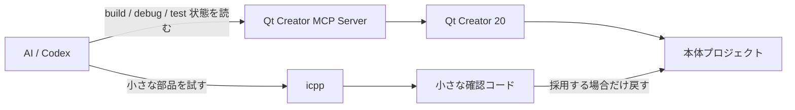
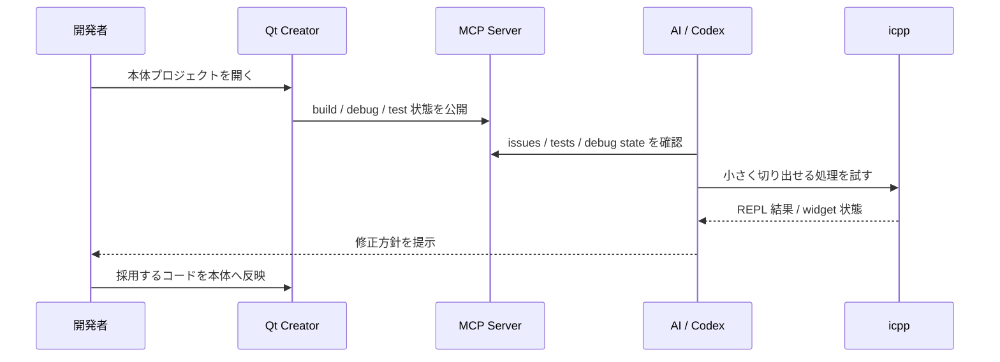
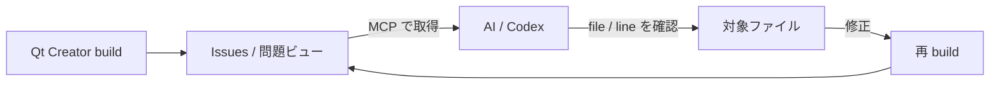
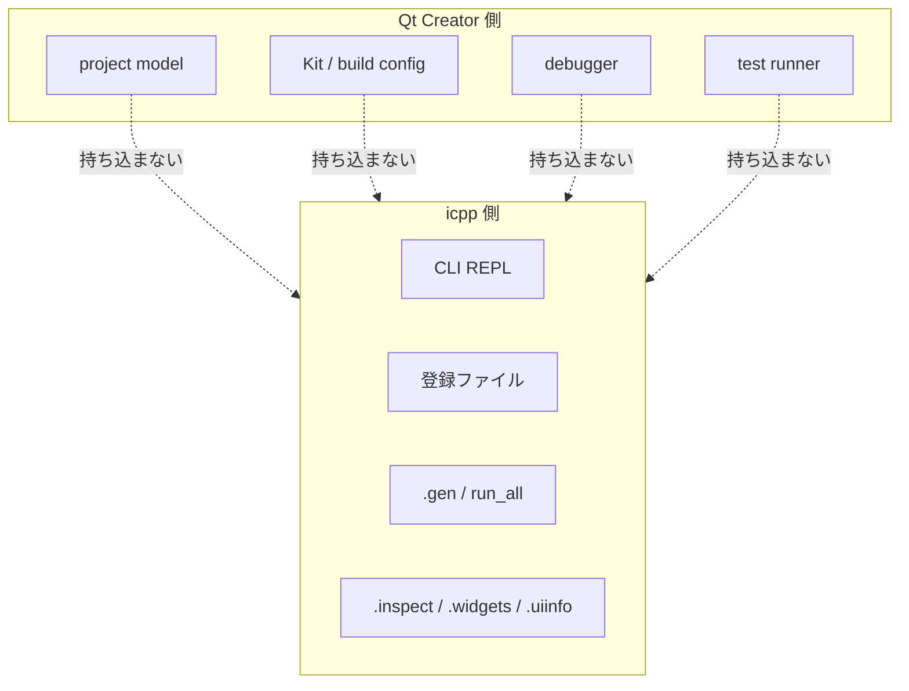

---
genpdf:
  Format: book
  Title: Qt Creator MCP Server と icpp 併用ガイド
  Subtitle: Qt Creator 20 の build / debug / test と icpp REPL の役割分担
  Author: (株) SRA
  version: 0.1
  page_numbers: true
---

<!-- page -->
!toc

<div class="page-break"></div>

<!-- page -->
# 1. 目的

このガイドは、Qt Creator MCP Server と icpp を併用するための考え方をまとめた別冊です。

Qt Creator 20 では、MCP Server により AI が Qt Creator の build、debug、test の状態を扱いやすくなっています。一方、icpp は小さな C++ / Qt コードをその場で試す CLI REPL です。

この 2 つは競合しません。Qt Creator MCP Server は本体プロジェクトの実状態を AI が読むために使い、icpp は本体へ入れる前の小さな部品を横で試すために使います。

このガイドでは、icpp に Qt Creator MCP Server を組み込むことは扱いません。icpp 本体は project model、debugger、test runner を持たず、CLI REPL として保ちます。

!callout{type=note title=この別冊の位置づけ}
  `USER_GUIDE.md` は icpp の使い方を説明します。
  この別冊は Qt Creator 20 の MCP Server と icpp を併用するときの役割分担を説明します。
  icpp 本体へ MCP 連携を追加する設計書ではありません。



<div class="page-break"></div>

<!-- page -->
# 2. 役割分担

| 作業 | 道具 |
|---|---|
| 本体プロジェクトの編集 | Qt Creator |
| CMake / Kit / build configuration | Qt Creator |
| Build Issues の取得 | Qt Creator MCP Server |
| debug session の起動と停止 | Qt Creator MCP Server |
| breakpoint / call stack / local variables | Qt Creator MCP Server |
| expression evaluation | Qt Creator MCP Server |
| AutoTest の実行と失敗詳細の確認 | Qt Creator MCP Server |
| 小さな QWidget / QObject の試作 | icpp |
| `.ui` / `.qrc` / `.ts` の小さな確認 | icpp |
| `go()` で widget を作って表示 | icpp |
| `.inspect` / `.widgets` / `.uiinfo` で動的確認 | icpp |
| 採用するコードの本体反映 | Qt Creator |

Qt Creator MCP Server は、Qt Creator が実際に使っている project、Kit、build directory、run configuration、debugger、test runner の状態を扱います。icpp はそれらを再現しようとせず、独立した小さな確認に集中します。

| 道具 | 持つ状態 | icpp との関係 |
|---|---|---|
| Qt Creator | project、Kit、CMake、build / run config | 本体開発の中心 |
| Qt Creator MCP Server | Qt Creator の build / debug / test 状態 | AI が本体状態を読む窓口 |
| icpp | 登録ファイル、include path、REPL の試行状態 | 小さな部品を横で試す |

<div class="page-break"></div>

<!-- page -->
# 3. 基本ワークフロー

基本の流れは次の形です。

```text
1. Qt Creator で本体プロジェクトを開く
2. Qt Creator MCP Server を有効にする
3. AI が build / debug / test の状態を読む
4. 小さく切り出せるものは icpp で試す
5. 有効なら Qt Creator に戻して本体へ反映する
```



icpp 側では、本体プロジェクトの CMake や Kit を読まず、確認用の実ファイルを使います。

```text
icpp[qtcling]> .new widget Widget
icpp[qtcling]> .add widget.cpp
icpp[qtcling]> .gen
icpp[qtcling]> static auto w = go();
icpp[qtcling]> w->show();
icpp[qtcling]> w->raise();
```

本体へ入れる判断ができたら、Qt Creator の Projects view から `Add Existing Files...` で追加します。確認だけで終わるコードは、本体プロジェクトへ入れません。

<div class="page-break"></div>

<!-- page -->
# 4. Qt Creator MCP Server が意味を持つケース

Qt Creator MCP Server が特に意味を持つのは、Qt Creator の中にある実際の状態を AI が直接使える場合です。単にコードを生成するだけではなく、開いている project、build 結果、Issues、test 結果、debug session などを材料にできます。

## 4.1 Build Issues 起点の修正

Qt Creator MCP Server を使うと、Qt Creator の「問題」ビューに出ている build error を AI エージェント側から取得できます。エラーには、message、file、line、候補となる symbol など、修正判断に必要な情報が含まれることがあります。

```text
1. Qt Creator で本体プロジェクトを開く
2. Qt Creator MCP Server 経由で build する
3. AI が Issues を取得する
4. AI が対象ファイルを確認する
5. AI または開発者が修正する
6. Qt Creator 側へ反映し、再 build する
```

この流れでは、人が build error をコピーして AI に貼り付ける必要がありません。AI は Qt Creator が見ている build result を直接参照し、原因の見当をつけ、対象ファイルの確認へ進めます。



## 4.2 Qt AI Assistant との違い

Qt AI Assistant は、Qt Creator の editor 上で選択したコードに対して修正案を出す使い方が中心です。開発者が対象箇所を選び、AI に `/fix` のような支援を依頼します。

Qt Creator MCP Server は、外部 AI エージェントが Qt Creator の build、Issues、file、debug、test などをまたいで扱う入口です。build result を起点にして、対象ファイルを読み、修正し、Qt Creator 側で再確認する流れを作れます。

| 観点 | Qt AI Assistant | Qt Creator MCP Server |
|---|---|---|
| 主な入口 | editor で選択したコード | build / Issues / debug / test 状態 |
| 操作する主体 | Qt Creator 内の AI 支援 | 外部 AI エージェント |
| 得意な作業 | 選択範囲の修正支援 | project 状態をまたいだ調査 |
| icpp との関係 | 直接の連携は不要 | 必要に応じて小さな再現を icpp で試す |

## 4.3 注意点

外部 AI エージェントが実ファイルを修正した場合、Qt Creator 側の editor buffer が古い内容を保持していることがあります。この場合は、Qt Creator 側で対象ファイルを開き直す、または MCP 経由で閉じて再度開く、といった同期確認が必要です。

また、Issues が古い build error を保持する場合があります。自動判定では、Issues だけでなく、実ファイルの内容、再 build 結果、必要なら debug / test の状態を合わせて確認します。

| 注意点 | 対処 |
|---|---|
| Qt Creator の editor buffer が古い | ファイルを開き直して同期を確認する |
| Issues が古いエラーを保持する | 再 build し、実ファイル内容と合わせて見る |
| 単純な typo だけを見ている | より大きな project 状態にも同じ流れが使えるか確認する |
| icpp へ持ち込みすぎる | project 依存の問題は Qt Creator MCP Server 側で追う |

<div class="page-break"></div>

<!-- page -->
# 5. デバッグ時の使い分け

Qt Creator MCP Server が向いているのは、ソースを読むだけでは実行時の事実が足りない場合です。

| 状況 | 主に使うもの |
|---|---|
| Debug build では動くが Release build では壊れる | Qt Creator MCP Server |
| Kit や build directory に依存する | Qt Creator MCP Server |
| breakpoint で止めて local variables を見たい | Qt Creator MCP Server |
| call stack や実際の呼び出し経路を見たい | Qt Creator MCP Server |
| expression evaluation で object state を確認したい | Qt Creator MCP Server |
| 小さな QObject / QWidget の挙動だけを切り出したい | icpp |
| signal / slot の小さな再現を作りたい | icpp |
| widget の property を `.inspect` で触りたい | icpp |

Qt Creator MCP Server では、debug session、breakpoint、call stack、variables、expression evaluation を組み合わせて本体プロジェクトの実行時状態を観察します。

icpp では、本体から切り出した小さな再現コードを作ります。たとえば signal / slot の接続、`Q_PROPERTY` の挙動、widget の初期状態、`.ui` の objectName などを短いコードで確認します。

<div class="page-break"></div>

<!-- page -->
# 6. テスト失敗調査

Qt Creator 20 の MCP Server では、AutoTest 系の情報を AI が扱えるようになっています。テスト失敗の調査では、まず Qt Creator MCP Server で本体プロジェクトの実際の失敗を見ます。

```text
1. Qt Creator MCP Server で tests を実行する
2. failing test と failure message を確認する
3. 必要なら debug session で停止して変数を見る
4. 小さく切り出せる処理だけ icpp で再現する
5. 修正を本体へ戻し、Qt Creator 側で tests を再実行する
```

icpp は test runner ではありません。テスト一覧、fixture、前後の test の副作用、Qt Creator の AutoTest 状態は Qt Creator 側で扱います。

icpp が役に立つのは、失敗の原因になっている小さな処理を切り出せる場合です。

```text
icpp[qtcling]> .e scratch/case.cpp
icpp[qtcling]> .r
icpp[qtcling]> checkSmallCase()
```

本体プロジェクトでしか再現しない失敗は、Qt Creator MCP Server の debug / test 機能で追います。

<div class="page-break"></div>

<!-- page -->
# 7. `.ui` / `.qrc` / `.ts` の確認

icpp は、Qt 生成物を伴う小さな確認に向いています。

## 7.1 `.ui`

```text
icpp[qtcling]> .new ui WidgetForm
icpp[qtcling]> .designer widgetform.ui
# Designer で保存する
icpp[qtcling]> .gen
icpp[qtcling]> .uiinfo widgetform.ui
```

`.uiinfo` で objectName を確認し、C++ 側では `ui_widgetform.h` を include します。`ui_*.h` は生成物なので手で編集しません。

## 7.2 `.qrc`

```text
icpp[qtcling]> .new qrc resources
icpp[qtcling]> .qrc creator resources.qrc
# Qt Creator の Resource Editor で保存する
icpp[qtcling]> .gen
```

Qt Creator の Resource Editor を使う場合は `.qrc creator` または `.qtc` を使います。テキストで十分な場合は `.qrc resources.qrc` を使います。

## 7.3 `.ts`

```text
icpp[qtcling]> .! lupdate *.cpp -ts app_ja.ts
icpp[qtcling]> .linguist app_ja.ts
# Linguist で翻訳して保存する
icpp[qtcling]> .! lrelease app_ja.ts
icpp[qtcling]> .gen
```

`.gen` は `lrelease` を実行しません。翻訳では、Qt 標準コマンドを `.!` で明示的に実行します。

<div class="page-break"></div>

<!-- page -->
# 8. 使わない方がよい境界

icpp に次の機能を持たせません。

| 持たせないもの | 理由 |
|---|---|
| Qt Creator project model の解釈 | Qt Creator が既に持っている |
| Kit / build configuration 管理 | Qt Creator が実状態を持っている |
| debugger 連携 | Qt Creator MCP Server が担当する |
| test runner | Qt Creator AutoTest と MCP Server が担当する |
| Qt Creator MCP Server の直接組み込み | icpp が project helper 化しやすい |
| GUI REPL | 既存 Qt ツールとの役割が重なる |

icpp は、Qt Creator の横に置く確認用 REPL として保つ方が分かりやすいです。



<div class="page-break"></div>

<!-- page -->
# 9. 典型例

## 9.1 signal / slot の順序が怪しい

本体プロジェクトで実際の順序を見る必要がある場合は、Qt Creator MCP Server で breakpoint、call stack、variables を見ます。

小さく再現できる場合は、icpp で最小の QObject / QWidget を作って確認します。

```text
icpp[qtcling]> .new widget SignalDemo
icpp[qtcling]> .add signaldemo.cpp
icpp[qtcling]> .gen
icpp[qtcling]> static auto w = go();
icpp[qtcling]> w->show();
```

## 9.2 `.ui` の objectName と C++ 側の参照がずれている

icpp 側で `.uiinfo` を使うと、`.ui` に実際に入っている objectName を確認できます。

```text
icpp[qtcling]> .uiinfo form.ui
```

本体プロジェクトの build issue として出ている場合は、Qt Creator MCP Server で issue の file / line を確認し、icpp で `.ui` 側の名前を確認します。

## 9.3 failing test の原因となる小さな変換関数を確認する

Qt Creator MCP Server で failing test を確認し、関数単体に切り出せるなら icpp で入力と出力を試します。

```text
icpp[qtcling]> .e scratch/convert_case.cpp
icpp[qtcling]> .r
icpp[qtcling]> convertCase(input)
```

fixture、test order、AutoTest の状態に依存する場合は、icpp へ持ち込まず Qt Creator MCP Server の debug / test 機能で追います。

<div class="page-break"></div>

<!-- page -->
# 10. まとめ

Qt Creator MCP Server と icpp は、担当する事実が違います。

```text
Qt Creator MCP Server:
  本体プロジェクトの build / debug / test の実状態を見る

icpp:
  小さな Qt/C++ 部品を横で試す

Qt Creator:
  採用するコードを本体へ入れ、ビルド、デバッグ、テストする
```

icpp に Qt Creator MCP Server の機能を取り込む必要はありません。Qt Creator 20 の debug / test 強化は Qt Creator 側で活かし、icpp は CLI REPL として軽く保ちます。
