---
genpdf:
  Format: book
  Title: icpp User Guide
  Subtitle: C++ REPL for cling / qtcling
  Author: SRA, Inc.
  version: 1.2.0
  page_numbers: true
---

<!-- page -->
!toc

<div class="page-break"></div>

<!-- page -->
# 1. Overview

`icpp` is a REPL wrapper for experimenting with C++ interactively.

This guide covers `icpp 1.2.0`.

Internally, it launches `cling` or `qtcling` and sends user input to that interpreter. `icpp` does not interpret C++ itself. Instead, it makes the following tasks easier:

- Managing multiline C++ code as an editing buffer
- Editing functions and classes in an editor
- Rerunning edited code from the beginning
- Registering multiple files and rerunning them together
- Transferring code through the clipboard
- Saving experimental code to files
- Easily displaying values of Qt types

The default interpreter is `qtcling`, so you can immediately experiment with Qt types such as `QString`, `QVariant`, and `QDebug`.

Supported platforms are macOS and Linux. Use `qtcling`, `run_all`, Qt's `moc` / `uic` / `rcc`, and required GUI tools from the same Qt 6.x.y environment.

The distribution includes a brief introduction in `README.md`, a change history in `CHANGELOG.md`, and detailed usage instructions in `USER_GUIDE.pdf`.

!callout{type=note title=Note}
  Tables are written as Markdown tables and processing flows as Mermaid diagrams.
  The PDF is intended to be generated with `genpdf`.

# 2. Where to Start

Before reading the details, start with the procedure closest to your goal.

| Goal | Shortest procedure |
|---|---|
| Try a single-line C++ / Qt expression | Enter the expression; display it with `.p <expr>` if needed |
| Write a small function | `.e scratch.cpp`, save and close, then `.x <function call>` |
| Try an existing `.cpp` | `.add widget.cpp`, `.r`, `.x static auto w = go();` |
| Use `Q_OBJECT` / `.ui` / `.qrc` | `.add widget.cpp`, `.gen` |
| Edit a `.ui` | `.designer form.ui`, `.gen` |
| Edit a `.qrc` | `.qrc resources.qrc` or `.qtc resources.qrc`, `.gen` |
| Edit a `.ts` | `.! lupdate ... -ts app_ja.ts`, `.linguist app_ja.ts`, `.! lrelease app_ja.ts` |
| Inspect an on-screen widget | `.x static auto w = go();`, `.x w->show();`, `.inspect` |
| Check defined functions | `.defs` |
| Check objectName values in a `.ui` | `.uiinfo form.ui` |

Handle Qt generation input files as follows:

| File | Edit | Generate / update |
|---|---|---|
| `.cpp` / `.h` | `.e <file>` or your usual editor | `.r` or `.gen` |
| `.ui` | `.designer <form\|file.ui>` | `.gen` |
| `.qrc` | `.qrc <file.qrc>` / `.qtc <file.qrc>` | `.gen` |
| `.ts` | `.linguist <file.ts>` | `.! lrelease <file.ts>` |

Run the standard Qt commands `lupdate` and `lrelease` explicitly through `.!`. There are no icpp-specific aliases.

When something goes wrong, start here:

| Symptom | Where to look |
|---|---|
| C++ type or member not found | The interpreter diagnostics shown immediately |
| Unsure of objectName values in a `.ui` | `.uiinfo <file.ui>` |
| Unsure which files are registered | `.files` / `.status` |
| An icpp command failed | `.errors` |
| Qt generated files seem stale | `.generated` / `.qt` / `.gen` |
| Want to remove generated files and start over | `.clean` |
| Want to check the environment or Qt tools | `.doctor` |

Use `.command -h` for detailed command help, for example `.e -h`, `.r -h`, `.gen -h`, or `.template -h`. `.?` provides a short overview.

# 3. What icpp Can Do

`icpp` helps you develop short C++/Qt code through experimentation.

| Goal | Feature |
|---|---|
| Try C++ expressions | Normal input |
| Try Qt types | Default `qtcling` |
| Display values | `.p` / `.print` |
| Display types | `.ptype` |
| Inspect QWidgets | `.widgets` |
| Write multiline functions | `.e <file>` / `.add` |
| View the editing buffer | `.show` |
| Rerun the editing buffer and registered files | `.run` |
| Manage multiple files together | `.add` / `.files` / `.drop` |
| Exchange code with Copilot or an editor | `.paste` / `.copy` |
| Save to a file | `.save` |
| Read existing files | `.open` / `.load` |
| Recreate the interpreter | `.reset` / `.restart` |

`icpp` is not a replacement for a full build system or IDE. It is suited to quickly checking small functions, data conversions, and Qt type behavior.

# 4. For Qt Creator Users

If Qt Creator is your main development environment, use icpp as a companion REPL for checks, rather than as a replacement IDE.

Use Qt Creator for project-wide editing, completion, building, debugging, and UI design. Use icpp to quickly try small pieces of C++/Qt code before adding them to the project. icpp does not interpret the project model or replace Qt Creator's Kits or CMake configuration.

## 4.1 Division of Responsibilities

| Task | Tool |
|---|---|
| Edit the main project | Qt Creator |
| CMake / Kits / building / debugging | Qt Creator |
| Generate code with Copilot | Qt Creator or your usual editor |
| Check small functions or Qt API behavior | icpp |
| Check small classes using `Q_OBJECT` | icpp + `.gen` |
| Create and edit `.ui` files | `.designer` or Qt Creator |
| Edit `.qrc` files | `.qrc creator` / `.qtc` or a text editor |
| Edit `.ts` translations | `.linguist` |
| Update `moc` / `uic` / `rcc` outputs | `.gen` |
| Add accepted code to the project | Qt Creator's `Add Existing Files...` |

## 4.2 Basic Approach

When using Qt Creator alongside icpp, real files are more reliable than temporary files. Running `.e` without arguments opens a temporary file, which can leave `icpp_XXXXXX.cpp` entries in Qt Creator sessions or recent files.

Keep experimental files separate from the main project, for example under `scratch/` or a lesson directory. Move only accepted code back into the Qt Creator project to avoid cluttering CMake configuration and build targets.

## 4.3 Trying Real Files

To try a small QWidget, create real files and register them:

```text
icpp[qtcling]> .new widget Widget
icpp[qtcling]> .add widget.cpp
icpp[qtcling]> .gen
icpp[qtcling]> static auto w = go();
icpp[qtcling]> w->show();
icpp[qtcling]> w->raise();
```

`.new widget Widget` creates `widget.h` and `widget.cpp`. Register the generated `widget.cpp` with `.add`, then update generated files with `.gen` before creating the widget, since `Q_OBJECT` and `moc_widget.cpp` are involved.

Edit `widget.h` and `widget.cpp` in Qt Creator or your usual editor, and use `.gen`, `.defs`, and `.inspect` in icpp to check them.

## 4.4 Using .ui Files

To try a Designer UI, create or edit a `.ui` file, save it, and generate `ui_*.h` with `.gen`.

```text
icpp[qtcling]> .new ui WidgetForm
icpp[qtcling]> .designer widgetform.ui
# Save in Designer
icpp[qtcling]> .gen
icpp[qtcling]> .uiinfo widgetform.ui
```

`.uiinfo` shows objectName values in the `.ui`. In C++, include `ui_widgetform.h` and use `private Ui::WidgetForm`. Do not edit the generated `ui_widgetform.h` manually.

## 4.5 Using .qrc Files

To try resources, create and edit a `.qrc`, save it, and generate `qrc_*.cpp` with `.gen`.

```text
icpp[qtcling]> .new qrc resources
icpp[qtcling]> .qrc creator resources.qrc
# Save in Qt Creator's Resource Editor
icpp[qtcling]> .gen
```

Use `.qrc creator resources.qrc` or `.qtc resources.qrc` for Qt Creator's Resource Editor. If text editing is sufficient, use `.qrc resources.qrc`. The consuming `.cpp` normally includes `qrc_resources.cpp`.

## 4.6 Using .ts Files

To try translations, explicitly run Qt's standard `lupdate` and `lrelease` through `.!`.

```text
icpp[qtcling]> .! lupdate *.cpp -ts app_ja.ts
icpp[qtcling]> .linguist app_ja.ts
# Translate and save in Linguist
icpp[qtcling]> .! lrelease app_ja.ts
icpp[qtcling]> .gen
```

`.gen` does not run `lrelease`. After saving a `.ts` in Linguist, update the `.qm` with `lrelease`, then return to the `.qrc` and `.gen` workflow as needed.

## 4.7 Moving Code Back into a Qt Creator Project

To adopt files tried in icpp, right-click the project in Qt Creator's Projects view and add them through `Add Existing Files...`. Code used only for a quick check can be discarded without adding it to the project.

Use Qt Creator for project-wide build settings, complex dependencies, debugger tracing, and production code maintained long term. In icpp, isolate small independent components for experimentation.

## 4.8 Troubleshooting

| Situation | What to check |
|---|---|
| Generated files seem stale | `.generated` / `.gen` |
| Qt tool locations seem wrong | `.doctor` / `.qt` |
| Unsure of objectName values in a `.ui` | `.uiinfo form.ui` |
| Unsure which files are registered | `.files` |
| Unsure of evaluation order | `.runorder` |
| Unsure which widgets are displayed | `.widgets all` |
| Want to inspect widget properties | `.inspect` |

A common checking sequence is:

```text
icpp[qtcling]> .generated
icpp[qtcling]> .qt
icpp[qtcling]> .files
icpp[qtcling]> .defs
icpp[qtcling]> .inspect
```

## 4.9 GUI Lesson Previews

`lessons/icpp-gui` provides practice material for first-time Qt GUI users in icpp. While `verification/` is for automated checks, `lessons/icpp-gui/` is for learning through hands-on use. Change into each lesson directory and follow its README in icpp.

You begin by displaying a small QWidget, then gradually progress through separating headers and implementations, signals/slots, `Q_OBJECT`, Designer UI, resources, translations, and the inspector.

For each lesson, change into its directory before starting `icpp`:

```sh
cd lessons/icpp-gui/01-first-window
icpp
```

Distinguish these three roles in the lessons:

| Type | Role |
|---|---|
| `widget.h` / `widget.cpp` | C++ code for the QWidget you want to try |
| `form.ui` / `resources.qrc` / `app_ja.ts` | Qt generation input files |
| `go()` | Entry point for creating a widget from the REPL |

`go()` is the common entry point used in this material. Put the actual behavior in the `Widget` class and generally keep `go()` to `return new Widget;`. Initially, prioritize displaying the widget and observing its behavior over organizing ownership and `deleteLater()`.

`.e` edits files, and `.add` registers them for rerunning. `.gen` updates generated files from `moc`, `uic`, `rcc`, and similar tools, then reevaluates registered files. `.x` executes short snippets without retaining them in the editing buffer.

Common commands:

| Command | Purpose |
|---|---|
| `.e <file>` | Open a file in an editor and reevaluate it after closing |
| `.add <file>` | Register a file for evaluation with `.r` / `.gen` |
| `.r edit` | Edit the registered file order, then reevaluate |
| `.gen` | Run `run_all`, update Qt generated files, then reevaluate |
| `.autogen on` | Automatically generate files when needed before `.e` / `.r` evaluation |
| `.defs` | Display defined functions and classes |
| `.files` | Display registered files |
| `.status` | Display the current state |
| `.generated` | Display generated files in the current directory |
| `.x <code>` | Execute C++ without keeping it in the editing buffer |
| `.a <code>` | Execute C++ and also append it to the editing buffer |
| `.! <command>` | Run an external shell command |
| `.errors` | Display recent icpp command-side errors |

The basic flow is:

```text
icpp[qtcling]> .e widget.cpp
icpp[qtcling]> .gen
icpp[qtcling]> .defs
icpp[qtcling]> .x static auto w = go();
icpp[qtcling]> .x w->show();
icpp[qtcling]> .x w->raise();
```

```text
icpp[qtcling]> .x static auto w = go();
icpp[qtcling]> .x w->show();
icpp[qtcling]> .x w->raise();
```

Using `static auto w = go();` lets you operate on the same widget later through `w`. Using only `go()->show();` makes the widget harder to reference later.

Run these examples in an environment with a display. Calling `show()` without one may produce an error such as `Cannot create window: no screens available`.

Qt sometimes requires generated files in addition to C++ sources.

| Input | Generated output | Usage |
|---|---|---|
| `.h` / `.cpp` containing `Q_OBJECT` | `moc_*.cpp` / `*.moc` | Include from the consuming `.cpp` |
| `.ui` | `ui_*.h` | Include from the consuming `.cpp` |
| `.qrc` | `qrc_*.cpp` | Include from the consuming `.cpp` |
| `.ts` | `.qm` | Generate with `lrelease` and include in `.qrc` |

If `moc_*.cpp` or `*.moc` does not yet exist, icpp may create an empty placeholder to avoid include errors and ease initial setup. It contains no real meta-object information, so always run `.gen` to generate real output when using `Q_OBJECT`, slots, signals, or `Q_PROPERTY`. Empty placeholders are not created for `qrc_*.cpp`, `ui_*.h`, or `.qm`.

| Lesson | What to check on screen |
|---|---|
| `00-introduction` | Basic commands and workflow |
| `01-first-window` | Display a minimal QWidget |
| `02-button-label` | Change a label with a button click |
| `03-button-counter` | Update state with a lambda connection |
| `04-slider-state` | Reflect a slider value on screen |
| `05-qobject-slot` | Use `Q_OBJECT` and slots with `.gen` |
| `06-designer-ui` | Edit a `.ui` with `.designer` and use it from C++ through `.gen` |
| `07-resource-message` | Display a resource included in `.qrc` |
| `08-resource-update` | Update the display with `.gen` after changing a resource |
| `09-autogen` | Automate generated file updates with `.autogen on` |
| `10-translation` | Apply translations through `.ts` / `.qm` / `.qrc` |
| `11-fix-errors` | Correct objectName mismatches with icpp diagnostics and `.uiinfo` |
| `12-inspect-widget` | Inspect widget properties, the object tree, and the picker with `.inspect` |

### 4.1.1 00-introduction

This lesson prepares you to create GUIs. It introduces the workflow used throughout the material: write C++ in an external editor, generate and evaluate it from icpp, and display the result.

**Steps**

```text
icpp[qtcling]> .e widget.cpp
# Write the Widget class and go(), then save
icpp[qtcling]> .gen
icpp[qtcling]> .defs
icpp[qtcling]> static auto w = go();
icpp[qtcling]> w->show();
icpp[qtcling]> w->raise();
```

**Key Points**

Open a file with `.e`, save and close it to return to icpp. Use `.gen` to update required Qt generated files, check that `go()` appears with `.defs`, then create and display the widget.

### 4.1.2 01-first-window

The first lesson defines a small `Widget` class entirely in `widget.h` and creates it through `go()` in `widget.cpp`. Start by verifying that you can create and display a QWidget from icpp.

**Steps**

```text
icpp[qtcling]> .e widget.h
# Write the Widget class in the header and save
icpp[qtcling]> .e widget.cpp
# Write go() and save
icpp[qtcling]> .gen
icpp[qtcling]> .defs
icpp[qtcling]> static auto w = go();
icpp[qtcling]> w->show();
icpp[qtcling]> w->raise();
```

`.defs` lets you check definitions such as the registered `go()` and `Widget::Widget()`. This lesson teaches the order: run `.gen`, then call `go()`.

<div class="page-break"></div>

**Expected Result**

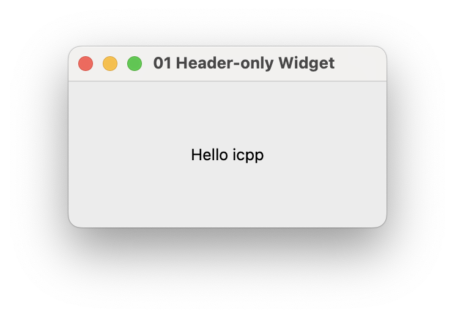

A common mistake is calling `go()` before `.gen`. If `go()` has not been evaluated yet, run `.gen` first, then `static auto w = go();`.

Another mistake is running only `go()->show();` without retaining the return value. The window appears, but calling `raise()` or `close()` on the same widget later becomes difficult. The lessons use `static auto w = go();` so you can inspect it later.

### 4.1.3 02-button-label

This lesson puts the class declaration in `widget.h` and the constructor implementation in `widget.cpp`. The GUI contains only a label and button, demonstrating the basic separation of header and implementation.

**Steps**

```text
icpp[qtcling]> .e widget.h
# Write the Widget class declaration and save
icpp[qtcling]> .e widget.cpp
# Write a constructor that creates the label and button, then save
icpp[qtcling]> .gen
icpp[qtcling]> static auto w = go();
icpp[qtcling]> w->show();
icpp[qtcling]> w->raise();
```

Button behavior is not yet the focus. Verify that `.gen` can evaluate the code together even when separated into `widget.h` and `widget.cpp`.

<div class="page-break"></div>

**Expected Result**

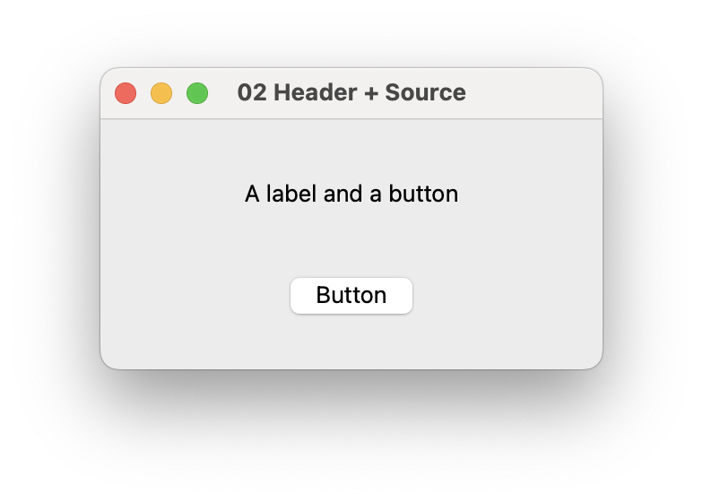

A small window containing a label and button appears. Keep click handling simple at this stage. First verify that icpp can evaluate the class declaration in `widget.h` and implementation in `widget.cpp` together.

### 4.1.4 03-button-counter

Handle button clicks with a lambda and increment `count` in the class. Keeping `QLabel *label` and `int count` as members provides practice managing UI components and state inside a class.

**Steps**

```text
icpp[qtcling]> .e widget.h
# Write a Widget class with label and count members, then save
icpp[qtcling]> .e widget.cpp
# Connect the button's clicked signal to a lambda, then save
icpp[qtcling]> .gen
icpp[qtcling]> static auto w = go();
icpp[qtcling]> w->show();
icpp[qtcling]> w->raise();
```

After displaying the window, verify that each click advances the label to `Count: 1`, `Count: 2`, and so on. This illustrates a case where a lambda connection is sufficient without `Q_OBJECT`.

<div class="page-break"></div>

**Expected Result**

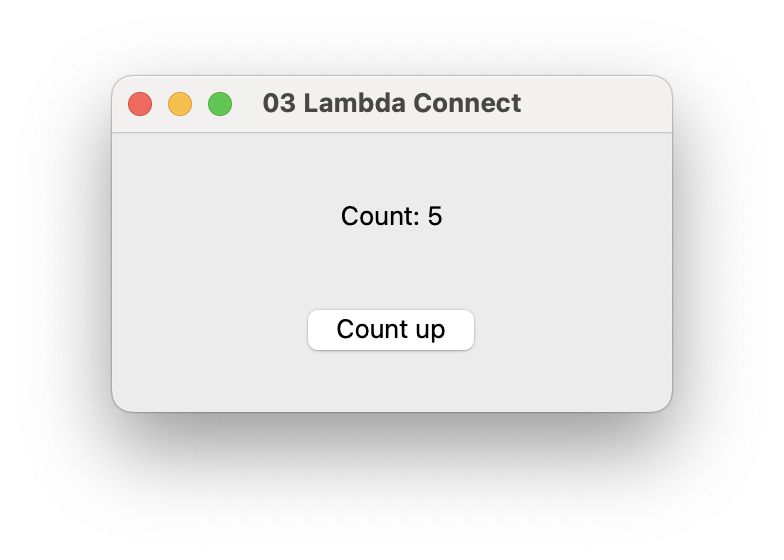

Each click increments the count and updates the label. Notice how the button signal, lambda, member variable, and label update are all organized within one `Widget` class.

### 4.1.5 04-slider-state

Reflect a slider value in a label. This introduces a UI with more continuous changes than a button and moves the value update into a private method.

**Steps**

```text
icpp[qtcling]> .e widget.h
# Write a Widget class with a label, slider, and update method, then save
icpp[qtcling]> .e widget.cpp
# Implement updating the label from the slider value, then save
icpp[qtcling]> .gen
icpp[qtcling]> static auto w = go();
icpp[qtcling]> w->show();
icpp[qtcling]> w->raise();
```

Move the slider left and right after displaying the window. If `Value: ...` changes with the slider, it works. Private methods organize the class internally; they are not intended to be called directly from the REPL.

<div class="page-break"></div>

**Expected Result**

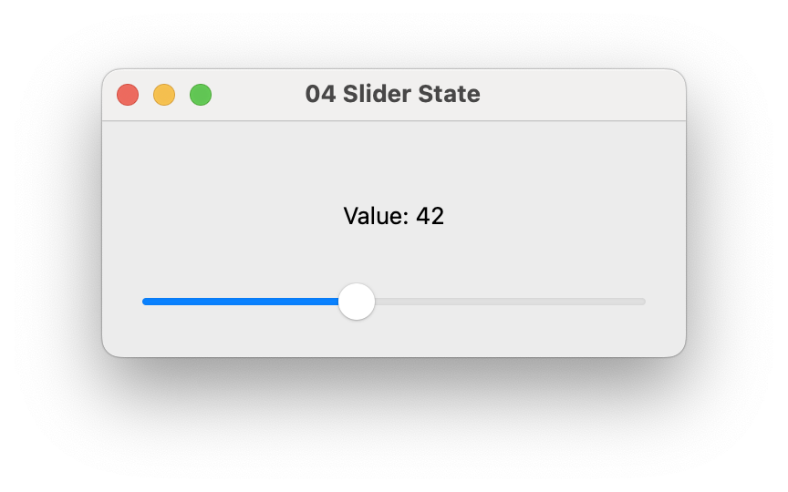

Moving the slider changes the number in the label. Since values change more frequently than with button clicks, placing display updates in a private method keeps the constructor readable.

### 4.1.6 05-qobject-slot

This lesson introduces `Q_OBJECT` and slots. Classes containing `Q_OBJECT` require `moc` output, so after editing, generate `moc_widget.cpp` with `.gen` before running.

**Steps**

```text
icpp[qtcling]> .e widget.h
# Write a Widget class with Q_OBJECT and slots, then save
icpp[qtcling]> .e widget.cpp
# Connect clicked to a slot, include moc_widget.cpp, and save
icpp[qtcling]> .generated
icpp[qtcling]> .! ls -l moc_widget.cpp
icpp[qtcling]> .! cat moc_widget.cpp
icpp[qtcling]> .gen
icpp[qtcling]> static auto w = go();
icpp[qtcling]> w->show();
icpp[qtcling]> w->raise();
icpp[qtcling]> .clean
icpp[qtcling]> .generated
```

Clicking the button calls the slot and increments the count. If `moc_widget.cpp` is missing, icpp may use an empty placeholder to avoid include errors. It is not real generated output, so always run `.gen`.

<div class="page-break"></div>

**Expected Result**

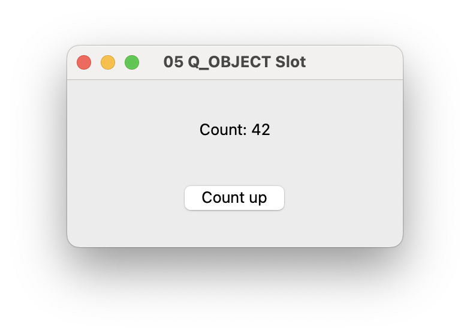

Each click calls the slot and increases the count in the label. Unlike a lambda connection, a slot is associated with the class's meta-object information. This lesson shows the relationship between `Q_OBJECT` and `moc` output.

### 4.1.7 06-designer-ui

In the `.designer` lesson, edit a `.ui` with Qt Designer, save it, then update `ui_*.h` with `.gen`.

**Steps**

```text
icpp[qtcling]> .designer form.ui
# Save form.ui in Qt Designer
icpp[qtcling]> .gen
icpp[qtcling]> .e widget.h
# Write a Widget class using ui_form.h and save
icpp[qtcling]> .e widget.cpp
# Use the components from form.ui through setupUi(this), then save
icpp[qtcling]> static auto w = go();
icpp[qtcling]> w->show();
icpp[qtcling]> w->raise();
icpp[qtcling]> .clean
icpp[qtcling]> .generated
```

After generation, use the `.ui` objectName values to manipulate widgets from C++.

<div class="page-break"></div>

**Expected Result**

| Editing in Designer | Result |
|---|---|
| 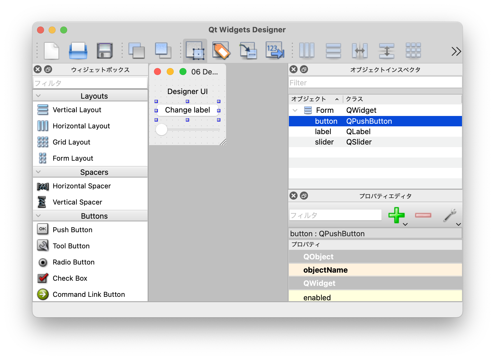 | 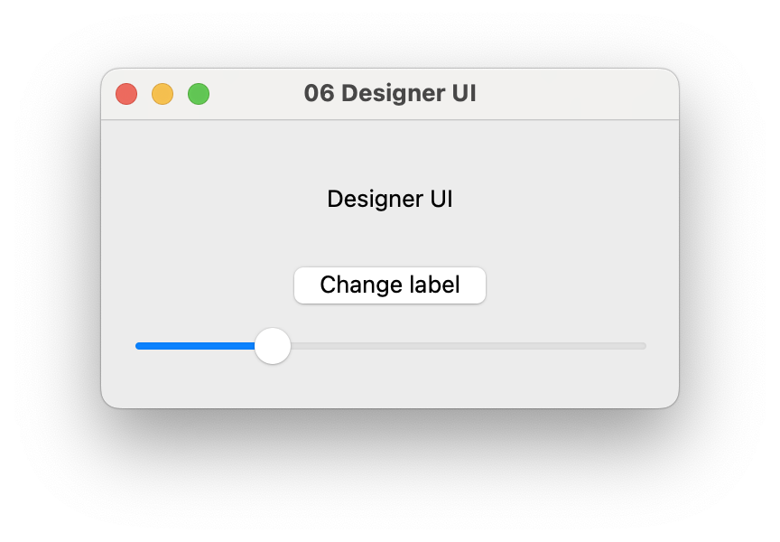 |

`form.ui` is input to `uic`. Do not edit the generated `ui_form.h` manually. Because `widget.cpp` includes it, run `.gen` before evaluating `widget.cpp`. Editing and evaluating `widget.cpp` before `ui_form.h` exists results in an include error.

`.designer` returns to icpp immediately after opening Qt Designer. Save UI changes in Qt Designer before running `.gen`.

The result displays the button and slider placed in Designer. Clicking the button changes the label; moving the slider changes the number. C++ accesses members corresponding to objectName values in `form.ui`.

### 4.1.8 07-resource-message

Load `message.txt`, registered in `.qrc`, as a resource and display it on screen.

**Steps**

```text
icpp[qtcling]> .qrc resources.qrc
# Check resources.qrc and save
icpp[qtcling]> .gen
icpp[qtcling]> .e widget.h
# Write a Widget class that reads resources, then save
icpp[qtcling]> .e widget.cpp
# Include qrc_resources.cpp and implement displaying message.txt, then save
icpp[qtcling]> static auto w = go();
icpp[qtcling]> w->show();
icpp[qtcling]> w->raise();
icpp[qtcling]> .clean
icpp[qtcling]> .generated
```

<div class="page-break"></div>

**Expected Result**

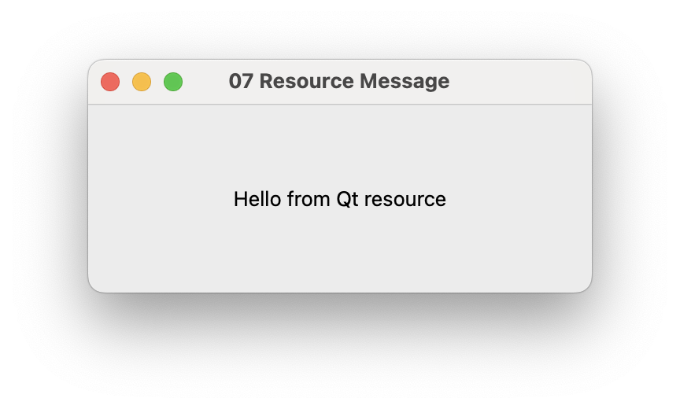

`resources.qrc` is input to `rcc`. Normally, do not register the generated `qrc_resources.cpp` directly with `.add`. Include it from `widget.cpp` and regenerate it with `.gen`.

`.qrc` opens an editor. Check the resource file, save and close it, then run `.gen` back in icpp.

The window displays `message.txt` loaded from the resource. The point is to read content embedded as a Qt resource rather than through an ordinary relative file path.

### 4.1.9 08-resource-update

The resource lesson displays `message.txt` registered in `.qrc`. After changing a resource, regenerate `qrc_*.cpp` with `.gen` before rerunning.

**Steps**

```text
icpp[qtcling]> .e widget.h
# Write a Widget class that reads resources, then save
icpp[qtcling]> .e widget.cpp
# Include qrc_resources.cpp and implement displaying message.txt, then save
icpp[qtcling]> static auto first = go();
icpp[qtcling]> first->show();
icpp[qtcling]> .e message.txt
# Change message.txt to Second message and save
icpp[qtcling]> .gen
icpp[qtcling]> static auto second = go();
icpp[qtcling]> second->show();
icpp[qtcling]> second->raise();
icpp[qtcling]> .clean
icpp[qtcling]> .generated
```

<div class="page-break"></div>

**Expected Result**

| Before Update | After Update |
|---|---|
| 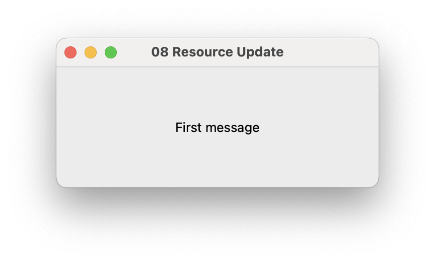 | 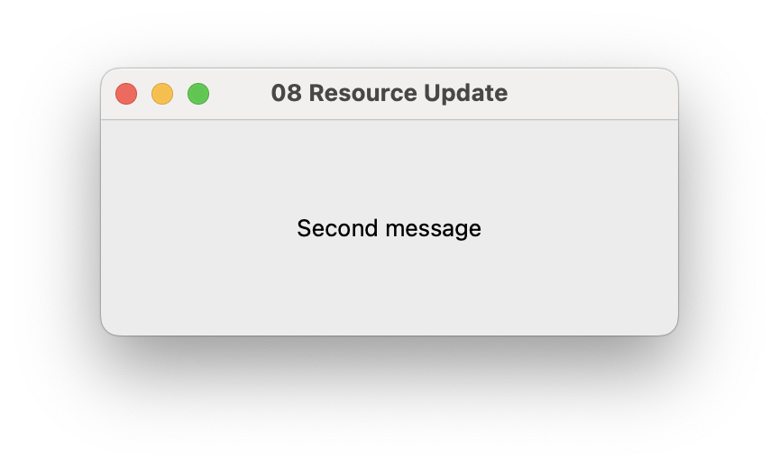 |

Changing `message.txt` alone does not change the previously generated `qrc_resources.cpp`. After editing a resource source file, run `rcc` through `.gen` to embed it in C++ again.

The first window displays `First message`; a window created after the change displays `Second message`. Existing windows do not update automatically. Regenerating resources and creating another widget makes the new resource available.

### 4.1.10 09-autogen

This lesson uses `.autogen on` to automate generated file updates after editing.

**Steps**

```text
icpp[qtcling]> .autogen
icpp[qtcling]> .autogen on
icpp[qtcling]> .status
icpp[qtcling]> .e widget.h
# Write a Widget class that reads resources, then save
icpp[qtcling]> .e widget.cpp
# Implement using qrc_resources.cpp produced by autogen, then save
icpp[qtcling]> static auto w = go();
icpp[qtcling]> w->show();
icpp[qtcling]> w->raise();
icpp[qtcling]> .clean
icpp[qtcling]> .generated
```

<div class="page-break"></div>

**Expected Result**

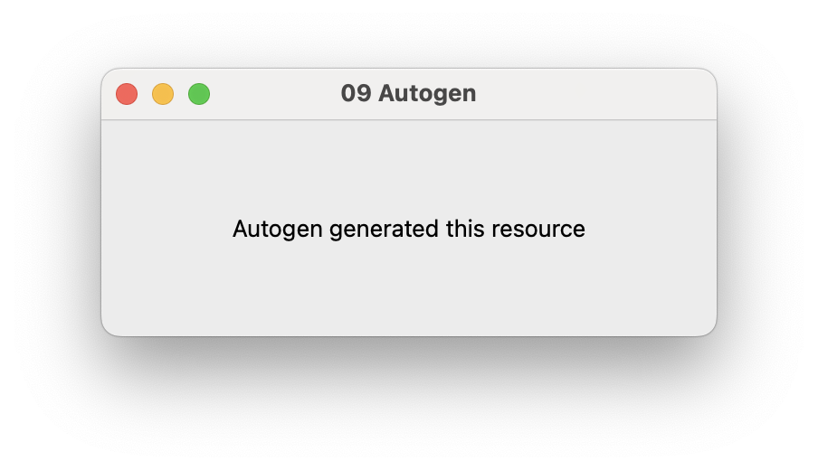

With `.autogen on`, `run_all` executes automatically as needed after editing with `.e`. This reduces repeated `.gen` commands, but explicit `.gen` use as in lessons 06–08 makes the workflow easier to follow until you understand what is generated.

A message such as `Autogen: run_all` after `.e widget.cpp` indicates that automatic generation ran. `.status` also shows whether autogen is enabled.

### 4.1.11 10-translation

The translation lesson updates `.ts`, `.qm`, and `.qrc` in the order `lupdate`, `.linguist`, `lrelease`, `.gen`, and verifies translated display strings.

`.linguist` returns to icpp immediately after opening Qt Linguist. Save translation edits in Qt Linguist, then run `.! lrelease app_ja.ts`.

**Steps**

```text
icpp[qtcling]> .e widget.h
# Write a Widget class with a label to translate, then save
icpp[qtcling]> .e widget.cpp
# Implement tr("Hello") and translation file loading, then save
icpp[qtcling]> .! lupdate widget.cpp -ts app_ja.ts
icpp[qtcling]> .linguist app_ja.ts
# Translate 'Hello' to the Japanese 'こんにちは' in Qt Linguist
# Save app_ja.ts in Qt Linguist
icpp[qtcling]> .! lrelease app_ja.ts
icpp[qtcling]> .qrc translations.qrc
# Check that the resource includes app_ja.qm, then close
icpp[qtcling]> .gen
icpp[qtcling]> .e widget.cpp
# Uncomment the include for qrc_translations.cpp
# Save and return to icpp
icpp[qtcling]> static auto w = go();
icpp[qtcling]> w->show();
icpp[qtcling]> w->raise();
icpp[qtcling]> .clean
```

Begin without an `app_ja.ts` file. Create it with `lupdate`, translate it in Linguist, then generate `app_ja.qm` with `lrelease`.

<div class="page-break"></div>

**Expected Result**

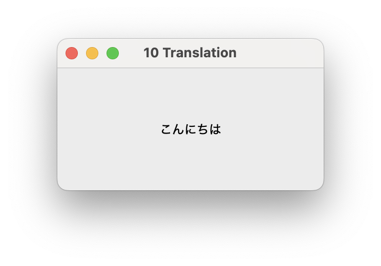

`.gen` does not run `lrelease`. For translations, update `.ts` with `lupdate`, edit translations in Linguist, generate `.qm` with `lrelease`, then proceed to `.qrc` and `.gen`. icpp has no short aliases for `lupdate` or `lrelease`; run the standard Qt commands explicitly through `.!`.

The window displays the translated text `こんにちは` (Japanese for "Hello"). `app_ja.ts` is the translation source data; `app_ja.qm` is the binary translation data loaded at runtime. If you forget to update `app_ja.qm`, editing `.ts` will not change the display.

### 4.1.12 11-fix-errors

This lesson practices reading failures before displaying a GUI. The objectName in the `.ui` differs from the name referenced in C++, so evaluating `widget.cpp` fails.

**Steps**

```text
icpp[qtcling]> .designer form.ui
# Check form.ui and save
icpp[qtcling]> .gen
icpp[qtcling]> .e widget.h
# Write a Widget class using private inheritance for the UI from ui_form.h, then save
icpp[qtcling]> .e widget.cpp
# Write code referencing the nonexistent messageLabel, save, and check the diagnostics
icpp[qtcling]> .uiinfo form.ui
icpp[qtcling]> .e widget.cpp
# Change messageLabel to titleLabel
# Save and return to icpp
icpp[qtcling]> .gen
icpp[qtcling]> static auto w = go();
icpp[qtcling]> w->show();
icpp[qtcling]> w->raise();
icpp[qtcling]> .clean
```

<div class="page-break"></div>

**Expected Result**

The expected diagnostic says that `messageLabel` does not exist in `Widget` or `Ui::Form`. Running `.uiinfo form.ui` then reveals that the label's actual objectName is `titleLabel`.

`widget.h` declares `Widget`, while `widget.cpp` contains `setupUi(this)` and references to components. Correct the C++ reference to match the name in the `.ui`.

```cpp
messageLabel->setText("Fixed");
```

Change the above to:

```cpp
titleLabel->setText("Fixed");
```

After fixing it, run `.gen` again. In this lesson, use the immediate icpp diagnostics and `.uiinfo`, rather than `.errors`. A reference to a nonexistent C++ member is reported as a C++ evaluation diagnostic.

### 4.1.13 12-inspect-widget

The `.inspect` lesson selects a displayed widget and uses properties, the object tree, and the picker to inspect its structure and state.

**Steps**

```text
icpp[qtcling]> .add widget.cpp
icpp[qtcling]> .gen
icpp[qtcling]> .r
icpp[qtcling]> static auto w = go();
icpp[qtcling]> w->show();
icpp[qtcling]> w->raise();
icpp[qtcling]> .inspect
```

<div class="page-break"></div>

**Expected Result**

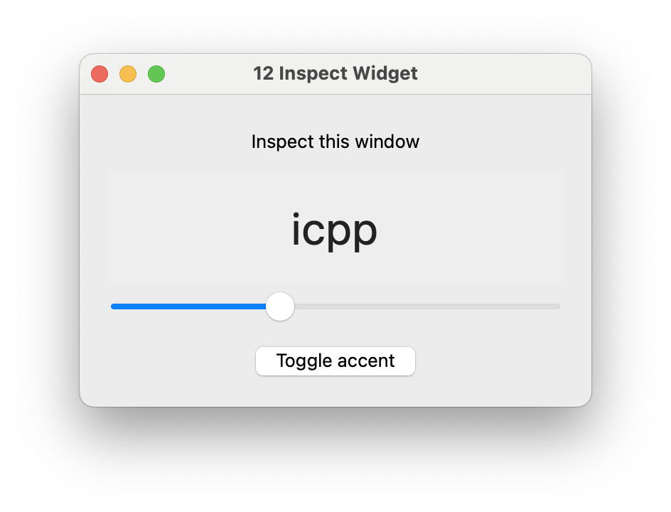

| property editor | object tree | picker |
|---|---|---|
| 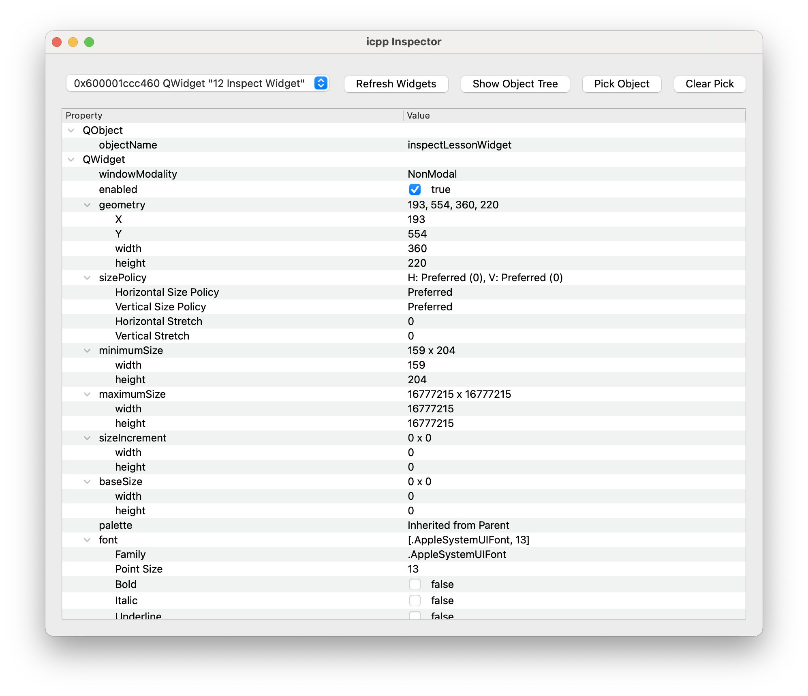 | 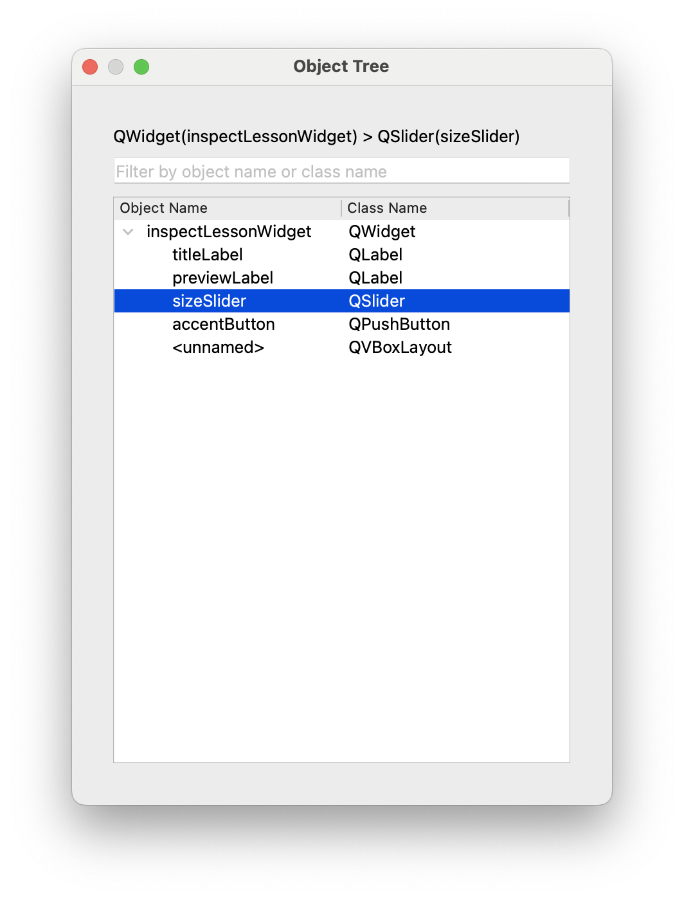 | 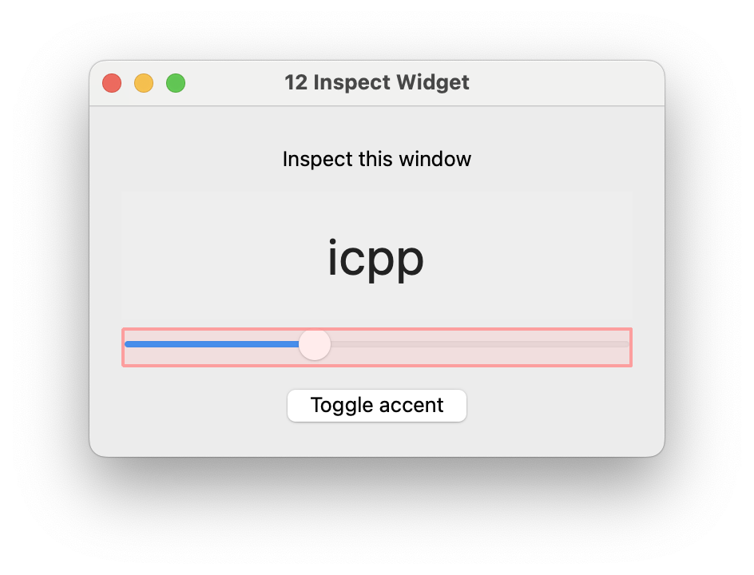 |

When the inspector opens, first select `12 Inspect Widget` in the top-level widget selector. Look for `objectName`, `windowTitle`, and `geometry` in PropertyEditor. Use `Show Object Tree` to examine components such as `titleLabel`, `previewLabel`, `sizeSlider`, and `accentButton`. Click `Pick Object` to select labels, sliders, or buttons directly on screen.

**Things to Try**

| Action | What to verify |
|---|---|
| Select `12 Inspect Widget` in the top-level widget selector | The inspected window changes |
| View `objectName`, `windowTitle`, and `geometry` in PropertyEditor | You can read properties of the running widget |
| Click `Show Object Tree` | `titleLabel`, `previewLabel`, `sizeSlider`, and `accentButton` appear |
| Click `Pick Object`, then click an on-screen component | The inspector reflects the selected component |
| Click `Clear Pick` | The picker highlight disappears |
| Operate a slider or button, then inspect PropertyEditor | You can observe state changes at runtime |

After trying the GUI, check for remaining windows and close them.

```text
icpp[qtcling]> .widgets
icpp[qtcling]> .closeall
icpp[qtcling]> .q
```

# 5. Relationship to cling / qtcling

`icpp` launches `cling` or `qtcling` as a child process.

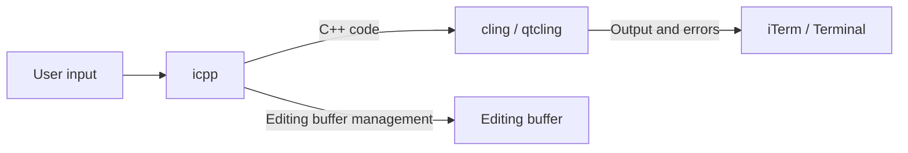

`icpp` handles input management, the editing buffer, dot commands, and file operations. `cling` / `qtcling` evaluates C++ and provides diagnostics.

| Engine | Purpose |
|---|---|
| `qtcling` | Use Qt types and libraries; the default |
| `cling` | Try C++ without Qt |

## 5.1 Relationship to cling Dot Commands

`cling` has metaprocessor commands such as `.L`, `.x`, `.I`, and `.printAST`. In ROOT environments, commands such as `.U`, `.undo`, and `.files` are also used.

In `icpp`, input beginning with `.` is first treated as an icpp command. Entering cling or ROOT dot commands directly therefore results in an unknown icpp command.

```text
icpp[qtcling]> .L sample.C
Unknown command: .L
```

This design keeps icpp's commands separate from cling/ROOT metaprocessor commands. Rather than manipulating cling's internal state in detail, icpp manages an editing buffer and registered files, recreating the interpreter and reevaluating them with `.r`.

The main equivalents are:

| Goal | cling / ROOT | icpp |
|---|---|---|
| Load a file | `.L file.C` | `.load file.cpp` |
| Load a file and run a function | `.x file.C` | Call the function after `.load`, or `.add` + `.r` |
| Add an include path | `.i path` | `.i path` |
| Load a library | `.L libsample.dylib` | `.loadlib libsample.dylib` |
| Remove a loaded file | `.U file.C` | `.drop file.cpp` + `.r` |
| Reevaluate multiple files | Run `.L` in sequence | `.add` / `.files` / `.r` |

Some `ROOT + cling` dot commands depend on the ROOT environment and may not be available in ordinary `qtcling`.

<div class="page-break"></div>

<!-- page -->
# 6. Starting icpp

## 6.1 Default Startup

Normally, launch it directly:

```text
$ icpp
icpp[qtcling]>
```

The default engine is `qtcling`.

After startup, check the engine with `.args`:

```text
icpp[qtcling]> .args
engine: qtcling
program: /usr/local/src/cling/bin/qtcling
arguments:
  --nologo
```

## 6.2 Using cling

Specify `cling` explicitly to try C++ without Qt.

```text
$ icpp --engine cling
icpp[cling]>
```

## 6.3 Specifying the qtcling Path

Specify a path if `qtcling` is not on PATH or you want a particular installation.

```text
$ icpp --engine qtcling --qtcling /usr/local/src/cling/bin/qtcling
```

No explicit path is needed if `type qtcling` finds the installation you want.

```text
$ icpp --engine qtcling
```

## 6.4 Checking the Engine After Startup

If Qt headers cannot be found, check `.args` first.

```text
icpp[qtcling]> .args
```

| Output | Meaning |
|---|---|
| `engine: qtcling` | Qt types are expected to be available |
| `engine: cling` | Qt types are not directly available |

# 7. Basic Usage

## 7.1 Evaluating a Single-Line Expression

Enter expressions directly:

```text
icpp[qtcling]> 1 + 2
(int) 3
```

End the input with `;` to treat it as a C++ statement.

```text
icpp[qtcling]> int x = 10;
icpp[qtcling]> x + 1
(int) 11
```

## 7.2 Executing C++ Statements

You can also use standard output:

```cpp
#include <iostream>
std::cout << "hello" << std::endl;
```

Output:

```text
hello
```

## 7.3 Using Qt Types

The default engine is `qtcling`, so Qt types are available.

```cpp
#include <QString>

QString name = "Qt";
```

Use `.p` to display values.

```text
icpp[qtcling]> .p name
Qt
```

## 7.4 Displaying Values

Entering a `QString` directly may show something close to its internal representation.

```text
icpp[qtcling]> QString s = "abc";
icpp[qtcling]> s
(QString &) { ... }
```

Use `.p` for readable output.

```text
icpp[qtcling]> .p s
abc
```

# 8. Editing Buffer

## 8.1 What Is the Editing Buffer?

`icpp` can accumulate entered C++ code in an editing buffer.

```text
icpp[qtcling]> int x = 10;
icpp[qtcling]> int y = 20;
icpp[qtcling]> .show
1  int x = 10;
2  int y = 20;
```

Inspection commands such as `.p` and `.args` are not added to the editing buffer.

## 8.2 Inspecting It with .show

Display the entire editing buffer:

```text
icpp[qtcling]> .show
```

You can also specify a range:

```text
icpp[qtcling]> .show 3
icpp[qtcling]> .show 3:8
```

## 8.3 Saving with .save

Save the editing buffer to a file:

```text
icpp[qtcling]> .save sample.cpp
Saved: sample.cpp
```

After saving once, you can omit the filename.

```text
icpp[qtcling]> .save
```

## 8.4 Clearing with .discard

Clear the editing buffer without resetting the interpreter session itself.

```text
icpp[qtcling]> .discard
Edit buffer cleared.
```

## 8.5 Normal Input Is Not Buffered by Default

Normal C++ input is sent to the interpreter but is not added to the editing buffer by default.

```text
icpp[qtcling]> auto h = go();
icpp[qtcling]> h->show();
icpp[qtcling]> .show
Edit buffer is empty.
```

Thus, after writing a class definition with `.e`, entering calls such as `auto h = go();` will not append execution code to the editor the next time you use `.e`.

To build up short code interactively, use `.b on` to add normal input to the editing buffer. The prompt displays `+b` in this mode.

Use `.x` or `.eval` for one-time execution. `.x` never adds code to the buffer, regardless of `.b on` / `.b off`. Conversely, use `.a` or `.append` to execute once and also retain the code in the buffer.

```text
icpp[qtcling]> .x static auto h = go();
icpp[qtcling]> .x h->show();
icpp[qtcling]> .a int saved_value = 42;
icpp[qtcling]> .show
1  int saved_value = 42;
```

## 8.6 Adding One Line with .append / .a

`.append` or `.a` executes C++ and adds the same code to the editing buffer. Use it to retain selected lines explicitly while keeping `.b off`.

```text
icpp[qtcling]> .a int x = 10;
icpp[qtcling]> .a int y = 20;
icpp[qtcling]> .show
1  int x = 10;
2  int y = 20;
```

The differences from `.x` are:

| Command | Evaluates | Adds to editing buffer | Main use |
|---|---|---|---|
| `.x <code>` | Yes | No | Display, calls, temporary variables |
| `.a <code>` | Yes | Yes | Definitions and initialization to retain |
| Normal input | Yes | Depends on `.b` | Quick input |

## 8.7 Toggling Normal Input Buffering with .buffer / .b

Use `.b on` or `.b` to retain normal input in the buffer. Each `.b` toggles whether normal input is added. The default is `off`.

```text
icpp[qtcling]> auto h = go();
icpp[qtcling]> h->show();
icpp[qtcling]> .show
Edit buffer is empty.
icpp[qtcling]> .b
Input buffer append: on
icpp[qtcling +b]> int z = 30;
icpp[qtcling +b]> .show
1  int z = 30;
```

The prompt shows `+b` when normal input is being buffered.

`.buffer` displays the current state.

```text
icpp[qtcling]> .buffer
Input buffer append: off
```

You can also set it explicitly:

```text
icpp[qtcling]> .b on
Input buffer append: on
icpp[qtcling +b]> .buffer off
Input buffer append: off
```

The default `.b off` is suited to developing functions and classes with `.e`. Enable `.b on` only when you want to accumulate short code through normal input.

## 8.8 Example: Separating Definitions and Execution

To keep class definitions clean, separate definition files from execution helpers.

`harness.cpp`:

```cpp
#include <QWidget>
#include <QPushButton>
#include <QVBoxLayout>
#include <QDebug>

class Harness : public QWidget {
    Q_OBJECT

public:
    Harness() {
        auto *button = new QPushButton("Click me", this);
        auto *layout = new QVBoxLayout(this);
        layout->addWidget(button, 0, Qt::AlignCenter);
        connect(button, &QPushButton::clicked, this, &Harness::onButtonClicked);
    }

public slots:
    void onButtonClicked() {
        qDebug() << "Button was clicked!";
    }
};

Harness *go() {
    auto *h = new Harness();
    h->show();
    return h;
}

#include "harness.moc"
```

`run_harness.cpp`:

```cpp
static Harness *harness = nullptr;

void showHarness() {
    if (harness) {
        harness->close();
    }
    harness = go();
}
```

In icpp, register both files, then use `.gen`.

```text
icpp[qtcling]> .add harness.cpp
icpp[qtcling]> .add run_harness.cpp
icpp[qtcling]> .gen
icpp[qtcling]> .x showHarness()
```

This separates `harness.cpp` as the class definition and `run_harness.cpp` as execution helper code. Use `.x showHarness()` to execute it without mixing call code into the editing buffer or definition file.

<div class="page-break"></div>

## 8.9 Operations That Request Confirmation or Issue Warnings

icpp requests confirmation or issues warnings in error-prone situations involving multiple files or unsaved buffers.

| Operation | Type | Condition |
|---|---|---|
| `.save` / `.s` without a filename | Confirmation | Saving to the remembered destination while working with multiple files |
| `.open <file>` | Confirmation | Replacing an unsaved editing buffer |
| `.discard` / `.d` | Confirmation | Clearing an unsaved editing buffer |
| `.reset` | Confirmation | Resetting the session with an unsaved editing buffer |
| `.clearfiles` | Confirmation | Removing multiple registered files at once |
| `.clean` | Confirmation | Deleting generated files in the current directory |
| `.gen` | Warning | Updating Qt generated files with an unsaved editing buffer |
| `.e` / `.r` with `.autogen on` | Confirmation or warning | An unsaved editing buffer exists before automatic generation |

An explicit destination such as `.save <file>` takes precedence. When working with multiple files, specify the destination or check the path in the confirmation message before entering `Y`.

`.gen` can run with an unsaved editing buffer. However, because `moc`, `uic`, and `rcc` depend on saved files, saving first with `.save <file>` is more reliable.

## 8.10 Checking State with .status

`.status` or `.st` displays an overview of the current working state.

```text
icpp[qtcling]> .status
engine: qtcling
help language: ja
input buffer append: off
autogen: off
quiet: off
new file name: lower
edit buffer: 42 lines, modified
save target: /path/to/harness.cpp
registered files: 2
qt generated files: needed
run_all: /usr/local/src/cling/bin/run_all
```

Use it when unsure about the `.s` destination, registered files evaluated by `.r`, or the states of `.b`, `.autogen`, `.quiet`, `.newname`, and `.lang`. In Japanese mode, `new file name` is displayed as `新規ファイル名`.

## 8.11 Automatically Updating Qt Generated Files with .autogen

With `.autogen on`, `run_all` executes before `.e` or `.r` reevaluation only when Qt generated files appear necessary. The default is `off`.

```text
icpp[qtcling]> .autogen on
Autogen: on
icpp[qtcling]> .e
Autogen: run_all
```

Detection checks `Q_OBJECT` and `.moc` includes in the buffer and registered files, and `.ui` / `.qrc` files among registered files or in the current directory. If an unsaved buffer has a known destination, icpp asks whether to save before autogen. If there is no destination, save first with `.save <file>`.

## 8.12 .doctor / .generated / .clean

As you work more with Qt generated files, use these status commands:

| Command | Purpose |
|---|---|
| `.doctor` | Check the current engine, Qt tools, and current directory state |
| `.generated` | List `moc_*.cpp`, `ui_*.h`, `qrc_*.cpp`, and `.qm` in the current directory |
| `.clean` | Delete only generated files, displaying the targets and requesting confirmation first |

`.clean` does not delete original `.h`, `.cpp`, `.ui`, `.qrc`, or `.ts` files. It targets only generated files in the current directory.

The following example shows Japanese UI output (generated files, up-to-date/stale status, and a deletion confirmation):

```text
icpp[qtcling]> .generated
生成物: /path/to/sample
  moc       moc_widget.cpp           <- widget.h  [最新]
  rcc       qrc_resources.cpp        <- resources.qrc  [古い可能性あり]
  uic       ui_form.h                <- form.ui  [最新]

icpp[qtcling]> .clean
削除する生成物:
  moc_widget.cpp
  qrc_resources.cpp
  ui_form.h
これらの生成物を削除しますか? [Y/N]
```

# 9. Editing in an Editor

## 9.1 .edit / .e

`.edit` or `.e` opens a real file or the editing buffer in an external editor.

Once familiar with the tool, the standard workflow is to specify a real working file.

```text
icpp[qtcling]> .e widget.cpp
```

`.e widget.cpp` automatically registers `widget.cpp` if it is not registered. If the file does not exist, icpp creates an empty file, registers it, and opens it in the external editor. Saving and closing reevaluates registered files and the editing buffer.

Registered files can also be opened by number.

```text
icpp[qtcling]> .files
1  /path/to/widget.cpp
icpp[qtcling]> .e 1
```

With no arguments, `.e` opens the editing buffer as a temporary file in the external editor. This is convenient for short experiments or getting started, but temporary filenames may remain in Qt Creator or VS Code history.

```text
icpp[qtcling]> .e
```

Closing the editor reruns code through the same flow as `.run`: registered files first, then the edited buffer.

If `Q_OBJECT`, `.moc` includes, `.ui`, or `.qrc` suggest that Qt generated files are needed after editing, icpp displays this warning (shown here in Japanese; it asks you to regenerate moc/uic/rcc and restart with `.gen`):

```text
警告: Qt 生成物が必要な可能性があります。.gen で moc/uic/rcc を再生成して再起動してください。
```

With `--help-language en` or `ICPP_HELP_LANGUAGE=en`, the message appears in English.

Use `.lang` to switch while running. The example below starts in Japanese mode, where the output means "help language: ja."

```text
icpp[qtcling]> .lang
ヘルプ言語: ja
icpp[qtcling]> .lang en
help language: en
```

`.lang ja` / `.lang en` is saved with `QSettings` and used on the next launch. Startup options `--help-language` and `ICPP_HELP_LANGUAGE` take precedence over the saved value.

This warning helps avoid apparently working with stale `moc` output after changing slots, signals, `Q_PROPERTY`, or `Q_INVOKABLE`. Run `.gen` as needed when it appears.

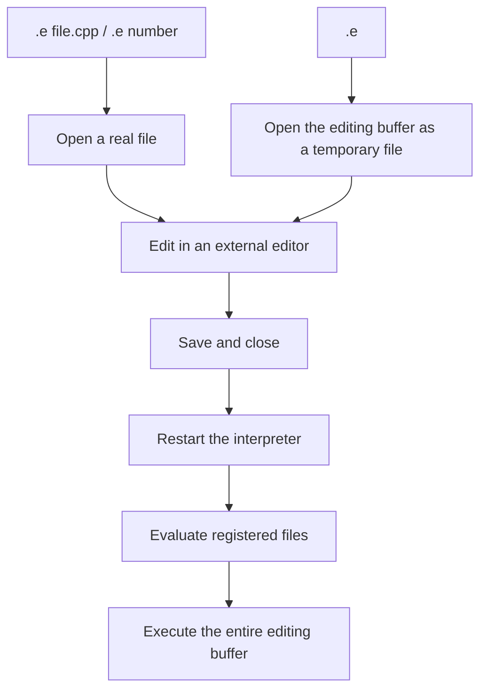

## 9.2 Selecting an Editor

The editor is selected in this order:

| Priority | Environment variable or default |
|---|---|
| 1 | `ICPP_EDITOR` |
| 2 | `VISUAL` |
| 3 | `EDITOR` |
| 4 | `vim` |

Example:

```text
$ ICPP_EDITOR=vim icpp
```

For terminal editing with `emacsclient`, specify:

```text
$ ICPP_EDITOR="emacsclient -nw" icpp
```

To open a GUI Emacs frame, specify:

```text
$ ICPP_EDITOR="emacsclient -c" icpp
```

`.e` waits for the editor to finish before rerunning. With `emacsclient`, save your edits and return to icpp with `C-x #` or `M-x server-edit`. Merely closing the buffer may leave icpp waiting.

For VS Code, add `--wait`.

```text
$ ICPP_EDITOR="code --wait" icpp
```

Save the real file opened with `.e <file>` or the temporary file opened with `.e`, then close its tab to return to icpp. Without `--wait`, VS Code may return immediately and trigger reevaluation before editing.

For Qt Creator, add `-block`. Also use `-client` to send the file to an already running Qt Creator instance.

```text
$ ICPP_EDITOR="qtcreator -client -block" icpp
```

On macOS, specify the executable directly if `qtcreator` is not on `PATH`.

```text
$ ICPP_EDITOR='"/Applications/Qt Creator.app/Contents/MacOS/Qt Creator" -client -block' icpp
```

In Qt Creator, saving and closing the opened file returns to icpp. Without `-block`, control returns to icpp immediately.

VS Code and Qt Creator may remember opened files in recent files, tabs, or session data. Because argument-free `.e` creates a new temporary file each time, names such as `icpp_XXXXXX.cpp` may remain in editor history.

Qt Creator's project and session management can make these temporary files particularly noticeable. To avoid clutter, choose a working `.cpp` file and manage it through `.e <file>` or `.add <file>`.

To move code tried in icpp into a Qt Creator project, add the real file through `Add Existing Files...`. If you worked in the argument-free `.e` buffer, save it with `.save` first.

```text
icpp[qtcling]> .save scratch/icpp_test.cpp
```

Then right-click the project in Qt Creator's Projects view and select `scratch/icpp_test.cpp` through `Add Existing Files...`. Depending on how it is added, a CMake project may include it in `CMakeLists.txt` and build it. Check the destination and CMake handling if experimental code should not be a build target.

## 9.3 Rerunning After Editing

After editing, `.e` reruns registered files and the entire buffer just like `.run`.

Thus, editing and saving a function makes its new definition available in the current session.

## 9.4 Avoiding C++ Redefinition Errors

Submitting the same function or class definition again in one C++ session may cause redefinition errors.

`.run` and `.edit` restart the interpreter before executing code, making them suitable for experimenting while changing functions or classes.

The icpp workflow recreates the session with `.run` and reloads the necessary code, rather than overwriting class definitions in the same session.

# 10. Working with Files

## 10.1 .open

`.open` replaces the editing buffer with a file's contents without executing them.

```text
icpp[qtcling]> .open sample.cpp
Opened: sample.cpp
```

## 10.2 .load

`.load` reads and executes a file in the current session and also appends it to the editing buffer.

```text
icpp[qtcling]> .load sample.cpp
Loaded: sample.cpp
```

## 10.3 Registering Multiple Files

`.add` registers files to evaluate with `.run` / `.r`. Registration itself does not execute them.

This is the standard workflow when using real files:

```text
icpp[qtcling]> .add widget.cpp
icpp[qtcling]> .r
icpp[qtcling]> .x static auto w = go();
icpp[qtcling]> .defs
icpp[qtcling]> .inspect
```

Register implementation files such as `.cpp` with `.add`. Do not register headers such as `widget.h` directly; include them from `widget.cpp` with `#include "widget.h"`. Evaluating headers directly makes duplicate class definitions more likely on reruns.

After editing `widget.cpp` externally, run `.r` in icpp. Use `.x` for execution calls so lines such as `static auto w = go();` do not remain in the buffer, regardless of `.b`.

```text
icpp[qtcling]> .add SimpleClass.cpp
Added: /path/to/SimpleClass.cpp
icpp[qtcling]> .add UseSimpleClass.cpp
Added: /path/to/UseSimpleClass.cpp
```

Check registered files with `.files`.

```text
icpp[qtcling]> .files
1  /path/to/SimpleClass.cpp
2  /path/to/UseSimpleClass.cpp
```

To edit a registered file, pass its number or path to `.e`.

```text
icpp[qtcling]> .e 1
```

`.e <file|number>` opens the actual file rather than a temporary file. Saving and closing restarts the interpreter and reevaluates registered files and the editing buffer, just like `.r`.

```text
icpp[qtcling]> .e UseSimpleClass.cpp
```

An unregistered `.cpp`, `.cc`, `.cxx`, `.c++`, or `.c` file is registered automatically. If missing, it is created as an empty file.

```text
icpp[qtcling]> .e NewClass.cpp
Created: /path/to/NewClass.cpp
Added: /path/to/NewClass.cpp
```

`.h`, `.hpp`, `.hh`, `.hxx`, `.ui`, and `.qrc` files can be edited but are not registered automatically, because headers and generation inputs are normally referenced by `.cpp` or generated `moc_*.cpp` / `qrc_*.cpp` files.

When editing files involving `Q_OBJECT`, `.moc` includes, `.ui`, or `.qrc`, enable `.autogen on` or run `.gen` after editing.

If a `.cpp` contains `#include "moc_*.cpp"` or `#include "*.moc"` and the generated file is missing, icpp creates an empty placeholder before evaluation. This avoids a fatal include error on an initial `.e widget.cpp` and lets you proceed to `.gen`.

The placeholder is not real moc output. Always generate real `moc_*.cpp` / `*.moc` with `.gen` to use `Q_OBJECT`, slots, signals, `Q_PROPERTY`, or `Q_INVOKABLE` correctly. `.gen` overwrites the placeholder with real output.

Only `moc_*.cpp` and `*.moc` receive empty placeholders. Empty `qrc_*.cpp`, `ui_*.h`, or `.qm` files would not be meaningful substitutes and would obscure the cause of failures. Generate these with `.gen`, or with `lrelease` for translations.

`.drop` removes a registration by number or file path.

```text
icpp[qtcling]> .drop 1
Dropped: /path/to/SimpleClass.cpp
```

Use `.clearfiles` to remove all registrations.

```text
icpp[qtcling]> .clearfiles
Registered files cleared.
```

## 10.4 .run

`.run` restarts the interpreter, executes registered files in order, then executes the entire editing buffer.

```text
icpp[qtcling]> .run
```

The processing order is:

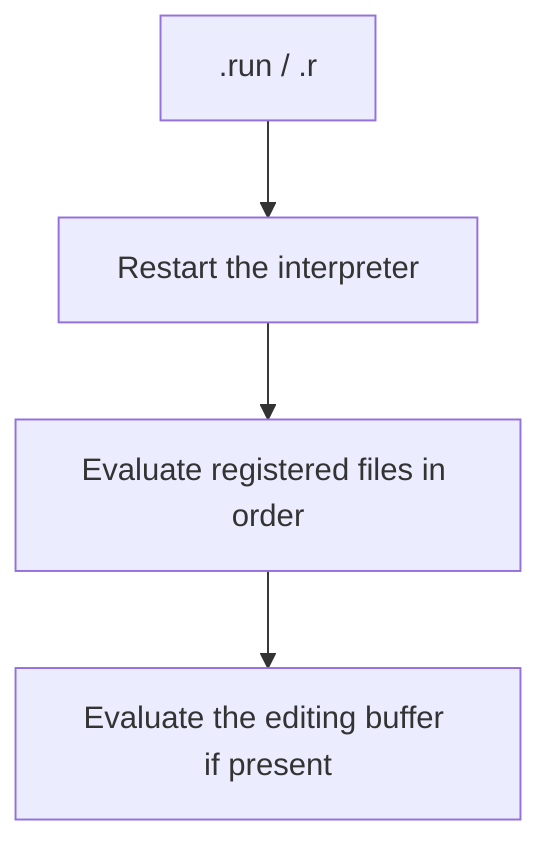

When splitting class definitions across files, register dependencies first with `.add`.

```text
icpp[qtcling]> .add SimpleClass.cpp
icpp[qtcling]> .add UseSimpleClass.cpp
icpp[qtcling]> .r
```

To change the order after registration, use `.r edit`. It opens the registered file list in an editor as a temporary file. Reorder its lines and save to run `.r` in that order.

```text
icpp[qtcling]> .r edit
# In the editor, place /path/to/SimpleClass.cpp before /path/to/UseSimpleClass.cpp
```

Blank lines and lines beginning with `#` are ignored. If the list contains unregistered files, duplicates, or missing entries, the order is not changed and code is not rerun.

This workflow lets you change class definitions and use `.r` alone to recreate the interpreter and reload everything.

## 10.5 .reset and .restart

| Command | Interpreter | Registered files | Editing buffer |
|---|---|---|---|
| `.restart` | Restart | Keep | Keep |
| `.run` / `.r` | Restart | Evaluate | Evaluate |
| `.reset` | Restart | Clear | Clear |

Use `.restart` to recreate only the interpreter state.

Use `.reset` to start the work over from scratch.

# 11. Clipboard Integration

## 11.1 .paste

`.paste` appends clipboard text to the editing buffer. It pastes without evaluating.

```text
icpp[qtcling]> .paste
Pasted 12 lines.
icpp[qtcling]> .show
```

Use `.run` to evaluate pasted code.

```text
icpp[qtcling]> .r
```

## 11.2 .copy

`.copy` copies the entire current editing buffer to the clipboard.

```text
icpp[qtcling]> .copy
Copied 12 lines.
```

## 11.3 External Commands Used

`icpp` does not use `QClipboard`. It remains a `QCoreApplication` and handles the clipboard through external commands.

| Operation | Commands searched |
|---|---|
| paste | `pbpaste`, `wl-paste`, `xclip`, `xsel` |
| copy | `pbcopy`, `wl-copy`, `xclip`, `xsel` |

Use environment variables to specify commands explicitly.

```text
$ ICPP_CLIPBOARD_PASTE=pbpaste ICPP_CLIPBOARD_COPY=pbcopy icpp
```

# 12. Display Commands

## 12.1 .print / .p

`.p` displays an expression without adding it to the editing buffer.

```text
icpp[qtcling]> QString s = "abc";
icpp[qtcling]> .p s
abc
```

`.print` is equivalent.

```text
icpp[qtcling]> .print s
abc
```

## 12.2 Displaying QString

`.p` is an easy way to display a `QString`.

```text
icpp[qtcling]> QString name = "Qt";
icpp[qtcling]> .p name
Qt
```

## 12.3 Displaying QVariant / QStringList

Use `.p` to inspect Qt types supported by `QDebug`.

```text
icpp[qtcling]> QVariant v = 123;
icpp[qtcling]> .p v
QVariant(int, 123)
```

```text
icpp[qtcling]> QStringList names{"a", "b"};
icpp[qtcling]> .p names
QList("a", "b")
```

## 12.4 Difference from qDebug()

With `qtcling`, `.p expr` internally sends display code like this:

```cpp
qDebug().noquote() << (expr);
```

It is a shortcut for inspecting values without writing `qDebug()` each time.

## 12.5 .ptype

`.ptype` checks an expression's C++/Qt type without adding it to the editing buffer.

```text
icpp[qtcling]> QString s = "abc";
icpp[qtcling]> .ptype s
QString
```

Use it to check types from template functions or values declared with `auto`.

```text
icpp[qtcling]> auto names = QStringList{"a", "b"};
icpp[qtcling]> .ptype names
QStringList
```

With `qtcling`, the C++ type name is the primary output. When the Qt meta-type name differs, it is also shown in parentheses as needed.

```text
icpp[qtcling]> using namespace Qt::Literals::StringLiterals;
icpp[qtcling]> QLatin1StringView key = "Content-Type"_L1;
icpp[qtcling]> .ptype key
QLatin1StringView (meta: QLatin1String)
```

For types whose public names are clearer than their internal Qt names, the public name is shown. For example, Qt may internally represent `QUtf8StringView` as `QBasicUtf8StringView<false>`, but `.ptype` displays it as follows:

```text
icpp[qtcling]> QUtf8StringView view = u8"example";
icpp[qtcling]> .ptype view
QUtf8StringView
```

`QStringView`, `QByteArrayView`, `QAnyStringView`, and `std::string_view` are also normally displayed under those type names.

## 12.6 .defs

`.defs` lists likely definitions found in registered files and the editing buffer. The example below uses Japanese UI labels for registered files, the editing buffer, and "no definitions."

```text
icpp[qtcling]> .defs
登録ファイル:
1  /path/to/widget.cpp
   1  class Widget
   8  public function Widget::Widget(QWidget *parent)
  15  private function void Widget::updatePreview()
  18  function Widget *go()
編集バッファ:
   (定義なし)
```

It detects `class`, `struct`, `enum`, and function definitions. Use it to see what is currently defined, rather than the history of calls such as `fibonacci(10)`.

If a registered file includes a class declaration through `#include "..."`, member functions are annotated with `public`, `protected`, or `private` where identifiable. Private and protected members cannot be called directly from the REPL; provide a `go()` entry point or public helper.

This is not a complete C++ parser. It may miss complex macros or unusual declarations, but is sufficient for checking small classes, functions, and separated headers commonly used in icpp.

## 12.7 .errors

`.errors` displays recent errors recorded by icpp's dot commands.

```text
icpp[qtcling]> .no_such_command
Unknown command: .no_such_command
icpp[qtcling]> .errors
Unknown command: .no_such_command
```

It covers errors in commands processed by icpp. C++ compilation errors and runtime diagnostics go directly from `cling` / `qtcling` to the terminal and are not stored in `.errors`.

# 13. Writing Qt Code

## 13.1 Using QString / QVariant

Write normal includes when using Qt types.

```cpp
#include <QString>
#include <QVariant>
#include <QDebug>
```

These headers are available when running with `qtcling`.

## 13.2 Variadic Function Example

This example converts any number of arguments to strings and concatenates them.

```cpp
// Accept any number of arguments of arbitrary types, convert each to a string,
// and return their concatenation as a QString.
// Example: auto s = concat(12, 34, "xyz");  // s is "1234xyz"

#include <QString>
#include <QVariant>
#include <utility>

inline QString concatToString(const char* value) {
    return QString::fromUtf8(value);
}

template <size_t N>
QString concatToString(const char (&value)[N]) {
    return QString::fromUtf8(value);
}

template <typename T>
QString concatToString(T&& value) {
    return QVariant::fromValue(std::forward<T>(value)).toString();
}

template <typename... Args>
QString concat(Args&&... args) {
    QString result;
    ((result += concatToString(std::forward<Args>(args))), ...);
    return result;
}
```

Usage:

```cpp
auto s = concat(12, 34, "xyz");
```

Check the result:

```text
icpp[qtcling]> .p s
1234xyz
```

## 13.3 Notes on String Literals

`"xyz"` is treated as a `const char[4]` array.

Consequently, the following simple approach may fail:

```cpp
QVariant::fromValue("xyz")
```

For functions handling string literals, explicitly converting `const char*` or `const char (&)[N]` to `QString` is safer.

<div class="page-break"></div>

## 13.4 Common Type Errors

The following function accepts only one argument:

```cpp
QString concat(const QVariantList& args)
```

Therefore, this is an error:

```cpp
concat(1, 2, 3)
```

Pass one `QVariantList` when calling it:

```cpp
concat(QVariantList{1, 2, 3})
```

To call it as `concat(1, 2, 3)`, define a variadic template.

# 14. Libraries and Pragmas

## 14.1 .include

`.include` sends an include directive.

```text
icpp[qtcling]> .include QString
```

Internally, it sends:

```cpp
#include <QString>
```

You can also specify `<...>` or `"..."` explicitly.

```text
icpp[qtcling]> .include <QVariant>
```

## 14.2 .i

`.i` displays, adds, and edits include paths. It is normally unnecessary if you change into the target directory before `.add widget.cpp`, as in the lessons. Use it to include headers or generated files from other directories.

`.i` alone shows registered include paths. The Japanese heading below means "Include paths."

```text
icpp[qtcling]> .i
インクルードパス:
1  .
```

Use `.i <path>` to add a path.

```text
icpp[qtcling]> .i .
```

Internally, it sends:

```cpp
#pragma cling add_include_path(".")
```

Use `.i edit` to review several paths together. Enter one path per line in the editor, then save and close to update icpp's list. Added paths are sent to the interpreter immediately. Removed paths take effect when `.r` next recreates the interpreter.

## 14.3 .pragma

`.pragma` sends `#pragma cling`.

```text
icpp[qtcling]> .pragma add_include_path("/path/to/include")
```

Internally, it sends:

```cpp
#pragma cling add_include_path("/path/to/include")
```

## 14.4 .loadlib

`.loadlib` is a shortcut for loading shared libraries.

```text
icpp[qtcling]> .loadlib /path/to/libsample.dylib
```

Internally, it sends:

```cpp
#pragma cling load("/path/to/libsample.dylib")
```

## 14.5 Entering #pragma cling load Directly

You can also enter `#pragma cling` directly.

```cpp
#pragma cling load("/path/to/libsample.dylib")
```

`.loadlib` abbreviates a commonly used pragma.

# 15. Command Reference

## 15.1 Sessions

| Command | Alias | Description |
|---|---|---|
| `.help` | `.h`, `.?` | Show help |
| `.args` |  | Show the current engine, program, and arguments |
| `.status` | `.st` | Show the current session state |
| `.errors` |  | Show recent icpp command-side errors |
| `.doctor` |  | Check the interpreter, Qt tools, and current directory |
| `.generated` |  | List generated files in the current directory |
| `.examples` |  | Show short usage examples |
| `.where` |  | Briefly show the current location and editing state |
| `.runorder` |  | Show the evaluation order of registered files |
| `.qt` |  | Briefly show Qt generated-file status |
| `.clean` |  | Confirm and delete generated files |
| `.buffer [on\|off]` | `.b` | Show or toggle buffering of normal input; default `off` |
| `.autogen [on\|off]` |  | Show or toggle automatic Qt generation |
| `.quit` | `.q` | Exit |

In an interactive terminal, `.help`, `.h`, and `.?` display help through a pager selected in the order `ICPP_PAGER`, `PAGER`, then `less -R`. Noninteractive runs, such as pipes and automated tests, continue to write to standard output.

`.?` provides a short overview of all commands. Use `.command -h` or `.command --help` for detailed individual help.

```text
icpp[qtcling]> .e -h
icpp[qtcling]> .r -h
icpp[qtcling]> .gen -h
icpp[qtcling]> .inspect -h
```

<div class="page-break"></div>

## 15.2 Execution and Reset

| Command | Alias | Description |
|---|---|---|
| `.run [edit]` | `.r` | Restart the interpreter and rerun registered files and the editing buffer; `edit` first opens the file order in an editor |
| `.gen` |  | Run `run_all`, then reevaluate as with `.run` |
| `.restart` |  | Restart the interpreter, keeping registered files and the editing buffer |
| `.reset` |  | Restart the interpreter and clear registered files and the editing buffer |

## 15.3 Editing Buffer

| Command | Alias | Description |
|---|---|---|
| `.edit [file\|number]` | `.e` | Open the editing buffer or a registered file in an external editor, then rerun after closing |
| `.show [range]` | `.sh` | Display the editing buffer with line numbers |
| `.save [file]` | `.s` | Save the editing buffer |
| `.discard` | `.d` | Clear the editing buffer |
| `.open <file>` | `.o` | Replace the editing buffer with file contents without executing |
| `.load <file>` | `.l` | Load and execute a file, also appending it to the editing buffer |
| `.paste` |  | Append clipboard text to the editing buffer |
| `.copy` |  | Copy the editing buffer to the clipboard |

## 15.4 Registered Files

| Command | Alias | Description |
|---|---|---|
| `.add <file>` |  | Register a file for `.run` |
| `.files` |  | List registered files |
| `.drop <file\|number>` |  | Remove a file registration |
| `.clearfiles` |  | Remove all file registrations |

## 15.5 Inspecting Values

| Command | Alias | Description |
|---|---|---|
| `.print <expr>` | `.p` | Display an expression without adding it to the editing buffer |
| `.ptype <expr>` |  | Display an expression's C++/Qt type |
| `.defs` |  | List definitions in registered files and the editing buffer |
| `.uiinfo <file.ui>` |  | Display widgets, layouts, and actions in a `.ui` |
| `.designer <form\|file.ui>` | `.de` | Create a `.ui` or edit it in Qt Designer |
| `.linguist <file.ts>` | `.li` | Edit a `.ts` in Qt Linguist |
| `.qrc [text\|creator] <file.qrc>` | `.qtc` | Edit a `.qrc` in a text editor or Qt Creator |
| `.template <kind> [base]` |  | Create starter files; see `.template -h` |
| `.new <kind> [base]` |  | Alias for `.template` |
| `.quiet [on\|off]` |  | Show or toggle quiet mode to reduce beginner hints |
| `.newname [lower\|asis]` |  | Show or toggle the case policy for new filenames |
| `.lang [ja\|en]` | `.language` | Show or change help language, saved in `QSettings` |
| `.preview <file.ui>` | `.pv` | Preview a `.ui` directly |
| `.inspect` |  | Inspect top-level QWidgets with PropertyEditor |
| `.eval <code>` | `.x` | Execute C++ without adding it to the editing buffer |
| `.append <code>` | `.a` | Execute C++ and also append it to the editing buffer |

`.x` is for execution tasks such as calling defined functions or creating temporary variables. Its code never appears in `.show` or the next `.e`, regardless of `.b on` / `.b off`.

`.a` is the counterpart to `.x`: use it when you also want the executed code retained in the editing buffer.

```text
icpp[qtcling]> .x static auto h = go();
icpp[qtcling]> .x h->show();
```

### 15.5.1 .template

`.template` creates starter files for experimenting in icpp. `.new` is a shorter alias. Use `.template -h` or `.new -h` for detailed help.

```text
icpp[qtcling]> .template -h
```

The basic syntax is:

```text
icpp[qtcling]> .template <kind> [base]
icpp[qtcling]> .new <kind> [base]
```

| kind | Creates |
|---|---|
| `widget` | A QWidget class with `Q_OBJECT` and a `moc_<base>.cpp` include |
| `ui` | Only a `.ui` file |
| `qrc` | Only a `.qrc` file |

Specify a class name for `widget`, a form name for `ui`, and a resource name for `qrc`. For example, `.template widget sample_widget` creates `sample_widget.h`, `sample_widget.cpp`, and class `SampleWidget`.

By default, filenames are normalized to lowercase, while widget class and form names use the entered capitalization. For example, `.new widget QuitButton` creates `quitbutton.h`, `quitbutton.cpp`, and class `QuitButton`.

Use `.newname` to change filename case handling. `lower` creates lowercase filenames; `asis` preserves the entered name. This setting is saved in `QSettings` and affects `.template`, `.new`, and new form creation with `.designer`. Opening an existing `.ui` with `.designer` uses that file unchanged regardless of the setting.

`.template ui QuitButtonForm` creates only `quitbuttonform.ui`. Its form class and top-level widget objectName are `QuitButtonForm`. After editing in Designer, include `ui_quitbuttonform.h` from an existing QWidget class.

`.template qrc resources` creates only `resources.qrc`. Add resource files through `.qrc` or `.qtc`, then include `qrc_resources.cpp` from the consuming `.cpp`.

If the name is omitted, an interactive terminal prompts for it. Empty input or noninteractive execution uses the default name for that kind.

Existing files are not overwritten. The proposed files are listed for confirmation before creation.

Once you no longer need post-creation guidance, use `.quiet on`. It is saved in `QSettings` and remains effective on future launches. `.quiet off` restores normal guidance. Confirmation prompts, errors, and created filenames remain visible even in quiet mode.

## 15.6 Interpreter Operations

| Command | Alias | Description |
|---|---|---|
| `.! <command>` |  | Run an external shell command |
| `.i [path\|edit]` |  | Display, add, or edit include paths |
| `.include <header>` |  | Send `#include` |
| `.pragma <text>` |  | Send `#pragma cling` |
| `.loadlib <path>` |  | Send `#pragma cling load(...)` |

`.!` is not added to the editing buffer. Use it to run arbitrary external commands without leaving icpp.

```text
icpp[qtcling]> .! pwd
```

The space immediately after `.!` is optional. These are equivalent:

```text
icpp[qtcling]> .!pwd
icpp[qtcling]> .!    pwd
```

For code involving `.ui`, `Q_OBJECT`, or `.qrc`, normally use `.gen`. It updates `moc`, `uic`, and `rcc` output through `run_all`, then reevaluates registered files and the buffer as with `.r`.

### 15.6.1 qtcling run_* Helpers

Ordinary Qt projects need files generated by `moc`, `uic`, and `rcc` in addition to source files. `qtcling` provides helper commands to generate them manually.

| Command | Main input | Output | Purpose |
|---|---|---|---|
| `run_moc` | `.h` / `.cpp` containing `Q_OBJECT` | `moc_<name>.cpp` or `<name>.moc` | Generate meta-object code |
| `run_uic` | `.ui` | `ui_<name>.h` | Generate Qt Designer UI headers |
| `run_rcc` | `.qrc` | `qrc_<name>.cpp` | Generate resource code |
| `run_all` | Current directory | All of the above | Run `run_moc`, `run_rcc`, and `run_uic` together |

With no arguments, each helper processes matching files in the current directory. Normally, start icpp in the target project's directory before running them.

```text
$ cd /path/to/qt/sample
$ icpp
icpp[qtcling]> .gen
```

To generate files individually, specify the target files.

```text
icpp[qtcling]> .! run_moc widget.h
icpp[qtcling]> .! run_uic mainwindow.ui
icpp[qtcling]> .! run_rcc resources.qrc
```

### 15.6.2 Using Generated Files

`run_*` only generates files. To use the output as C++, include it from the original `.cpp` / `.h` or set an include path in icpp as needed.

| Generated file | Usage in icpp |
|---|---|
| `ui_<name>.h` | Use `#include "ui_<name>.h"` |
| `moc_<name>.cpp` | Include at the end of the original `.cpp` with `#include "moc_<name>.cpp"` |
| `<name>.moc` | Include at the end of the original `.cpp` with `#include "<name>.moc"` |
| `qrc_<name>.cpp` | Prefer `#include "qrc_<name>.cpp"` from the consuming `.cpp` |

For example, to try `widget.h`, `widget.cpp`, `widget.ui`, and `resources.qrc`, use this structure:

```text
icpp[qtcling]> .add widget.cpp
icpp[qtcling]> .gen
```

`ui_widget.h` is normally included from `widget.cpp` or `widget.h` using `#include "ui_widget.h"`. It does not need its own `.add` registration; ensure that its include path is available.

Similarly, including `qrc_resources.cpp` from the consuming `.cpp` is more reliable. Normal include relationships make regeneration and reevaluation easier to understand than registering generated files directly with `.add`.

<div class="page-break"></div>

### 15.6.3 Workflow After Changes

After changing a `.ui`, a header containing `Q_OBJECT`, or a `.qrc`, update in this order:

```text
icpp[qtcling]> .gen
```

`.gen` restarts the interpreter and reevaluates registered files from the beginning only if `run_all` succeeds. Because cling/qtcling restrict class redefinition, recreating the session with `.gen` after regenerating files is more reliable.

If additional generated files are needed, register them once with `.add`.

```text
icpp[qtcling]> .add moc_newwidget.cpp
icpp[qtcling]> .add qrc_icons.cpp
icpp[qtcling]> .gen
```

Remove generated files no longer needed with `.drop`.

```text
icpp[qtcling]> .files
icpp[qtcling]> .drop moc_oldwidget.cpp
icpp[qtcling]> .r
```

## 15.7 Qt widget

| Command | Alias | Description |
|---|---|---|
| `.uiinfo <file.ui>` |  | Display widgets, layouts, and actions in a `.ui` |
| `.designer <form\|file.ui>` | `.de` | Create a `.ui` or edit it in Qt Designer |
| `.linguist <file.ts>` | `.li` | Edit a `.ts` in Qt Linguist |
| `.qrc [text\|creator] <file.qrc>` | `.qtc` | Edit a `.qrc` in a text editor or Qt Creator |
| `.preview <file.ui>` | `.pv` | Preview a `.ui` directly |
| `.inspect` |  | Inspect top-level QWidgets with PropertyEditor |
| `.widgets [all]` |  | List top-level QWidgets |
| `.closeall` |  | Close top-level QWidgets together |

# 16. Inspecting Qt Widgets

`.uiinfo` parses a `.ui` as XML and lists its widgets, layouts, and actions. It does not generate files or run `.gen` / `run_all`.

`.designer` opens a `.ui` in Qt Designer. A name without an extension is treated as a form name, and a `.ui` is created according to `.newname` before Designer opens. A missing `.ui` also results in a minimal QWidget form. New creation shows the filename and form class for confirmation. After saving in Designer, update `ui_*.h` with `.gen`.

`.linguist` opens a `.ts` in Qt Linguist. After saving, update `.qm` with `lrelease`.

`.qrc` edits a resource file in a text editor by default, or in Qt Creator's Resource Editor when `creator` is specified.

`.preview` loads and displays a `.ui` directly through `QUiLoader`. It also generates no files and does not run `.gen` / `run_all`.

`.inspect` selects a displayed top-level widget and combines `PropertyEditor`, `ObjectTreeDialog`, and `ObjectPicker` to inspect and edit properties.

`.preview`, `.inspect`, `.widgets`, and `.closeall` are helpers for `qtcling`. They are unavailable with `--engine cling`.

## 16.1 .uiinfo

Use `.uiinfo` to check objectName values before writing `widget.cpp`. In the output below, `(なし)` means "none."

```text
icpp[qtcling]> .uiinfo form.ui
class: Form
base: QWidget

widgets:
  QWidget      Form
  QLabel       titleLabel
  QLineEdit    nameEdit
  QPushButton  okButton

layouts:
  QVBoxLayout  verticalLayout

actions:
  (なし)
spacers:
  (なし)
```

Use this output to identify members such as `ui->okButton` and `ui->nameEdit` for `widget.cpp`. Since `.uiinfo` does not display actual widgets, it can check the structure independently of whether custom widgets or resources load successfully.

## 16.2 .designer / .de

`.designer` creates or edits a `.ui` in Qt Designer. A name without an extension is treated as a form name, and a `.ui` is created according to `.newname` before Designer opens. If the specified `.ui` does not exist, a minimal QWidget form is created. Creation displays the filename and form class for confirmation.

The new form class and top-level widget objectName are derived from the form name. For example, `.designer QuitButtonForm` creates `quitbuttonform.ui` with form class `QuitButtonForm`. The Japanese output below confirms creation, opening in Designer, and the need to run `.gen` after saving.

```text
icpp[qtcling]> .designer QuitButtonForm
作成する .ui ファイル: quitbuttonform.ui
form class: QuitButtonForm
続けますか? [Y/N] Y
.ui ファイルを作成しました: quitbuttonform.ui
Designer で開きました: quitbuttonform.ui
Designer で保存した後、.gen で生成物を更新してください。

icpp[qtcling]> .designer form.ui
Designer で開きました: form.ui
Designer で保存した後、.gen で生成物を更新してください。
```

`.de` is also available as an alias.

```text
icpp[qtcling]> .de form.ui
```

Designer is located in this order: `ICPP_DESIGNER`, Qt's `bin/Designer.app` on macOS, Qt's `bin/designer`, then `designer` on PATH. Qt Designer may open files in an existing instance and cannot wait until a file closes like Qt Creator with `-client -block`. Therefore `.designer` launches asynchronously and returns immediately. After saving in Designer, manually run `.gen` to regenerate `ui_*.h`, even with `.autogen on`.

On Linux, use Qt's `bin/designer` or `designer` on PATH. Set `ICPP_DESIGNER` explicitly if needed.

## 16.3 .linguist / .li

`.linguist` edits `.ts` files in Qt Linguist. The Japanese output below confirms opening and asks you to update `.qm` with `.! lrelease app_ja.ts` after saving.

```text
icpp[qtcling]> .linguist app_ja.ts
Linguist で開きました: app_ja.ts
Linguist で保存した後、.! lrelease app_ja.ts で .qm を更新してください。
```

`.li` is also available as an alias.

```text
icpp[qtcling]> .li app_ja.ts
```

Linguist is located in this order: `ICPP_LINGUIST`, Qt's `bin/Linguist.app` on macOS, Qt's `bin/linguist`, then `linguist` on PATH. It may also use an existing instance, so `.linguist` launches asynchronously and returns immediately. `.gen` / `run_all` do not currently run `lrelease`; after saving, regenerate `.qm` with `.! lrelease app_ja.ts`.

On Linux, use Qt's `bin/linguist` or `linguist` on PATH. Set `ICPP_LINGUIST` explicitly if needed.

There are no icpp-specific shortcuts for `lupdate` or `lrelease`. These standard Qt commands directly modify `.ts` / `.qm` files, so execute them explicitly as `.! lupdate ...` and `.! lrelease ...` without hiding their options.

## 16.4 .qrc / .qtc

`.qrc` edits resource files using the text editor selected by `ICPP_EDITOR` / `VISUAL` / `EDITOR` by default. The Japanese message below confirms editing and asks you to run `.gen` after changing the `.qrc`.

```text
icpp[qtcling]> .qrc resources.qrc
テキストエディタで編集しました: resources.qrc
.qrc を変更した場合は .gen で生成物を更新してください。
```

Specify `creator` to open Qt Creator's Resource Editor. Its output likewise confirms editing and requests `.gen` after changes.

```text
icpp[qtcling]> .qrc creator resources.qrc
Qt Creator で編集しました: resources.qrc
.qrc を変更した場合は .gen で生成物を更新してください。
```

`.qtc` is also available as an alias.

```text
icpp[qtcling]> .qtc resources.qrc
```

Qt Creator is located in this order: `ICPP_QTCREATOR`, `Qt Creator.app` in the Qt installation tree on macOS, `/Applications/Qt Creator.app` on macOS, then `qtcreator` on PATH. By default, it launches with `-client -block` and icpp waits until the file is closed. With `.autogen on`, editing is followed by `run_all` and reevaluation.

On Linux, use `qtcreator` on PATH. Set `ICPP_QTCREATOR` explicitly if needed.

## 16.5 .preview / .pv

`.preview` checks the appearance of a `.ui` immediately after saving. The output below says the UI preview was opened.

```text
icpp[qtcling]> .preview form.ui
.ui プレビューを開きました: /path/to/form.ui
```

`.pv` is also available as an alias.

```text
icpp[qtcling]> .pv form.ui
```

`.preview` does not generate `ui_*.h` or change registered files or the editing buffer. After checking the appearance, list remaining windows with `.widgets` and close them with `.closeall`.

A `.ui` using custom or promoted widgets, resources, or translations may need additional include paths, libraries, or resource loading. In that case, inspect its structure with `.uiinfo`, then check it through the implementation using the usual `.gen` / `.r` flow.

## 16.6 .inspect

`.inspect` examines a currently displayed top-level widget using `PropertyEditor`. It can target a `.ui` displayed with `.preview` or a widget created with `go()`. The example output below says the inspector was opened.

```text
icpp[qtcling]> .preview form.ui
icpp[qtcling]> .inspect
inspector を開きました。
```

The inspector window contains a top-level widget selector, `Refresh Widgets`, `Show Object Tree`, `Pick Object`, `Clear Pick`, and `PropertyEditor`.

- Switch the target window with the top-level widget selector.
- Open the target's object tree with `Show Object Tree`.
- Use `Pick Object` to select a widget by clicking it in the target window.
- Use `Clear Pick` to clear only the picker highlight.
- Objects selected in the tree or picker are reflected in `PropertyEditor`.

`.inspect` loads the PropertyEditor shared library and the include paths for its ObjectPicker/ObjectTree headers at runtime. It first searches relative to the icpp executable. If not found, specify these environment variables:

```text
icpp/bin/icpp
icpp/lib/property_editor.dylib       # macOS
icpp/lib/property_editor.so          # Linux
icpp/include/...
icpp/include/propertyeditor/...
```

```text
ICPP_PROPERTY_EDITOR_LIB=/path/to/property_editor.dylib   # macOS
ICPP_PROPERTY_EDITOR_LIB=/path/to/property_editor.so      # Linux
ICPP_PROPERTY_EDITOR_INCLUDE=/path/to/include
```

## 16.7 .widgets

`.widgets` lists currently displayed top-level `QWidget` instances.

```text
icpp[qtcling]> auto b = go();
icpp[qtcling]> .widgets
0x600001234000 QPushButton "Hello World" visible=true
```

Use it to see which widgets remain on screen while trying GUI examples. It omits icpp's internal inspector and hidden helper windows.

Specify `all` to include hidden top-level widgets. Each row includes `visible=true` or `visible=false` to distinguish their visibility.

```text
icpp[qtcling]> .widgets all
0x600001234000 QWidget "Hidden Window" visible=false
0x600001235000 QWidget "Preview Window" visible=true
```

## 16.8 .closeall

`.closeall` closes top-level `QWidget` instances together.

```text
icpp[qtcling]> .closeall
Closed 1 widget.
```

Use it to clean up windows after trying several widgets in the REPL. Like `.widgets` without arguments, it excludes icpp internal windows and hidden helper windows.

## 16.9 Usage Example

Open and run `examples/08_push_button.cpp`.

```text
icpp[qtcling]> .open examples/08_push_button.cpp
Opened: 08_push_button.cpp
icpp[qtcling]> .r
icpp[qtcling]> auto b = go();
icpp[qtcling]> .widgets
icpp[qtcling]> .closeall
```

# 17. Dependencies

`icpp` itself does not interpret C++. It starts `cling` or `qtcling` as an external interpreter and adds REPL features such as editing, rerunning, multiple-file management, and display helpers.

Dependencies shown by `otool -L icpp` or `ldd icpp` are icpp's own link dependencies. Libraries loaded into qtcling at command runtime, such as PropertyEditor for `.inspect`, do not appear as dependencies of the icpp executable.

| Category | Dependency | Usage |
|---|---|---|
| icpp itself | `QtCore`, `libedit`, etc. | REPL, command processing, and external interpreter startup |
| Interpreter | `cling` or `qtcling` | Launched through `QProcess`; interprets C++ and performs JIT evaluation |
| With `qtcling` | Qt GUI libraries | Widget code and helpers such as `.widgets` / `.closeall` |
| `.preview` | `QtUiTools` | Loaded at runtime to display `.ui` directly with `QUiLoader` |
| `.inspect` | PropertyEditor shared library and ObjectPicker/ObjectTree headers | Loaded at runtime by sending `#pragma cling load` and `#pragma cling add_include_path` to qtcling |

Input editing and history use GNU Readline or libedit. On Ubuntu 24.04, install `libedit-dev` before configuring/building with CMake to enable them. If neither is found, icpp falls back to standard input without arrow-key editing or history.

The PropertyEditor library and include path required by `.inspect` are first searched relative to the icpp executable. If not found, set `ICPP_PROPERTY_EDITOR_LIB` and `ICPP_PROPERTY_EDITOR_INCLUDE`. On Linux, specify the actual `.so` path, such as `property_editor.so`, in `ICPP_PROPERTY_EDITOR_LIB`.

## 17.1 Windows WSL2 / Ubuntu 24.04

icpp also works on Ubuntu 24.04 under Windows WSL2, treated as Linux. For Japanese messages or `.ts` files, ensure Qt recognizes a UTF-8 locale.

```text
locale
locale -a | grep -E 'ja_JP|C.UTF-8'
```

For a Japanese environment, use settings such as:

```text
LANG=ja_JP.UTF-8
```

If Qt warns `Detected locale "C" ...`, check that `ja_JP.UTF-8` has been generated and that `LC_ALL` / `LC_CTYPE` do not specify `C`.

Install `libedit-dev` for input editing and history.

```text
sudo apt update
sudo apt install libedit-dev
```

Then reconfigure CMake and build. If the existing build cache is stale, remove `build` and configure again. Always reconfigure after installing or updating `libedit-dev`: a stale cache retaining GNU Readline include paths can cause a build failure even when libedit is installed.

```text
rm -rf build
cmake -S . -B build
cmake --build build
```

To install under `/usr/local`, run the following after building. The executable is placed at `/usr/local/bin/icpp`. MCP Server functionality is built into icpp, so no QtMcpServer shared library needs to be deployed.

```text
sudo cmake --install build --prefix /usr/local
```

For `.inspect`, place the PropertyEditor shared library and headers relative to the icpp executable. The following layout has been verified on WSL2/Linux:

```text
bin/icpp
lib/property_editor.so
include/objectpicker.h
include/objecttreedialog.h
include/objecttreewidget.h
include/propertyeditor.h
```

Alternatively, if the executable is in `bin/`, it can detect `../lib/property_editor.so` and `../include/*.h` relative to itself.

## 17.2 Matching Qt Versions

`icpp` requires Qt 6. When using Qt through `qtcling`, it is recommended to use the same Qt 6.x.y version for:

| Component | Reason to match versions |
|---|---|
| Qt used to build icpp | `.qt`, `.doctor`, `.preview`, etc. consult Qt information and library paths |
| Qt used by qtcling | Actually evaluates C++/Qt code |
| `run_all` / `moc` / `uic` / `rcc` | Produce outputs for `Q_OBJECT`, `.ui`, and `.qrc` |
| `QtUiTools` | Loaded into qtcling by `.preview` |
| `PropertyEditor` | Directly handles `QObject` / `QWidget` for `.inspect` |

Even within Qt 6, mixing libraries or generated files from different minor versions in one qtcling process can be unstable. As with keeping separate Squish builds for each Qt version, building and using icpp separately for each Qt version is safer.

Example:

```sh
cmake -S . -B build-qt6.11 \
  -DCMAKE_PREFIX_PATH=/path/to/Qt/6.11.0/macos
cmake --build build-qt6.11
```

When switching Qt versions, use `.doctor` or `.qt` to check that qtcling, Qt tools, and icpp refer to the same Qt. `.doctor` displays `icpp Qt` separately from `active Qt tools`.

# 18. Startup Options

| Option | Description |
|---|---|
| `--engine qtcling` | Use `qtcling`; the default |
| `--engine cling` | Use `cling` |
| `--qtcling <path>` | Specify the qtcling path |
| `--cling <path>` | Specify the cling path |
| `--interpreter-arg <arg>` | Pass an extra argument to the selected interpreter |
| `--qtcling-arg <arg>` | Pass an extra argument only when qtcling is selected |
| `--cling-arg <arg>` | Pass an extra argument only when cling is selected |
| `--help-language ja` | Show `.help` / `.?`, confirmations, and icpp messages in Japanese; the default |
| `--help-language en` | Show `.help` / `.?`, confirmations, and icpp messages in English |
| `--help` | Show help |
| `--version` | Show the version |

You can also switch after startup with `.lang ja` / `.lang en`. Changes are saved in `QSettings`, but startup `--help-language` and `ICPP_HELP_LANGUAGE` take precedence.

# 19. Environment Variables

| Variable | Description |
|---|---|
| `ICPP_QTCLING` | Path to qtcling |
| `ICPP_CLING` | Path to cling |
| `ICPP_EDITOR` | Editor for `.edit` |
| `ICPP_DESIGNER` | Qt Designer command for `.designer` |
| `ICPP_LINGUIST` | Qt Linguist command for `.linguist` |
| `ICPP_QTCREATOR` | Qt Creator command for `.qrc creator` / `.qtc` |
| `ICPP_CLIPBOARD_PASTE` | External command for `.paste` |
| `ICPP_CLIPBOARD_COPY` | External command for `.copy` |
| `ICPP_HELP_LANGUAGE` | Language for `.help` / `.?`, confirmations, and icpp messages: `ja` or `en` |
| `ICPP_PAGER` | Pager for `.help` / `.h` / `.?`; falls back to `PAGER`, then `less -R` |
| `ICPP_PROPERTY_EDITOR_LIB` | Path to the property_editor library for `.inspect` |
| `ICPP_PROPERTY_EDITOR_INCLUDE` | Include path for PropertyEditor/ObjectPicker/ObjectTree headers used by `.inspect` |
| `VISUAL` | Editor when `ICPP_EDITOR` is unset |
| `EDITOR` | Editor when `VISUAL` is unset |

The interpreter path is selected in this order:

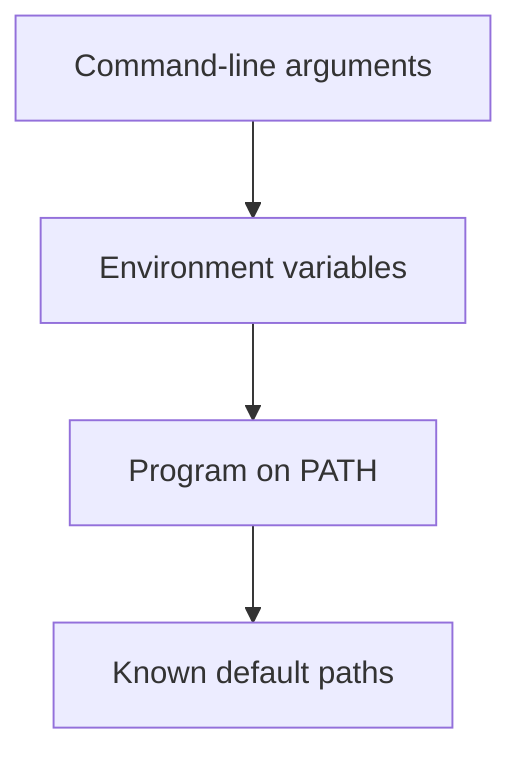

# 20. Common Errors

## 20.1 QDebug file not found

Example:

```text
fatal error: 'QDebug' file not found
```

You may be running with `cling`.

Check with `.args`.

```text
icpp[qtcling]> .args
```

If it shows `engine: cling`, start with `qtcling`.

```text
$ icpp --engine qtcling
```

## 20.2 QString Reported as an Unknown Type Name

Example:

```text
error: unknown type name 'QString'
```

The usual cause is one of the following:

| Cause | Fix |
|---|---|
| Missing `#include <QString>` | Add the include |
| Running with `cling` | Start with `qtcling` |

## 20.3 Cannot Call concat(1, 2, 3)

If the function accepts only one `QVariantList`, the following is an error:

```cpp
concat(1, 2, 3)
```

Call it like this instead:

```cpp
concat(QVariantList{1, 2, 3})
```

To pass multiple arguments, define a variadic template.

## 20.4 QString Output Is Hard to Read

Entering a `QString` directly may show its internal representation rather than a readable value.

```text
icpp[qtcling]> QString s = "abc";
icpp[qtcling]> s
(QString &) { ... }
```

Use `.p`:

```text
icpp[qtcling]> .p s
abc
```

## 20.5 Redefinition Errors

Sending the same function definition repeatedly in one session may cause a C++ redefinition error.

Use `.run`, `.edit`, or `.restart` to recreate the interpreter.

```text
icpp[qtcling]> .run
```

`.run` reevaluates registered files and the editing buffer, making it suitable for experimenting while changing functions or classes.

To develop multiple classes in separate files, register them with `.add`, then run `.r`.

```text
icpp[qtcling]> .add A.cpp
icpp[qtcling]> .add B.cpp
icpp[qtcling]> .r
```

<div class="page-break"></div>

<!-- page -->
# 21. Differences from Using qtcling Directly

Using `qtcling` directly lets you evaluate Qt/C++ interactively.

`icpp` adds an editing buffer and file operations on top.

| Feature | qtcling directly | icpp |
|---|---|---|
| C++ evaluation | Yes | Yes |
| Qt types | Yes | Yes |
| Editing buffer | No | Yes |
| `.edit` | No | Yes |
| `.save` | No | Yes |
| Rerun through `.run` | Manual | Yes |
| Reevaluate multiple files | Manual | `.add` / `.files` / `.r` |
| Clipboard integration | Manual | `.paste` / `.copy` |
| Display through `.p` | No | Yes |

For brief checks, direct qtcling use is sufficient.

icpp is better suited to developing functions through editing and saving the results as files.

# 22. ROOT + cling and qtcling + icpp

Both `ROOT + cling` and `qtcling + icpp` support interactive C++, but they target different users and take different implementation approaches.

## 22.1 Different Audiences

| Environment | Suitable users |
|---|---|
| `ROOT + cling` | Users of ROOT I/O, histograms, graphs, data analysis, and dictionary generation |
| `qtcling + icpp` | Users experimenting with small Qt/C++ snippets, checking Qt types, prototyping widgets, or verifying Copilot-generated code |

`ROOT + cling` integrates cling into ROOT's data analysis environment. It suits physics analysis, large-scale data processing, and work using ROOT's object model.

`qtcling + icpp` uses qtcling as the C++/Qt evaluation engine, while icpp manages the editing buffer, multiple files, clipboard, and reevaluation with `.r`. It suits trying Qt APIs and developing short classes and functions.

## 22.2 Different Approaches to Class Definitions

Cling makes redefining an existing class in the same session difficult. This constraint matters in both environments.

Their approaches differ as follows:

| Aspect | ROOT + cling | qtcling + icpp |
|---|---|---|
| Basic approach | Use ROOT macros, loading/unloading, dictionary generation, ACLiC, etc. | Restart the interpreter and reevaluate registered files and the buffer from the beginning |
| File handling | ROOT meta commands such as `.L`, `.x`, `.U` | `.add`, `.files`, `.drop`, `.r` |
| Compilation | ACLiC can compile code into shared libraries | icpp does not compile; cling/qtcling interprets and performs JIT evaluation |
| Avoiding redefinition | Use unload/reload or compiled libraries | Avoid overwriting definitions; recreate the session with `.r` |
| Crashes | Cling runs inside ROOT, so a cling or JIT-code crash may bring down the entire ROOT session | The interpreter is a separate process, so icpp retains its editing buffer and registered file list if it crashes |
| Best stage | Using analysis code within ROOT's framework | Prototyping Qt/C++ before creating a CMake project |

icpp's multiple-file management is not a compilation substitute for ACLiC. It provides a lighter reevaluation workflow.

```text
icpp[qtcling]> .add A.cpp
icpp[qtcling]> .add B.cpp
icpp[qtcling]> .r
```

This operation restarts the interpreter, then evaluates `A.cpp`, `B.cpp`, and the editing buffer in order. After changing a class definition, it recreates the session and reloads the code instead of overwriting the old definition.

Crash recovery follows the same approach. JIT code and qtcling state are lost, but icpp retains registered files, the editing buffer, include paths, and reevaluation order. After a crash, `.r` recreates the interpreter and reconstructs the working state from the files and buffer. In ROOT + cling, a crash affecting ROOT itself can also lose session management, making this a useful distinction of icpp's file management.

## 22.3 Choosing an Environment

| Goal | Suitable environment |
|---|---|
| Read ROOT files, create histograms, run analysis macros | `ROOT + cling` |
| Compile ROOT macros for faster execution | `ROOT + ACLiC` |
| Try `QString`, `QVariant`, and `QWidget` interactively | `qtcling + icpp` |
| Immediately run and check Copilot-generated Qt/C++ code | `qtcling + icpp` |
| Try multiple small C++ files with interpreter restarts | `qtcling + icpp` |
| Create distributable applications or libraries | CMake project |

# 23. Appendix: Minimal Examples

## 23.1 Displaying QString

```text
icpp[qtcling]> #include <QString>
icpp[qtcling]> QString s = "hello";
icpp[qtcling]> .p s
hello
```

## 23.2 Creating a concat Function

Write the following code with `.e`:

```cpp
#include <QString>
#include <QVariant>
#include <utility>

inline QString concatToString(const char* value) {
    return QString::fromUtf8(value);
}

template <size_t N>
QString concatToString(const char (&value)[N]) {
    return QString::fromUtf8(value);
}

template <typename T>
QString concatToString(T&& value) {
    return QVariant::fromValue(std::forward<T>(value)).toString();
}

template <typename... Args>
QString concat(Args&&... args) {
    QString result;
    ((result += concatToString(std::forward<Args>(args))), ...);
    return result;
}
```

Call it:

```text
icpp[qtcling]> auto s = concat(12, 34, "xyz");
icpp[qtcling]> .p s
1234xyz
```

## 23.3 Saving and Reusing

```text
icpp[qtcling]> .save concat.cpp
Saved: concat.cpp
```

Load it in another session:

```text
icpp[qtcling]> .open concat.cpp
Opened: concat.cpp
icpp[qtcling]> .run
```

## 23.4 Using cling

Specify `cling` explicitly when not using Qt.

```text
$ icpp --engine cling
icpp[cling]> 1 + 2
(int) 3
```

## 23.5 Trying Classes Across Multiple Files

This example separates a class definition from the code using it.

```cpp
// SimpleClass.cpp
class SimpleClass {
public:
    int getValue() const { return 100; }
};
```

```cpp
// UseSimpleClass.cpp
int makeValue() {
    SimpleClass s;
    return s.getValue() * 2;
}
```

Register them in dependency order in icpp.

```text
icpp[qtcling]> .add SimpleClass.cpp
icpp[qtcling]> .add UseSimpleClass.cpp
icpp[qtcling]> .r
icpp[qtcling]> .p makeValue()
200
```

After changing the class definition, run `.r` again. This recreates the interpreter and reloads the code instead of overwriting the old definition in the same session.

## 23.6 Using Copilot and the Clipboard

Write comments in the editor and ask GitHub Copilot to generate code. The Japanese guide uses Japanese comments; the equivalent English prompt is:

```cpp
// Create a function that returns all elements of a QStringList converted to uppercase.
// Name it upperAll, with QStringList as both the argument and return type.
```

Copy the generated code and paste it into icpp.

```text
icpp[qtcling]> .paste
Pasted 12 lines.
icpp[qtcling]> .r
```

Use `.copy` as needed to transfer the editing buffer back to the editor.

```text
icpp[qtcling]> .copy
Copied 12 lines.
```

## 23.7 Using the Included Examples

`examples/` contains small Qt/C++ samples that are easy to try in icpp.

Each file begins with Japanese comments intended as prompts for GitHub Copilot to generate similar code. Use `.open` to read the file including its comments, then `.run` to execute it.

```text
icpp[qtcling]> .open examples/01_concat.cpp
Opened: 01_concat.cpp
icpp[qtcling]> .run
icpp[qtcling]> .p concatExample
1234xyz
```

| File | Content | Example check |
|---|---|---|
| `examples/01_concat.cpp` | Convert any number of values to strings and concatenate them | `.p concatExample` |
| `examples/02_string_list.cpp` | Transform and join a `QStringList` | `.p joinedNames` |
| `examples/03_variant_summary.cpp` | Summarize a `QVariantList` | `.p variantSummary` |
| `examples/04_variant_map.cpp` | Format a `QVariantMap` as key=value | `.p userText` |
| `examples/05_json.cpp` | Convert a `QVariantMap` to JSON | `.p settingsJson` |
| `examples/06_regular_expression.cpp` | Extract numbers with a regular expression | `.p numbers` |
| `examples/07_timer.cpp` | Try `QTimer::singleShot` | `later()` |
| `examples/08_push_button.cpp` | Check `QPushButton` clicks | `auto b = go();` |
| `examples/09_table_widget.cpp` | Display a `QTableWidget` | `auto t = showTable();` |
| `examples/10_file_info.cpp` | Inspect paths with `QFileInfo` | `.p currentDirSummary` |

GUI examples do not define `main()` like ordinary Qt applications. Call `go()` or `showTable()` to create widgets from the REPL.

Check displayed widgets with:

```text
icpp[qtcling]> .widgets
```

Close them together with:

```text
icpp[qtcling]> .closeall
```
