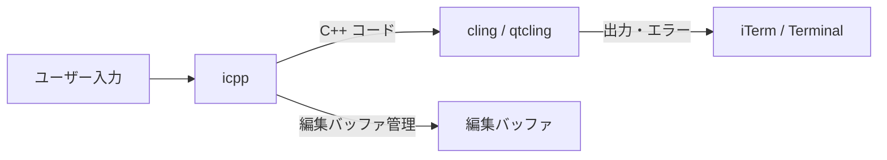
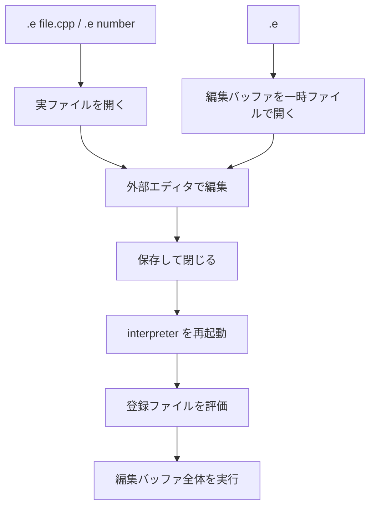
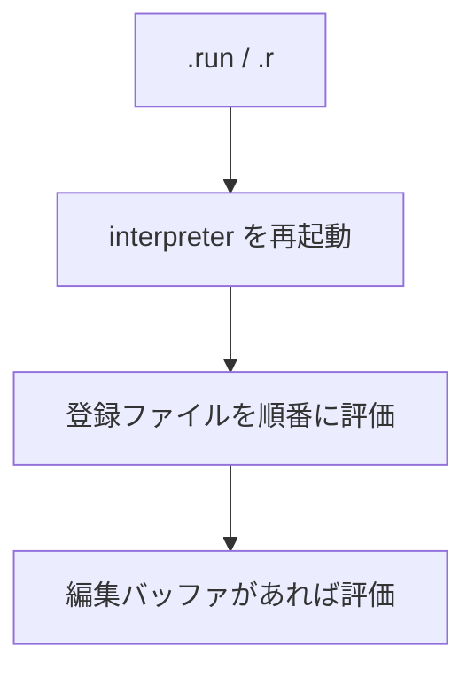
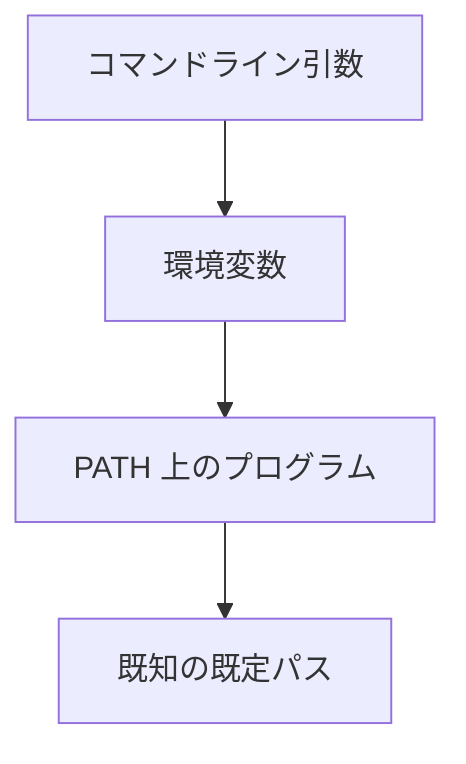

---
genpdf:
  Format: book
  Title: icpp 利用ガイド
  Subtitle: cling / qtcling 対応 C++ REPL
  Author: (株) SRA
  version: 1.2.0
  page_numbers: true
---

<!-- page -->
!toc

<div class="page-break"></div>

<!-- page -->
# 1. 概要

`icpp` は、C++ を対話的に試すための REPL ラッパーです。

このガイドは `icpp 1.2.0` を対象にしています。

内部では `cling` または `qtcling` を起動し、ユーザー入力をその interpreter に送ります。`icpp` 自体は C++ を解釈しません。代わりに、次のような作業をしやすくします。

- 複数行の C++ コードを編集バッファとして扱う
- エディタで関数やクラスを編集する
- 編集したコードを最初から再実行する
- 複数ファイルを登録し、まとめて再実行する
- クリップボード経由でコードを出し入れする
- 試したコードをファイルへ保存する
- Qt 型の値を簡単に表示する

既定では `qtcling` を使います。そのため、`QString`、`QVariant`、`QDebug` など Qt の型をすぐ試せます。

対応対象は macOS と Linux です。`qtcling`、`run_all`、Qt の `moc` / `uic` / `rcc`、必要な GUI ツールは同じ Qt 6.x.y の環境で揃えて使います。

配布物には、短い導入用の `README.md`、変更履歴の `CHANGELOG.md`、詳細な利用説明の `USER_GUIDE.pdf` を含めています。

!callout{type=note title=このガイドの前提}
  本文中の表は Markdown 表として、処理の流れは Mermaid 図として記述しています。
  PDF は `genpdf` で生成する前提です。

# 2. まず何をするか

詳細を読む前に、目的に近い手順から始めます。

| 目的 | 最短手順 |
|---|---|
| 1 行の C++ / Qt 式を試す | 式を入力し、必要なら `.p <expr>` で表示 |
| 小さな関数を書く | `.e scratch.cpp`、保存して閉じる、`.x 関数呼び出し` |
| 既存の `.cpp` を試す | `.add widget.cpp`、`.r`、`.x static auto w = go();` |
| `Q_OBJECT` / `.ui` / `.qrc` を含む | `.add widget.cpp`、`.gen` |
| `.ui` を編集する | `.designer form.ui`、`.gen` |
| `.qrc` を編集する | `.qrc resources.qrc` または `.qtc resources.qrc`、`.gen` |
| `.ts` を編集する | `.! lupdate ... -ts app_ja.ts`、`.linguist app_ja.ts`、`.! lrelease app_ja.ts` |
| 画面上の widget を調べる | `.x static auto w = go();`、`.x w->show();`、`.inspect` |
| 定義済みの関数を確認する | `.defs` |
| `.ui` の objectName を確認する | `.uiinfo form.ui` |

Qt の生成入力ファイルは、次のように扱います。

| ファイル | 編集 | 生成 / 更新 |
|---|---|---|
| `.cpp` / `.h` | `.e <file>` または普段のエディタ | `.r` または `.gen` |
| `.ui` | `.designer <form|file.ui>` | `.gen` |
| `.qrc` | `.qrc <file.qrc>` / `.qtc <file.qrc>` | `.gen` |
| `.ts` | `.linguist <file.ts>` | `.! lrelease <file.ts>` |

`lupdate` と `lrelease` は Qt 標準コマンドとして `.!` で明示実行します。icpp 独自の alias はありません。

問題が起きたときは、まず次を見ます。

| 症状 | 見る場所 |
|---|---|
| C++ の型や member が見つからない | その場に出る interpreter の診断 |
| `.ui` の objectName が分からない | `.uiinfo <file.ui>` |
| 登録したファイルが分からない | `.files` / `.status` |
| icpp コマンドが失敗した | `.errors` |
| Qt 生成物が古そう | `.generated` / `.qt` / `.gen` |
| 生成物を消してやり直したい | `.clean` |
| 環境や Qt ツールを確認したい | `.doctor` |

各コマンドの詳しい使い方は `.command -h` で確認できます。たとえば `.e -h`、`.r -h`、`.gen -h`、`.template -h` のように使います。`.?` は全体を見渡すための短い一覧です。

# 3. icpp でできること

`icpp` は、短い C++/Qt コードを試しながら育てるための道具です。

| 目的 | 使う機能 |
|---|---|
| C++ の式を試す | 通常入力 |
| Qt の型を試す | 既定の `qtcling` |
| 値を表示する | `.p` / `.print` |
| 型を表示する | `.ptype` |
| QWidget を確認する | `.widgets` |
| 複数行関数を書く | `.e <file>` / `.add` |
| 編集バッファを見る | `.show` |
| 編集バッファと登録ファイルを再実行する | `.run` |
| 複数ファイルをまとめて扱う | `.add` / `.files` / `.drop` |
| Copilot やエディタとコードをやり取りする | `.paste` / `.copy` |
| ファイルに保存する | `.save` |
| 既存ファイルを読む | `.open` / `.load` |
| interpreter を作り直す | `.reset` / `.restart` |

`icpp` は、本格的なビルドシステムや IDE の代替ではありません。小さな関数、データ変換、Qt 型の挙動確認を素早く行う用途に向いています。

# 4. Qt Creator を主に使う人向け

Qt Creator を主な開発環境として使う場合、icpp は代替 IDE ではなく、横に置く確認用 REPL として使います。

Qt Creator ではプロジェクト全体の編集、補完、ビルド、デバッグ、UI 設計を行います。icpp では、プロジェクトに入れる前の小さな C++ / Qt コードを素早く試します。icpp 側で project model を解釈したり、Qt Creator の Kit や CMake 設定を置き換えたりはしません。

## 4.1 役割分担

| 作業 | 使う道具 |
|---|---|
| 本体プロジェクトの編集 | Qt Creator |
| CMake / Kit / ビルド / デバッグ | Qt Creator |
| Copilot にコードを生成させる | Qt Creator または普段のエディタ |
| 小さな関数や Qt API の挙動確認 | icpp |
| `Q_OBJECT` を含む小さなクラスの確認 | icpp + `.gen` |
| `.ui` の作成と編集 | `.designer` または Qt Creator |
| `.qrc` の編集 | `.qrc creator` / `.qtc` またはテキストエディタ |
| `.ts` の翻訳編集 | `.linguist` |
| `moc` / `uic` / `rcc` の生成物更新 | `.gen` |
| 採用するコードをプロジェクトへ入れる | Qt Creator の `Add Existing Files...` |

## 4.2 基本方針

Qt Creator と併用する場合は、一時ファイルより実ファイルを使う方が安定します。`.e` を引数なしで使うと一時ファイルを開くため、Qt Creator 側のセッションや最近使ったファイルに `icpp_XXXXXX.cpp` が残ることがあります。

確認用のファイルは、たとえば `scratch/` や lesson 用ディレクトリのように、本体プロジェクトとは分けて置きます。採用するコードだけを Qt Creator 側のプロジェクトへ戻すと、CMake やビルド対象を汚しにくくなります。

## 4.3 実ファイルで試す

小さな QWidget を試す場合は、実ファイルを作ってから登録します。

```text
icpp[qtcling]> .new widget Widget
icpp[qtcling]> .add widget.cpp
icpp[qtcling]> .gen
icpp[qtcling]> static auto w = go();
icpp[qtcling]> w->show();
icpp[qtcling]> w->raise();
```

`.new widget Widget` は `widget.h` と `widget.cpp` を作ります。生成された `widget.cpp` を `.add` し、`Q_OBJECT` や `moc_widget.cpp` が関係するため `.gen` で生成物を更新してから widget を作ります。

Qt Creator や普段のエディタで `widget.h` / `widget.cpp` を開いて編集し、icpp 側では `.gen`、`.defs`、`.inspect` で確認します。

## 4.4 .ui を使う場合

Designer UI を試す場合は、`.ui` を作成または編集し、保存後に `.gen` で `ui_*.h` を生成します。

```text
icpp[qtcling]> .new ui WidgetForm
icpp[qtcling]> .designer widgetform.ui
# Designer で保存する
icpp[qtcling]> .gen
icpp[qtcling]> .uiinfo widgetform.ui
```

`.uiinfo` では、`.ui` 内の objectName を確認できます。C++ 側では `ui_widgetform.h` を include し、`private Ui::WidgetForm` として使います。`ui_widgetform.h` は生成物なので手で編集しません。

## 4.5 .qrc を使う場合

resource file を試す場合は、`.qrc` を作って編集し、保存後に `.gen` で `qrc_*.cpp` を生成します。

```text
icpp[qtcling]> .new qrc resources
icpp[qtcling]> .qrc creator resources.qrc
# Qt Creator の Resource Editor で保存する
icpp[qtcling]> .gen
```

Qt Creator の Resource Editor を使いたい場合は `.qrc creator resources.qrc` または `.qtc resources.qrc` を使います。テキストで十分な場合は `.qrc resources.qrc` を使います。利用側の `.cpp` では、通常 `qrc_resources.cpp` を include します。

## 4.6 .ts を使う場合

翻訳を試す場合は、Qt 標準の `lupdate` / `lrelease` を `.!` で明示的に実行します。

```text
icpp[qtcling]> .! lupdate *.cpp -ts app_ja.ts
icpp[qtcling]> .linguist app_ja.ts
# Linguist で翻訳して保存する
icpp[qtcling]> .! lrelease app_ja.ts
icpp[qtcling]> .gen
```

`.gen` は `lrelease` を実行しません。`.ts` を Linguist で保存した後は、`lrelease` で `.qm` を更新してから、必要に応じて `.qrc` と `.gen` の流れに戻ります。

## 4.7 Qt Creator プロジェクトへ戻す

icpp で試したファイルを採用する場合は、Qt Creator の Projects view でプロジェクトを右クリックし、`Add Existing Files...` から追加します。確認だけで終わるコードは、Qt Creator のプロジェクトへ追加しないまま捨てても構いません。

既存プロジェクト全体のビルド条件、複雑な依存関係、デバッガでの追跡、長期管理する本番コードの編集は Qt Creator 側で行います。icpp では、独立した小さな部品として確認できる範囲に切り出して試します。

## 4.8 困ったとき

| 状況 | 確認するもの |
|---|---|
| 生成物が古そう | `.generated` / `.gen` |
| Qt tool の場所が怪しい | `.doctor` / `.qt` |
| `.ui` の objectName が分からない | `.uiinfo form.ui` |
| 登録ファイルが分からない | `.files` |
| 評価順が分からない | `.runorder` |
| 表示中の widget が分からない | `.widgets all` |
| widget のプロパティを見たい | `.inspect` |

よく使う確認の流れは次の形です。

```text
icpp[qtcling]> .generated
icpp[qtcling]> .qt
icpp[qtcling]> .files
icpp[qtcling]> .defs
icpp[qtcling]> .inspect
```

## 4.9 GUI lesson の見た目

`lessons/icpp-gui` は、初めて icpp で Qt GUI を動かす人向けの練習教材です。`verification/` は自動検証用ですが、`lessons/icpp-gui/` は手で動かして覚えるための教材です。各 lesson のディレクトリへ移動して、README に書かれた手順を icpp で実行します。

最初は小さな QWidget を表示するだけですが、少しずつ header / implementation の分離、signal / slot、`Q_OBJECT`、Designer UI、resource、translation、inspector へ進みます。

各 lesson は、ディレクトリへ移動してから `icpp` を起動して実行します。

```sh
cd lessons/icpp-gui/01-first-window
icpp
```

lesson では、次の 3 つの役割を分けて考えます。

| 種類 | 役割 |
|---|---|
| `widget.h` / `widget.cpp` | 試したい QWidget の C++ コード |
| `form.ui` / `resources.qrc` / `app_ja.ts` | Qt の生成入力ファイル |
| `go()` | REPL から widget を作るための入口 |

`go()` は、この教材で使う共通の入口です。実際の処理は `Widget` class に書き、`go()` は基本的に `return new Widget;` だけにします。最初は ownership や `deleteLater()` の整理よりも、作った widget を画面に表示して挙動を見ることを優先します。

`.e` はファイルを編集し、`.add` は再実行対象としてファイルを登録します。`.gen` は `moc` / `uic` / `rcc` などの生成物を更新し、登録ファイルを評価し直します。`.x` は実行用の短いコードを編集バッファに残さずに実行します。

よく使うコマンドは次の通りです。

| コマンド | 用途 |
|---|---|
| `.e <file>` | ファイルをエディタで開き、閉じた後に再評価します |
| `.add <file>` | `.r` / `.gen` で評価するファイルとして登録します |
| `.r edit` | 登録ファイルの順番をエディタで変更してから再評価します |
| `.gen` | `run_all` を実行し、Qt 生成物を更新してから再評価します |
| `.autogen on` | `.e` / `.r` の前に必要なら自動生成します |
| `.defs` | 定義された関数や class を表示します |
| `.files` | 登録ファイルを表示します |
| `.status` | 現在状態を表示します |
| `.generated` | 現在ディレクトリの生成物を表示します |
| `.x <code>` | 編集バッファに残さず C++ を実行します |
| `.a <code>` | C++ を実行し、編集バッファにも追加します |
| `.! <command>` | 外部 shell command を実行します |
| `.errors` | 直近の icpp コマンド側のエラーを表示します |

基本の流れは次の形です。

```text
icpp[qtcling]> .e widget.cpp
icpp[qtcling]> .gen
icpp[qtcling]> .defs
icpp[qtcling]> .x static auto w = go();
icpp[qtcling]> .x w->show();
icpp[qtcling]> .x w->raise();
```

```text
icpp[qtcling]> .x static auto w = go();
icpp[qtcling]> .x w->show();
icpp[qtcling]> .x w->raise();
```

`static auto w = go();` としておくと、後から `w` を使って同じ widget を操作できます。`go()->show();` だけだと、後でその widget を参照しにくくなります。

GUI を表示するため、画面のある環境で実行してください。画面のない環境で `show()` すると、`Cannot create window: no screens available` のようなエラーになることがあります。

Qt では、C++ ソース以外に生成物が必要になることがあります。

| 入力 | 生成物 | 使い方 |
|---|---|---|
| `Q_OBJECT` を含む `.h` / `.cpp` | `moc_*.cpp` / `*.moc` | 利用側 `.cpp` から include |
| `.ui` | `ui_*.h` | 利用側 `.cpp` から include |
| `.qrc` | `qrc_*.cpp` | 利用側 `.cpp` から include |
| `.ts` | `.qm` | `lrelease` で生成し、`.qrc` に入れる |

icpp は、`moc_*.cpp` / `*.moc` がまだ存在しない場合に、空の placeholder を作って include エラーを避けることがあります。これは初回のつまずきを減らす補助です。本物の meta-object 情報ではないため、`Q_OBJECT`、slot、signal、`Q_PROPERTY` を使う場合は必ず `.gen` で本物を生成します。`qrc_*.cpp`、`ui_*.h`、`.qm` には空 placeholder を作りません。

| lesson | 画面で確認すること |
|---|---|
| `00-introduction` | 基本コマンドと進め方を確認する |
| `01-first-window` | 最小の QWidget を表示できること |
| `02-button-label` | ボタンクリックでラベルを変更できること |
| `03-button-counter` | lambda connect で状態を更新できること |
| `04-slider-state` | スライダーの値を画面に反映できること |
| `05-qobject-slot` | `Q_OBJECT` とスロットを `.gen` で扱えること |
| `06-designer-ui` | `.designer` で `.ui` を編集し、`.gen` で C++ から使えること |
| `07-resource-message` | `.qrc` に入れたリソースを表示できること |
| `08-resource-update` | リソース更新後に `.gen` で表示が変わること |
| `09-autogen` | `.autogen on` で生成物更新を自動化できること |
| `10-translation` | `.ts` / `.qm` / `.qrc` で翻訳を反映できること |
| `11-fix-errors` | icpp の診断と `.uiinfo` で objectName のずれを直すこと |
| `12-inspect-widget` | `.inspect` で widget の property、object tree、picker を確認できること |

### 4.1.1 00-introduction

この lesson は、GUI を作る前の準備です。C++ を外部エディタで書き、icpp から生成・評価し、画面を出すという、この教材全体の流れを確認します。

**操作**

```text
icpp[qtcling]> .e widget.cpp
# Widget クラスと go() を書いて保存する
icpp[qtcling]> .gen
icpp[qtcling]> .defs
icpp[qtcling]> static auto w = go();
icpp[qtcling]> w->show();
icpp[qtcling]> w->raise();
```

**ポイント**

`.e` でファイルを開き、保存して閉じると icpp 側に戻ります。`.gen` で必要な Qt 生成物を更新し、`.defs` で `go()` が見えていることを確認してから、widget を作って表示します。

### 4.1.2 01-first-window

最初の lesson では、`widget.h` だけで小さな `Widget` クラスを定義し、`widget.cpp` の `go()` から作成します。まずは「icpp から QWidget を作って表示できる」ことを確認します。

**操作**

```text
icpp[qtcling]> .e widget.h
# Widget クラスをヘッダー内に書いて保存する
icpp[qtcling]> .e widget.cpp
# go() を書いて保存する
icpp[qtcling]> .gen
icpp[qtcling]> .defs
icpp[qtcling]> static auto w = go();
icpp[qtcling]> w->show();
icpp[qtcling]> w->raise();
```

`.defs` では、登録された `go()` や `Widget::Widget()` などの定義を確認できます。`.gen` の後で `go()` を呼ぶ、という順序を覚えるのがこの lesson の目的です。

<div class="page-break"></div>

**期待される結果**


よくある失敗は、`.gen` の前に `go()` を呼ぶことです。`go()` がまだ評価されていない場合は、先に `.gen` を実行してから `static auto w = go();` を実行します。

もう一つの失敗は、`go()` の戻り値を保存せずに `go()->show();` だけ実行することです。画面は出ますが、後で同じ widget に対して `raise()` や `close()` を呼びにくくなります。lesson では、後から調べられるように `static auto w = go();` の形を使います。

### 4.1.3 02-button-label

この lesson では、`widget.h` にクラス宣言、`widget.cpp` にコンストラクタ実装を書きます。GUI の内容はラベルとボタンだけですが、ヘッダーと実装を分ける基本形を確認します。

**操作**

```text
icpp[qtcling]> .e widget.h
# Widget クラスの宣言を書いて保存する
icpp[qtcling]> .e widget.cpp
# ラベルとボタンを作るコンストラクタを書いて保存する
icpp[qtcling]> .gen
icpp[qtcling]> static auto w = go();
icpp[qtcling]> w->show();
icpp[qtcling]> w->raise();
```

この段階では、ボタンを押したときの処理はまだ重要ではありません。`widget.h` と `widget.cpp` を分けても、`.gen` でまとめて評価できることを確認します。

<div class="page-break"></div>

**期待される結果**


ラベルとボタンを持つ小さな window が表示されます。この lesson では、まだクリック処理を複雑にしません。まず、クラス宣言を `widget.h`、実装を `widget.cpp` に分けた状態で、icpp が両方を評価できることを確認します。

### 4.1.4 03-button-counter

ボタンクリックを lambda で受け、クラス内の `count` を増やします。`QLabel *label` と `int count` を member に持たせることで、UI 部品と状態をクラスの中で扱う練習になります。

**操作**

```text
icpp[qtcling]> .e widget.h
# ラベルと count を member に持つ Widget クラスを書いて保存する
icpp[qtcling]> .e widget.cpp
# ボタンの clicked を lambda に接続する実装を書いて保存する
icpp[qtcling]> .gen
icpp[qtcling]> static auto w = go();
icpp[qtcling]> w->show();
icpp[qtcling]> w->raise();
```

表示後、ボタンを押すたびに `Count: 1`、`Count: 2` のように増えることを確認します。ここでは `Q_OBJECT` を使わず、lambda connect だけで十分な場合の書き方を見ます。

<div class="page-break"></div>

**期待される結果**


ボタンを押すたびに count が増え、ラベルが更新されます。ここで見るべき点は、ボタンの signal、lambda、member 変数、ラベル更新が一つの `Widget` クラスの中でまとまっていることです。

### 4.1.5 04-slider-state

スライダーの値をラベルに反映します。ボタンよりも連続的に値が変わる UI を扱い、値の更新処理をプライベートメソッドに分ける形を確認します。

**操作**

```text
icpp[qtcling]> .e widget.h
# ラベル、スライダー、更新用メソッドを持つ Widget クラスを書いて保存する
icpp[qtcling]> .e widget.cpp
# スライダーの値をラベルへ反映する実装を書いて保存する
icpp[qtcling]> .gen
icpp[qtcling]> static auto w = go();
icpp[qtcling]> w->show();
icpp[qtcling]> w->raise();
```

表示後、スライダーを左右に動かします。ラベルの `Value: ...` がスライダーの値に合わせて変われば成功です。プライベートメソッドは REPL から直接呼ぶ対象ではなく、クラス内部の整理に使います。

<div class="page-break"></div>

**期待される結果**


スライダーを動かすとラベルの数値が変わります。ボタンクリックよりも値の変化が多いため、表示更新をプライベートメソッドに分けておくと、コンストラクタの中が読みやすくなります。

### 4.1.6 05-qobject-slot

ここから `Q_OBJECT` とスロットを使います。`Q_OBJECT` を含むクラスは `moc` の生成物が必要です。そのため、編集後は `.gen` で `moc_widget.cpp` を生成してから実行します。

**操作**

```text
icpp[qtcling]> .e widget.h
# Q_OBJECT とスロットを持つ Widget クラスを書いて保存する
icpp[qtcling]> .e widget.cpp
# clicked をスロットへ接続し、moc_widget.cpp をインクルードして保存する
icpp[qtcling]> .generated
icpp[qtcling]> .! ls -l moc_widget.cpp
icpp[qtcling]> .! cat moc_widget.cpp
icpp[qtcling]> .gen
icpp[qtcling]> static auto w = go();
icpp[qtcling]> w->show();
icpp[qtcling]> w->raise();
icpp[qtcling]> .clean
icpp[qtcling]> .generated
```

ボタンを押すとスロットが呼ばれて count が増えます。`moc_widget.cpp` がまだない場合、icpp は空のプレースホルダーでインクルードエラーを避けることがあります。ただし本物ではないので、必ず `.gen` で生成します。

<div class="page-break"></div>

**期待される結果**


ボタンを押すたびにスロットが呼ばれ、ラベルの count が増えます。lambda connect と違い、スロットはクラスの meta-object 情報と関係するため、`Q_OBJECT` と `moc` 生成物の関係をここで確認します。

### 4.1.7 06-designer-ui

`.designer` を使う lesson では、Qt Designer で `.ui` を編集し、保存した後に `.gen` で `ui_*.h` を更新します。

**操作**

```text
icpp[qtcling]> .designer form.ui
# Qt Designer で form.ui を保存する
icpp[qtcling]> .gen
icpp[qtcling]> .e widget.h
# ui_form.h を使う Widget クラスを書いて保存する
icpp[qtcling]> .e widget.cpp
# setupUi(this) で form.ui の部品を使う実装を書いて保存する
icpp[qtcling]> static auto w = go();
icpp[qtcling]> w->show();
icpp[qtcling]> w->raise();
icpp[qtcling]> .clean
icpp[qtcling]> .generated
```

生成後は、C++ 側から `.ui` の objectName を使って widget を操作できます。

<div class="page-break"></div>

**期待される結果**

| Designer で編集 | 実行結果 |
|---|---|
|  |  |

`form.ui` は `uic` の入力です。`ui_form.h` は生成物なので、手で編集しません。`widget.cpp` は `ui_form.h` を include するため、先に `.gen` で生成物を作ってから `widget.cpp` を評価します。`ui_form.h` がまだない状態で `widget.cpp` を編集・評価すると、include のエラーになります。

`.designer` は Qt Designer を開くとすぐ icpp に戻ります。UI を変更したら Qt Designer 側で保存してから `.gen` を実行してください。

実行結果では、Designer で配置したボタンとスライダーが表示されます。ボタンを押すとラベルが変わり、スライダーを動かすと数値が変わります。C++ 側では、`form.ui` の objectName に対応する member を参照します。

### 4.1.8 07-resource-message

`.qrc` に登録した `message.txt` をリソースとして読み込み、画面に表示します。

**操作**

```text
icpp[qtcling]> .qrc resources.qrc
# resources.qrc を確認して保存する
icpp[qtcling]> .gen
icpp[qtcling]> .e widget.h
# リソースを読む Widget クラスを書いて保存する
icpp[qtcling]> .e widget.cpp
# qrc_resources.cpp をインクルードし、message.txt を表示する実装を書いて保存する
icpp[qtcling]> static auto w = go();
icpp[qtcling]> w->show();
icpp[qtcling]> w->raise();
icpp[qtcling]> .clean
icpp[qtcling]> .generated
```

<div class="page-break"></div>

**期待される結果**


`resources.qrc` は `rcc` の入力です。`qrc_resources.cpp` は生成物なので、通常は直接 `.add` しません。`widget.cpp` から include し、`.gen` で再生成します。

`.qrc` はエディタを開く操作です。リソースファイルを確認したら保存して閉じ、icpp に戻って `.gen` を実行してください。

window には、リソースから読んだ `message.txt` の内容が表示されます。ファイルを通常の相対パスで読むのではなく、Qt リソースとして埋め込んだ内容を読む点がこの lesson の要点です。

### 4.1.9 08-resource-update

リソースの lesson では、`.qrc` に登録した `message.txt` を表示します。リソースを更新した後は、`.gen` で `qrc_*.cpp` を作り直してから再実行します。

**操作**

```text
icpp[qtcling]> .e widget.h
# リソースを読む Widget クラスを書いて保存する
icpp[qtcling]> .e widget.cpp
# qrc_resources.cpp をインクルードし、message.txt を表示する実装を書いて保存する
icpp[qtcling]> static auto first = go();
icpp[qtcling]> first->show();
icpp[qtcling]> .e message.txt
# message.txt を Second message に変更して保存する
icpp[qtcling]> .gen
icpp[qtcling]> static auto second = go();
icpp[qtcling]> second->show();
icpp[qtcling]> second->raise();
icpp[qtcling]> .clean
icpp[qtcling]> .generated
```

<div class="page-break"></div>

**期待される結果**

| 更新前 | 更新後 |
|---|---|
|  |  |

ここで重要なのは、`message.txt` を変更しただけでは、すでに生成済みの `qrc_resources.cpp` は変わらないことです。リソースの元ファイルを変えたら `.gen` で `rcc` を走らせ、リソースを C++ 側へ埋め込み直します。

最初の window には `First message`、変更後に作った window には `Second message` が表示されます。既に表示済みの window が自動的に変わるわけではありません。リソースを再生成し、もう一度 widget を作ることで、新しいリソースが使われます。

### 4.1.10 09-autogen

`.autogen on` を使い、編集後の生成物更新を自動化する lesson です。

**操作**

```text
icpp[qtcling]> .autogen
icpp[qtcling]> .autogen on
icpp[qtcling]> .status
icpp[qtcling]> .e widget.h
# リソースを読む Widget クラスを書いて保存する
icpp[qtcling]> .e widget.cpp
# autogen で生成される qrc_resources.cpp を使う実装を書いて保存する
icpp[qtcling]> static auto w = go();
icpp[qtcling]> w->show();
icpp[qtcling]> w->raise();
icpp[qtcling]> .clean
icpp[qtcling]> .generated
```

<div class="page-break"></div>

**期待される結果**


`.autogen on` の状態では、`.e` で編集を終えた後、必要に応じて `run_all` が自動実行されます。毎回 `.gen` を打つ手間を減らせますが、何が生成されるかを理解するまでは、06 から 08 のように明示的に `.gen` を実行する方が流れを追いやすいです。

`.e widget.cpp` の後に `Autogen: run_all` のような表示が出れば、自動生成が動いています。`.status` では autogen が有効になっていることも確認できます。

### 4.1.11 10-translation

翻訳の lesson では、`lupdate`、`.linguist`、`lrelease`、`.gen` の順に `.ts` / `.qm` / `.qrc` を更新し、表示文字列が翻訳されることを確認します。

`.linguist` は Qt Linguist を開くとすぐ icpp に戻ります。翻訳を編集したら Qt Linguist 側で保存し、その後 `.! lrelease app_ja.ts` を実行します。

**操作**

```text
icpp[qtcling]> .e widget.h
# 翻訳対象のラベルを持つ Widget クラスを書いて保存する
icpp[qtcling]> .e widget.cpp
# tr("Hello") と翻訳ファイル読み込みの実装を書いて保存する
icpp[qtcling]> .! lupdate widget.cpp -ts app_ja.ts
icpp[qtcling]> .linguist app_ja.ts
# Qt Linguist で 'Hello' を 'こんにちは' に翻訳する
# Qt Linguist で app_ja.ts を保存する
icpp[qtcling]> .! lrelease app_ja.ts
icpp[qtcling]> .qrc translations.qrc
# リソースに app_ja.qm が入っていることを確認して閉じる
icpp[qtcling]> .gen
icpp[qtcling]> .e widget.cpp
# qrc_translations.cpp のインクルード行のコメントを外す
# 保存して icpp に戻る
icpp[qtcling]> static auto w = go();
icpp[qtcling]> w->show();
icpp[qtcling]> w->raise();
icpp[qtcling]> .clean
```

最初は `app_ja.ts` がない状態から始めます。`lupdate` で作成し、Linguist で翻訳してから `lrelease` で `app_ja.qm` を生成します。

<div class="page-break"></div>

**期待される結果**


`.gen` は `lrelease` を実行しません。翻訳では、`lupdate` で `.ts` を更新し、Linguist で翻訳を編集し、`lrelease` で `.qm` を生成してから、`.qrc` と `.gen` の流れに入ります。icpp は `lupdate` / `lrelease` の短縮 alias を持たないため、Qt 標準コマンドを `.!` で明示実行します。

ウィンドウには翻訳後の `こんにちは` が表示されます。`app_ja.ts` は翻訳元データ、`app_ja.qm` は実行時に読み込むバイナリ形式の翻訳データです。`app_ja.qm` を更新し忘れると、`.ts` を編集しても表示は変わりません。

### 4.1.12 11-fix-errors

この lesson は、画面を作る前に失敗を読む練習です。`.ui` の objectName と C++ 側の参照名がずれているため、`widget.cpp` の評価でエラーになります。

**操作**

```text
icpp[qtcling]> .designer form.ui
# form.ui を確認して保存する
icpp[qtcling]> .gen
icpp[qtcling]> .e widget.h
# ui_form.h を private 継承する Widget クラスを書いて保存する
icpp[qtcling]> .e widget.cpp
# 存在しない messageLabel を参照する実装を書いて保存し、診断を確認する
icpp[qtcling]> .uiinfo form.ui
icpp[qtcling]> .e widget.cpp
# messageLabel を titleLabel に変更する
# 保存して icpp に戻る
icpp[qtcling]> .gen
icpp[qtcling]> static auto w = go();
icpp[qtcling]> w->show();
icpp[qtcling]> w->raise();
icpp[qtcling]> .clean
```

<div class="page-break"></div>

**期待される結果**

期待される診断は、`messageLabel` が `Widget` または `Ui::Form` に存在しない、という内容です。その後 `.uiinfo form.ui` を見ると、実際のラベルの objectName が `titleLabel` であることを確認できます。

`widget.h` には `Widget` クラスの宣言があり、`widget.cpp` には `setupUi(this)` と部品への参照があります。直し方は、C++ 側の参照を `.ui` に存在する名前へ合わせることです。

```cpp
messageLabel->setText("Fixed");
```

を次のように直します。

```cpp
titleLabel->setText("Fixed");
```

修正後、もう一度 `.gen` を実行します。この lesson では、`.errors` ではなく、その場に出る icpp の診断と `.uiinfo` を見ます。C++ が存在しない member を参照している場合、失敗は C++ 評価の診断として出るためです。

### 4.1.13 12-inspect-widget

`.inspect` の lesson では、表示中の widget を選び、property、object tree、picker を使って構造と状態を確認します。

**操作**

```text
icpp[qtcling]> .add widget.cpp
icpp[qtcling]> .gen
icpp[qtcling]> .r
icpp[qtcling]> static auto w = go();
icpp[qtcling]> w->show();
icpp[qtcling]> w->raise();
icpp[qtcling]> .inspect
```

<div class="page-break"></div>

**期待される結果**


| property editor | object tree | picker |
|---|---|---|
|  |  |  |

inspector が開いたら、まず top-level widget selector で `12 Inspect Widget` を選びます。PropertyEditor では `objectName`、`windowTitle`、`geometry` などを探します。`Show Object Tree` では `titleLabel`、`previewLabel`、`sizeSlider`、`accentButton` のような部品構造を確認します。`Pick Object` を押すと、画面上のラベル、スライダー、ボタンを直接クリックして選べます。

**試すこと**

| 操作 | 確認すること |
|---|---|
| top-level widget selector で `12 Inspect Widget` を選ぶ | 調査対象の window が切り替わること |
| PropertyEditor で `objectName`、`windowTitle`、`geometry` を見る | 実行中 widget の property が読めること |
| `Show Object Tree` を押す | `titleLabel`、`previewLabel`、`sizeSlider`、`accentButton` が見えること |
| `Pick Object` を押して画面上の部品をクリックする | 選んだ部品が inspector 側に反映されること |
| `Clear Pick` を押す | picker のハイライトを消せること |
| slider や button を操作してから PropertyEditor を見る | 実行中の状態変化を観察できること |

GUI を試した後は、残っている window を確認して閉じます。

```text
icpp[qtcling]> .widgets
icpp[qtcling]> .closeall
icpp[qtcling]> .q
```

# 5. cling / qtcling との関係

`icpp` は `cling` または `qtcling` を子プロセスとして起動します。



`icpp` が担当するのは、入力管理、編集バッファ、ドットコマンド、ファイル操作です。C++ の評価やエラー診断は `cling` / `qtcling` が行います。

| エンジン | 用途 |
|---|---|
| `qtcling` | Qt 型や Qt ライブラリを使う。既定値 |
| `cling` | Qt を使わない C++ を試す |

## 5.1 cling の dot command との関係

`cling` には `.L`、`.x`、`.I`、`.printAST` などの metaprocessor command があります。ROOT 環境では、さらに `.U`、`.undo`、`.files` などのコマンドも使われます。

`icpp` では、先頭が `.` の入力はまず `icpp` 自身のコマンドとして扱います。そのため、`cling` や ROOT の dot command をそのまま入力しても、`icpp` の未知のコマンドとして扱われます。

```text
icpp[qtcling]> .L sample.C
Unknown command: .L
```

これは制限というより、`icpp` のコマンド体系と `cling` / ROOT の metaprocessor command を混在させないための設計です。`icpp` は、cling の内部状態を細かく操作するより、編集バッファと登録ファイルを管理し、`.r` で interpreter を作り直して再評価する作業モデルを採用しています。

主な対応関係は次の通りです。

| やりたいこと | cling / ROOT | icpp |
|---|---|---|
| ファイルを読み込む | `.L file.C` | `.load file.cpp` |
| ファイルを読み込み、関数を実行する | `.x file.C` | `.load` または `.add` + `.r` の後に関数を呼ぶ |
| include path を追加する | `.i path` | `.i path` |
| ライブラリを読み込む | `.L libsample.dylib` | `.loadlib libsample.dylib` |
| 読み込んだファイルを外す | `.U file.C` | `.drop file.cpp` + `.r` |
| 複数ファイルを再評価する | `.L` を順番に実行 | `.add` / `.files` / `.r` |

`ROOT + cling` の dot command は ROOT の環境に依存するものがあります。通常の `qtcling` では同じコマンドが使えない場合があります。

<div class="page-break"></div>

<!-- page -->
# 6. 起動方法

## 6.1 既定の起動

通常はそのまま起動します。

```text
$ icpp
icpp[qtcling]>
```

既定のエンジンは `qtcling` です。

起動後、使用中のエンジンは `.args` で確認できます。

```text
icpp[qtcling]> .args
engine: qtcling
program: /usr/local/src/cling/bin/qtcling
arguments:
  --nologo
```

## 6.2 cling を使う

Qt を使わない C++ だけを試す場合は、`cling` を明示します。

```text
$ icpp --engine cling
icpp[cling]>
```

## 6.3 qtcling のパスを指定する

`qtcling` が PATH から見つからない場合や、特定の `qtcling` を使いたい場合はパスを指定します。

```text
$ icpp --engine qtcling --qtcling /usr/local/src/cling/bin/qtcling
```

`type qtcling` で利用したい `qtcling` が見えている場合は、パス指定は不要です。

```text
$ icpp --engine qtcling
```

## 6.4 起動後にエンジンを確認する

Qt ヘッダが見つからない場合は、まず `.args` を確認します。

```text
icpp[qtcling]> .args
```

| 表示 | 意味 |
|---|---|
| `engine: qtcling` | Qt 型を使える想定 |
| `engine: cling` | Qt 型はそのままでは使えない |

# 7. 基本的な使い方

## 7.1 1 行の式を実行する

式をそのまま入力できます。

```text
icpp[qtcling]> 1 + 2
(int) 3
```

C++ 文として扱いたい場合は、末尾に `;` を付けます。

```text
icpp[qtcling]> int x = 10;
icpp[qtcling]> x + 1
(int) 11
```

## 7.2 C++ 文を実行する

標準出力を使うこともできます。

```cpp
#include <iostream>
std::cout << "hello" << std::endl;
```

出力:

```text
hello
```

## 7.3 Qt の型を使う

既定では `qtcling` なので、Qt の型を使えます。

```cpp
#include <QString>

QString name = "Qt";
```

値を表示するには `.p` を使います。

```text
icpp[qtcling]> .p name
Qt
```

## 7.4 値を表示する

`QString` はそのまま入力すると内部表現に近い表示になる場合があります。

```text
icpp[qtcling]> QString s = "abc";
icpp[qtcling]> s
(QString &) { ... }
```

読みやすく表示するには `.p` を使います。

```text
icpp[qtcling]> .p s
abc
```

# 8. 編集バッファ

## 8.1 編集バッファとは

`icpp` は、入力した C++ コードを編集バッファに蓄積します。

```text
icpp[qtcling]> int x = 10;
icpp[qtcling]> int y = 20;
icpp[qtcling]> .show
1  int x = 10;
2  int y = 20;
```

`.p` や `.args` などの確認用コマンドは、編集バッファには追加されません。

## 8.2 .show で確認する

編集バッファ全体を表示します。

```text
icpp[qtcling]> .show
```

範囲指定もできます。

```text
icpp[qtcling]> .show 3
icpp[qtcling]> .show 3:8
```

## 8.3 .save で保存する

編集バッファをファイルへ保存します。

```text
icpp[qtcling]> .save sample.cpp
Saved: sample.cpp
```

一度保存した後は、ファイル名を省略できます。

```text
icpp[qtcling]> .save
```

## 8.4 .discard で消す

編集バッファを消します。interpreter のセッション自体は初期化しません。

```text
icpp[qtcling]> .discard
Edit buffer cleared.
```

## 8.5 通常入力は既定では編集バッファに残らない

通常の C++ 入力は interpreter に送られますが、既定では編集バッファには追加されません。

```text
icpp[qtcling]> auto h = go();
icpp[qtcling]> h->show();
icpp[qtcling]> .show
Edit buffer is empty.
```

このため、`.e` でクラス定義を書いた後に `auto h = go();` などを入力しても、次に `.e` したとき、エディタの末尾へ実行用コードが混ざりません。

短いコードをその場で育てたい場合は、`.b on` で通常入力を編集バッファへ追加するモードに切り替えます。この状態では prompt に `+b` が表示されます。

一回だけ実行したいコードは `.x` または `.eval` で実行します。`.x` は `.b on` / `.b off` の状態に関係なく、実行したコードを編集バッファへ追加しません。逆に、一回だけ実行しつつ編集バッファにも残したい場合は `.a` または `.append` を使います。

```text
icpp[qtcling]> .x static auto h = go();
icpp[qtcling]> .x h->show();
icpp[qtcling]> .a int saved_value = 42;
icpp[qtcling]> .show
1  int saved_value = 42;
```

## 8.6 .append / .a で 1 行だけ追加する

`.append` または `.a` は、C++ コードを実行し、同じコードを編集バッファにも追加します。`.b off` のまま、必要な行だけを明示的に残したい場合に使います。

```text
icpp[qtcling]> .a int x = 10;
icpp[qtcling]> .a int y = 20;
icpp[qtcling]> .show
1  int x = 10;
2  int y = 20;
```

`.x` との違いは次の通りです。

| コマンド | 評価 | 編集バッファへの追加 | 主な用途 |
|---|---|---|---|
| `.x <code>` | する | しない | 表示、呼び出し、一時変数 |
| `.a <code>` | する | する | 残したい定義や初期化 |
| 通常入力 | する | `.b` の状態次第 | 手早い入力 |

## 8.7 .buffer / .b で通常入力の追加を切り替える

通常入力を編集バッファに残したい場合は、`.b on` または `.b` を使います。`.b` は押すたびに通常入力を編集バッファへ追加するかどうかを切り替えます。既定は `off` です。

```text
icpp[qtcling]> auto h = go();
icpp[qtcling]> h->show();
icpp[qtcling]> .show
Edit buffer is empty.
icpp[qtcling]> .b
Input buffer append: on
icpp[qtcling +b]> int z = 30;
icpp[qtcling +b]> .show
1  int z = 30;
```

通常入力が編集バッファに追加される状態では、プロンプトに `+b` が表示されます。

`.buffer` は現在状態を表示します。

```text
icpp[qtcling]> .buffer
Input buffer append: off
```

明示的に指定することもできます。

```text
icpp[qtcling]> .b on
Input buffer append: on
icpp[qtcling +b]> .buffer off
Input buffer append: off
```

関数やクラスを `.e` で育てる運用では、既定の `.b off` が向いています。通常入力を短いコードの蓄積に使いたい場合だけ `.b on` にします。

## 8.8 作成例: 定義と実行を分ける

クラス定義をきれいに保ちたい場合は、定義ファイルと実行用ファイルを分けます。

`harness.cpp`:

```cpp
#include <QWidget>
#include <QPushButton>
#include <QVBoxLayout>
#include <QDebug>

class Harness : public QWidget {
    Q_OBJECT

public:
    Harness() {
        auto *button = new QPushButton("Click me", this);
        auto *layout = new QVBoxLayout(this);
        layout->addWidget(button, 0, Qt::AlignCenter);
        connect(button, &QPushButton::clicked, this, &Harness::onButtonClicked);
    }

public slots:
    void onButtonClicked() {
        qDebug() << "Button was clicked!";
    }
};

Harness *go() {
    auto *h = new Harness();
    h->show();
    return h;
}

#include "harness.moc"
```

`run_harness.cpp`:

```cpp
static Harness *harness = nullptr;

void showHarness() {
    if (harness) {
        harness->close();
    }
    harness = go();
}
```

icpp では、両方を登録してから `.gen` を使います。

```text
icpp[qtcling]> .add harness.cpp
icpp[qtcling]> .add run_harness.cpp
icpp[qtcling]> .gen
icpp[qtcling]> .x showHarness()
```

この形にすると、`harness.cpp` はクラス定義、`run_harness.cpp` は実行補助コードとして分けて管理できます。実行時は `.x showHarness()` を使うため、編集バッファにも定義ファイルにも呼び出しコードが混ざりません。

<div class="page-break"></div>

## 8.9 安全確認と警告が出る操作

icpp は、複数ファイル作業や未保存バッファで誤操作しやすい場面では確認または警告を出します。

| 操作 | 種類 | 出る条件 |
|---|---|---|
| `.save` / `.s` のファイル名省略 | 確認 | 複数ファイルを扱っている状態で、記憶中の保存先へ保存しようとしたとき |
| `.open <file>` | 確認 | 未保存の編集バッファを置き換えようとしたとき |
| `.discard` / `.d` | 確認 | 未保存の編集バッファを消そうとしたとき |
| `.reset` | 確認 | 未保存の編集バッファがある状態でセッションをリセットしようとしたとき |
| `.clearfiles` | 確認 | 複数の登録ファイルをまとめて外そうとしたとき |
| `.clean` | 確認 | 現在ディレクトリの生成物を削除しようとしたとき |
| `.gen` | 警告 | 未保存の編集バッファがある状態で Qt 生成物を更新しようとしたとき |
| `.autogen on` 中の `.e` / `.r` | 確認または警告 | Qt 生成物の自動更新前に未保存の編集バッファがあるとき |

`.save <file>` のように保存先を明示した場合は、その指定を優先します。複数ファイルを扱う場合は、保存先を明示するか、確認メッセージのパスを見てから `Y` を入力します。

`.gen` は未保存の編集バッファがある場合でも実行できます。ただし、`moc` / `uic` / `rcc` の生成対象が保存済みファイルに依存するため、先に `.save <file>` しておく運用が安定します。

## 8.10 .status で状態を確認する

`.status` または `.st` は、現在の作業状態をまとめて表示します。

```text
icpp[qtcling]> .status
engine: qtcling
help language: ja
input buffer append: off
autogen: off
quiet: off
new file name: lower
edit buffer: 42 lines, modified
save target: /path/to/harness.cpp
registered files: 2
qt generated files: needed
run_all: /usr/local/src/cling/bin/run_all
```

`.s` の保存先、`.r` で評価される登録ファイル、`.b`、`.autogen`、`.quiet`、`.newname`、`.lang` の状態が分からなくなったときに確認します。日本語表示では `new file name` は `新規ファイル名` と表示されます。

## 8.11 .autogen で Qt 生成物を自動更新する

`.autogen on` にすると、`.e` や `.r` の再評価前に Qt 生成物が必要そうな場合だけ `run_all` を実行します。既定は `off` です。

```text
icpp[qtcling]> .autogen on
Autogen: on
icpp[qtcling]> .e
Autogen: run_all
```

検出対象は、編集バッファと登録ファイルの `Q_OBJECT` / `.moc` include、登録ファイルやカレントディレクトリの `.ui` / `.qrc` です。未保存の編集バッファがあり保存先が分かる場合は、autogen の前に保存するか確認します。保存先がない場合は、先に `.save <file>` します。

## 8.12 .doctor / .generated / .clean

Qt 生成物を扱う作業が増えてきたら、状態確認用のコマンドを使います。

| コマンド | 用途 |
|---|---|
| `.doctor` | 使用中の engine、Qt 関連ツール、カレントディレクトリの状態を確認します |
| `.generated` | 現在ディレクトリの `moc_*.cpp`、`ui_*.h`、`qrc_*.cpp`、`.qm` を一覧表示します |
| `.clean` | 生成物だけを削除します。削除前に対象一覧を表示して確認します |

`.clean` は元の `.h`、`.cpp`、`.ui`、`.qrc`、`.ts` は削除しません。削除対象は、現在ディレクトリにある生成物だけです。

```text
icpp[qtcling]> .generated
生成物: /path/to/sample
  moc       moc_widget.cpp           <- widget.h  [最新]
  rcc       qrc_resources.cpp        <- resources.qrc  [古い可能性あり]
  uic       ui_form.h                <- form.ui  [最新]

icpp[qtcling]> .clean
削除する生成物:
  moc_widget.cpp
  qrc_resources.cpp
  ui_form.h
これらの生成物を削除しますか? [Y/N]
```

# 9. エディタで編集する

## 9.1 .edit / .e

`.edit` または `.e` は、実ファイルまたは編集バッファを外部エディタで開きます。

慣れてきた後の標準的な使い方は、作業用の実ファイルを指定する形です。

```text
icpp[qtcling]> .e widget.cpp
```

`.e widget.cpp` は、`widget.cpp` が未登録なら自動で登録します。ファイルが存在しない場合は空ファイルを作成してから登録し、外部エディタで開きます。保存して閉じると、登録ファイルと編集バッファを再評価します。

登録済みファイルは番号でも開けます。

```text
icpp[qtcling]> .files
1  /path/to/widget.cpp
icpp[qtcling]> .e 1
```

引数なしの `.e` は、編集バッファを一時ファイルとして外部エディタで開きます。短い試行や最初の入口には便利ですが、Qt Creator や VS Code と併用する作業では一時ファイル名が履歴に残ることがあります。

```text
icpp[qtcling]> .e
```

エディタを閉じると、`.run` と同じ流れで再実行します。登録ファイルがあれば先に評価し、その後で編集後のバッファを評価します。

編集後に `Q_OBJECT`、`.moc` include、`.ui`、`.qrc` などから Qt 生成物が必要そうな場合は、次の警告を表示します。

```text
警告: Qt 生成物が必要な可能性があります。.gen で moc/uic/rcc を再生成して再起動してください。
```

`--help-language en` または `ICPP_HELP_LANGUAGE=en` を指定している場合は、英語で表示されます。

実行中に切り替える場合は `.lang` を使います。

```text
icpp[qtcling]> .lang
ヘルプ言語: ja
icpp[qtcling]> .lang en
help language: en
```

`.lang ja` / `.lang en` は `QSettings` に保存され、次回起動時にも使われます。起動時に `--help-language` または `ICPP_HELP_LANGUAGE` を指定した場合は、それらが保存値より優先されます。

これは、スロット、signal、`Q_PROPERTY`、`Q_INVOKABLE` などを変更したときに、古い `moc` 生成物で動いて見えることを避けるための注意喚起です。警告が出た場合は、必要に応じて `.gen` を実行します。



## 9.2 使用するエディタの指定

エディタは次の順で決まります。

| 優先順位 | 環境変数または既定値 |
|---|---|
| 1 | `ICPP_EDITOR` |
| 2 | `VISUAL` |
| 3 | `EDITOR` |
| 4 | `vim` |

例:

```text
$ ICPP_EDITOR=vim icpp
```

`emacsclient` を使う場合は、端末内で編集するなら次のように指定します。

```text
$ ICPP_EDITOR="emacsclient -nw" icpp
```

GUI の Emacs frame を開く場合は次のように指定します。

```text
$ ICPP_EDITOR="emacsclient -c" icpp
```

`.e` はエディタの終了を待ってから再実行します。`emacsclient` では、編集後に保存してから `C-x #`、または `M-x server-edit` で icpp に戻ります。バッファを閉じるだけでは、icpp 側が待ち続けることがあります。

VS Code を使う場合は、`--wait` を付けます。

```text
$ ICPP_EDITOR="code --wait" icpp
```

`.e <file>` で開いた実ファイル、または引数なし `.e` で開いた一時ファイルを保存し、タブを閉じると icpp に戻ります。`--wait` がないと、VS Code がすぐに戻ってしまい、編集前に再実行されることがあります。

Qt Creator を使う場合は、`-block` を付けます。既に起動している Qt Creator に渡す場合は `-client` も指定します。

```text
$ ICPP_EDITOR="qtcreator -client -block" icpp
```

macOS で `qtcreator` が `PATH` にない場合は、実行ファイルを直接指定します。

```text
$ ICPP_EDITOR='"/Applications/Qt Creator.app/Contents/MacOS/Qt Creator" -client -block' icpp
```

Qt Creator でも、開いたファイルを保存して閉じると icpp に戻ります。`-block` がないと、icpp 側にすぐ戻ってしまいます。

VS Code や Qt Creator は、開いたファイルを最近使ったファイル、開いているタブ、セッション情報として覚えることがあります。引数なしの `.e` は毎回一時ファイルを作って外部エディタに渡すため、`icpp_XXXXXX.cpp` のような一時ファイルがエディタ側の履歴に残ることがあります。

特に Qt Creator はプロジェクトやセッション管理が強いため、一時ファイルが目立ちやすい場合があります。履歴を汚したくない場合は、作業用の `.cpp` ファイルを決めて `.e <file>` または `.add <file>` で管理する運用が向いています。

Qt Creator で開発中のプロジェクトへ icpp で確認したコードを移す場合は、実ファイルで作業しているならそのファイルを Qt Creator の `Add Existing Files...` でカレントプロジェクトに追加します。引数なし `.e` の編集バッファで作業した場合は、先に `.save` で保存します。

```text
icpp[qtcling]> .save scratch/icpp_test.cpp
```

その後、Qt Creator の Projects view でプロジェクトを右クリックし、`Add Existing Files...` から `scratch/icpp_test.cpp` を選択します。CMake プロジェクトでは、追加方法によって `CMakeLists.txt` に入り、ビルド対象になることがあります。確認用コードをビルド対象にしたくない場合は、追加先や CMake 側の扱いを確認します。

## 9.3 編集後の再実行

`.e` は、編集後に `.run` と同じように登録ファイルとバッファ全体を再実行します。

そのため、関数を修正して保存すれば、現在のセッションでは新しい定義が使われます。

## 9.4 C++ の再定義エラーを避ける考え方

C++ では、同じセッションに同じ関数やクラス定義を再投入すると再定義エラーになることがあります。

`icpp` の `.run` と `.edit` は interpreter を再起動してからコードを実行するため、関数やクラスを修正しながら試す用途に向いています。

`icpp` では、クラス定義を同じセッションに上書きするのではなく、`.run` でセッションを作り直してから必要なコードを読み直す作業モデルに寄せています。

# 10. ファイルを使う

## 10.1 .open

`.open` は、ファイル内容で編集バッファを置き換えます。実行はしません。

```text
icpp[qtcling]> .open sample.cpp
Opened: sample.cpp
```

## 10.2 .load

`.load` は、ファイルを読み込んで現在のセッションで実行し、編集バッファにも追加します。

```text
icpp[qtcling]> .load sample.cpp
Loaded: sample.cpp
```

## 10.3 複数ファイルを登録する

`.add` は、`.run` / `.r` で評価するファイルを登録します。登録した時点では実行しません。

実ファイル中心で使う場合は、この形が標準的な流れです。

```text
icpp[qtcling]> .add widget.cpp
icpp[qtcling]> .r
icpp[qtcling]> .x static auto w = go();
icpp[qtcling]> .defs
icpp[qtcling]> .inspect
```

`.add` には `.cpp` などの実装ファイルを指定します。`widget.h` のような header は直接登録せず、`widget.cpp` から `#include "widget.h"` します。header を直接評価対象にすると、再実行時に class 定義が重複しやすくなります。

エディタ側で `widget.cpp` を修正したら、icpp 側で `.r` し直します。実行用の呼び出しは `.x` で行うと、`.b` の状態に関係なく編集バッファに `static auto w = go();` などが残りません。

```text
icpp[qtcling]> .add SimpleClass.cpp
Added: /path/to/SimpleClass.cpp
icpp[qtcling]> .add UseSimpleClass.cpp
Added: /path/to/UseSimpleClass.cpp
```

登録済みファイルは `.files` で確認できます。

```text
icpp[qtcling]> .files
1  /path/to/SimpleClass.cpp
2  /path/to/UseSimpleClass.cpp
```

登録済みファイルを編集する場合は、`.e` に番号またはファイルパスを指定します。

```text
icpp[qtcling]> .e 1
```

`.e <file|number>` は、一時ファイルではなく実ファイルそのものを外部エディタで開きます。保存して閉じると、`.r` と同じように interpreter を再起動し、登録ファイルと編集バッファを再評価します。

```text
icpp[qtcling]> .e UseSimpleClass.cpp
```

未登録の `.cpp` / `.cc` / `.cxx` / `.c++` / `.c` ファイルを指定した場合は、自動で登録します。ファイルが存在しない場合は空ファイルを作成します。

```text
icpp[qtcling]> .e NewClass.cpp
Created: /path/to/NewClass.cpp
Added: /path/to/NewClass.cpp
```

`.h` / `.hpp` / `.hh` / `.hxx`、`.ui`、`.qrc` は編集できますが、自動登録しません。ヘッダーや生成入力ファイルは、通常 `.cpp` や生成された `moc_*.cpp` / `qrc_*.cpp` から参照される側だからです。

`Q_OBJECT`、`.moc` include、`.ui`、`.qrc` が関係するファイルを編集する場合は、`.autogen on` にしておくか、編集後に `.gen` を実行します。

`.cpp` に `#include "moc_*.cpp"` または `#include "*.moc"` があり、まだ生成物が存在しない場合は、icpp が評価前に空の placeholder を作成します。これにより、初回の `.e widget.cpp` で `moc_widget.cpp` がまだない場合でも、include の fatal error を避けて先に `.gen` へ進めます。

この placeholder は本物の moc 生成物ではありません。`Q_OBJECT`、slot、signal、`Q_PROPERTY`、`Q_INVOKABLE` などを正しく使うには、必ず `.gen` で本物の `moc_*.cpp` / `*.moc` を生成してください。`.gen` 後は本物の生成物で上書きされます。

空 placeholder を作る対象は `moc_*.cpp` / `*.moc` だけです。`qrc_*.cpp`、`ui_*.h`、`.qm` は空ファイルでは意味のある代替にならず、原因が分かりにくくなるため placeholder は作りません。これらは `.gen`、または翻訳の場合は `lrelease` で本物を生成します。

`.drop` は、番号またはファイルパスで登録を外します。

```text
icpp[qtcling]> .drop 1
Dropped: /path/to/SimpleClass.cpp
```

全て外す場合は `.clearfiles` を使います。

```text
icpp[qtcling]> .clearfiles
Registered files cleared.
```

## 10.4 .run

`.run` は interpreter を再起動し、登録ファイルを順番に実行してから、編集バッファ全体を実行します。

```text
icpp[qtcling]> .run
```

処理の順序は次の通りです。



クラス定義を複数ファイルに分ける場合は、依存される側を先に `.add` します。

```text
icpp[qtcling]> .add SimpleClass.cpp
icpp[qtcling]> .add UseSimpleClass.cpp
icpp[qtcling]> .r
```

登録後に順番を変えたい場合は、`.r edit` を使います。登録ファイル一覧を一時ファイルとしてエディタで開き、行の順番を入れ替えて保存すると、その順番で `.r` を実行します。

```text
icpp[qtcling]> .r edit
# エディタで /path/to/SimpleClass.cpp を /path/to/UseSimpleClass.cpp より前にする
```

空行と `#` で始まる行は無視します。登録されていないファイル、重複、不足がある場合は順番を変更せず、再実行もしません。

この運用では、クラス定義を修正した後も `.r` だけで interpreter を作り直して全体を読み直せます。

## 10.5 .reset と .restart

| コマンド | interpreter | 登録ファイル | 編集バッファ |
|---|---|---|---|
| `.restart` | 再起動する | 残す | 残す |
| `.run` / `.r` | 再起動する | 評価する | 評価する |
| `.reset` | 再起動する | 消す | 消す |

`.restart` は、interpreter の状態だけを作り直したいときに使います。

`.reset` は、作業を最初からやり直したいときに使います。

# 11. クリップボード連携

## 11.1 .paste

`.paste` は、クリップボードのテキストを編集バッファ末尾に追加します。貼り付けるだけで、評価はしません。

```text
icpp[qtcling]> .paste
Pasted 12 lines.
icpp[qtcling]> .show
```

貼り付けたコードを評価するには `.run` を使います。

```text
icpp[qtcling]> .r
```

## 11.2 .copy

`.copy` は、現在の編集バッファ全体をクリップボードへコピーします。

```text
icpp[qtcling]> .copy
Copied 12 lines.
```

## 11.3 使用する外部コマンド

`icpp` は `QClipboard` を使いません。`QCoreApplication` のまま動作するため、外部コマンド経由でクリップボードを扱います。

| 操作 | 探すコマンド |
|---|---|
| paste | `pbpaste`, `wl-paste`, `xclip`, `xsel` |
| copy | `pbcopy`, `wl-copy`, `xclip`, `xsel` |

明示指定する場合は環境変数を使います。

```text
$ ICPP_CLIPBOARD_PASTE=pbpaste ICPP_CLIPBOARD_COPY=pbcopy icpp
```

# 12. 表示用コマンド

## 12.1 .print / .p

`.p` は、式を表示するためのコマンドです。編集バッファには追加されません。

```text
icpp[qtcling]> QString s = "abc";
icpp[qtcling]> .p s
abc
```

`.print` と書いても同じです。

```text
icpp[qtcling]> .print s
abc
```

## 12.2 QString を表示する

`QString` は `.p` で表示するのが簡単です。

```text
icpp[qtcling]> QString name = "Qt";
icpp[qtcling]> .p name
Qt
```

## 12.3 QVariant / QStringList を表示する

Qt が `QDebug` で表示できる型は `.p` で確認できます。

```text
icpp[qtcling]> QVariant v = 123;
icpp[qtcling]> .p v
QVariant(int, 123)
```

```text
icpp[qtcling]> QStringList names{"a", "b"};
icpp[qtcling]> .p names
QList("a", "b")
```

## 12.4 qDebug() との違い

`qtcling` では、`.p expr` は内部的に次のような表示用コードを送ります。

```cpp
qDebug().noquote() << (expr);
```

毎回 `qDebug()` を書かずに値を確認するための短縮形です。

## 12.5 .ptype

`.ptype` は、式の C++ / Qt 型を確認するためのコマンドです。編集バッファには追加されません。

```text
icpp[qtcling]> QString s = "abc";
icpp[qtcling]> .ptype s
QString
```

テンプレート関数や `auto` で受けた値の型を確認するときに使います。

```text
icpp[qtcling]> auto names = QStringList{"a", "b"};
icpp[qtcling]> .ptype names
QStringList
```

`qtcling` では、C++ 側の型名を主に表示します。Qt の meta type 名が C++ 側の型名と違う場合は、必要に応じて括弧内に併記します。

```text
icpp[qtcling]> using namespace Qt::Literals::StringLiterals;
icpp[qtcling]> QLatin1StringView key = "Content-Type"_L1;
icpp[qtcling]> .ptype key
QLatin1StringView (meta: QLatin1String)
```

Qt の内部実体名より、普段コードで使う公開名が分かりやすい型では、公開名を表示します。たとえば `QUtf8StringView` は Qt 内部では `QBasicUtf8StringView<false>` として表れることがありますが、`.ptype` では次のように表示します。

```text
icpp[qtcling]> QUtf8StringView view = u8"example";
icpp[qtcling]> .ptype view
QUtf8StringView
```

`QStringView`、`QByteArrayView`、`QAnyStringView`、`std::string_view` なども、通常はそのままの型名で表示されます。

## 12.6 .defs

`.defs` は、登録ファイルと編集バッファから定義らしいものを一覧します。

```text
icpp[qtcling]> .defs
登録ファイル:
1  /path/to/widget.cpp
   1  class Widget
   8  public function Widget::Widget(QWidget *parent)
  15  private function void Widget::updatePreview()
  18  function Widget *go()
編集バッファ:
   (定義なし)
```

対象は `class` / `struct` / `enum` と、関数定義です。`fibonacci(10)` のような呼び出し履歴ではなく、いま何を定義しているかを確認したいときに使います。

登録ファイルの `#include "..."` 先にクラス宣言がある場合、member 関数には分かる範囲で `public` / `protected` / `private` を併記します。`private` / `protected` の member 関数は REPL から直接呼び出せないため、実行用の `go()` や public helper を用意して呼び出します。

この機能は C++ の完全な構文解析ではありません。複雑なマクロや特殊な宣言では拾えない場合がありますが、icpp でよく使う小さなクラス、関数、ヘッダー分離の確認には十分です。

## 12.7 .errors

`.errors` は、`icpp` のドットコマンド側で記録した直近のエラーを表示します。

```text
icpp[qtcling]> .no_such_command
Unknown command: .no_such_command
icpp[qtcling]> .errors
Unknown command: .no_such_command
```

対象は `icpp` が処理するコマンドのエラーです。C++ コードのコンパイルエラーや実行時の診断は、`cling` / `qtcling` から直接端末へ出力されるため、`.errors` には保存されません。

# 13. Qt コードを書く

## 13.1 QString / QVariant を使う

Qt 型を使うコードでは、通常どおり include を書きます。

```cpp
#include <QString>
#include <QVariant>
#include <QDebug>
```

`qtcling` で起動していれば、これらのヘッダを使えます。

## 13.2 可変個引数関数の例

任意個数の引数を文字列化して結合する関数の例です。

```cpp
// 任意個数の任意型引数を受け取り、それぞれを文字列化して結合した QString を返す。
// 例: auto s = concat(12, 34, "xyz");  // s は "1234xyz"

#include <QString>
#include <QVariant>
#include <utility>

inline QString concatToString(const char* value) {
    return QString::fromUtf8(value);
}

template <size_t N>
QString concatToString(const char (&value)[N]) {
    return QString::fromUtf8(value);
}

template <typename T>
QString concatToString(T&& value) {
    return QVariant::fromValue(std::forward<T>(value)).toString();
}

template <typename... Args>
QString concat(Args&&... args) {
    QString result;
    ((result += concatToString(std::forward<Args>(args))), ...);
    return result;
}
```

使い方:

```cpp
auto s = concat(12, 34, "xyz");
```

確認:

```text
icpp[qtcling]> .p s
1234xyz
```

## 13.3 文字列リテラルを扱う注意

`"xyz"` は `const char[4]` の配列として扱われます。

そのため、単純に次のように書くと失敗する場合があります。

```cpp
QVariant::fromValue("xyz")
```

文字列リテラルを扱う関数では、`const char*` や `const char (&)[N]` を明示的に `QString` に変換すると安全です。

<div class="page-break"></div>

## 13.4 よくある型エラー

次の関数は、引数を 1 個だけ受け取ります。

```cpp
QString concat(const QVariantList& args)
```

そのため、これはエラーです。

```cpp
concat(1, 2, 3)
```

呼び出すなら、`QVariantList` を 1 個渡します。

```cpp
concat(QVariantList{1, 2, 3})
```

`concat(1, 2, 3)` の形で呼びたい場合は、可変個引数テンプレートとして定義します。

# 14. ライブラリと pragma

## 14.1 .include

`.include` は include ディレクティブを送ります。

```text
icpp[qtcling]> .include QString
```

内部的には次を送ります。

```cpp
#include <QString>
```

明示的に `<...>` や `"..."` を書くこともできます。

```text
icpp[qtcling]> .include <QVariant>
```

## 14.2 .i

`.i` はインクルードパスを表示・追加・編集します。lesson のように対象ディレクトリへ移動してから `.add widget.cpp` する場合は通常不要です。別ディレクトリのヘッダーや生成物を `#include` したい場合に使います。

`.i` 単独では、現在登録しているインクルードパスを表示します。

```text
icpp[qtcling]> .i
インクルードパス:
1  .
```

パスを追加するには `.i <path>` を使います。

```text
icpp[qtcling]> .i .
```

内部的には次を送ります。

```cpp
#pragma cling add_include_path(".")
```

複数のパスをまとめて見直す場合は `.i edit` を使います。エディターで 1 行に 1 パスを書き、保存して閉じると icpp 側の一覧が更新されます。追加したパスはその場で interpreter に送られます。削除したパスは、次に `.r` で interpreter を作り直したときに反映されます。

## 14.3 .pragma

`.pragma` は `#pragma cling` を送ります。

```text
icpp[qtcling]> .pragma add_include_path("/path/to/include")
```

内部的には次を送ります。

```cpp
#pragma cling add_include_path("/path/to/include")
```

## 14.4 .loadlib

`.loadlib` は共有ライブラリを読み込むための短縮形です。

```text
icpp[qtcling]> .loadlib /path/to/libsample.dylib
```

内部的には次を送ります。

```cpp
#pragma cling load("/path/to/libsample.dylib")
```

## 14.5 #pragma cling load を直接書く

`#pragma cling` は直接入力しても構いません。

```cpp
#pragma cling load("/path/to/libsample.dylib")
```

`.loadlib` は、よく使う pragma の短縮形です。

# 15. コマンド一覧

## 15.1 セッション

| コマンド | 短縮形 | 説明 |
|---|---|---|
| `.help` | `.h`, `.?` | ヘルプを表示します |
| `.args` |  | 現在のエンジン、プログラム、引数を表示します |
| `.status` | `.st` | 現在のセッション状態を表示します |
| `.errors` |  | `icpp` コマンド側の直近エラーを表示します |
| `.doctor` |  | interpreter、Qt ツール、現在ディレクトリを確認します |
| `.generated` |  | 現在ディレクトリの生成物一覧を表示します |
| `.examples` |  | 短い操作例を表示します |
| `.where` |  | 現在位置と編集状態を短く表示します |
| `.runorder` |  | 登録ファイルの評価順を表示します |
| `.qt` |  | Qt 生成物まわりの状態を短く表示します |
| `.clean` |  | 生成物を確認してから削除します |
| `.buffer [on\|off]` | `.b` | 通常入力を編集バッファへ追加するか表示・切り替えします。既定は `off` です |
| `.autogen [on\|off]` |  | Qt 生成物の自動更新を表示・切り替えします |
| `.quit` | `.q` | 終了します |

対話端末で `.help` / `.h` / `.?` を実行すると、ヘルプはページャーで表示されます。ページャーは `ICPP_PAGER`、`PAGER`、既定値 `less -R` の順で決まります。パイプや自動テストなどの非対話実行では、従来通り標準出力へ表示します。

`.?` は全体のコマンド一覧を短く見るためのものです。個別の詳しい説明は `.command -h` または `.command --help` で表示します。

```text
icpp[qtcling]> .e -h
icpp[qtcling]> .r -h
icpp[qtcling]> .gen -h
icpp[qtcling]> .inspect -h
```

<div class="page-break"></div>

## 15.2 実行とリセット

| コマンド | 短縮形 | 説明 |
|---|---|---|
| `.run [edit]` | `.r` | interpreter を再起動し、登録ファイルと編集バッファを再実行します。`edit` 付きでは先に登録ファイル順をエディタで変更します |
| `.gen` |  | `run_all` を実行してから `.run` と同じ再評価をします |
| `.restart` |  | interpreter を再起動します。登録ファイルと編集バッファは残します |
| `.reset` |  | interpreter を再起動し、登録ファイルと編集バッファを消します |

## 15.3 編集バッファ

| コマンド | 短縮形 | 説明 |
|---|---|---|
| `.edit [file\|number]` | `.e` | 編集バッファまたは登録ファイルを外部エディタで開き、閉じた後に再実行します |
| `.show [range]` | `.sh` | 編集バッファを行番号付きで表示します |
| `.save [file]` | `.s` | 編集バッファを保存します |
| `.discard` | `.d` | 編集バッファを消去します |
| `.open <file>` | `.o` | ファイル内容で編集バッファを置き換えます。実行はしません |
| `.load <file>` | `.l` | ファイルを読み込んで実行し、編集バッファにも追加します |
| `.paste` |  | クリップボードのテキストを編集バッファへ追加します |
| `.copy` |  | 編集バッファをクリップボードへコピーします |

## 15.4 登録ファイル

| コマンド | 短縮形 | 説明 |
|---|---|---|
| `.add <file>` |  | `.run` で評価するファイルを登録します |
| `.files` |  | 登録ファイル一覧を表示します |
| `.drop <file|number>` |  | 登録ファイルを外します |
| `.clearfiles` |  | 登録ファイルを全て外します |

## 15.5 値の確認

| コマンド | 短縮形 | 説明 |
|---|---|---|
| `.print <expr>` | `.p` | 式を表示します。編集バッファには追加しません |
| `.ptype <expr>` |  | 式の C++ / Qt 型を表示します |
| `.defs` |  | 登録ファイルと編集バッファの定義一覧を表示します |
| `.uiinfo <file.ui>` |  | `.ui` ファイル内の widget、layout、action を表示します |
| `.designer <form|file.ui>` | `.de` | `.ui` ファイルを作成または Qt Designer で編集します |
| `.linguist <file.ts>` | `.li` | `.ts` ファイルを Qt Linguist で編集します |
| `.qrc [text|creator] <file.qrc>` | `.qtc` | `.qrc` ファイルをテキストエディタまたは Qt Creator で編集します |
| `.template <kind> [base]` |  | ひな形ファイルを作成します。詳しくは `.template -h` |
| `.new <kind> [base]` |  | `.template` の別名です |
| `.quiet [on|off]` |  | 初心者向けヒントを減らす quiet 設定を表示・切り替えします |
| `.newname [lower|asis]` |  | 新規ファイル名の大文字小文字設定を表示・切り替えします |
| `.lang [ja|en]` | `.language` | ヘルプ言語を表示・切り替えします。設定は `QSettings` に保存されます |
| `.preview <file.ui>` | `.pv` | `.ui` ファイルを直接プレビューします |
| `.inspect` |  | PropertyEditor で top-level QWidget を調べます |
| `.eval <code>` | `.x` | C++ コードを実行します。編集バッファには追加しません |
| `.append <code>` | `.a` | C++ コードを実行し、編集バッファにも追加します |

`.x` は、定義済みの関数を呼び出したり、一時変数を作ったりするための実行用コマンドです。`.b on` / `.b off` の状態に関係なく、`.show` や次回の `.e` には出ません。

`.a` は `.x` の対になるコマンドです。実行したコードをそのまま編集バッファにも残したい場合に使います。

```text
icpp[qtcling]> .x static auto h = go();
icpp[qtcling]> .x h->show();
```

### 15.5.1 .template

`.template` は、icpp で試し始めるためのひな形ファイルを作成します。`.new` は同じ機能の短い別名です。詳しいヘルプは `.template -h` または `.new -h` で表示します。

```text
icpp[qtcling]> .template -h
```

基本形は次の通りです。

```text
icpp[qtcling]> .template <kind> [base]
icpp[qtcling]> .new <kind> [base]
```

| kind | 作成するもの |
|---|---|
| `widget` | `Q_OBJECT` と `moc_<base>.cpp` include を含む QWidget クラス |
| `ui` | `.ui` ファイルだけ |
| `qrc` | `.qrc` ファイルだけ |

`widget` では class 名、`ui` では form 名、`qrc` では resource 名を指定します。たとえば `.template widget sample_widget` は `sample_widget.h`、`sample_widget.cpp`、class `SampleWidget` を作成します。

既定ではファイル名を小文字に正規化しますが、widget class 名と form 名は入力した名前の大文字小文字を使います。たとえば `.new widget QuitButton` は `quitbutton.h`、`quitbutton.cpp`、class `QuitButton` を作成します。

新規ファイル名の大文字小文字は `.newname` で切り替えます。`lower` は小文字のファイル名を作り、`asis` は入力した名前をそのまま使います。この設定は `QSettings` に保存され、`.template` / `.new` と `.designer` の新規 form 作成に効きます。既存 `.ui` を `.designer` で開く場合は、設定に関係なくそのファイルをそのまま開きます。

`.template ui QuitButtonForm` は `quitbuttonform.ui` だけを作成します。生成される form class と top-level widget の objectName は `QuitButtonForm` です。Designer で編集した後に既存の QWidget クラスから `ui_quitbuttonform.h` を include して使います。

`.template qrc resources` は `resources.qrc` だけを作成します。resource に入れるファイルは `.qrc` または `.qtc` で追加し、利用側 `.cpp` から `qrc_resources.cpp` を include します。

名前を省略すると、対話端末では入力を促します。空入力、または非対話実行では kind ごとの既定名を使います。

既存ファイルは上書きしません。作成前にファイル一覧を表示し、確認してから作成します。

慣れてきて作成後の案内が不要になった場合は、`.quiet on` を実行します。設定は `QSettings` に保存され、次回の icpp 起動後も有効です。`.quiet off` で通常の案内に戻せます。quiet が on でも、確認プロンプト、エラー、作成されたファイル名は表示されます。

## 15.6 interpreter 操作

| コマンド | 短縮形 | 説明 |
|---|---|---|
| `.! <command>` |  | 外部 shell コマンドを実行します |
| `.i [path|edit]` |  | インクルードパスを表示・追加・編集します |
| `.include <header>` |  | `#include` を送ります |
| `.pragma <text>` |  | `#pragma cling` を送ります |
| `.loadlib <path>` |  | `#pragma cling load(...)` を送ります |

`.!` は編集バッファには追加されません。任意の外部コマンドを icpp から抜けずに実行したいときに使います。

```text
icpp[qtcling]> .! pwd
```

`.!` の直後の空白は省略できます。次はどちらも同じ意味です。

```text
icpp[qtcling]> .!pwd
icpp[qtcling]> .!    pwd
```

`.ui`、`Q_OBJECT`、`.qrc` を含むコードでは、通常は `.gen` を使います。`.gen` は `run_all` で `moc` / `uic` / `rcc` の生成物を更新してから、`.r` と同じように登録ファイルと編集バッファを再評価します。

### 15.6.1 qtcling の run_* helper

Qt の通常のプロジェクトでは、ソースファイルだけでなく `moc`、`uic`、`rcc` が生成するファイルも必要になります。`qtcling` には、これらを手動で生成するための helper command があります。

| command | 主な入力 | 生成物 | 用途 |
|---|---|---|---|
| `run_moc` | `Q_OBJECT` を含む `.h` / `.cpp` | `moc_<name>.cpp` または `<name>.moc` | meta-object code を生成します |
| `run_uic` | `.ui` | `ui_<name>.h` | Qt Designer の UI header を生成します |
| `run_rcc` | `.qrc` | `qrc_<name>.cpp` | resource code を生成します |
| `run_all` | カレントディレクトリ | 上記すべて | `run_moc`、`run_rcc`、`run_uic` をまとめて実行します |

引数を省略すると、各 helper はカレントディレクトリの対象ファイルを処理します。icpp から実行する場合は、対象プロジェクトのディレクトリで icpp を起動しておくのが基本です。

```text
$ cd /path/to/qt/sample
$ icpp
icpp[qtcling]> .gen
```

個別に生成したい場合は、対象ファイルを指定します。

```text
icpp[qtcling]> .! run_moc widget.h
icpp[qtcling]> .! run_uic mainwindow.ui
icpp[qtcling]> .! run_rcc resources.qrc
```

### 15.6.2 生成物の使い方

`run_*` はファイルを生成するだけです。生成されたファイルを C++ として使うには、元の `.cpp` / `.h` から `#include` するか、必要に応じて icpp 側で include path を通します。

| 生成物 | icpp での扱い |
|---|---|
| `ui_<name>.h` | `#include "ui_<name>.h"` で使います |
| `moc_<name>.cpp` | 元の `.cpp` 末尾で `#include "moc_<name>.cpp"` して使います |
| `<name>.moc` | 元の `.cpp` 末尾で `#include "<name>.moc"` して使います |
| `qrc_<name>.cpp` | 利用側 `.cpp` から `#include "qrc_<name>.cpp"` して使うのが安定します |

たとえば `widget.h`、`widget.cpp`、`widget.ui`、`resources.qrc` を試す場合は次の形にします。

```text
icpp[qtcling]> .add widget.cpp
icpp[qtcling]> .gen
```

`ui_widget.h` は通常、`widget.cpp` または `widget.h` から `#include "ui_widget.h"` されます。そのため、`ui_widget.h` 自体を `.add` する必要はありません。必要なのは、その header が見つかるように include path を通すことです。

`qrc_resources.cpp` も同様に、利用側の `.cpp` から `#include "qrc_resources.cpp"` する運用が安定します。生成物を直接 `.add` するより、通常の include 関係に寄せる方が、再生成と再評価の流れを理解しやすくなります。

<div class="page-break"></div>

### 15.6.3 変更した後の流れ

`.ui`、`Q_OBJECT` を含む header、`.qrc` を変更した後は、次の順で更新します。

```text
icpp[qtcling]> .gen
```

`.gen` は `run_all` が成功した場合だけ interpreter を restart し、登録ファイルを先頭から評価し直します。`cling` / `qtcling` では class 定義の再定義に制約があるため、生成物を更新した後は `.gen` で作り直す運用が安定します。

生成物が増えた場合は、最初に一度だけ `.add` します。

```text
icpp[qtcling]> .add moc_newwidget.cpp
icpp[qtcling]> .add qrc_icons.cpp
icpp[qtcling]> .gen
```

不要になった生成物は `.drop` で外します。

```text
icpp[qtcling]> .files
icpp[qtcling]> .drop moc_oldwidget.cpp
icpp[qtcling]> .r
```

## 15.7 Qt widget

| コマンド | 短縮形 | 説明 |
|---|---|---|
| `.uiinfo <file.ui>` |  | `.ui` ファイル内の widget、layout、action を表示します |
| `.designer <form|file.ui>` | `.de` | `.ui` ファイルを作成または Qt Designer で編集します |
| `.linguist <file.ts>` | `.li` | `.ts` ファイルを Qt Linguist で編集します |
| `.qrc [text|creator] <file.qrc>` | `.qtc` | `.qrc` ファイルをテキストエディタまたは Qt Creator で編集します |
| `.preview <file.ui>` | `.pv` | `.ui` ファイルを直接プレビューします |
| `.inspect` |  | PropertyEditor で top-level QWidget を調べます |
| `.widgets [all]` |  | top-level QWidget 一覧を表示します |
| `.closeall` |  | top-level QWidget をまとめて閉じます |

# 16. Qt widget の確認

`.uiinfo` は `.ui` ファイルを XML として解析し、配置されている widget、layout、action を表示します。ファイル生成は行わず、`.gen` や `run_all` も実行しません。

`.designer` は `.ui` ファイルを Qt Designer で開きます。拡張子なしの名前を指定した場合は form 名として扱い、`.newname` の設定に従う `.ui` を作成してから Designer を開きます。指定した `.ui` が存在しない場合も、最小の QWidget フォームを作成します。新規作成時はファイル名と form class を表示して確認します。Designer で保存した後、`.gen` で `ui_*.h` を更新します。

`.linguist` は `.ts` ファイルを Qt Linguist で開きます。Linguist で保存した後、`lrelease` で `.qm` を更新します。

`.qrc` は resource file を編集します。既定ではテキストエディタで開き、`creator` を指定すると Qt Creator の Resource Editor で開きます。

`.preview` は `.ui` ファイルを `QUiLoader` で直接ロードして表示します。こちらもファイル生成は行わず、`.gen` や `run_all` は実行しません。

`.inspect` は、表示中の top-level widget を選び、`PropertyEditor`、`ObjectTreeDialog`、`ObjectPicker` を組み合わせてプロパティを確認・編集します。

`.preview`、`.inspect`、`.widgets`、`.closeall` は `qtcling` 用の補助コマンドです。`--engine cling` で起動している場合は使えません。

## 16.1 .uiinfo

`.uiinfo` は、`widget.cpp` を書く前に `.ui` の objectName を確認するためのコマンドです。

```text
icpp[qtcling]> .uiinfo form.ui
class: Form
base: QWidget

widgets:
  QWidget      Form
  QLabel       titleLabel
  QLineEdit    nameEdit
  QPushButton  okButton

layouts:
  QVBoxLayout  verticalLayout

actions:
  (なし)
spacers:
  (なし)
```

この出力を見て、`widget.cpp` 側で `ui->okButton`、`ui->nameEdit` のように使う対象を確認します。`.uiinfo` は実際に widget を表示しないため、custom widget や resource のロード可否とは切り離して確認できます。

## 16.2 .designer / .de

`.designer` は、`.ui` を Qt Designer で作成または編集するためのコマンドです。拡張子なしの名前を指定した場合は form 名として扱い、`.newname` の設定に従う `.ui` を作成してから Designer を開きます。指定した `.ui` が存在しない場合も、最小の QWidget フォームを作成します。新規作成時はファイル名と form class を表示して確認します。

新規作成時の form class と top-level widget の objectName は form 名から作ります。たとえば `.designer QuitButtonForm` は `quitbuttonform.ui` を作り、form class は `QuitButtonForm` になります。

```text
icpp[qtcling]> .designer QuitButtonForm
作成する .ui ファイル: quitbuttonform.ui
form class: QuitButtonForm
続けますか? [Y/N] Y
.ui ファイルを作成しました: quitbuttonform.ui
Designer で開きました: quitbuttonform.ui
Designer で保存した後、.gen で生成物を更新してください。

icpp[qtcling]> .designer form.ui
Designer で開きました: form.ui
Designer で保存した後、.gen で生成物を更新してください。
```

短縮形として `.de` も使えます。

```text
icpp[qtcling]> .de form.ui
```

Designer コマンドは `ICPP_DESIGNER`、Qt の `bin/Designer.app`（macOS）、Qt の `bin/designer`、PATH 上の `designer` の順で探します。Qt Designer は既存インスタンスで開かれることがあり、Qt Creator の `-client -block` のようにファイルを閉じるまで待つ動作ができません。そのため `.designer` は Designer を非同期に起動し、すぐ icpp に戻ります。Designer で保存した後は、手動で `.gen` を実行して `ui_*.h` を生成し直します。`.autogen on` の場合でも、Designer 保存後の `.gen` は手動で実行してください。

Linux では Qt の `bin/designer` または PATH 上の `designer` を使います。必要に応じて `ICPP_DESIGNER` で明示してください。

## 16.3 .linguist / .li

`.linguist` は、`.ts` を Qt Linguist で編集するためのコマンドです。

```text
icpp[qtcling]> .linguist app_ja.ts
Linguist で開きました: app_ja.ts
Linguist で保存した後、.! lrelease app_ja.ts で .qm を更新してください。
```

短縮形として `.li` も使えます。

```text
icpp[qtcling]> .li app_ja.ts
```

Linguist コマンドは `ICPP_LINGUIST`、Qt の `bin/Linguist.app`（macOS）、Qt の `bin/linguist`、PATH 上の `linguist` の順で探します。Qt Linguist も既存インスタンスで開かれることがあるため、`.linguist` は非同期に起動し、すぐ icpp に戻ります。`.gen` / `run_all` は現時点では `lrelease` を実行しないため、Linguist で保存した後は `.! lrelease app_ja.ts` で `.qm` を生成し直します。

Linux では Qt の `bin/linguist` または PATH 上の `linguist` を使います。必要に応じて `ICPP_LINGUIST` で明示してください。

`lupdate` と `lrelease` には icpp 専用の短縮コマンドを用意しません。これらは `.ts` / `.qm` を直接書き換える Qt 標準コマンドなので、オプションを隠さず `.! lupdate ...` と `.! lrelease ...` で明示的に実行します。

## 16.4 .qrc / .qtc

`.qrc` は、resource file を編集するためのコマンドです。既定では `ICPP_EDITOR` / `VISUAL` / `EDITOR` のテキストエディタで開きます。

```text
icpp[qtcling]> .qrc resources.qrc
テキストエディタで編集しました: resources.qrc
.qrc を変更した場合は .gen で生成物を更新してください。
```

Qt Creator の Resource Editor で開きたい場合は、`creator` を指定します。

```text
icpp[qtcling]> .qrc creator resources.qrc
Qt Creator で編集しました: resources.qrc
.qrc を変更した場合は .gen で生成物を更新してください。
```

短縮形として `.qtc` も使えます。

```text
icpp[qtcling]> .qtc resources.qrc
```

Qt Creator コマンドは `ICPP_QTCREATOR`、Qt install tree の `Qt Creator.app`（macOS）、`/Applications/Qt Creator.app`（macOS）、PATH 上の `qtcreator` の順で探します。既定では `-client -block` を付けて起動し、Qt Creator 側でファイルを閉じるまで icpp が待ちます。`.autogen on` の場合は、編集後に `run_all` を実行して再評価します。

Linux では PATH 上の `qtcreator` を使います。必要に応じて `ICPP_QTCREATOR` で明示してください。

## 16.5 .preview / .pv

`.preview` は、`.ui` を保存した直後に見た目を確認するためのコマンドです。

```text
icpp[qtcling]> .preview form.ui
.ui プレビューを開きました: /path/to/form.ui
```

短縮形として `.pv` も使えます。

```text
icpp[qtcling]> .pv form.ui
```

`.preview` は `ui_*.h` を生成せず、登録ファイルや編集バッファにも触りません。見た目を確認した後、残ったウィンドウは `.widgets` で確認し、`.closeall` で閉じられます。

custom widget、promoted widget、resource、translation を使う `.ui` は、追加の include path や library、resource の読み込みが必要になる場合があります。その場合は `.uiinfo` で構成を確認し、通常の `.gen` / `.r` の流れで実装側から確認します。

## 16.6 .inspect

`.inspect` は、現在表示されている top-level widget を `PropertyEditor` で調べるためのコマンドです。`.preview` で表示した `.ui`、または `go()` で作成した widget を対象にできます。

```text
icpp[qtcling]> .preview form.ui
icpp[qtcling]> .inspect
inspector を開きました。
```

inspector window には top-level widget selector、`Refresh Widgets`、`Show Object Tree`、`Pick Object`、`Clear Pick`、`PropertyEditor` が表示されます。

- top-level widget selector で対象 window を切り替えます
- `Show Object Tree` で対象配下の object tree を開きます
- `Pick Object` で対象 window 上の widget をクリック選択します
- `Clear Pick` で picker の選択ハイライトだけを消します
- object tree や picker で選んだ object が `PropertyEditor` に反映されます

`.inspect` は PropertyEditor の共有ライブラリと、その中で使う ObjectPicker / ObjectTree 関連ヘッダーの include path を実行時に読み込みます。まず `icpp` 実行ファイルからの相対配置を探します。見つからない場合は、次の環境変数で指定してください。

```text
icpp/bin/icpp
icpp/lib/property_editor.dylib       # macOS
icpp/lib/property_editor.so          # Linux
icpp/include/...
icpp/include/propertyeditor/...
```

```text
ICPP_PROPERTY_EDITOR_LIB=/path/to/property_editor.dylib   # macOS
ICPP_PROPERTY_EDITOR_LIB=/path/to/property_editor.so      # Linux
ICPP_PROPERTY_EDITOR_INCLUDE=/path/to/include
```

## 16.7 .widgets

`.widgets` は、現在表示されている top-level `QWidget` の一覧を表示します。

```text
icpp[qtcling]> auto b = go();
icpp[qtcling]> .widgets
0x600001234000 QPushButton "Hello World" visible=true
```

GUI サンプルを試しているときに、どの widget が画面に残っているか確認するために使います。icpp が内部で開く inspector window や非表示の補助 window は表示しません。

非表示の top-level widget も含めて確認したい場合は、`all` を指定します。各行には `visible=true` または `visible=false` が表示されるため、表示中かどうかを区別できます。

```text
icpp[qtcling]> .widgets all
0x600001234000 QWidget "Hidden Window" visible=false
0x600001235000 QWidget "Preview Window" visible=true
```

## 16.8 .closeall

`.closeall` は、top-level `QWidget` をまとめて閉じます。

```text
icpp[qtcling]> .closeall
Closed 1 widget.
```

REPL 上で複数の widget を試した後、ウィンドウをまとめて片付けたいときに使います。引数なしの `.widgets` と同じく、icpp 内部 window や非表示の補助 window は閉じません。

## 16.9 使い方の例

`examples/08_push_button.cpp` を開いて実行します。

```text
icpp[qtcling]> .open examples/08_push_button.cpp
Opened: 08_push_button.cpp
icpp[qtcling]> .r
icpp[qtcling]> auto b = go();
icpp[qtcling]> .widgets
icpp[qtcling]> .closeall
```

# 17. 依存ライブラリー

`icpp` 本体は C++ を解釈しません。`cling` または `qtcling` を外部 interpreter として起動し、編集、再実行、複数ファイル管理、表示補助などの REPL 機能を追加します。

`otool -L icpp` や `ldd icpp` で見える依存は `icpp` 本体のリンク依存です。`.inspect` で使う PropertyEditor のように、特定コマンドの実行時に `qtcling` 側へ読み込ませるライブラリーは、`icpp` 本体の依存としては表示されません。

| 分類 | 依存 | 使われ方 |
|---|---|---|
| `icpp` 本体 | `QtCore`, `libedit` など | REPL、コマンド処理、外部 interpreter の起動に使います |
| interpreter | `cling` または `qtcling` | `QProcess` で起動します。C++ の解釈と JIT 評価は interpreter 側が行います |
| `qtcling` 利用時 | Qt の GUI 関連ライブラリー | Qt widget を使うコードや `.widgets` / `.closeall` などの補助コマンドで使います |
| `.preview` | `QtUiTools` | `.ui` を `QUiLoader` で直接表示するときに実行時に読み込みます |
| `.inspect` | PropertyEditor shared library, ObjectPicker / ObjectTree 関連ヘッダー | `#pragma cling load` と `#pragma cling add_include_path` を `qtcling` へ送り、実行時に読み込みます |

入力編集とコマンド履歴には GNU Readline または libedit を使います。Ubuntu 24.04 では `libedit-dev` を入れてから CMake configure / build すると有効になります。見つからない場合は標準入力にフォールバックするため、矢印キーによる編集や履歴は使えません。

`.inspect` に必要な PropertyEditor shared library と include path は、まず `icpp` 実行ファイルからの相対配置で探します。見つからない場合は、`ICPP_PROPERTY_EDITOR_LIB` と `ICPP_PROPERTY_EDITOR_INCLUDE` で指定します。Linux では `property_editor.so` など `.so` の実パスを `ICPP_PROPERTY_EDITOR_LIB` に指定してください。

## 17.1 Windows WSL2 / Ubuntu 24.04

Windows WSL2 の Ubuntu 24.04 でも、Linux と同じ扱いで icpp を使えます。日本語メッセージや `.ts` を扱う場合は、Qt が UTF-8 locale を認識できる状態にしておきます。

```text
locale
locale -a | grep -E 'ja_JP|C.UTF-8'
```

日本語環境で使う場合は、たとえば次の状態にします。

```text
LANG=ja_JP.UTF-8
```

Qt が `Detected locale "C" ...` の警告を出す場合は、`ja_JP.UTF-8` locale が生成されているか、`LC_ALL` / `LC_CTYPE` が `C` を指定していないかを確認します。

入力編集と履歴には `libedit-dev` を入れます。

```text
sudo apt update
sudo apt install libedit-dev
```

その後、CMake を再構成してからビルドします。既存の build cache が古い場合は `build` を消して構成し直します。`libedit-dev` を導入または更新した後は、必ずこの手順で再構成してください。古い cache が GNU Readline 用の include path を保持すると、libedit が入っていても build が失敗することがあります。

```text
rm -rf build
cmake -S . -B build
cmake --build build
```

`/usr/local` へインストールする場合は、build 後に次を実行します。`icpp` は `/usr/local/bin/icpp` に配置されます。MCP Server 機能は icpp 本体に含まれているため、QtMcpServer shared library の配置は不要です。

```text
sudo cmake --install build --prefix /usr/local
```

`.inspect` を使う場合は、`icpp` 実行ファイルから見た相対位置に PropertyEditor の共有ライブラリーとヘッダーを置きます。WSL2 / Linux では次の配置で確認済みです。

```text
bin/icpp
lib/property_editor.so
include/objectpicker.h
include/objecttreedialog.h
include/objecttreewidget.h
include/propertyeditor.h
```

または、実行ファイルを `bin/` に置いている場合は、実行ファイルから見て `../lib/property_editor.so` と `../include/*.h` になる配置でも検出できます。

## 17.2 Qt バージョンの揃え方

`icpp` は Qt 6 前提のツールです。`qtcling` で Qt を使う場合は、次を同じ Qt 6.x.y に揃える運用を推奨します。

| 対象 | 揃える理由 |
|---|---|
| `icpp` 本体をビルドした Qt | `.qt` / `.doctor` / `.preview` などで Qt の情報や library path を参照します |
| `qtcling` が使う Qt | C++ / Qt コードを実際に評価する側です |
| `run_all` / `moc` / `uic` / `rcc` | `Q_OBJECT`、`.ui`、`.qrc` の生成物を作ります |
| `QtUiTools` | `.preview` で `qtcling` 側へ読み込ませます |
| `PropertyEditor` | `.inspect` で `QObject` / `QWidget` を直接扱います |

Qt 6 同士でも、minor version が違う Qt library や生成物を同じ `qtcling` プロセスに混ぜると、不安定になる可能性があります。Squish を Qt バージョンごとに用意するのと同じ考え方で、`icpp` も Qt バージョンごとにビルドして使い分けるのが安全です。

例:

```sh
cmake -S . -B build-qt6.11 \
  -DCMAKE_PREFIX_PATH=/path/to/Qt/6.11.0/macos
cmake --build build-qt6.11
```

Qt を切り替える運用では、`qtcling`、Qt tool、`icpp` が同じ Qt を見ているか `.doctor` または `.qt` で確認します。`.doctor` は `icpp Qt` と `active Qt tools` を分けて表示します。

# 18. 起動オプション一覧

| オプション | 説明 |
|---|---|
| `--engine qtcling` | `qtcling` を使います。既定値 |
| `--engine cling` | `cling` を使います |
| `--qtcling <path>` | `qtcling` のパスを指定します |
| `--cling <path>` | `cling` のパスを指定します |
| `--interpreter-arg <arg>` | 選択中の interpreter に追加引数を渡します |
| `--qtcling-arg <arg>` | `qtcling` 選択時だけ追加引数を渡します |
| `--cling-arg <arg>` | `cling` 選択時だけ追加引数を渡します |
| `--help-language ja` | `.help` / `.?`、安全確認、icpp の表示メッセージを日本語で表示します。既定値 |
| `--help-language en` | `.help` / `.?`、安全確認、icpp の表示メッセージを英語で表示します |
| `--help` | ヘルプを表示します |
| `--version` | バージョンを表示します |

ヘルプ言語は起動後に `.lang ja` / `.lang en` でも切り替えられます。`.lang` で変更した値は `QSettings` に保存されますが、起動時の `--help-language` と `ICPP_HELP_LANGUAGE` が優先されます。

# 19. 環境変数

| 環境変数 | 説明 |
|---|---|
| `ICPP_QTCLING` | `qtcling` のパス |
| `ICPP_CLING` | `cling` のパス |
| `ICPP_EDITOR` | `.edit` で使うエディタ |
| `ICPP_DESIGNER` | `.designer` で使う Qt Designer コマンド |
| `ICPP_LINGUIST` | `.linguist` で使う Qt Linguist コマンド |
| `ICPP_QTCREATOR` | `.qrc creator` / `.qtc` で使う Qt Creator コマンド |
| `ICPP_CLIPBOARD_PASTE` | `.paste` で使う外部コマンド |
| `ICPP_CLIPBOARD_COPY` | `.copy` で使う外部コマンド |
| `ICPP_HELP_LANGUAGE` | `.help` / `.?`、安全確認、icpp の表示メッセージの言語。`ja` または `en` |
| `ICPP_PAGER` | `.help` / `.h` / `.?` で使うページャー。未指定時は `PAGER`、それもなければ `less -R` |
| `ICPP_PROPERTY_EDITOR_LIB` | `.inspect` で使う `property_editor` ライブラリのパス |
| `ICPP_PROPERTY_EDITOR_INCLUDE` | `.inspect` で使う PropertyEditor / ObjectPicker / ObjectTree 関連ヘッダーの include path |
| `VISUAL` | `ICPP_EDITOR` がない場合のエディタ |
| `EDITOR` | `VISUAL` がない場合のエディタ |

interpreter のパスは、次の順で決まります。



# 20. よくあるエラー

## 20.1 QDebug file not found

例:

```text
fatal error: 'QDebug' file not found
```

`cling` で実行している可能性があります。

`.args` で確認します。

```text
icpp[qtcling]> .args
```

`engine: cling` と出ている場合は、`qtcling` で起動します。

```text
$ icpp --engine qtcling
```

## 20.2 QString が unknown type name になる

例:

```text
error: unknown type name 'QString'
```

主な原因は次のどちらかです。

| 原因 | 対処 |
|---|---|
| `#include <QString>` がない | include を追加する |
| `cling` で起動している | `qtcling` で起動する |

## 20.3 concat(1, 2, 3) が呼べない

関数が `QVariantList` を 1 個だけ受け取る定義になっている場合、次はエラーです。

```cpp
concat(1, 2, 3)
```

その場合は次のように呼びます。

```cpp
concat(QVariantList{1, 2, 3})
```

複数引数で呼びたい場合は、可変個引数テンプレートとして定義します。

## 20.4 QString の表示が分かりにくい

`QString` をそのまま入力すると、値ではなく内部表現に近い表示になる場合があります。

```text
icpp[qtcling]> QString s = "abc";
icpp[qtcling]> s
(QString &) { ... }
```

`.p` を使います。

```text
icpp[qtcling]> .p s
abc
```

## 20.5 再定義エラーが出る

同じセッションに同じ関数定義を何度も送ると、C++ の再定義エラーになる場合があります。

その場合は `.run`、`.edit`、または `.restart` を使って interpreter を作り直します。

```text
icpp[qtcling]> .run
```

`.run` は登録ファイルと編集バッファを再実行するので、関数やクラスを修正しながら試す作業に向いています。

複数のクラスを別々のファイルで育てる場合は、`.add` で登録してから `.r` します。

```text
icpp[qtcling]> .add A.cpp
icpp[qtcling]> .add B.cpp
icpp[qtcling]> .r
```

<div class="page-break"></div>

<!-- page -->
# 21. qtcling を直接使う場合との違い

`qtcling` を直接使うと、Qt/C++ をそのまま対話的に評価できます。

`icpp` はその上に、編集バッファとファイル操作を追加します。

| 項目 | qtcling 直接 | icpp |
|---|---|---|
| C++ 評価 | できる | できる |
| Qt 型 | 使える | 使える |
| 編集バッファ | なし | あり |
| `.edit` | なし | あり |
| `.save` | なし | あり |
| `.run` による再実行 | 手動 | あり |
| 複数ファイルの再評価 | 手動 | `.add` / `.files` / `.r` |
| クリップボード連携 | 手動 | `.paste` / `.copy` |
| `.p` による表示 | なし | あり |

短い確認だけなら `qtcling` 直接でも十分です。

関数を編集しながら育てたり、ファイルとして保存したりする場合は `icpp` が向いています。

# 22. ROOT + cling と qtcling + icpp

`ROOT + cling` と `qtcling + icpp` は、どちらも C++ を対話的に扱います。ただし、向いている利用者と実装方針は異なります。

## 22.1 利用者の違い

| 環境 | 向いている利用者 |
|---|---|
| `ROOT + cling` | ROOT の I/O、ヒストグラム、グラフ、データ解析、辞書生成を使う利用者 |
| `qtcling + icpp` | Qt/C++ の小さな実験、Qt 型の確認、widget 試作、Copilot で生成したコードの検証をする利用者 |

`ROOT + cling` は、ROOT のデータ解析環境に `cling` が統合されたものです。物理解析や大きなデータ処理、ROOT のオブジェクトモデルを使う作業に向いています。

`qtcling + icpp` は、`qtcling` を C++/Qt の評価エンジンとして使い、`icpp` が編集バッファ、複数ファイル、クリップボード、`.r` による再評価を担当します。Qt の API を試したり、短いクラスや関数を育てる作業に向いています。

## 22.2 クラス定義問題への方針の違い

`cling` では、一度定義したクラスを同じセッション内で再定義しにくいという制約があります。これは `ROOT + cling` でも `qtcling + icpp` でも意識する必要があります。

両者の対策は次のように異なります。

| 観点 | ROOT + cling | qtcling + icpp |
|---|---|---|
| 基本方針 | ROOT のマクロ、ロード、unload、辞書生成、ACLiC などを使う | interpreter を restart し、登録ファイルと編集バッファを最初から評価し直す |
| ファイル単位の扱い | `.L`, `.x`, `.U` など ROOT の meta command を使う | `.add`, `.files`, `.drop`, `.r` を使う |
| コンパイル | ACLiC でコンパイルして共有ライブラリとして扱える | コンパイルはしない。`cling` / `qtcling` へ解釈・JIT 評価させる |
| 再定義回避 | unload / reload や compiled library の運用に寄せる | 同じセッションへの上書きを避け、`.r` でセッションを作り直す |
| クラッシュ時 | `cling` は ROOT プロセス内で動くため、`cling` や JIT コードのクラッシュで ROOT セッション全体が落ちることがある | `cling` / `qtcling` は別プロセスなので、interpreter が落ちても icpp 側の編集バッファや登録ファイル一覧は残る |
| 向く段階 | 解析コードを ROOT の仕組みに乗せて使う段階 | CMake プロジェクト化する前に、Qt/C++ コードを試作する段階 |

`icpp` の複数ファイル管理は、ACLiC の代わりにコンパイルする仕組みではありません。位置づけとしては、ACLiC より軽い再評価ワークフローです。

```text
icpp[qtcling]> .add A.cpp
icpp[qtcling]> .add B.cpp
icpp[qtcling]> .r
```

この操作では、interpreter を再起動してから `A.cpp`、`B.cpp`、編集バッファの順に評価します。クラス定義を修正した場合でも、古い定義を同じセッションに上書きせず、セッションを作り直して読み直します。

クラッシュ時の復帰も同じ考え方です。JIT したコードや `qtcling` 側の状態は失われますが、icpp 側には登録ファイル、編集バッファ、include path、再評価順序が残ります。そのため、クラッシュ後は `.r` で interpreter を作り直し、登録ファイルと編集バッファから作業状態を再構築できます。ROOT + cling では ROOT 本体が巻き込まれると、セッション管理側も一緒に失われるため、この点は icpp のファイル管理が効く場面です。

## 22.3 使い分け

| やりたいこと | 向いている環境 |
|---|---|
| ROOT ファイルを読む、ヒストグラムを作る、解析マクロを回す | `ROOT + cling` |
| ROOT マクロをコンパイルして高速に動かす | `ROOT + ACLiC` |
| `QString`, `QVariant`, `QWidget` を対話的に試す | `qtcling + icpp` |
| Copilot が生成した Qt/C++ コードをすぐ実行して確認する | `qtcling + icpp` |
| 複数の小さな C++ ファイルを restart 前提で試す | `qtcling + icpp` |
| 配布するアプリやライブラリを作る | CMake プロジェクト |

# 23. 付録: 最小サンプル

## 23.1 QString を表示する

```text
icpp[qtcling]> #include <QString>
icpp[qtcling]> QString s = "hello";
icpp[qtcling]> .p s
hello
```

## 23.2 concat 関数を作る

`.e` で次のコードを書きます。

```cpp
#include <QString>
#include <QVariant>
#include <utility>

inline QString concatToString(const char* value) {
    return QString::fromUtf8(value);
}

template <size_t N>
QString concatToString(const char (&value)[N]) {
    return QString::fromUtf8(value);
}

template <typename T>
QString concatToString(T&& value) {
    return QVariant::fromValue(std::forward<T>(value)).toString();
}

template <typename... Args>
QString concat(Args&&... args) {
    QString result;
    ((result += concatToString(std::forward<Args>(args))), ...);
    return result;
}
```

呼び出します。

```text
icpp[qtcling]> auto s = concat(12, 34, "xyz");
icpp[qtcling]> .p s
1234xyz
```

## 23.3 保存して再利用する

```text
icpp[qtcling]> .save concat.cpp
Saved: concat.cpp
```

別のセッションで読みます。

```text
icpp[qtcling]> .open concat.cpp
Opened: concat.cpp
icpp[qtcling]> .run
```

## 23.4 cling を使う

Qt を使わない場合は、`cling` を明示できます。

```text
$ icpp --engine cling
icpp[cling]> 1 + 2
(int) 3
```

## 23.5 複数ファイルでクラスを試す

クラス定義と利用コードを別ファイルに分ける例です。

```cpp
// SimpleClass.cpp
class SimpleClass {
public:
    int getValue() const { return 100; }
};
```

```cpp
// UseSimpleClass.cpp
int makeValue() {
    SimpleClass s;
    return s.getValue() * 2;
}
```

`icpp` では依存順に登録します。

```text
icpp[qtcling]> .add SimpleClass.cpp
icpp[qtcling]> .add UseSimpleClass.cpp
icpp[qtcling]> .r
icpp[qtcling]> .p makeValue()
200
```

クラス定義を修正したら、もう一度 `.r` します。古い定義を同じセッションに上書きせず、interpreter を作り直して読み直します。

## 23.6 Copilot とクリップボードを使う

エディタで日本語コメントを書き、GitHub Copilot にコードを生成させます。

```cpp
// QStringList の全要素を大文字に変換して返す関数を作成する。
// 関数名は upperAll とし、引数と戻り値は QStringList とする。
```

生成されたコードをコピーし、`icpp` 側で貼り付けます。

```text
icpp[qtcling]> .paste
Pasted 12 lines.
icpp[qtcling]> .r
```

必要に応じて `.copy` で編集バッファをエディタ側へ戻します。

```text
icpp[qtcling]> .copy
Copied 12 lines.
```

## 23.7 同梱サンプルを使う

`examples/` には、`icpp` で試しやすい小さな Qt/C++ サンプルがあります。

各ファイルの先頭には、GitHub Copilot に同種のコードを生成させるための日本語コメントを入れています。`icpp` では、そのコメントも含めて `.open` し、`.run` で実行できます。

```text
icpp[qtcling]> .open examples/01_concat.cpp
Opened: 01_concat.cpp
icpp[qtcling]> .run
icpp[qtcling]> .p concatExample
1234xyz
```

| ファイル | 内容 | 確認例 |
|---|---|---|
| `examples/01_concat.cpp` | 任意個数の値を文字列化して結合する | `.p concatExample` |
| `examples/02_string_list.cpp` | `QStringList` の変換と結合 | `.p joinedNames` |
| `examples/03_variant_summary.cpp` | `QVariantList` の要約 | `.p variantSummary` |
| `examples/04_variant_map.cpp` | `QVariantMap` の key=value 整形 | `.p userText` |
| `examples/05_json.cpp` | `QVariantMap` を JSON に変換 | `.p settingsJson` |
| `examples/06_regular_expression.cpp` | 正規表現で数値を抽出 | `.p numbers` |
| `examples/07_timer.cpp` | `QTimer::singleShot` の確認 | `later()` |
| `examples/08_push_button.cpp` | `QPushButton` のクリック確認 | `auto b = go();` |
| `examples/09_table_widget.cpp` | `QTableWidget` の表示 | `auto t = showTable();` |
| `examples/10_file_info.cpp` | `QFileInfo` によるパス情報確認 | `.p currentDirSummary` |

GUI サンプルでは、通常の Qt アプリのような `main()` は書いていません。`go()` や `showTable()` を呼び出して、REPL 上で widget を作成します。

表示中の widget は次のコマンドで確認できます。

```text
icpp[qtcling]> .widgets
```

まとめて閉じる場合は次を使います。

```text
icpp[qtcling]> .closeall
```
