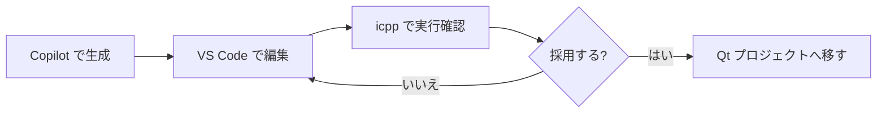
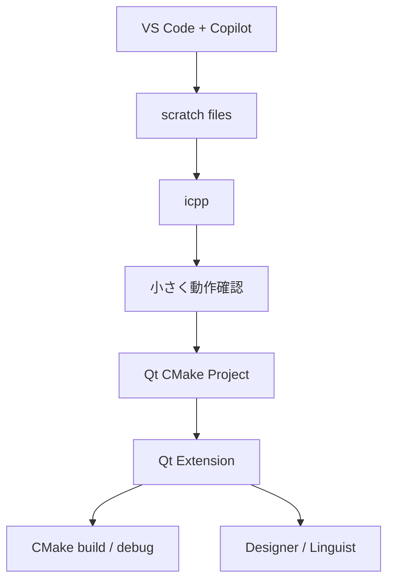
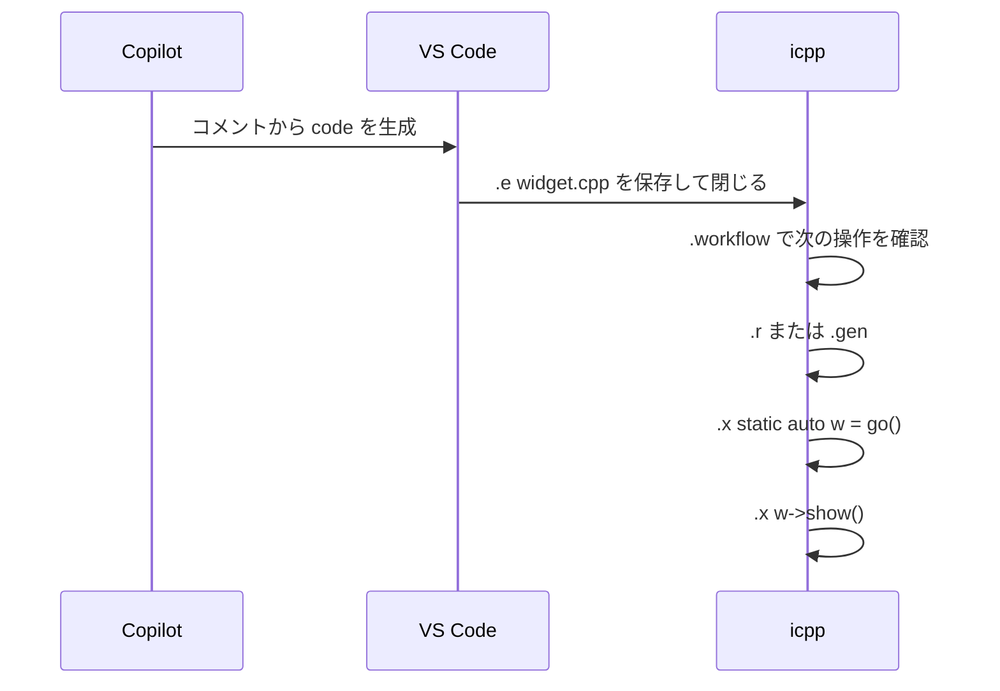

---
genpdf:
  Format: book
  Title: VS Code + Copilot で icpp を使うガイド
  Subtitle: Qt Extension と Copilot の横で C++ / Qt の小片をすぐ試す
  Author: (株) SRA
  version: 0.3.0
  page_numbers: true
---

<!-- page -->
!toc

<div class="page-break"></div>

<!-- page -->
# 1. このガイドの目的

このガイドは、VS Code、Qt Extension、GitHub Copilot を使って Qt / C++ のコードを書きながら、`icpp` で小さく動かして確認するための実践ガイドです。

`icpp` は VS Code の代替ではありません。VS Code + Qt Extension + Copilot は、Qt プロジェクトを書く環境です。`icpp` は、その横で C++ / Qt の小片をすぐ動かして確認する環境です。

| 作業 | VS Code + Qt Extension + Copilot | icpp |
|---|---|---|
| Qt プロジェクトを開く | 主担当 | 担当外 |
| CMake kit / build / debug | 主担当 | 担当外 |
| Qt / C++ コードを書く | 主担当 | 外部エディタとして利用 |
| Copilot でコード生成 | 主担当 | 担当外 |
| 小さな関数を即時実行 | 可能だがプロジェクト準備が必要 | 主担当 |
| QWidget 部品をすぐ表示 | 最小アプリが必要 | `go()` + `.x w->show()` |
| `.ui` / `.qrc` / `moc` の軽い確認 | 可能 | `.workflow` / `.gen` で補助 |
| 画面上の widget を調べる | デバッガ中心 | `.widgets` / `.inspect` |

VS Code + Copilot だけで済む作業は、そのまま VS Code で行います。`icpp` を足す価値があるのは、プロジェクトに入れる前の小さな試作、Qt API の挙動確認、GUI 部品の確認です。



# 2. 基本の役割分担

VS Code 側は「書く場所」、`icpp` 側は「試す場所」と考えます。

| 役割 | 使うもの | 補足 |
|---|---|---|
| 補完、生成、修正 | VS Code + Copilot | class や関数の skeleton を作る |
| Qt project の管理 | VS Code + Qt Extension | CMake、kit、build、debug |
| 実験用ファイルの編集 | VS Code | `ICPP_EDITOR="code --wait"` |
| 再評価 | icpp `.r` / `.gen` | interpreter を作り直して評価 |
| 次の操作確認 | icpp `.workflow` | `.gen` / `lrelease` / `.add` などを提案 |
| GUI 確認 | icpp `.x` / `.inspect` | widget を表示し property を見る |

`icpp` の作業単位は、完成したアプリではなく「試したい部品」です。大きな設計や本格デバッグは VS Code 側に残します。

<div class="page-break"></div>

# 3. VS Code の Qt 拡張

VS Code には Qt 公式の Qt Extension があります。Qt C++ 開発では、Qt C++ extension pack または Qt Extension Pack を使います。

主な役割は次の通りです。

| 機能 | Qt Extension 側の役割 |
|---|---|
| Qt installation の登録 | 使用する Qt を VS Code に知らせる |
| CMake kit の選択 | Qt に合った kit で build する |
| Qt 独自ファイルの補完 | `.ui`、`.qrc`、QML などを扱いやすくする |
| Qt Designer 連携 | Widgets UI を設計する |
| Qt Linguist 連携 | `.ts` を編集する |
| Qt documentation | VS Code から Qt docs を参照する |
| Debug | Qt 型を見やすくする |

`icpp` はこれらを置き換えません。`icpp` は Qt Extension で作る前、または作っている途中の小さな確認に使います。



# 4. 推奨ディレクトリ構成

プロジェクトの中、または隣に `scratch/` を作ると整理しやすくなります。

```text
my-project/
  CMakeLists.txt
  src/
  ui/
  scratch/
    widget.h
    widget.cpp
    form.ui
    resources.qrc
    app_ja.ts
```

`scratch/` のファイルは、採用前の試作用です。採用する場合は VS Code 側で本来の `src/` や `ui/` へ移し、CMake に追加します。

| ファイル | 用途 | icpp での扱い |
|---|---|---|
| `widget.h` | class 宣言 | `.e widget.h` |
| `widget.cpp` | class 実装と `go()` | `.add widget.cpp` |
| `form.ui` | Designer UI | `.designer form.ui` |
| `resources.qrc` | resource 入力 | `.qrc resources.qrc` |
| `app_ja.ts` | 翻訳入力 | `.linguist app_ja.ts` |

# 5. icpp から VS Code をエディタとして使う

`icpp` から VS Code を開くには、`code --wait` を使います。

```sh
export ICPP_EDITOR="code --wait"
```

`--wait` は、VS Code のウィンドウまたはタブを閉じるまでコマンドを戻さない指定です。これにより、`.e widget.cpp` で VS Code を開き、保存して閉じた後に `icpp` が再評価できます。

優先順は次の通りです。

| 優先順 | 変数 |
|---|---|
| 1 | `ICPP_EDITOR` |
| 2 | `VISUAL` |
| 3 | `EDITOR` |
| 4 | 既定値 `vim` |

VS Code と併用する場合は、引数なしの `.e` よりも実ファイルを指定する運用が向いています。

```text
icpp[qtcling]> .e widget.cpp
```

引数なしの `.e` は一時ファイルを開くため、エディタの履歴に `icpp_XXXXXX.cpp` のような名前が残ることがあります。実ファイルなら Copilot、検索、補完、履歴が自然に使えます。

<div class="page-break"></div>

# 6. Copilot に書かせるコメント

Copilot には、icpp で使う前提をコメントに書きます。特に `main()` を書かせないこと、`go()` を用意することが重要です。

## 6.1 基本形

```cpp
// Qt: QPushButton と QLabel を持つ QWidget クラスを作成する。
// button を押すたびに counter を増やし、label に表示する。
// class 名は Widget。ヘッダーと実装を分ける。
// main() は書かない。
// icpp から使うため Widget* go() を用意する。
```

## 6.2 Q_OBJECT を使う場合

```cpp
// Qt: Q_OBJECT と slot を使う QWidget クラスを作成する。
// class 名は Widget。widget.h と widget.cpp に分ける。
// widget.cpp の最後に #include "moc_widget.cpp" を書く。
// icpp では .gen で moc_widget.cpp を生成してから実行する。
// main() は書かない。Widget* go() を用意する。
```

## 6.3 .ui を使う場合

```cpp
// Qt: form.ui から生成される ui_form.h を使う QWidget クラスを実装する。
// widget.cpp で #include "ui_form.h" を使う。
// icpp では .designer form.ui で UI を編集し、.gen で ui_form.h を生成する。
// main() は書かない。Widget* go() を用意する。
```

## 6.4 .qrc を使う場合

```cpp
// Qt: resources.qrc に入れた message.txt を QLabel に表示する QWidget を作成する。
// widget.cpp で #include "qrc_resources.cpp" を使う。
// icpp では .qrc resources.qrc で resource を確認し、.gen で qrc_resources.cpp を生成する。
// main() は書かない。Widget* go() を用意する。
```

Copilot が通常の Qt アプリ前提で `QApplication app(argc, argv);` や `main()` を生成した場合は、icpp 用の試作では削除します。

# 7. 最小ワークフロー

最初は、`widget.h` と `widget.cpp` を作って試します。

```text
icpp[qtcling]> .e widget.h
icpp[qtcling]> .e widget.cpp
icpp[qtcling]> .files
icpp[qtcling]> .workflow
icpp[qtcling]> .r
icpp[qtcling]> .x static auto w = go();
icpp[qtcling]> .x w->show();
```

`Q_OBJECT`、`.ui`、`.qrc` がある場合は `.r` の代わりに `.gen` を使います。

```text
icpp[qtcling]> .workflow
icpp[qtcling]> .gen
icpp[qtcling]> .x static auto w = go();
icpp[qtcling]> .x w->show();
```



<div class="page-break"></div>

# 8. QWidget 部品を試す

GUI 部品は、`go()` で widget を作り、`.x` で表示します。

```text
icpp[qtcling]> .x static auto w = go();
icpp[qtcling]> .x w->show();
icpp[qtcling]> .x w->raise();
```

よく試す部品は次の通りです。

| 部品 | 確認すること |
|---|---|
| `QPushButton` + `QLabel` | click で表示が変わる |
| `QSlider` + `QLabel` | valueChanged が反映される |
| `QLineEdit` | textChanged の扱い |
| `QComboBox` | currentIndexChanged の扱い |
| `QTableWidget` | 行列の表示 |
| custom QWidget | paintEvent や sizeHint |

画面に出した後は `.inspect` が便利です。

```text
icpp[qtcling]> .inspect
```

`.inspect` は top-level widget を選び、property と object tree を確認できます。Copilot が生成した objectName、layout、sizePolicy が意図通りかを見ます。

# 9. .ui を使う

`.ui` は Qt Designer で編集します。

```text
icpp[qtcling]> .designer form.ui
```

Designer で保存したら、`.uiinfo` で配置された widget を確認できます。

```text
icpp[qtcling]> .uiinfo form.ui
class: Form
base: QWidget

widgets:
  QWidget      Form
  QPushButton  okButton
  QLabel       titleLabel
```

Copilot には、`ui_form.h` の objectName を前提に実装させます。

```cpp
// form.ui には okButton と titleLabel がある。
// Widget constructor で ui->setupUi(this) し、
// okButton clicked で titleLabel の text を変更する。
```

生成と実行は `.gen` です。

```text
icpp[qtcling]> .add widget.cpp
icpp[qtcling]> .gen
icpp[qtcling]> .x static auto w = go();
icpp[qtcling]> .x w->show();
```

`.preview form.ui` は C++ 実装なしで `.ui` の見た目だけを確認したいときに使います。

```text
icpp[qtcling]> .preview form.ui
```

# 10. .qrc と translation を使う

resource は `.qrc` を編集し、`.gen` で `qrc_*.cpp` を作ります。

```text
icpp[qtcling]> .qrc resources.qrc
icpp[qtcling]> .workflow
icpp[qtcling]> .gen
```

translation では、`.gen` は `lrelease` を実行しません。`.ts` から `.qm` を作る操作は `.!` で明示します。

```text
icpp[qtcling]> .! lupdate widget.cpp -ts app_ja.ts
icpp[qtcling]> .linguist app_ja.ts
icpp[qtcling]> .! lrelease app_ja.ts
icpp[qtcling]> .qrc translations.qrc
icpp[qtcling]> .workflow
icpp[qtcling]> .gen
```

生成物の状態は `.generated` で確認できます。

```text
icpp[qtcling]> .generated
```

やり直したい場合は `.clean` を使います。削除前に対象一覧が出ます。

```text
icpp[qtcling]> .clean
```

<div class="page-break"></div>

# 11. 複数ファイルを扱う

複数ファイルは `.add` で登録します。

```text
icpp[qtcling]> .add model.cpp
icpp[qtcling]> .add widget.cpp
icpp[qtcling]> .files
```

`.r` は `.files` の表示順に評価します。依存される側を先にします。

```text
1  /path/to/model.cpp
2  /path/to/widget.cpp
```

順番を変えたい場合は `.r edit` を使います。

```text
icpp[qtcling]> .r edit
```

エディタに次のような内容が出ます。

```text
# 登録ファイルの順番を編集します。1 行に 1 ファイルパスを書いてください。
# # で始まる行と空行は無視します。
# 保存して閉じると、この順番で .r を実行します。

/path/to/model.cpp
/path/to/widget.cpp
```

保存して閉じると、順番を検証してから再実行します。未登録ファイル、重複、不足がある場合は、順番を変更せず再実行もしません。

定義の確認には `.defs` を使います。

```text
icpp[qtcling]> .defs
```

# 12. Copilot 生成コードのよくある修正

Copilot は通常の Qt アプリとして自然なコードを生成することがあります。icpp で試す場合は、次の点を直します。

| 生成されがちなもの | icpp での修正 |
|---|---|
| `main()` | 削除し、`Widget* go()` を用意する |
| `QApplication app(argc, argv)` | 削除する。qtcling 側の application を使う |
| stack 上の widget | `go()` では `new Widget` を返す |
| `deleteLater()` の多用 | 試作ではまず表示と操作を優先する |
| `.ui` の objectName と C++ が違う | `.uiinfo` で確認して修正する |
| `Q_OBJECT` なのに moc include がない | `#include "moc_widget.cpp"` を追加し `.gen` |
| include 不足 | エラーを見て必要な Qt header を追加する |

icpp 用の `go()` は、試作用の入口です。本番コードへ移すときは残すか削除するか判断します。

# 13. 採用するコードを本番プロジェクトへ移す

icpp で確認したコードを採用する場合は、VS Code 側で本番のディレクトリへ移します。

```text
scratch/widget.h   -> src/widget.h
scratch/widget.cpp -> src/widget.cpp
scratch/form.ui    -> ui/form.ui
```

その後、CMake に追加し、VS Code + Qt Extension 側で build / debug します。

| 試作側 | 本番側で確認すること |
|---|---|
| `go()` | 残す必要があるか |
| `#include "moc_widget.cpp"` | 通常プロジェクトでは不要な場合がある |
| `qrc_*.cpp` include | CMake の resource 管理へ移すか |
| hard-coded path | 本番用の resource / setting に置き換える |
| temporary objectName | Designer 側で整理する |

`icpp` は採用判断までを短くする道具です。本番化の最後は、VS Code + Qt Extension の build / debug で確認します。

<div class="page-break"></div>

# 14. 使わない方がよい場面

`icpp` は万能ではありません。次の作業は VS Code + Qt Extension、Qt Creator、通常の build system で行います。

| 場面 | 理由 |
|---|---|
| 大きなアプリ全体の設計 | REPL の粒度を超える |
| 本格デバッグ | debugger の方が適している |
| 複雑な CMake 条件 | build system で確認するべき |
| production code の直接編集 | review / test / build の流れが必要 |
| 長時間動くアプリ状態の検証 | 通常実行の方が安全 |

`icpp` は「必ず使うもの」ではありません。VS Code + Copilot だけで済むなら、それで十分です。小さく動かして確認したいときに使います。

# 15. チートシート

## 15.1 VS Code 設定

```sh
export ICPP_EDITOR="code --wait"
```

## 15.2 Copilot コメント

```cpp
// main() は書かない。
// icpp から使うため Widget* go() を用意する。
// Q_OBJECT を使う場合は widget.cpp の最後に #include "moc_widget.cpp" を書く。
```

## 15.3 icpp コマンド

| コマンド | 用途 |
|---|---|
| `.e <file>` | VS Code で実ファイルを編集 |
| `.add <file>` | `.r` / `.gen` の評価対象に登録 |
| `.files` | 登録順を確認 |
| `.r` | 登録ファイルと編集バッファを再評価 |
| `.r edit` | 登録順をエディタで変更して再評価 |
| `.gen` | `run_all` 後に再評価 |
| `.workflow` | 次の操作候補を見る |
| `.generated` | 生成物一覧を見る |
| `.clean` | 生成物を確認して削除 |
| `.template <kind> [base]` | ひな形ファイルを作成 |
| `.defs` | 定義一覧を見る |
| `.x <code>` | 編集バッファに残さず実行 |
| `.a <code>` | 実行して編集バッファにも追加 |
| `.uiinfo <file.ui>` | `.ui` の widget 一覧を見る |
| `.preview <file.ui>` | `.ui` を直接プレビュー |
| `.inspect` | 表示中 widget の property を見る |

## 15.4 最短手順

```text
icpp[qtcling]> .e widget.h
icpp[qtcling]> .e widget.cpp
icpp[qtcling]> .workflow
icpp[qtcling]> .gen
icpp[qtcling]> .x static auto w = go();
icpp[qtcling]> .x w->show();
icpp[qtcling]> .inspect
```
