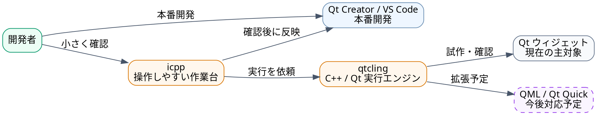

---
genpdf:
  Format: slides
  Title: icpp と qtcling 紹介資料
  Subtitle: Qt/C++ 開発の確認・試作・学習を軽くするツールセット
  Author: (株) SRA
  Date: 2026-06-01
  Page_Numbers: true
---

<!-- slide -->
<h1 align="center">icpp と qtcling</h1>

---

## 紹介資料

- Qt/C++ 開発の「ちょっと試したい」を速くする
- 現在は Qt ウィジェット向けの確認・試作に対応
- 今後 QML / Qt Quick への対応を予定
- 対応プラットフォームは macOS / Linux / Windows WSL2
- GUI を表示した後も、その場で C++ コードを実行して確認できる

<!-- slide -->

<h1 align="center">この資料で伝えたいこと</h1>

---

`icpp` と `qtcling` は、Qt/C++ 開発の確認・試作・学習を軽くするツールセットです。

## 一言でいうと

- `qtcling`: C++ / Qt を対話的に実行する環境
- `icpp`: `qtcling` を実務で使いやすくする作業支援ツール
- GUI 確認環境: ウィジェットを表示した後もその場で C++ コードを実行して確認できる

!callout{type=note title=説明の要点}
  Qt/C++ 開発者が、プロジェクトを作らずに小さなコードやウィジェットの動きをすぐ試せるようにする道具です。

<!-- slide -->

<h1 align="center">全体像</h1>

---

!dot{align=center scale=0.78}

!callout{type=note title=図の読み方}
  IDE は本番開発、icpp と qtcling は確認・試作の作業環境として横に置きます。

<!-- slide -->

<h1 align="center">開発現場の課題</h1>

---

C++ / Qt は、少し動きを確認するだけでも準備が重くなりがちです。

## よくある手間

- プロジェクトを作る
- CMake やキットを設定する
- ビルドを待つ
- 小さな確認用コードを本番側へ混ぜてしまう

<!-- slide -->

<h1 align="center">使う利点</h1>

---

`icpp` と `qtcling` を使うと、小さな確認をその場で実行できます。

## 開発者にとっての効果

- Qt API の動作をすぐ確認できる
- `QString`、`QVariant`、`QWidget` などを短いコードで試せる
- 本番プロジェクトを汚さずに試作できる
- 小さなコードの動作を短いサイクルで確認できる
- Qt Creator / VS Code の横で試作用ワークベンチとして使える

<!-- slide -->

<h1 align="center">現在の対象</h1>

---

現在は主に Qt ウィジェット向けの C++ / Qt 確認に対応しています。

## 向いている用途

- Qt API の挙動確認
- `QWidget` 部品の小さな試作
- 画面部品のプロパティー確認
- 小さな関数や変換処理の検証
- 研修や学習での Qt/C++ 実験

<!-- slide -->

<h1 align="center">対応プラットフォーム</h1>

---

`icpp` と `qtcling` は、複数の開発環境で使えることを前提にしています。

## 対応対象

| プラットフォーム | 位置づけ |
|---|---|
| macOS | 対応 |
| Linux | 対応 |
| Windows WSL2 | 対応 |

!callout{type=note title=説明の要点}
  Windows WSL2 は、Windows 上の WSL2 環境を対象とします。利用者の開発環境に合わせて、macOS、Linux、Windows WSL2 の各環境で使えることを示します。

<!-- slide -->

<h1 align="center">今後の予定</h1>

---

今後は QML / Qt Quick への対応を予定しています。

## 広がる価値

- Qt Quick 部品を小さく試す
- QML と C++ の連携を確認する
- Qt ウィジェットだけでなく Qt UI 開発全体を支援する
- 既存 Qt 資産と新しい UI 開発の両方で使える方向へ広げる

!callout{type=important title=説明の要点}
  まず Qt ウィジェット開発者の試行錯誤を速くし、将来的に QML / Qt Quick まで支援範囲を広げる計画です。

<!-- slide -->

<h1 align="center">qtcling とは</h1>

---

`qtcling` は、C++ と Qt を対話的に実行できる環境です。

## 役割

- C++ の式や関数をその場で実行する
- Qt の型や API をすぐ試す
- 小さなコードをコンパイル済みアプリなしで確認する

## 要約

`qtcling` は、Qt/C++ をすぐ試せる実行エンジンです。

<!-- slide -->

<h1 align="center">icpp とは</h1>

---

`icpp` は、`qtcling` / `cling` の対話実行を実務で使いやすくする作業支援ツールです。

## 役割

- 複数行の C++ コードを編集しやすくする
- ファイルを登録して再実行しやすくする
- Qt の型やウィジェットを確認しやすくする
- 表示中のオブジェクトを調べ、プロパティーを確認しやすくする
- 外部エディタやクリップボードと連携する

## 要約

`icpp` は、試行錯誤を続けやすくする作業台です。

<!-- slide -->

<h1 align="center">icpp の GUI 支援機能</h1>

---

`icpp` は、表示した Qt オブジェクトを見ながら確認を続けるための機能を持っています。

## 画面を見ながら確認

- オブジェクトの状態と連動したプロパティーエディター
- オブジェクトリストで、表示中のウィジェットを一覧表示
- ピッカーで、画面上の対象オブジェクトを直接選択
- 選んだオブジェクトのプロパティーや状態を確認

!callout{type=note title=説明の要点}
  コードだけでなく、実際に表示されている GUI 部品を対象にして確認できることが特徴です。

<!-- slide -->

<h1 align="center">icpp の作業支援機能</h1>

---

`icpp` は、確認用コードを扱いやすくするためのファイル管理とコマンド群を備えています。

## ファイルの編集と管理

- 外部エディタでファイルや入力バッファを編集
- 複数ファイルを登録し、決まった順番で再実行
- `.ui`、`.qrc`、翻訳ファイルなど Qt 関連ファイルの編集を支援
- 生成物の確認や再生成を短いコマンドで実行
- Qt Designer や Qt Linguist と組み合わせた確認にも使える

!callout{type=note title=説明の要点}
  小さな確認用コードを、使い捨てではなく管理しながら繰り返し試せるようにします。

<!-- slide -->

<h1 align="center">icpp のコマンド群</h1>

---

`icpp` は、確認・編集・再実行・診断を短く行うために、50 以上のコマンドを備えています。

## コマンド例

- `.e`: ファイルや入力バッファを編集
- `.run`: 登録ファイルと入力内容を再実行
- `.gen`: `moc`、`uic`、`rcc` など Qt 関連の生成処理を行ってから再実行
- `.p`: 式の値を表示
- `.ptype`: 式の C++ / Qt 型を確認
- `.widgets`: 表示中のウィジェットを一覧表示
- `.inspect`: 表示中のウィジェットをプロパティーエディターで確認
- `.uiinfo`: `.ui` ファイル内のオブジェクト名を確認
- `.doctor`: インタープリター、Qt ツール、作業ディレクトリを確認

<!-- slide -->

<h1 align="center">icpp と qtcling の関係</h1>

---

| 役割 | 担当 |
|---|---|
| C++ / Qt を実行する | `qtcling` |
| 実務で使いやすく操作する | `icpp` |
| 本番開発を行う | Qt Creator / VS Code |

## 位置づけ

- `qtcling` が実行エンジン
- `icpp` が操作しやすい作業環境
- IDE は本番開発の中心

<!-- slide -->

<h1 align="center">利用シーン</h1>

---

## 利用者の課題に合う場面

- Qt API の動作を確認したい
- ウィジェット部品を小さく作って試したい
- 本番コードへ入れる前に関数を検証したい
- 既存コードの型や動きを理解したい
- 外部から得たコード例を軽く確認したい

<!-- slide -->

<h1 align="center">GUI 部品の確認ワークフロー</h1>

---

ウィジェット部品は、見た目と状態を実際に表示して確認することで判断しやすくなります。

## 短いサイクルで確認

- `QWidget` を作る
- 表示する
- プロパティーや状態をその場で確認する
- 必要な修正を小さく試す
- 確認できた内容を本番プロジェクトへ戻す

<!-- slide -->

<h1 align="center">近いものとの違い</h1>

---

GUI を表示したまま、入力と実行を繰り返して確認を続ける考え方には近い先例があります。

## IPython + `%gui qt` + PyQt / PySide

- 近い点: Qt のイベントループと対話的な確認を共存できる
- 違う点: Python / Qt の環境であり、C++ / Qt ではない

## Smalltalk / Morphic

- 近い点: 表示中の GUI オブジェクトを生きたまま操作できる
- 違う点: Smalltalk のライブ環境であり、Qt / C++ ではない

!callout{type=important title=位置づけ}
  Qt/C++ で GUI を表示した後も対話的な確認を続けられる作業環境は、調査した範囲では `icpp + qtcling` のほかに確認できていません。

<!-- slide -->

<h1 align="center">IDE との使い分け</h1>

---

`icpp` は Qt Creator や VS Code の代替ではありません。

| 作業 | 主に使うもの |
|---|---|
| 本番プロジェクト編集 | Qt Creator / VS Code |
| ビルド、デバッグ、リリース | Qt Creator / VS Code |
| 小さな API 確認 | `icpp` + `qtcling` |
| ウィジェット部品の試作 | `icpp` + `qtcling` |
| コード例の軽い動作確認 | `icpp` + `qtcling` |

<!-- slide -->

<h1 align="center">想定利用者</h1>

---

## 対象となる利用者

- Qt/C++ 開発チーム
- Qt ウィジェットの既存資産を持つ企業
- Qt の教育・研修を行う部門
- Qt Creator や VS Code を日常的に使う開発者

<!-- slide -->

<h1 align="center">利用者価値</h1>

---

## 期待できる効果

- 試行錯誤の時間を短くする
- Qt/C++ の学習を軽くする
- 本番プロジェクトを汚さずに確認できる
- コード例や試作品の確認をしやすくする
- ウィジェットから QML / Qt Quick へ広げる余地がある

!callout{type=note title=要点}
  開発者が手元で素早く確認できる環境を用意し、Qt/C++ 開発の小さな待ち時間を減らします。

<!-- slide -->

<h1 align="center">デモで見せる内容</h1>

---

## 短時間で見せやすい例

- `QString` や `QVariant` の挙動確認
- `.ptype` による型確認
- 小さな関数をエディタで編集して再実行
- `QWidget` を生成して表示
- ウィジェットのプロパティーや状態を確認
- プロパティーエディターで状態変更を確認
- ピッカーで画面上のオブジェクトを選択

## 見せ方

「プロジェクト作成なしで、ここまで試せる」ことを強調します。

<!-- slide -->

<h1 align="center">注意点</h1>

---

`icpp` と `qtcling` は、開発補助ツールです。

## 置き換えないもの

- 本格 IDE
- ビルドシステム
- デバッガ
- 本番テスト環境
- リリース工程

## 正しい位置づけ

本番開発の横に置く、確認・試作・学習用の作業環境です。

<!-- slide -->

<h1 align="center">まとめ</h1>

---

## 伝えるべき結論

- `qtcling` は Qt/C++ をその場で試す実行環境
- `icpp` はそれを実務で使いやすくする作業支援ツール
- 現在は Qt ウィジェット向けの確認・試作に有効
- 今後 QML / Qt Quick 対応を予定
- Qt/C++ 開発の確認・試作・学習を軽くできる

!callout{type=important title=最後の一言}
  Qt/C++ 開発者の「ちょっと試したい」を速くするツールセットです。
