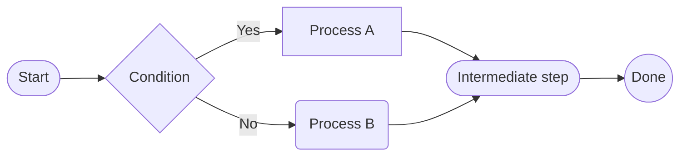
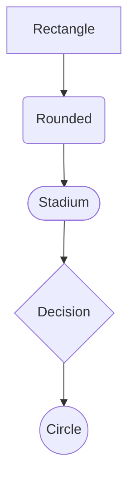
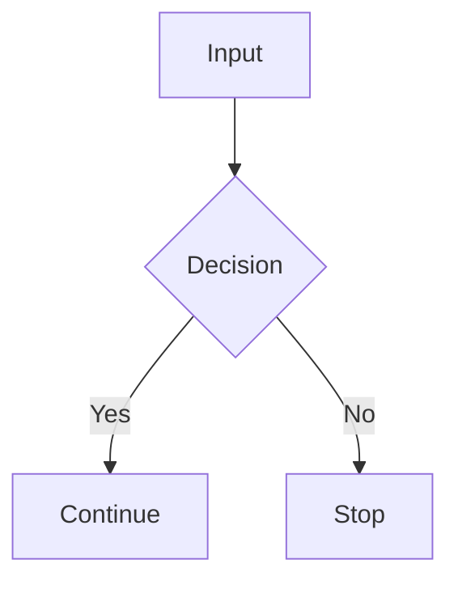
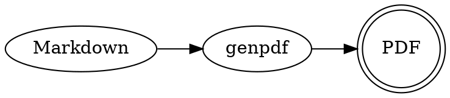
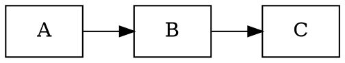
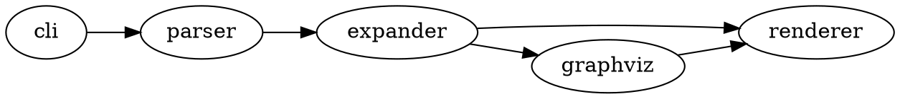
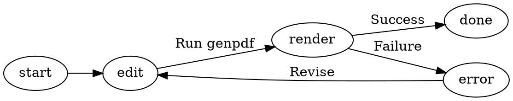

---
genpdf:
  format: book
  title: GenPDF User Guide
  subtitle: Essential usage and syntax
  author: SRA, Inc.
  copyright: 2026 Software Research Associates, Inc.
  page_numbers: true
---

# Overview

`genpdf` converts existing Markdown to PDF without extensive rewriting.
The `book` format creates documents with a cover; `slides` creates landscape A4 slides.

This guide covers:

- Installation and runtime requirements
- Basic commands
- Front matter settings
- Custom directives
- Currently included samples

# Installation

Requirements:

- Python 3.11 or later
- Node.js
- `node` and `npx` on PATH
- Access to the npm registry on first use
- `genpdf`
- `pypdf`

Basic installation:

```sh
python -m pip install pypdf
python -m pip install -e .
```

Verify:

```sh
genpdf -h
genpdf --help
node --version
npx --version
```

Internally, `genpdf` uses `md-to-pdf`, normally through `npx --yes md-to-pdf`.
You do not need to install `md-to-pdf` beforehand. The first run needs a network
connection for `npx` to fetch it. To install it locally, run this in the project:

```sh
npm install md-to-pdf
```

Documents using `!footer{...}` require `pypdf` for PDF merging:

```sh
python -m pip install pypdf
```

# Basic Commands

```sh
genpdf /path/to/doc.md
genpdf --format book /path/to/book.md
genpdf --format slides /path/to/slides.md
genpdf --output /path/to/out.pdf /path/to/doc.md
genpdf -T
genpdf --front-matter-template
```

Basic behavior:

- The default format is `book`.
- By default, the output is `*.pdf` beside the input Markdown.
- `genpdf` settings are read from the initial YAML front matter.
- Specify document-specific metadata in front matter.
- `-T` / `--front-matter-template` prints a front matter template and exits without requiring input Markdown.
- `-h` shows brief everyday help; `--help` shows detailed help including deprecated options.

These CLI options remain for backward compatibility but are deprecated and produce warnings:

- `--title`
- `--subtitle`
- `--author`
- `--copyright`
- `--page-numbers` / `--no-page-numbers`
- `--font-size`
- `--date`

# Front Matter

Place YAML front matter at the start of Markdown to embed PDF settings.

Print a template containing all available settings with:

```sh
genpdf -T
```

```yaml
---
genpdf:
  format: slides
  title: |-
    Qt for Python
    Introduction
  subtitle: |-
    Version 1.0
    Basic operations
  author: SRA, Inc.
  version: 1.0
  date: 2026-04-13
  font_size: 24pt
  page_numbers: true
  copyright: 2026 Example, Inc.
  background:
    image: company-watermark.svg
    target: all
    size: contain
    position: center
    repeat: no-repeat
    opacity: 0.08
  table:
    header_background: "#e8f1ff"
    header_color: "#1f2937"
    border_color: "#cbd5e1"
    border_width: "1px"
    stripe: true
    stripe_background: "#f8fafc"
    compact: false
    align: left
    header_align: center
    cell_align: left
---
```

`title:` and `subtitle:` support multiline values with `|-`. Line breaks are
preserved in the same positions on the cover.

Available settings:

- `format`
- `title`
- `subtitle`
- `author`
- `version`
- `date`
- `font_size`
- `page_numbers`
- `copyright`
- `background`
- `table`

Notes:

- Keys are case-insensitive.
- `version:` appears on the cover in a form such as `Version 1.0`.
- `copyright:` may also be specified at the front matter's top level.
- An empty `date:` hides the date.
- Omitting `date` uses the current date at execution time.

## Background Images

Use `genpdf.background` for an image shared by all pages, such as a company
watermark or common logo.

```yaml
---
genpdf:
  background:
    image: company-watermark.svg
    target: all
    size: contain
    position: center
    repeat: no-repeat
    opacity: 0.08
---
```

Available settings:

- `image`: Filename in `background-images/`; paths are not accepted.
- `target`: Target pages; currently only `all` is supported.
- `size`: CSS `background-size`, such as `contain`, `cover`, or `72%`.
- `position`: CSS `background-position`, such as `center` or `right bottom`.
- `repeat`: `no-repeat` / `repeat` / `repeat-x` / `repeat-y`.
- `opacity`: Image opacity from `0` to `1`.

Notes:

- For company watermarks, `opacity` around `0.05` to `0.12` is a useful readability guideline.
- Strong background images reduce the readability of text and tables.
- Only local images are supported.

# Page Breaks

```html
<div class="page-break"></div>
```

- Supported in both `book` and `slides`.
- Documents using `!footer{...}` are expected to define page boundaries explicitly.

# Body Font Size

Set the document-wide body size in front matter:

```yaml
---
genpdf:
  font_size: 24pt
---
```

- Bare numbers are treated as `pt`.
- Page titles at `#` level are unaffected.
- Body headings at `##` and below are affected.
- Paragraphs, lists, tables, quotes, code, and callout bodies are affected.
- Footer size is unaffected.

Override for an individual page:

```md
!font-size{32pt}
```

- Changes the body size only on that page.
- Page-level settings override the document-wide setting.

# Table Customization

Use `genpdf.table` in front matter. There are no corresponding CLI options.

```yaml
---
genpdf:
  table:
    header_background: "#e8f1ff"
    header_color: "#1f2937"
    border_color: "#cbd5e1"
    border_width: "1px"
    stripe: true
    stripe_background: "#f8fafc"
    cell_padding: "0.45em 0.65em"
    font_size: "0.95em"
    compact: false
    header_align: center
    cell_align: left
---
```

Available settings:

- `header_background`: Header-cell background color
- `header_color`: Header text color
- `border_color`: Border color
- `border_width`: Border width
- `stripe`: Whether to color alternate (even-numbered) rows
- `stripe_background`: Background color for even-numbered rows
- `cell_padding`: Cell padding
- `font_size`: Font size applied only to tables
- `compact`: Simple compact-layout switch
- `align`: Header and body alignment together: `left` / `center` / `right`
- `header_align`: Header alignment: `left` / `center` / `right`
- `cell_align`: Body-cell alignment: `left` / `center` / `right`

Alignment example:

```yaml
---
genpdf:
  table:
    header_align: center
    cell_align: left
---
```

- `header_align` applies only to headers.
- `cell_align` applies only to body cells.
- `align` continues to apply to both.
- `header_align` / `cell_align` take precedence when specified together with `align`.

# Book Features

## `!toc`

```md
!toc
```

- Expands a static table of contents at that position.
- Available only in `book` format.

# Slides Features

## Slide Titles and Subtitles

Place a paragraph with class `slide-subtitle` immediately after the main title
to display a centered subtitle. A thin horizontal rule below the subtitle
separates the title area from the body.

```html
<h1 align="center">Introduction and overview</h1>
<p class="slide-subtitle">Purpose and use cases</p>
```

- Use the existing `<h1 align="center">...` as the main title.
- Omit `<p class="slide-subtitle">...` on slides without a subtitle.

## `!pause`

```md
Content shown first

!pause

Content shown next
```

- Creates a duplicate slide showing content up to that point.
- Available only in `slides` format.

## `!incremental-list`

```md
!incremental-list
- Item 1
- Item 2
- Item 3
```

- Creates duplicate slides that reveal list items one at a time.
- Available only in `slides` format.
- May be used only once per page.

## `!cover-image`

```md
!cover-image{path=images/hero.png alt=Overview caption=Architecture width=82%}
```

- Places an image intended for prominent display.
- `path=` is required.
- Supports `alt=`, `caption=`, and `width=`.

## `!svg`

```md
!svg{path=images/vu-background.svg alt=VU-meter caption=VU-meter width=72% align=center}
```

- Places an SVG file as a `<figure>`.
- `path=` is required.
- Supports `alt=`, `caption=`, `width=`, and `align=`.
- `align=` accepts `left` / `center` / `right`.
- Useful for reusable vector components such as VU meters and keyboards.

# Shared Directives

## `!callout`

```md
!callout{type=warning title=Warning}
  This operation cannot be undone.
```

- `type=` accepts `note` / `warning` / `success` / `important`.
- Indent the body on subsequent lines.

## `!fit-code`

````md
!fit-code
```python
print("hello")
```
````

- Displays the immediately following fenced code block at a smaller size.

## `!columns`

````md
!columns
:::column
Left column content
:::
:::column
Right column content
:::
!end-columns
````

- Creates layouts with two or more columns.
- `!columns{divider}` adds vertical lines between columns.

## Mermaid Fenced Code Blocks

````md

````

- Embeds Mermaid diagrams in the body.
- Supported in both `book` and `slides`.
- Change node shapes with `[]`, `()`, `([ ])`, `{}`, and `(( ))`.
- Place `!mermaid{align=left}`, `center`, or `right` immediately before the block to set alignment.
- Scale diagrams with settings such as `!mermaid{scale=0.8}`; the default is `1`.
- A local `mermaid` package takes precedence; otherwise it loads from a CDN.
- For reliable offline use, run `npm install mermaid`.

Node shape examples:

````md

````

Right-aligned example:

````md
!mermaid{align=right}

````

Scaled-down example:

````md
!mermaid{align=right scale=0.8}

````

## Graphviz DOT Fenced Code Blocks

````md

````

- Embeds Graphviz DOT diagrams in the body.
- Supported in both `book` and `slides`.
- Converts diagrams to SVG with `dot -Tsvg` before PDF generation.
- Requires Graphviz's `dot` command on PATH.
- Place `!dot{align=left}`, `center`, or `right` immediately before the block to set alignment.
- Scale diagrams with settings such as `!dot{scale=0.8}`; the default is `1`.
- GitLab Markdown does not necessarily render `` ```dot `` as a diagram.

Right-aligned example:

````md
!dot{align=right scale=0.8}

````

Dependency diagram example:

````md

````

State transition diagram example:

````md

````

### DOT Rendering on GitLab

`genpdf` runs `dot -Tsvg` locally to convert DOT blocks to SVG.
GitLab does not run your local `dot` command when displaying `.md` files.

GitLab's documentation lists Mermaid, PlantUML, and Kroki as ways to generate
diagrams from Markdown. GitLab.com supports Mermaid, but `` ```dot `` is likely
to be treated as a code block rather than a diagram.

To display Graphviz DOT diagrams on GitLab, consider:

- GraphViz through Kroki on a GitLab Self-Managed instance with Kroki enabled
- Converting to SVG / PNG first and embedding it as a normal Markdown image
- Using Mermaid for diagrams whose GitLab rendering is the priority

References:
[GitLab Flavored Markdown](https://docs.gitlab.com/user/markdown/),
[Kroki](https://docs.gitlab.com/administration/integration/kroki/)

## `!include-code`

```md
!include-code{path=src/main.py lang=python}
!include-code{path=src/main.py lang=python lines=10-30}
```

- Includes code from a specified file.
- Relative paths are resolved from the Markdown file's directory.
- Use `lines=` to select a range.

## `!notes`

```md
!notes{Additional notes for this point}

!notes{
Additional notes for this point
The next line belongs to the same note
}
```

- Not shown in the PDF body.
- Written to `*.notes.md` beside the output PDF.
- May appear multiple times on the same page.

# Footers and Page Numbers

## Per-Page Footer

```md
Body text

!footer{Confidential}
```

- Appears in the PDF footer area on that page only.
- Place it at the end of the page, immediately before the page break.
- Cannot be combined with `genpdf.copyright`.

## Shared Copyright Footer

```yaml
---
copyright: 2026 Example, Inc. All rights reserved.
genpdf:
  copyright: 2026 Example Override
---
```

- Appears on the left of the footer on every page.
- Automatically prefixed with `© `.
- `genpdf.copyright` takes precedence if both it and top-level `copyright:` are present.

## Page Numbers

Set `genpdf.page_numbers: true` in the initial YAML front matter to show page
numbers on the right of the footer.

```yaml
---
genpdf:
  page_numbers: true
---
```

- Appears on the footer's right side.
- Can coexist with a shared footer or `!footer{...}`.
- Set `genpdf.page_numbers: false` or omit it to hide page numbers.

# Relative Paths

Paths are resolved relative to the Markdown file for:

- Markdown images
- `!cover-image` images
- `!svg` images
- `!include-code` source files

Example:

```md

!include-code{path=src/main.py lang=python}
!svg{path=images/vu-background.svg alt=VU-meter}
```

For `/work/specs/guide.md`, these refer to:

- `/work/specs/images/overview.png`
- `/work/specs/src/main.py`
- `/work/specs/images/vu-background.svg`

# Included Samples

- `examples/book.md`: Document sample
- `examples/slides.md`: Slide sample

# Notes

- Initial YAML front matter is not included in the PDF body.
- Documents using `!footer{...}` require `pypdf`.
- `!incremental-list` may shift positions depending on the layout.
- Missing startup dependencies are identified in error messages.
