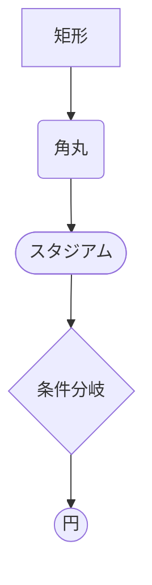
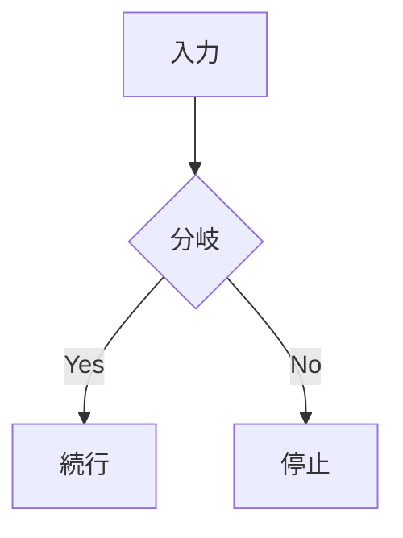
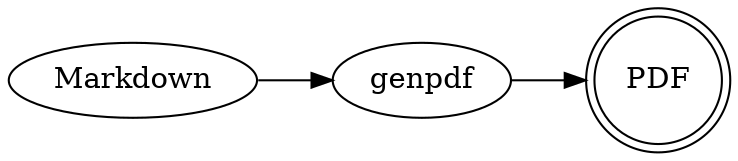
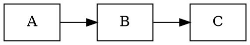
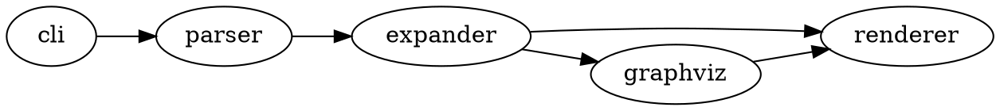
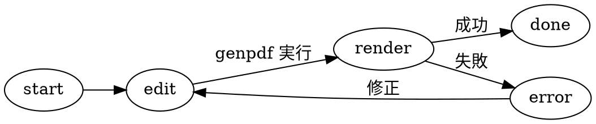

---
genpdf:
  format: book
  title: GenPDF ユーザーガイド
  subtitle: 運用と記法の要点
  author: (株) SRA
  copyright: 2026 Software Research Associates, Inc.
  page_numbers: true
---

# 概要

`genpdf` は既存の Markdown を大きく書き換えずに PDF 化するためのツールです。  
`book` 形式では表紙付き文書、`slides` 形式では A4 横長スライドを作成できます。

このガイドでは次を扱います。

- インストールと実行前提
- 基本的なコマンド
- front matter の設定項目
- 各独自ディレクティブの使い方
- 現在同梱されているサンプル

# インストール

必要なもの:

- Python 3.11 以降
- Node.js
- `node` と `npx` が PATH に通っていること
- 初回実行時に npm レジストリへアクセスできること
- `genpdf` 本体
- `pypdf`

基本の導入:

```sh
python -m pip install pypdf
python -m pip install -e .
```

確認:

```sh
genpdf -h
genpdf --help
node --version
npx --version
```

`genpdf` は内部で `md-to-pdf` を使います。通常は `npx --yes md-to-pdf` で実行されます。  
そのため、利用者が `md-to-pdf` を事前インストールする必要はありません。  
初回実行時は `npx` による取得が走るため、ネットワーク接続が必要です。  
ローカルへ固定したい場合は、このプロジェクトで次を実行します。

```sh
npm install md-to-pdf
```

`!footer{...}` を使う文書では PDF 結合のために `pypdf` が必要です。

```sh
python -m pip install pypdf
```

# 基本コマンド

```sh
genpdf /path/to/doc.md
genpdf --format book /path/to/book.md
genpdf --format slides /path/to/slides.md
genpdf --output /path/to/out.pdf /path/to/doc.md
genpdf -T
genpdf --front-matter-template
```

基本動作:

- 既定の書式は `book`
- 出力先は既定で入力 Markdown と同じ場所の `*.pdf`
- 先頭 YAML front matter の `genpdf` 設定を読める
- 文書固有のメタ情報は front matter で指定する
- `-T` / `--front-matter-template` は入力 Markdown なしで front matter テンプレートを標準出力して終了する
- `-h` は通常利用向けの短いヘルプ、`--help` は非推奨オプションも含む詳細ヘルプを表示する

次の CLI オプションは後方互換性のため動作しますが、非推奨です。指定すると警告を出します。

- `--title`
- `--subtitle`
- `--author`
- `--copyright`
- `--page-numbers` / `--no-page-numbers`
- `--font-size`
- `--date`

# Front Matter

Markdown 先頭に YAML front matter を置くと、PDF 化時の設定を埋め込めます。

指定できる項目をすべて含むテンプレートは、次のコマンドで標準出力できます。

```sh
genpdf -T
```

```yaml
---
genpdf:
  format: slides
  title: |-
    Qt for Python
    入門
  subtitle: |-
    1.0 版
    基本操作
  author: (株) SRA
  version: 1.0
  date: 2026-04-13
  font_size: 24pt
  page_numbers: true
  copyright: 2026 Example, Inc.
  background:
    image: company-watermark.svg
    target: all
    size: contain
    position: center
    repeat: no-repeat
    opacity: 0.08
  table:
    header_background: "#e8f1ff"
    header_color: "#1f2937"
    border_color: "#cbd5e1"
    border_width: "1px"
    stripe: true
    stripe_background: "#f8fafc"
    compact: false
    align: left
    header_align: center
    cell_align: left
---
```

`title:` と `subtitle:` は `|-` を使った複数行指定に対応しています。複数行にすると、表紙ページでも同じ位置で改行されます。

指定できる項目:

- `format`
- `title`
- `subtitle`
- `author`
- `version`
- `date`
- `font_size`
- `page_numbers`
- `copyright`
- `background`
- `table`

補足:

- キー名の大文字小文字は区別しません
- `version:` を指定すると表紙に `Version 1.0` の形式で表示します
- `copyright:` は front matter 直下でも指定できます
- `date:` を空欄にすると日付を表示しません
- `date` 自体を省略した場合は実行日の現在日付を使います

## 背景画像

全ページ共通の背景画像は front matter の `genpdf.background` で指定できます。会社資料の透かしや共通ロゴに使います。

```yaml
---
genpdf:
  background:
    image: company-watermark.svg
    target: all
    size: contain
    position: center
    repeat: no-repeat
    opacity: 0.08
---
```

指定できる項目:

- `image`: `background-images/` にある背景画像ファイル名。パスは指定できません
- `target`: 適用先。現在は `all` のみ指定できます
- `size`: CSS の `background-size` と同じ指定。例: `contain`、`cover`、`72%`
- `position`: CSS の `background-position` と同じ指定。例: `center`、`right bottom`
- `repeat`: `no-repeat` / `repeat` / `repeat-x` / `repeat-y`
- `opacity`: 画像の透明度。`0` から `1` で指定します

補足:

- 会社資料の透かし用途では `opacity: 0.05` から `0.12` 程度が読みやすい目安です
- 濃い背景画像を使うと本文や表の可読性が下がります
- ローカル画像のみ対応しています

# 改ページ

```html
<div class="page-break"></div>
```

- `book` / `slides` のどちらでも使えます
- `!footer{...}` を使う場合はページ境界を明示しておく前提です

# 本文フォントサイズ

文書全体の本文サイズは front matter で指定できます。

```yaml
---
genpdf:
  font_size: 24pt
---
```

- 数字だけを指定した場合は `pt` として扱います
- `#` のページタイトルは変更対象外です
- `##` 以降の本文見出しは変更対象です
- 段落、箇条書き、表、引用、コード、コールアウト本文も変更対象です
- フッターのサイズには影響しません

ページ単位で上書きする場合:

```md
!font-size{32pt}
```

- そのページだけ本文サイズを上書きします
- 全体設定がある場合はページ単位設定を優先します

# 表のカスタマイズ

表の見た目は front matter の `genpdf.table` で指定できます。CLI オプションはありません。

```yaml
---
genpdf:
  table:
    header_background: "#e8f1ff"
    header_color: "#1f2937"
    border_color: "#cbd5e1"
    border_width: "1px"
    stripe: true
    stripe_background: "#f8fafc"
    cell_padding: "0.45em 0.65em"
    font_size: "0.95em"
    compact: false
    header_align: center
    cell_align: left
---
```

指定できる項目:

- `header_background`: 列見出しの背景色
- `header_color`: 列見出しの文字色
- `border_color`: 罫線色
- `border_width`: 罫線の太さ
- `stripe`: 偶数行の背景色を有効にするか
- `stripe_background`: 偶数行の背景色
- `cell_padding`: セル内余白
- `font_size`: 表だけに適用する文字サイズ
- `compact`: 表を詰めて表示する簡易指定
- `align`: 列見出しとセルの文字揃えをまとめて指定。`left` / `center` / `right`
- `header_align`: 列見出しの文字揃え。`left` / `center` / `right`
- `cell_align`: セルの文字揃え。`left` / `center` / `right`

文字揃えの指定:

```yaml
---
genpdf:
  table:
    header_align: center
    cell_align: left
---
```

- `header_align` は列見出しだけに適用されます
- `cell_align` は本文セルだけに適用されます
- `align` は従来どおり列見出しと本文セルの両方に適用されます
- `align` と `header_align` / `cell_align` を同時に指定した場合は、`header_align` / `cell_align` が優先されます

# Book 向け機能

## `!toc`

```md
!toc
```

- その位置に静的な目次を展開します
- `book` 形式専用です

# Slides 向け機能

## スライドタイトルとサブタイトル

スライド本文では、主タイトルの直後に `slide-subtitle` クラスの段落を書くと、中央揃えのサブタイトルとして表示できます。サブタイトルの下には、タイトル部分と本文を分ける細い横区切り線が入ります。

```html
<h1 align="center">導入と全体像</h1>
<p class="slide-subtitle">目的と使いどころ</p>
```

- 既存の `<h1 align="center">...` を主タイトルとして使います
- サブタイトルが不要なスライドでは `<p class="slide-subtitle">...` を省略します

## `!pause`

```md
最初に見せる本文

!pause

次に見せる本文
```

- その位置までの内容を見せた複製スライドを作ります
- `slides` 形式専用です

## `!incremental-list`

```md
!incremental-list
- 項目 1
- 項目 2
- 項目 3
```

- 箇条書きを 1 項目ずつ増やした複製スライドを作ります
- `slides` 形式専用です
- 1 ページにつき 1 回だけ使えます

## `!cover-image`

```md
!cover-image{path=images/hero.png alt=概要図 caption=全体構成 width=82%}
```

- 大きく見せたい画像を配置します
- `path=` は必須です
- `alt=`、`caption=`、`width=` を指定できます

## `!svg`

```md
!svg{path=images/vu-background.svg alt=VUメーター caption=VUメーター width=72% align=center}
```

- SVG ファイルを `<figure>` として配置します
- `path=` は必須です
- `alt=`、`caption=`、`width=`、`align=` を指定できます
- `align=` は `left` / `center` / `right` を指定できます
- VU メーターやキーボードのような、再利用するベクター部品に向いています

# 共通ディレクティブ

## `!callout`

```md
!callout{type=warning title=注意}
  この操作は元に戻せません。
```

- `type=` は `note` / `warning` / `success` / `important`
- 本文は次行以降をインデントして書きます

## `!fit-code`

````md
!fit-code
```python
print("hello")
```
````

- 直後の fenced code block を小さめに表示します

## `!columns`

````md
!columns
:::column
左側の内容
:::
:::column
右側の内容
:::
!end-columns
````

- 2 カラム以上のレイアウトを作れます
- `!columns{divider}` で列間に縦線を表示できます

## Mermaid fenced code block

````md

````

- Mermaid 図を本文中へ埋め込めます
- `book` / `slides` のどちらでも使えます
- `[]`、`()`、`([ ])`、`{}`、`(( ))` でノード形状を変えられます
- `!mermaid{align=left}` / `center` / `right` を直前に書くと寄せ方を指定できます
- `!mermaid{scale=0.8}` のように書くと図の拡大縮小ができます。既定値は `1` です
- ローカルに `mermaid` パッケージがあればそれを優先し、無ければ CDN から読み込みます
- オフライン環境で安定して使いたい場合は `npm install mermaid` を実行してください

形状一覧の例:

````md

````

右寄せの例:

````md
!mermaid{align=right}

````

縮小の例:

````md
!mermaid{align=right scale=0.8}

````

## Graphviz DOT fenced code block

````md

````

- Graphviz DOT 図を本文中へ埋め込めます
- `book` / `slides` のどちらでも使えます
- PDF 化の前に `dot -Tsvg` で SVG に変換します
- 利用するには Graphviz の `dot` コマンドが PATH にある必要があります
- `!dot{align=left}` / `center` / `right` を直前に書くと寄せ方を指定できます
- `!dot{scale=0.8}` のように書くと図の拡大縮小ができます。既定値は `1` です
- GitLab の Markdown 表示では、`` ```dot `` がそのまま図として表示されるとは限りません

右寄せの例:

````md
!dot{align=right scale=0.8}

````

依存関係図の例:

````md

````

状態遷移図の例:

````md

````

### GitLab での DOT 表示について

`genpdf` はローカルで `dot -Tsvg` を実行して、DOT のコードブロックを SVG に変換します。
一方、GitLab は `.md` 表示時にローカルの `dot` を実行しません。

GitLab 公式ドキュメントでは、Markdown から図を生成する方法として Mermaid、PlantUML、Kroki が示されています。
GitLab.com では Mermaid がサポートされていますが、`` ```dot `` は図ではなくコードブロックとして扱われる可能性が高いです。

GitLab で Graphviz DOT を図として表示したい場合は、次のいずれかを検討してください。

- Kroki が有効な GitLab Self-Managed で GraphViz 図として表示する
- 事前に SVG / PNG に変換し、通常の画像として Markdown に貼る
- GitLab 上での表示を優先する図は Mermaid で書く

参考:
[GitLab Docs「GitLab Flavored Markdown」](https://docs.gitlab.com/user/markdown/)、
[GitLab Docs「Kroki」](https://docs.gitlab.com/administration/integration/kroki/)

## `!include-code`

```md
!include-code{path=src/main.py lang=python}
!include-code{path=src/main.py lang=python lines=10-30}
```

- 指定ファイルのコードを取り込みます
- 相対パスは対象 Markdown の置き場所基準で解決します
- `lines=` で範囲指定できます

## `!notes`

```md
!notes{ここで補足したい内容}

!notes{
ここで補足したい内容
次の行も同じメモに含める
}
```

- PDF 本文には出しません
- 出力 PDF と同じ場所に `*.notes.md` を書き出します
- 同じページに複数書けます

# フッターとページ番号

## ページ単位フッター

```md
本文

!footer{社外秘}
```

- そのページだけ PDF のフッター領域に表示します
- ページ末尾、改ページ直前に置いてください
- `genpdf.copyright` とは同時に使えません

## 全ページ共通の著作権フッター

```yaml
---
copyright: 2026 Example, Inc. All rights reserved.
genpdf:
  copyright: 2026 Example Override
---
```

- 全ページ共通でフッター左側に表示します
- 先頭に `© ` を自動で補います
- `copyright:` と `genpdf.copyright` を両方書いた場合は `genpdf.copyright` を優先します

## ページ番号

先頭 YAML front matter で `genpdf.page_numbers: true` を指定すると、フッター右側にページ番号を表示できます。

```yaml
---
genpdf:
  page_numbers: true
---
```

- フッター右側に表示します
- 共通フッターや `!footer{...}` と併記できます
- ページ番号を表示しない場合は `genpdf.page_numbers: false` を指定するか、項目を省略します

# 相対パス

- Markdown 画像の相対パスは対象 Markdown 基準で解決します
- `!cover-image` の画像パスも同様です
- `!svg` の画像パスも同様です
- `!include-code` のコードパスも同様です

例:

```md

!include-code{path=src/main.py lang=python}
!svg{path=images/vu-background.svg alt=VUメーター}
```

対象 Markdown が `/work/specs/guide.md` なら、次を参照します。

- `/work/specs/images/overview.png`
- `/work/specs/src/main.py`
- `/work/specs/images/vu-background.svg`

# 同梱サンプル

- `examples/book.md`: 文書向けサンプル
- `examples/slides.md`: スライド向けサンプル

# 注意

- 先頭 YAML front matter は PDF 本文には出しません
- `!footer{...}` を使う文書では `pypdf` が必要です
- `!incremental-list` はレイアウトによって位置ずれが出ることがあります
- 起動時に必要なものが足りない場合は、エラーメッセージで不足依存を案内します
