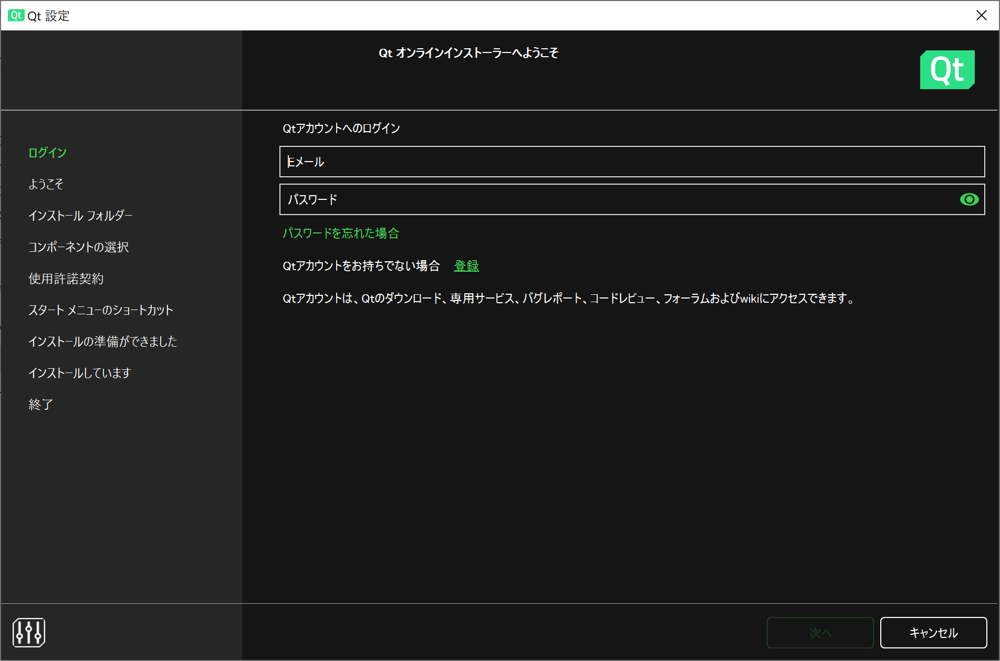
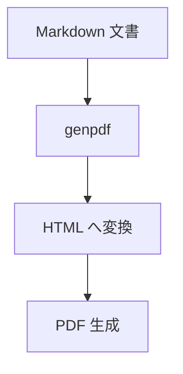
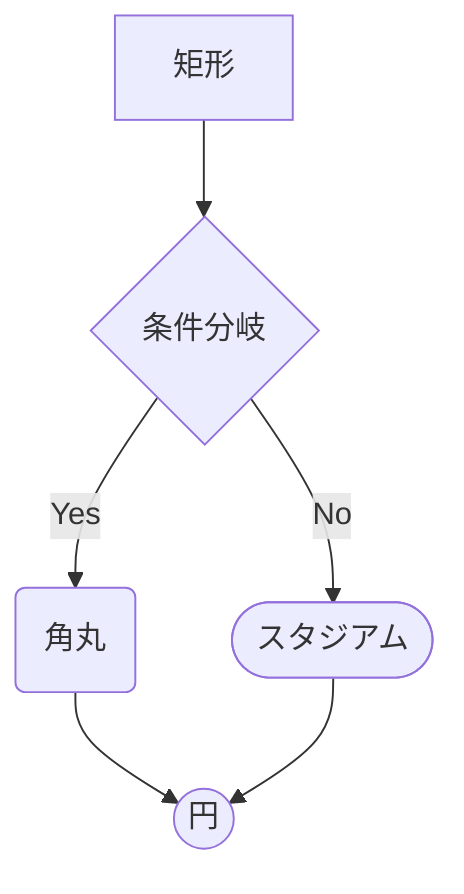
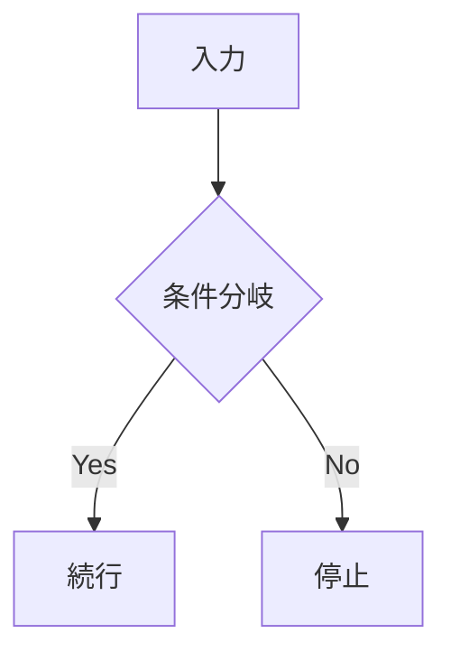
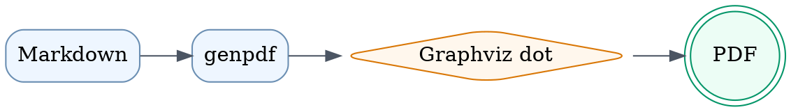
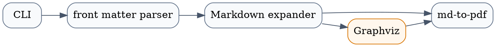
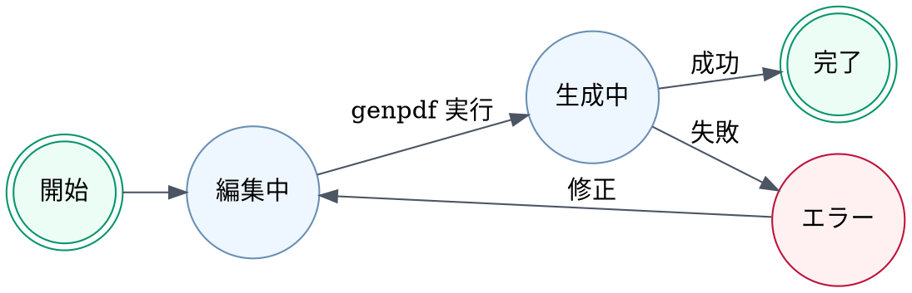

---
genpdf:
  Format: book
  Title: Qt for Python 入門
  Subtitle: 1.0 版
  Author: (株) SRA
  Date: 2024-06-01
  Page_Numbers: true
---

<!-- page -->
!toc

<div class="page-break"></div>

<!-- page -->
# はじめに

このサンプル文書では、テンプレート付き PDF 出力の基本機能を確認できます。

## この文書で扱う内容

- テンプレート付き表紙
- 静的目次
- ページ単位フッター

### 想定する利用場面

社内向けの手順書、配布資料、簡易な技術メモを PDF 化する用途を想定しています。
!notes{このページでは文書テンプレートの用途を最初に共有する}

- 既存 Markdown をそのまま使いたい
- 改ページを自分で制御したい
- 最小限の独自記法だけ追加したい

<div class="page-break"></div>

<!-- page -->
# 画像ページの例

<center>

</center>

このページでは、本文中に画像を挿入したときの見え方を確認できます。  
画像の相対パスは対象 Markdown の位置を基準に解決されます。  
必要であればページ単位フッターも付けられます。  
!notes{画像ページとフッターの組み合わせ例として説明する}

!footer{社外秘}

<div class="page-break"></div>

<!-- page -->
# SVG ファイル参照の例

!svg{path=../images/vu-background.svg alt=VUメーター caption=VUメーター width=72% align=center}

!svg{path=../images/us-keyboard-white.svg alt=USキーボード caption=USキーボード width=88% align=center}

このページでは、SVG ファイルを図として参照し、幅、キャプション、寄せ方を指定する例を示します。

<div class="page-break"></div>

<!-- page -->
# コードブロックの例

```c++
#include <QApplication>
#include <QPushButton>

int main(int argc, char** argv)
{
    QApplication app(argc, argv);

    QPushButton button("Click me");
    QObject::connect(&button, &QPushButton::clicked, &app, QApplication::quit);
    button.show();

    return app.exec();
}
```

!callout{type=important title=ポイント}
  サンプルコードを載せるページでは、
  補足事項をボックスで強調できます。

このページではコードブロックの等幅フォント表示を確認できます。  
コード例を説明資料に載せたいケースを想定しています。  

<!-- page -->
# オプション一覧

| Option | Example | Purpose |
| ------ | ------- | ------- |
| `--format book` | `genpdf --format book guide.md` | 文書向けレイアウトを使う |
| `--title` | `--title "導入ガイド"` | 表紙タイトルを上書きする |
| `--author` | `--author "Example Team"` | 著者名や部門名を出す |
| `--date` | `--date 2026-04-12` | 表紙の日付を固定する |
| `--output` | `--output dist/guide.pdf` | 出力先を変更する |

!callout{type=note title=補足}
  オプションは CLI と front matter の両方から指定できます。

<div class="page-break"></div>
<!-- page -->
# Mermaid 図の例



このページでは、文書形式でも Mermaid 図をそのまま埋め込めることを示します。

<div class="page-break"></div>
<!-- page -->
# Mermaid 形状一覧



このページでは、Mermaid の代表的なノード形状と枝分かれをまとめて確認できます。

<div class="page-break"></div>
<!-- page -->
# Mermaid 右寄せの例

!mermaid{align=right}


このページでは、`!mermaid{align=right}` による図単位の右寄せを確認できます。

<div class="page-break"></div>
<!-- page -->
# Graphviz DOT 図の例

!dot{align=center scale=0.9}


このページでは、Graphviz DOT を SVG に変換して文書へ埋め込む例を示します。

<div class="page-break"></div>
<!-- page -->
# Graphviz DOT 依存関係図

!dot{align=center scale=0.85}


このページでは、モジュールや処理の依存関係を DOT で表す例を示します。

<div class="page-break"></div>
<!-- page -->
# Graphviz DOT 状態遷移図

!dot{align=center scale=0.85}


このページでは、状態遷移を DOT で表す例を示します。

<div class="page-break"></div>
<!-- page -->
# 実装コードの取り込み

!include-code{path=../src/main.py lang=python}
!notes{最後に include-code の使い方へ触れる}
