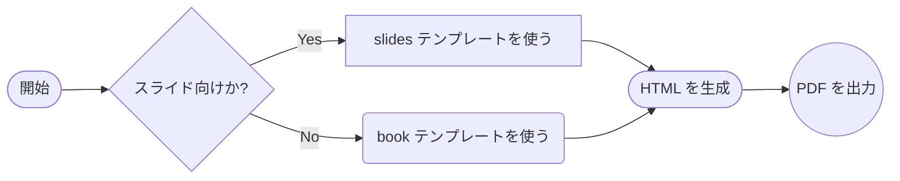
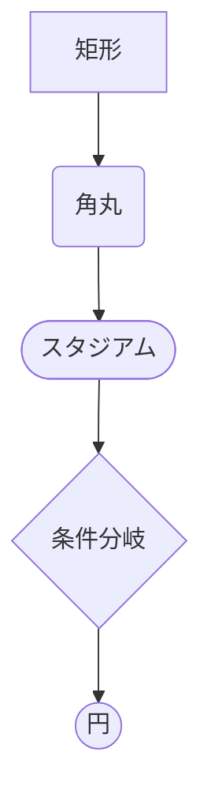
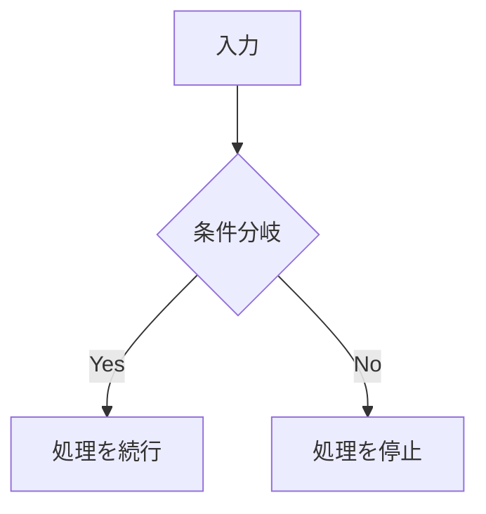
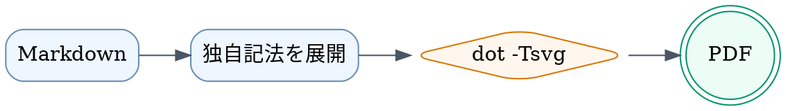
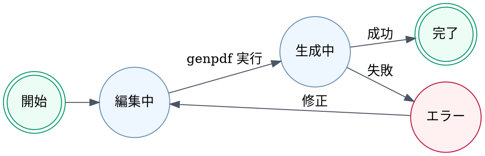

---
genpdf:
  Format: slides
  Title: |-
    Qt for Python
    入門
  Subtitle: |-
    1.0 版
    基本操作
  Author: (株) SRA
  Date: 2024-06-01
  Page_Numbers: true
  Background:
    Image: qt-footer-logo-band.svg
    Target: all
    Size: 100%
    Position: bottom center
    Repeat: no-repeat
    Opacity: 1
---

<!-- slide -->
<h1 align="center">導入と全体像</h1>
<p class="slide-subtitle">目的と使いどころ</p>

このサンプルでは、PDF スライド向けの基本機能をまとめて確認できます。

## このテンプレートでできること

- タイトル付きのスライド PDF を生成する
- 箇条書きの段階表示風スライドを作る
- カバー画像、コールアウト、発表者メモを併用する

### 段階表示の例

!incremental-list
- 目的と全体像を先に伝える
- 要点を 1 つずつ追加しながら説明する
- 最後に詳細ページへつなげる

<div class="page-break"></div>

<!-- slide -->
<h1 align="center">デモの見どころ</h1>
<p class="slide-subtitle">確認する機能の流れ</p>

このページでは、サンプル全体の見どころを先に整理します。

!callout{type=note title=このあと確認するもの}
  カバー画像、段階表示、コード表示、フッター、発表者メモを順番に確認します。

<!-- slide -->
<div class="page-break"></div>
<h1 align="center">インストール画面の紹介</h1>
<p class="slide-subtitle">画面を使った手順説明</p>

!cover-image{path=../images/qt-installation-01.png alt=Qt-installation caption=インストール画面 width=82%}
!notes{
    インストール手順の全体像を最初に説明する
    画面を見せながら、必要なツールを確認する
    画面の説明は次のライブデモで補足する
}

<!-- slide -->
<div class="page-break"></div>
<h1 align="center">説明の段階表示</h1>

---

最初に必要なツールを確認します。  
Python と Node.js がそろっていれば開始できます。  
!pause
次に `genpdf` の基本コマンドを示します。  
入力 Markdown を指定するだけで PDF を生成できます。  
最後に拡張ディレクティブを紹介します。  
!notes{詳細手順は次のライブデモで補足する}

!footer{社内共有用サンプル}

<!-- slide -->
<div class="page-break"></div>
<h1 align="center">SVG VU メーターの例</h1>

---

!svg{path=../images/vu-background.svg alt=VUメーター caption=VUメーター width=38% align=center}

!callout{type=note title=補足}
  `!svg` は SVG ファイルを figure として配置し、幅、キャプション、寄せ方を指定できます。

<!-- slide -->
<div class="page-break"></div>
<h1 align="center">SVG キーボードの例</h1>

---

!svg{path=../images/us-keyboard-white.svg alt=USキーボード caption=USキーボード width=92% align=center}

!callout{type=note title=補足}
  キーボードのような横長 SVG は、ページを分けると細部を確認しやすくなります。

<!-- slide -->
<div class="page-break"></div>
!font-size{10}
<h1 align="center">コード例と注意点</h1>

---

```c++
#include <QApplication>
#include <QPushButton>

int main(int argc, char** argv)
{
    QApplication app(argc, argv);

    QPushButton button("Click me");
    QObject::connect(&button, &QPushButton::clicked, &app, QApplication::quit);
    button.show();

    return app.exec();
}
```

!callout{type=warning title=注意}
  このコードは説明用です。
  実運用では例外処理を追加してください。

このページではコードブロックとコールアウトの併用例を示しています。  
サンプル用途では、読みやすさを優先して最小構成のコードを載せています。  

<!-- slide -->
<div class="page-break"></div>
<h1 align="center">主要オプション一覧</h1>

---

| Option | Example | Purpose |
| ------ | ------- | ------- |
| `--format slides` | `genpdf --format slides slides.md` | スライド向けの横長レイアウトにする |
| `--format book` | `genpdf --format book book.md` | 文書向けの縦長レイアウトにする |
| `--title` | `--title "Qt for Python 入門"` | 表紙タイトルを上書きする |
| `--copyright` | `--copyright "2024 Example, Inc."` | 共通フッターを付ける |
| `--output` | `--output out/demo.pdf` | 出力先を変更する |

!callout{type=success title=活用例}
  スライド用サンプルでは、段階表示、メモ、フッターをまとめて確認できます。

<!-- slide -->
<div class="page-break"></div>
<h1 align="center">Mermaid 図の例</h1>

---



!callout{type=note title=補足}
  Mermaid は fenced code block の `mermaid` 言語指定で書けて、ノード形状も変えられます。

<!-- slide -->
<div class="page-break"></div>
<h1 align="center">Mermaid 形状一覧</h1>

---

!mermaid{align=center scale=0.75}


!callout{type=note title=補足}
  形状だけを確認したいときは、このように 1 ページへ並べると見比べやすくなります。

<!-- slide -->
<div class="page-break"></div>
<h1 align="center">Mermaid 右寄せの例</h1>

---

!columns{widths=2,1}
:::column
このページでは、右上に配置した図と本文を同じスライド内に並べます。  
左側の説明を先に読み、そのあと右側の分岐図を見る想定です。

- 図はスライド上端から配置
- 本文は左カラムに集約
- 図と補足の競合を確認しやすい構成

!callout{type=note title=補足}
  区切り線なしで左カラムを広く取り、右カラム先頭に図を置く構成です。
:::
:::column
!mermaid{align=right scale=0.85}

:::
!end-columns

<!-- slide -->
<div class="page-break"></div>
<h1 align="center">Graphviz DOT 図の例</h1>

---

!dot{align=center scale=0.8}


!callout{type=note title=補足}
  `dot` コマンドが使える環境では、Graphviz DOT のコードブロックを図として埋め込めます。

<!-- slide -->
<div class="page-break"></div>
<h1 align="center">DOT 依存関係図の例</h1>

---

!dot{align=center scale=0.75}


!callout{type=note title=補足}
  DOT は依存関係や処理パイプラインの自動レイアウトに向いています。

<!-- slide -->
<div class="page-break"></div>
<h1 align="center">DOT 状態遷移図の例</h1>

---

!dot{align=center scale=0.75}


!callout{type=note title=補足}
  状態と遷移ラベルを明示したい図は、DOT でも読みやすく書けます。

<!-- slide -->
<div class="page-break"></div>
<h1 align="center">2 カラムの例</h1>

---

!columns{divider}
:::column
### 左側

- 導入の要点
- 注意事項
- 次のアクション
:::
:::column
### 右側

!callout{type=note title=補足}
  カラム内でも Markdown をそのまま書けます。
:::
!end-columns

<!-- slide -->
<div class="page-break"></div>
<h1 align="center">3 カラムの例</h1>

---

!columns{divider}
:::column
### 概要

- 目的
- 対象
:::
:::column
### 手順

1. 準備
2. 実行
3. 確認
:::
:::column
### 補足

!callout{type=note title=補足}
  3 列でも Markdown をそのまま書けます。
:::
!end-columns

<!-- slide -->
<div class="page-break"></div>
### 実装コードの抜粋

!fit-code
```python
def build_pdf(source: str) -> None:
    print(f"render: {source}")
    print("apply template")
    print("write pdf 01")
    print("write pdf 02")
    print("write pdf 03")
    print("write pdf 04")
    print("write pdf 05")
    print("write pdf 06")
    print("write pdf 07")
    print("write pdf 08")
    print("write pdf 09")
    print("write pdf 10")
    print("write pdf 11")
    print("write pdf 12")
    print("write pdf 13")
    print("write pdf 14")
    print("write pdf 15")
    print("write pdf 16")
    print("write pdf 17")
    print("write pdf 18")
    print("write pdf 19")
    print("write pdf 20")
```

!callout{type=note title=補足}
  長めのコードを 1 ページに収めたいときは `!fit-code` を使います。

!include-code{path=../src/main.py lang=python}
