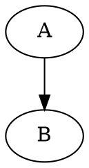

# GitLab Markdown での図の表示

GitLab の `.md` で **DOT をそのまま `` ```dot `` と書いて図として表示する標準機能は確認できません**。
通常はコードブロックとして扱われる可能性が高いです。

GitLab 公式ドキュメントでは、Markdown の図表示として以下が挙げられています。

- Mermaid
- PlantUML
- Kroki

## GitLab Flavored Markdown の図表示

GitLab Flavored Markdown の「Diagrams and flowcharts」では、テキストから図を生成する方法として
Mermaid、PlantUML、Kroki が示されています。

GitLab.com は Mermaid v10 をサポートし、PlantUML は GitLab.com では有効です。
Self-Managed では、管理者が PlantUML を有効化する必要があります。
Kroki も GitLab で使うには管理者による有効化が必要です。

出典:
[GitLab Docs「GitLab Flavored Markdown」](https://docs.gitlab.com/user/markdown/)

## DOT / Graphviz の扱い

DOT / Graphviz については、GitLab の Kroki 管理ドキュメント側に出ています。Kroki の対応図種に `GraphViz` が含まれており、Kroki を有効化すると Markdown などの delimited block を Kroki 経由で画像化できます。

出典:
[GitLab Docs「Kroki」](https://docs.gitlab.com/administration/integration/kroki/)

## 実用上の整理

### GitLab.com / GitLab Self-Managed の素の Markdown

````markdown

````

上記のような `` ```dot `` は、図ではなくコード表示になる可能性が高いです。

### Mermaid

````markdown

````

`` ```mermaid `` は GitLab Markdown で公式サポートされています。

### Graphviz DOT

Kroki が有効な GitLab Self-Managed なら、Kroki 経由で GraphViz 図として表示できる可能性があります。
ただし、GitLab 側の Kroki 設定が必要です。

## genpdf との違い

genpdf の現在の `dot` 実装とは違います。genpdf はローカルで `dot -Tsvg` を実行して SVG に変換しますが、GitLab は `.md` 表示時にローカルの `dot` を実行するわけではありません。GitLab で DOT を表示したいなら、Kroki を使うか、事前に SVG/PNG に変換して画像として貼るのが現実的です。
