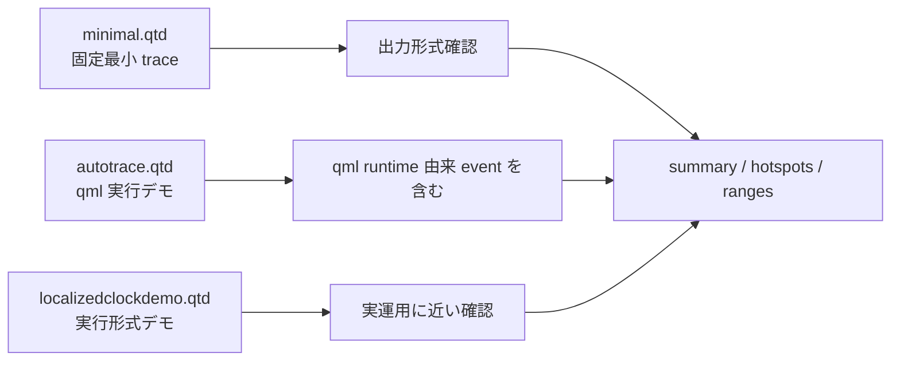
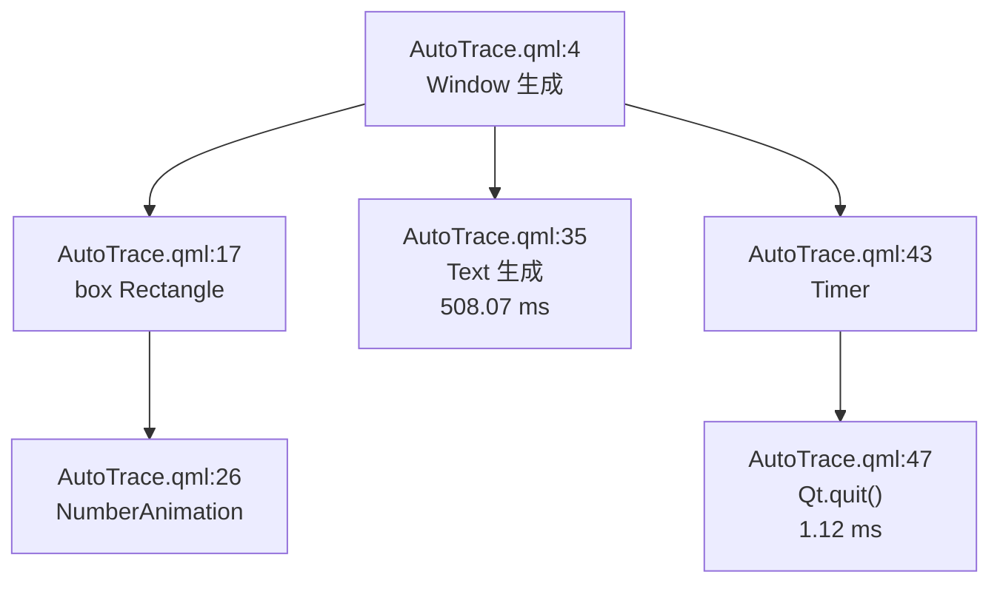
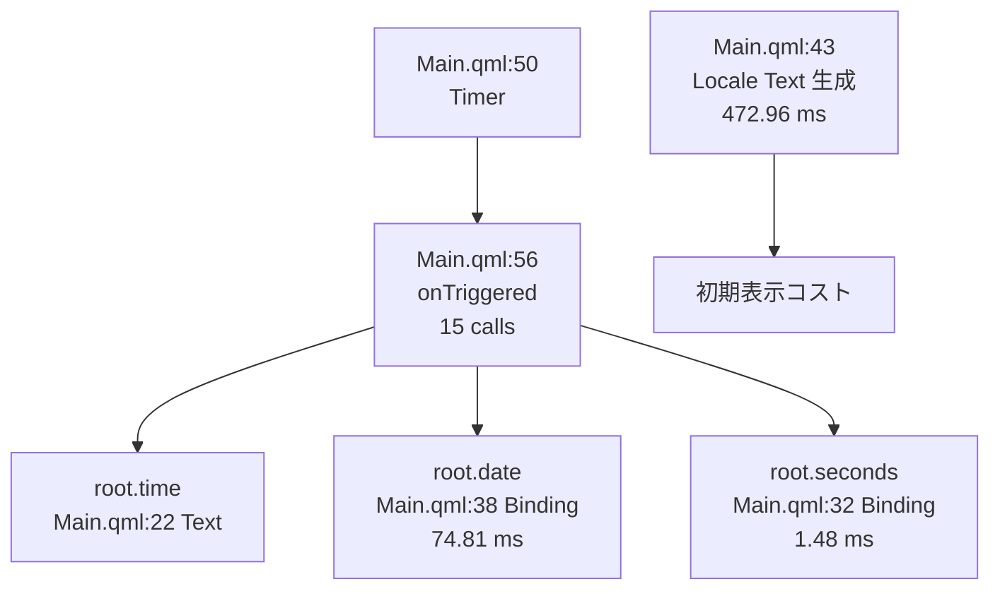
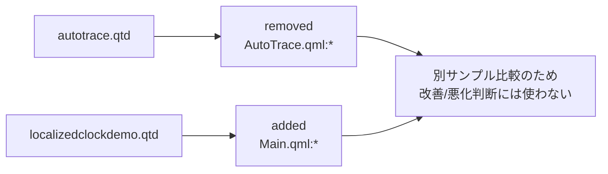

---
genpdf:
  format: book
  title: samples トレース解析報告書
  subtitle: qmlprofileranalyzer によるサンプルトレース分析
  author: qmlprofileranalyzer
  version: 1.0
  date: 2026-05-08
  font_size: 11pt
  page_numbers: true
  copyright: ""
  table:
    header_background: "#e8f1ff"
    header_color: "#1f2937"
    border_color: "#cbd5e1"
    border_width: "1px"
    stripe: true
    stripe_background: "#f8fafc"
    cell_padding: "0.35em 0.55em"
    font_size: "0.82em"
    compact: true
    header_align: center
    cell_align: left
---

# 1. 目的

本報告書は `samples` 配下にある QML Profiler トレースを `qmlprofileranalyzer` で解析し、各サンプルの性格、主要 hotspot、`ranges` の注意点、複数トレース比較の読み方を整理したものです。

# 2. 対象

解析対象:

- `samples/minimal.qtd`
- `samples/generated/autotrace.qtd`
- `samples/generated/localizedclockdemo.qtd`

使用コマンド:

```bash
./build/qmlprofileranalyzer summary samples/minimal.qtd
./build/qmlprofileranalyzer hotspots samples/minimal.qtd
./build/qmlprofileranalyzer summary samples/generated/autotrace.qtd
./build/qmlprofileranalyzer hotspots samples/generated/autotrace.qtd
./build/qmlprofileranalyzer ranges samples/generated/autotrace.qtd
./build/qmlprofileranalyzer summary samples/generated/localizedclockdemo.qtd
./build/qmlprofileranalyzer hotspots samples/generated/localizedclockdemo.qtd
./build/qmlprofileranalyzer ranges samples/generated/localizedclockdemo.qtd
./build/qmlprofileranalyzer events-aggregated samples/generated/localizedclockdemo.qtd
./build/qmlprofileranalyzer compare samples/generated/autotrace.qtd samples/generated/localizedclockdemo.qtd
```

実行時に `C` locale から `UTF-8` へ切り替える Qt の警告が出たが、解析コマンド自体は正常に完了した。

# 3. 全体サマリ

| trace | duration | events | ranges | pointEvents | notes | longest range |
| --- | ---: | ---: | ---: | ---: | ---: | --- |
| `samples/minimal.qtd` | 800 ns | 3 | 1 | 2 | 1 | `root width binding`, 40 ns |
| `samples/generated/autotrace.qtd` | 1,727,701,542 ns | 423 | 24 | 399 | 0 | `AutoTrace.qml:35`, 508,066,625 ns |
| `samples/generated/localizedclockdemo.qtd` | 15,499,169,084 ns | 441 | 106 | 335 | 0 | `Main.qml:43`, 472,956,334 ns |

`minimal.qtd` は固定サンプルとして期待通り小さく、機能確認用の trace である。`autotrace.qtd` と `localizedclockdemo.qtd` は実行デモ由来で、どちらも短い初期化処理と長い待機系 range が混在する。

!mermaid{align=center scale=0.85}


図 1 は、3 つの trace の位置付けを示す。`minimal.qtd` は機能確認、`autotrace.qtd` は `qml` ランタイム込みのデモ確認、`localizedclockdemo.qtd` は実行形式に近い確認で使う。

| trace | traceDuration | totalTime | longestRange | longestRange ms |
| --- | ---: | ---: | --- | ---: |
| `samples/minimal.qtd` | 800 ns | 260 ns | `root width binding` | 0.000040 |
| `samples/generated/autotrace.qtd` | 1,727,701,542 ns | 518,638,710 ns | `AutoTrace.qml:35` | 508.07 |
| `samples/generated/localizedclockdemo.qtd` | 15,499,169,084 ns | 569,050,834 ns | `Main.qml:43` | 472.96 |

# 4. `samples/minimal.qtd`

## 4.1 目的

最小 trace として reader / summary / hotspots / notes の基本確認に向く。イベント数は 3、range は 1、note は 1 で、解析結果を目視確認しやすい。

## 4.2 主な結果

- `traceDuration`: 800 ns
- `totalTime`: 260 ns
- `longestRange`: `root width binding`, 40 ns
- hotspot は `samples/qml/AutoTrace.qml:17` の `Binding` 1 件のみ
- `outlier`, `burst`, `image`, `compilingNote` はすべて `no`

## 4.3 評価

この trace は性能評価用ではなく、出力形式の確認用である。`hotspots` の `groupKey` は `type=Binding|file=samples/qml/AutoTrace.qml|line=17|column=13` で、比較キーの基本動作確認にも使える。

# 5. `samples/generated/autotrace.qtd`

## 5.1 trace の性格

`samples/qml/AutoTrace.qml` を `qml` ランタイムで動かして採取した trace。`qml` ランタイム由来の `default.qml` 系イベントも含まれる。

## 5.2 主な統計

- `traceDuration`: 1,727,701,542 ns
- `totalTime`: 518,638,710 ns
- `eventTypes`: 26
- `events`: 423
- `ranges`: 24
- `pointEvents`: 399
- `longestRange`: `AutoTrace.qml:35`, 508,066,625 ns

## 5.3 主要 hotspot

| rank | location | type | calls | selfTotal | medianSelf | note |
| ---: | --- | --- | ---: | ---: | ---: | --- |
| 1 | `AutoTrace.qml:35` | `Creating` | 2 | 508,183,917 | 508,066,625 | 長い Text 生成 range |
| 2 | `AutoTrace.qml:0` | `Compiling` | 1 | 8,228,792 | 8,228,792 | import / plugin load が混ざる可能性 |
| 3 | `AutoTrace.qml:47` | `Javascript` | 1 | 1,117,167 | 1,117,167 | `Qt.quit()` 側の処理 |
| 4 | `default.qml:0` | `Compiling` | 1 | 495,333 | 495,333 | qml runtime 初期化由来 |
| 5 | `AutoTrace.qml:4` | `Creating` | 2 | 367,834 | 297,042 | Window 生成 |

## 5.4 行番号との対応

- `AutoTrace.qml:35` は `Text { ... }` の開始行
- `AutoTrace.qml:43` は `Timer { ... }` の開始行
- `AutoTrace.qml:47` は `onTriggered: Qt.quit()`
- `AutoTrace.qml:26` は `NumberAnimation on x`

## 5.5 所見

最大の値は `AutoTrace.qml:35` の `Creating` で、range でも `gapWarning=yes` が付いている。`Text` 要素の生成そのもの、あるいは QML 子 range では説明されない内部処理が含まれている可能性がある。ただしこれはデモ trace であり、長い `Text` 生成が実アプリの性能問題を示すとは限らない。

`AutoTrace.qml:0` の `Compiling` は 8.23 ms 程度で、初回ロードの補助情報として見るべきである。`Compiling` は QML コンパイルだけでなく import や plugin load を含む可能性がある。

`outlier`, `burst`, `image` は主要 hotspot では発生していない。画像ロードのないサンプルとしては妥当である。

!mermaid{align=center scale=0.8}


図 2 は `autotrace.qtd` の主要 range の読み方を示す。最大値は `AutoTrace.qml:35` に集中し、終了時の `Qt.quit()` も別 hotspot として見える。

# 6. `samples/generated/localizedclockdemo.qtd`

## 6.1 trace の性格

`demos/localizedclock/Main.qml` を実行形式デモとして起動し、約 15 秒間採取した trace。`qml` コマンド直実行より実運用に近い確認用である。

## 6.2 主な統計

- `traceDuration`: 15,499,169,084 ns
- `totalTime`: 569,050,834 ns
- `eventTypes`: 37
- `events`: 441
- `ranges`: 106
- `pointEvents`: 335
- `longestRange`: `Main.qml:43`, 472,956,334 ns

## 6.3 主要 hotspot

| rank | location | type | calls | selfTotal | medianSelf | note |
| ---: | --- | --- | ---: | ---: | ---: | --- |
| 1 | `Main.qml:43` | `Creating` | 2 | 472,957,834 | 472,956,334 | 長い Locale 表示 Text 生成 range |
| 2 | `Main.qml:38` | `Binding` | 2 | 74,808,751 | 74,807,917 | date text binding |
| 3 | `Main.qml:0` | `Compiling` | 1 | 10,541,667 | 10,541,667 | 初期ロード候補 |
| 4 | `Main.qml:56` | `Javascript` | 15 | 5,609,665 | 309,916 | Timer handler |
| 5 | `Main.qml:22` | `Creating` | 2 | 2,213,208 | 2,151,583 | time Text 生成 |
| 6 | `Main.qml:32` | `Binding` | 16 | 1,478,790 | 101,542 | seconds text binding |

## 6.4 行番号との対応

- `Main.qml:22` は時刻表示の `Text`
- `Main.qml:31` は秒数表示の `Text`
- `Main.qml:37` は日付表示の `Text`
- `Main.qml:43` は locale 表示の `Text`
- `Main.qml:50` は `Timer`
- `Main.qml:56` は `onTriggered` handler
- `Main.qml:38` は `text: root.date`
- `Main.qml:32` は `text: qsTr("%n second(s)", "seconds", root.seconds)`

## 6.5 所見

最大 hotspot は `Main.qml:43` の `Creating` で、range でも `gapWarning=yes` が付いている。`Text { text: qsTr("Locale: %1").arg(Qt.locale().name) }` の生成に対応し、QML 子 range では説明しにくい内部処理が大きく見えている。

次に大きい `Main.qml:38` の `Binding` は `root.date` を表示する `Text` の binding で、`selfTotal` が 74.8 ms と目立つ。これは初期表示時または更新時の文字列・レイアウト処理が含まれている可能性がある。

`Main.qml:56` の `Javascript` は 15 calls で、`Timer` の `onTriggered` 内の `Date` 作成、locale 取得、時刻・日付・秒の更新に対応する。`outlier=yes` が付いており、最大値 1.58 ms に対して中央値 0.31 ms なので、1 回だけ重い更新がある。

`Main.qml:9`, `Main.qml:10`, `Main.qml:56` などに `outlier=yes` が見られるが、`burst=yes` は見られない。短時間集中というより、更新の一部に重いサンプルが混じる形である。

!mermaid{align=center scale=0.8}


図 3 は `localizedclockdemo.qtd` の主要な更新経路を示す。`Timer` handler は継続更新、`Main.qml:43` は初期表示寄りの大きい単発コストとして読む。

## 6.6 Scene Graph / Memory / Debug

`events-aggregated` では次が確認できた。

- `MemoryAllocationSummary`
  - `HeapPage`: 1 event, total 647,680
  - `SmallItem`: 247 events, total 608,256
  - `LargeItem`: 1 event, total 0
- `DebugMessageSummary`
  - `Level-1`: 3 events
- `SceneGraphFrame`
  - 23 frame 分の `SceneGraph` 系 point event が含まれる
  - 初期付近に `SceneGraphRenderLoopFrame` totalTiming 2,403,791 ns があり、その後はおおむね数十から数百 us 台が多い

Scene Graph 側は初期フレームが大きく、その後は継続的な軽いフレーム処理に落ち着く傾向である。

# 7. `autotrace.qtd` と `localizedclockdemo.qtd` の比較

`compare samples/generated/autotrace.qtd samples/generated/localizedclockdemo.qtd` を実行した。ただし、両者は別 QML ファイルであり、同じ `groupKey` を共有しないため、結果は `removed` と `added` が中心になる。

主要差分:

- `AutoTrace.qml:35` の `Creating` 508,183,917 ns は `removed`
- `Main.qml:43` の `Creating` 472,957,834 ns は `added`
- `Main.qml:38` の `Binding` 74,808,751 ns は `added`
- `AutoTrace.qml:0` の `Compiling` 8,228,792 ns は `removed`
- `Main.qml:0` の `Compiling` 10,541,667 ns は `added`

この比較は「同じ操作の before / after」ではなく「別サンプル同士の構成差」を示す。性能改善・悪化の判断には使わず、`compare` コマンドの出力確認と、trace 間で `groupKey` が異なる場合の見え方を確認する用途に留める。

!mermaid{align=center scale=0.75}


図 4 は今回の `compare` 結果の性格を示す。別 QML 同士なので `changed` ではなく `added` / `removed` が中心になる。

# 8. 結論

`minimal.qtd` は最小確認用として正常である。性能評価の対象ではない。

`autotrace.qtd` は `AutoTrace.qml:35` の `Text` 生成が支配的で、`gapWarning=yes` も付く。`qml` ランタイム由来の `default.qml` event も含まれるため、アプリ固有の評価ではそれを区別して読む必要がある。

`localizedclockdemo.qtd` は実行形式デモとして最も実用に近い。`Main.qml:43` の locale 表示 `Text` 生成、`Main.qml:38` の date binding、`Main.qml:56` の Timer handler が主要な確認ポイントである。特に `Main.qml:56` は 15 calls あり、継続更新の解析対象として有用である。

比較機能については、今回の 2 本は別サンプルなので added / removed 中心になる。同一サンプルの変更前後 trace を用意すれば、`groupKey` による `changed` 行を使って改善・悪化の確認ができる。
