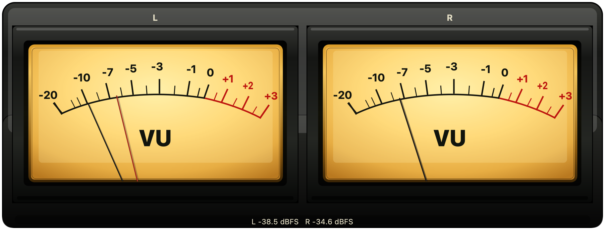

# VuStereo

日本語 | [English](README.en.md)

`VuStereo` は、macOS のシステム再生音を表示するステレオ VU メーターです。

左右のシステム音声レベルをアナログ風の VU メーターで表示します。
Qt 6 Widgets と macOS の ScreenCaptureKit を使用しています。



VuStereo は、オーディオ機器やアナログ VU メーターが好きな人に向けた、
見た目を楽しむデスクトップアクセサリーです。計測器としての精度よりも
メーターの見た目や動きを重視し、機能は意図的に絞っています。

## バージョン

現在のリリースバージョンは [`VERSION`](VERSION) に記録しています。
このファイルを CMake のプロジェクトバージョンの唯一の参照元としています。
リリースビルドを構成する前に更新してください。

## 必要な環境

- macOS 13 以降
- Qt 6
- CMake 3.16 以降
- C++17 対応コンパイラー
- `vu-stereo Local Code Signing` という名前のローカルコード署名 ID

ScreenCaptureKit によるシステム音声の監視には、macOS の画面収録権限が必要です。
詳細は [`SIGNING.md`](SIGNING.md) と [`USER_GUIDE.md`](USER_GUIDE.md) を参照してください。

## ビルド

```text
cmake -S . -B build
cmake --build build
open build/VuStereo.app
```

既定のビルドでは、[`SIGNING.md`](SIGNING.md) に記載したローカルコード署名 ID で
`build/VuStereo.app` に署名します。

## ソースリリース

ソース配布用 ZIP を作成します。

```text
cmake --build build --target source_release
```

出力先は `release/` 配下です。

```text
release/vu-stereo-<version>-source.zip
```

ZIP の最上位には `vu-stereo/` ディレクトリーが入ります。
アプリのビルドと確認に必要なビルド定義、ソースファイル、リソース、翻訳、
利用ガイド、署名に関する説明、プライバシーポリシーを含みます。
