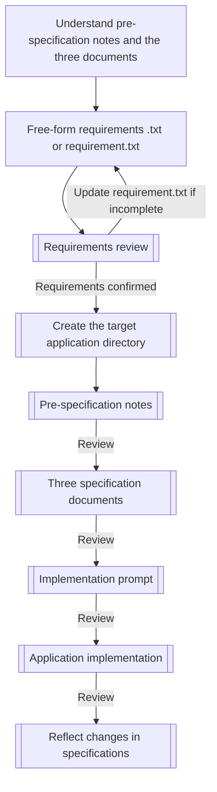
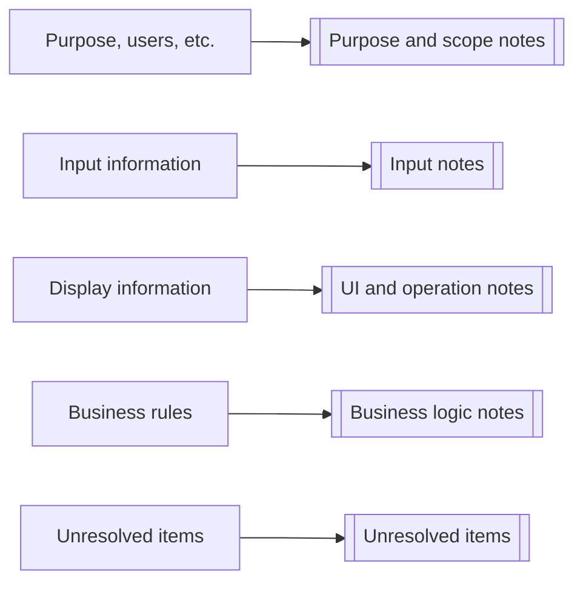
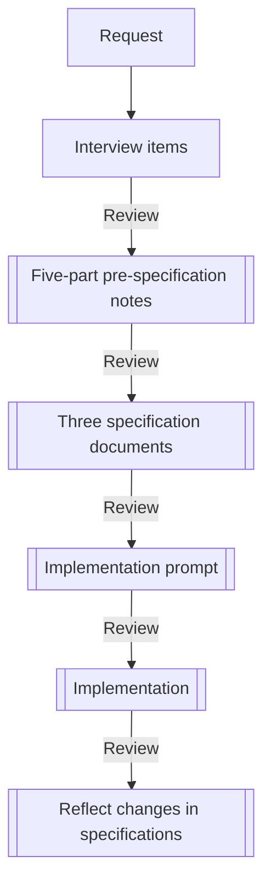
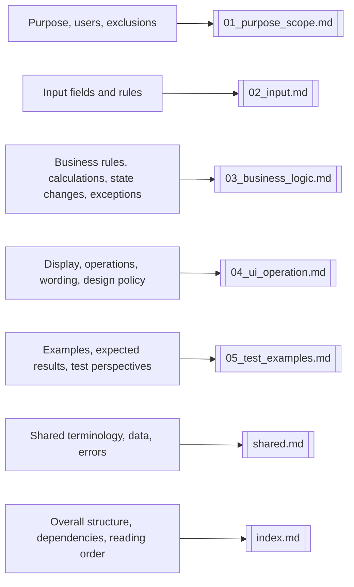
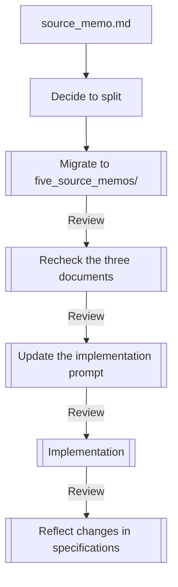
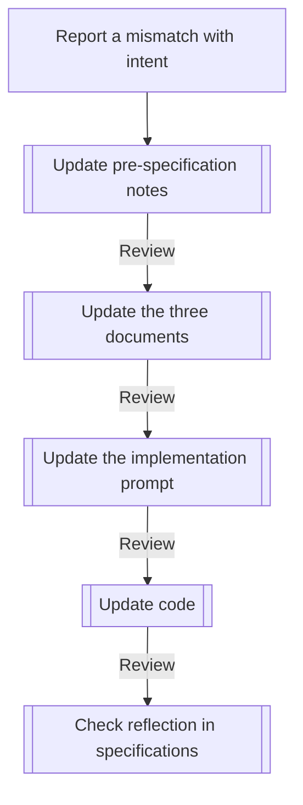

---
genpdf:
  format: book
  title: App Generation Workflow Guide
  subtitle: Creating Applications with Pre-Specification Notes
  author: SRA, Inc.
  version: 0.1.0
  date: 2026-05-07
  font_size: 12pt
  page_numbers: true
  copyright: 2026 SRA, Inc. All rights reserved.
  table:
    header_background: "#e8f1ff"
    header_color: "#1f2937"
    border_color: "#cbd5e1"
    border_width: "1px"
    stripe: true
    stripe_background: "#f8fafc"
    cell_padding: "0.45em 0.65em"
    font_size: "0.95em"
    compact: false
    align: left
    header_align: center
    cell_align: left
---

# User Guide

This guide is for people creating applications with `app-generation-workflow`.

In this workflow, you do not start by implementing the application. First, collect material from a free-form requirements `.txt` file into pre-specification notes, use those notes to create the three specification documents, and finally specify an implementation approach and create the application. To reduce unresolved questions, start by organizing requirements with the recommended `templates/requirement.txt` template.

This guide is the entry point for users. `three_key_documents_workflow.md` is the authoritative procedure; consult it when unsure about detailed decisions.

Refer only to the workflow already copied into the user's workspace. Do not consult workflow copies elsewhere. Treat the copied workflow as a template and do not write application-specific content into it.

## What to Read First

Read this guide first. Then read the authoritative procedure:

- `three_key_documents_workflow.md`

To give the AI the working context, use an instruction such as:

```text
Please read app-generation-workflow/three_key_documents_workflow.md.
```

## Basic Flow



## 1. Create Pre-Specification Notes

Accept user requirements as a free-form `.txt` file. This file is raw input, not an implementation specification.

To reduce unresolved questions, copy the recommended template below and use it as `requirement.txt`. Free-form requirements are acceptable, but `requirement.txt` makes gaps easier to find before creating pre-specification notes.

```text
app-generation-workflow/templates/requirement.txt
```

After receiving the requirements `.txt` or `requirement.txt`, the AI reviews the requirements. It checks whether there is enough material to create pre-specification notes, including the purpose, users, application type, inputs, displays, operations, operations in each state, operation conflicts, OS and input-device differences, rules, exclusions, exceptions, representative examples, and unresolved questions.

If gaps are found, the AI presents questions worth asking the user, proposed additions to `requirement.txt`, and areas it might otherwise fill in by guessing. These additions are recommendations, not official requirements until the user accepts them. If missing information affects implementation or generation of the three documents, update `requirement.txt` before proceeding to the notes or specifications. Stopping here is the correct behavior: it prevents plausible-looking specifications or code from being invented from ambiguous requirements.

Once the requirements pass review, create a new directory for the target application. From then on, keep the pre-specification notes, three specification documents, implementation prompt, and source code under that directory.

Copy this template into the target application's working directory:

```text
app-generation-workflow/templates/source_memo.md
```

Example destination:

```text
my-app/source_memo.md
```

Include the following in the copied `source_memo.md`:

- Purpose of the application
- Users
- Application type
- What users want to do
- Input information
- Information to display
- Rules to observe
- States and processing flow
- Operations in each state, operation conflicts, and classification of operation targets
- Round-trip operations, OS differences, and input-device differences
- Representative examples and expected results
- Features not to implement
- Undecided matters

Choose the closest application type first. If several apply, select the primary purpose and note the others. A provisional choice is fine if precise classification is not yet possible.

Main types:

- Input, calculation, and result display application
- Data management application
- Viewer
- Editor
- Conversion tool
- Game / interactive application
- Other

Do not write application-specific content into the original templates. Do not change the copied workflow itself either.

For each unresolved item, add a one-line destination indicating where its resolution will be reflected.

```text
- Unresolved: Choose JSON, SQLite, or CSV for storage. Once decided, reflect in: states and processing flow, input rules, and implementation approach if needed.
```

If the initial notes contain unresolved items, make decisions based on the AI's questions. If the user decides to mark the unresolved items as "none," write `- None` in that section. If the user decides not to do so, the AI presents recommendations. When a recommendation is accepted or revised, remove it from the unresolved section and move the decision into the relevant chapter.

After creating the notes, check that they cover all requirements in the `.txt` file and organize unresolved items and exclusions. Treat AI-generated notes as a draft; a person must review them before proceeding to the three documents.

### 1.1 Pre-Specification Notes for Reverse-Generation Review

When reconstructing pre-specification notes from an existing implementation, generated specification documents, or code, use this template instead of the usual `templates/source_memo.md`:

```text
app-generation-workflow/templates/source_memo_reverse_review.md
```

At the destination, name it `source_memo.md`, just like ordinary pre-specification notes.

```text
my-app/source_memo.md
```

In reverse generation, behavior observed in the implementation is not necessarily the correct specification. Separate observed current behavior, behavior accepted as the specification, and suspected bugs or items requiring confirmation.

Key checks:

- Is implementation-derived behavior being treated as official specification without review?
- Have suspected bugs or accidental behavior been accepted as specifications?
- Has a person approved expected results for boundary values and representative examples?
- Are unresolved matters stated as definitive specifications in the body?

## 2. Create the Three Specification Documents

Create these three documents from the pre-specification notes:

```text
my-app/specs/01_usecase_spec.md
my-app/specs/02_ui_spec.md
my-app/specs/03_business_spec.md
```

Templates to use:

```text
app-generation-workflow/templates/01_usecase_spec.md
app-generation-workflow/templates/02_ui_spec.md
app-generation-workflow/templates/03_business_spec.md
```

Roles of the three documents:

- Use case specification: User goals, usage scenarios, success conditions, and exception conditions.
- UI specification: Screens, input fields, displayed information, operations, and error displays.
- Business layer specification: UI-independent data, input validation, calculations, saving, updates, deletion, and state changes.

Carry over the application type selected in `source_memo.md`. The type is a guide for choosing relevant perspectives, not a fixed specification. For example, games and interactive applications emphasize state transitions and end conditions, while conversion tools emphasize input parsing, conversion, output, and failure conditions.

Use optional patterns in the templates only when needed. For applications that do not need administration screens, addition/deletion, state management, aggregation, or saving/loading, mark them "Out of scope" or "None."

### 2.1 Review the Three Documents

Review the three documents before implementation. Treat AI-generated documents as drafts immediately after generation. Only after human review and necessary corrections may they be considered reviewed specifications. Do not create implementation prompts or source code from unreviewed documents.

Choose lightweight, standard, or focused review according to application size and risk.

Lightweight review:

- For small applications, prototypes, and changes with limited impact.
- Check blanks, unresolved items, and obvious contradictions.

Standard review:

- For ordinary new applications, feature additions, and specification changes.
- Check consistency among the three documents and with the pre-specification notes, exclusions, and test perspectives.

Focused review:

- For reverse generation from existing code, ports to another language, applications with substantial business rules, and features with high failure impact.
- Check storage, deletion, billing, personal information, permissions, external integrations, safety, and porting risks.
- Check that suspected bugs and accidental behavior have not been accepted as official specifications.

Use AI-assisted checks during review. Ask the AI to list formatting issues, blanks, contradictions, omissions, guesses, unresolved matters, and suspected bugs. People use that list to decide acceptance, business policy, safety, scope exclusions, and porting policy.

## 3. Splitting Pre-Specification Notes

Normally, start with a single `source_memo.md`. Use the five-part notes when either:

1. The project is known to be large from the outset.
2. You started with one `source_memo.md`, but it grew too large.

### 3.1 When the Project Is Large from the Start

If you already know there will be many screens, use cases, business rules, input fields, or exception conditions, create `five_source_memos/` from the start rather than a single `source_memo.md`. In this case, the split notes under `five_source_memos/` are the authoritative source for the workflow.

Example structure:

```text
five_source_memos/
├─ index.md
├─ shared.md
├─ 01_purpose_scope.md
├─ 02_input.md
├─ 03_business_logic.md
├─ 04_ui_operation.md
└─ 05_test_examples.md
```

Destinations for the nine interview items:

"Purpose, users, etc." in the diagram includes the purpose, users, application type, desired actions, and features not to implement.



The flow in this case:



### 3.2 When the Notes Grow During Work

It is fine to begin with a single `source_memo.md`. If the content grows difficult to navigate, migrate to `five_source_memos/`.

Do not immediately discard the existing `source_memo.md` when splitting it. First create `five_source_memos/` and move content by role.

Destinations:



The flow in this case:



After migration, stop treating the single `source_memo.md` as authoritative. The split notes under `five_source_memos/` become authoritative. Use them, rather than `source_memo.md`, for subsequent changes, specification generation, and implementation prompt updates.

Even after splitting, do not directly edit the three documents or code to correct mismatches with intent. First update the relevant pre-specification note, then propagate the change to the three documents, implementation prompt, and code.

After migrating, check for missing content, duplication, altered meaning, lost unresolved items, consistent shared terminology, and a clear switch of the authoritative source.

## 4. Create the Implementation Prompt

After checking the reviewed specifications, choose the implementation approach. Do not create a prompt from unreviewed AI output, documents with unresolved matters, or reverse-generated documents whose behavior has not yet been accepted.

Examples:

- Qt desktop application
- Web application
- CLI tool
- Mobile application
- API server

Copy this template to create the application-specific implementation prompt:

```text
app-generation-workflow/templates/implementation_prompt.md
```

If there are implementation constraints shared across the split specification workflow, such as build compatibility, code generation policy, or portability, copy this template into the target application directory. Do not mix these constraints into the three specification documents; reference them when creating the implementation prompt. Input rules in the pre-specification notes should describe business and input constraints, not build compatibility or code generation policy.

```text
app-generation-workflow/templates/implementation_constraints.md
```

Example destinations:

```text
my-app/prompts/implementation_prompt.md
my-app/implementation_constraints.md
```

Explicitly state in the implementation prompt that the three documents are the governing specifications. They must have been reviewed. Use the target application directory as the working directory during implementation, and reference `source_memo.md`, `specs/`, and `implementation_constraints.md` from there. If `implementation_constraints.md` exists, reference it in the prompt as the shared project implementation constraints.

After creating the prompt, check that it references reviewed specifications and includes the implementation approach, build approach, testing approach, exclusions, and unresolved items.

Do not proceed to implementation if `implementation_prompt.md` is not ready. List missing information as warnings if it is absent, contains blanks, references insufficient specifications, omits the implementation approach, or contains unresolved questions that must be answered before implementation.

## 5. Implement the Application

Treat the three specification documents and implementation prompt as governing specifications.

Implementation principles:

- Separate the UI and business logic.
- Put input validation and business rules in the business layer.
- Let the UI handle input, operations, display, and error display.
- Do not independently add specifications absent from the three documents.
- Confirm unresolved matters before implementation if they affect it.
- Do not proceed if `implementation_prompt.md` is not ready.

After implementation, verify that the result follows the prompt and the three documents. Check for out-of-scope features, provisional decisions on unresolved matters, missing error conditions, insufficient tests, and decisions not reflected back into the specifications.

## 6. Correct Mismatches with Intent

If the implementation differs from the intended behavior, do not immediately change the code. Do not start by changing only the three documents either.

Make corrections in this order:



Prohibited approaches:

- Editing only the code immediately after a mismatch is reported.
- Editing only the three documents without updating `source_memo.md`.
- Editing only the code without updating the implementation prompt.
- Adding specifications directly to code when absent from the three documents.
- Leaving provisional decisions only in code without reflecting them in specifications.

## Example Instructions for the AI

Initial reading:

```text
Please read app-generation-workflow/three_key_documents_workflow.md.
```

Create pre-specification notes:

```text
Using the free-form requirements .txt, create a directory for the target application and copy templates/source_memo.md to create pre-specification notes.
Choose one application type and include representative examples and expected results.
```

Create notes for reverse-generation review:

```text
Using the existing implementation, generated specification documents, or code, copy templates/source_memo_reverse_review.md to create source_memo.md.
Separate behavior observed in the current implementation, behavior accepted as the specification, and suspected bugs or items requiring confirmation.
```

Create the three documents:

```text
Using source_memo.md, create the use case, UI, and business layer specifications.
Carry over the application type from source_memo.md and mark unnecessary optional patterns as out of scope.
Treat the generated documents as drafts and review them before creating the implementation prompt.
```

Create the implementation prompt:

```text
Using the reviewed three documents as the governing specifications, create an implementation prompt for the specified implementation approach.
If the prompt is not ready for use, issue a warning and do not proceed to implementation.
```

Correct a mismatch with intent:

```text
The implementation differs from my intent. Do not edit the code directly; first identify which parts of source_memo.md need to change.
```
