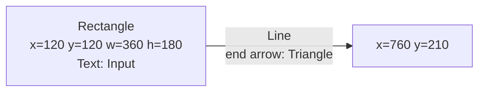
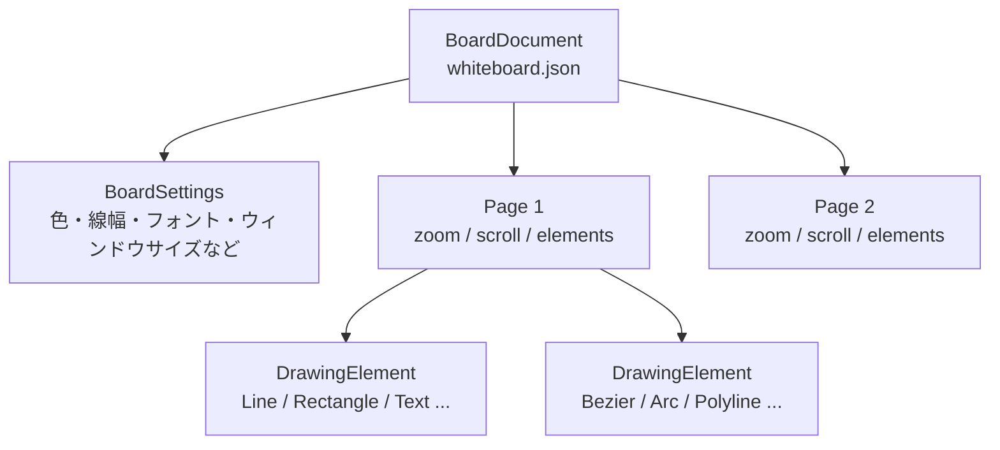
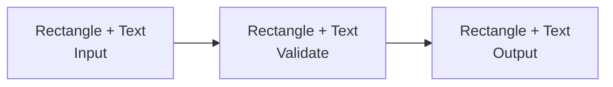
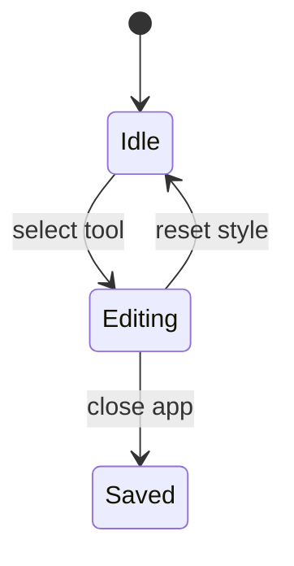

---
genpdf:
  format: book
  title: WhiteboardApp 利用ガイド
  subtitle: 説明図作成向けホワイトボード
  author: (株) SRA
  version: 0.1.0
  date: 2026-08-06
  font_size: 12pt
  page_numbers: true
  copyright: 2026 SRA, Inc. All rights reserved.
  table:
    header_background: "#e8f1ff"
    header_color: "#1f2937"
    border_color: "#cbd5e1"
    border_width: "1px"
    stripe: true
    stripe_background: "#f8fafc"
    cell_padding: "0.45em 0.65em"
    font_size: "0.95em"
    compact: false
    align: left
    header_align: center
    cell_align: left
---

# WhiteboardApp 利用ガイド

## 概要

WhiteboardApp は、説明図、技術メモ、オンライン説明用の図を作成するための Qt Widgets アプリケーションです。
1920 x 1080 の白いキャンバスに、線、矢印、図形、円弧、ベジェ曲線、テキストを配置し、後から選択して編集できます。

主な用途は、Zoom などの簡易ホワイトボードでは再編集しにくい説明図を、ページ単位で保存しながら作成することです。

主な機能は次の通りです。

| 分類 | 機能 |
| --- | --- |
| 描画 | ペン、直線、矩形、角丸矩形、楕円、円、折れ線、ベジェ曲線、円弧、テキスト |
| 編集 | 選択、移動、サイズ変更、回転、頂点編集、コピー、貼り付け、削除、Undo/Redo |
| スタイル | 線色、塗り潰し、線幅、角丸、実線/点線、矢印、フォント、スタイルリセット |
| 複数選択 | ラバーバンド選択、Ctrl/Command クリック追加選択、グループ化、グループ解除 |
| ページ | 最大 20 ページ、ページ追加、ページ削除、前後移動、ページ単位ズーム、ページ単位スクロール位置 |
| 補助 UI | 色分けツールバー、クリック開閉式のツールバー拡張パネル、右端のフローティングアクションボタン、ショートカット一覧 |
| 保存 | 終了時の自動保存と復元、現在ページの PNG/SVG 画像保存 |

## 要件

### 利用者の前提知識

- マウスまたはトラックパッドによるドラッグ操作ができること。
- 図形、線、矢印、テキストなどの一般的な作図操作を理解していること。
- ソースからビルドする場合は、CMake と Qt 6 の基本的な使い方を理解していること。

### 実行環境

| 項目 | 内容 |
| --- | --- |
| アプリ | WhiteboardApp 0.1.0 |
| UI フレームワーク | Qt 6 Widgets |
| ビルドシステム | CMake 3.16 以上 |
| C++ | C++17 |
| Qt コンポーネント | Core, Gui, Widgets, Test |
| MCP ライブラリ | `/usr/local/qt/qtmcpserver`。別の場所は `QTMCPSERVER_SOURCE_DIR` で指定 |
| macOS ビルド | arm64 / x86_64 universal binary |
| キャンバスサイズ | 1920 x 1080 |
| ズーム範囲 | 10% から 400% |
| 最大ページ数 | 20 |

## インストールまたはビルド方法

### ソースからビルドする

リポジトリの `whiteboard-app` ディレクトリを CMake プロジェクトとしてビルドします。

```bash
cmake -S whiteboard-app -B whiteboard-app/build
cmake --build whiteboard-app/build
```

macOS でライセンス確認をバイパスする環境では、次のように実行します。

```bash
QTFRAMEWORK_BYPASS_LICENSE_CHECK=1 cmake --build whiteboard-app/build
```

### テストを実行する

```bash
QTFRAMEWORK_BYPASS_LICENSE_CHECK=1 ctest --test-dir whiteboard-app/build --output-on-failure
```

実装には Qt Test による単体テストが含まれます。

| テスト | 対象 |
| --- | --- |
| `WhiteboardCoreDrawingTest` | 基本描画 |
| `WhiteboardCoreStyleTest` | 色、線幅、線種、矢印、フォントなどのスタイル |
| `WhiteboardCoreCurveTest` | 折れ線、ベジェ曲線、閉じる/開く |
| `WhiteboardCoreSelectionTest` | 選択、移動、コピー、グループ |
| `WhiteboardCoreDocumentTest` | 保存対象、ページ、設定 |
| `WhiteboardImageExporterTest` | PNG/SVG の範囲、背景、選択要素、SVG ID、拡張子、保存処理 |
| `WhiteboardImageExportDialogTest` | 画像保存設定ダイアログの既定値と操作部品 |
| `WhiteboardFloatingActionButtonTest` | FAB のクリック/ドラッグ判定 |
| `WhiteboardPersistentToolBarTest` | ツールバー拡張パネルの開閉、表示維持、再配置 |
| `WhiteboardCanvasCurveTest` | キャンバス上の曲線操作 |
| `WhiteboardCanvasShapeTextTest` | 図形とテキスト操作 |
| `WhiteboardCanvasSelectionTest` | キャンバス上の選択操作 |
| `WhiteboardMcpTest` | MCP ツール公開、一括反映、PNG、Undo、入力拒否 |
| `WhiteboardMcpHttpTest` | Streamable HTTP、セッション、Origin 制限、図反映 |

### MCP クライアントから接続する

WhiteboardApp を通常どおり起動すると、ローカル MCP Server が
`http://127.0.0.1:8765/mcp` で待ち受けます。Codex には次の URL を登録します。

```toml
[mcp_servers.whiteboard]
url = "http://127.0.0.1:8765/mcp"
```

Codex はアプリを自動起動しません。先に WhiteboardApp を起動してから Codex を起動または
MCP 接続を再読み込みしてください。Server は loopback からの接続だけを受け付けます。
ポート 8765 を使用できない場合は警告を表示し、ホワイトボード本体はそのまま使用できます。

従来の標準入出力接続が必要な MCP クライアントでは、実行ファイルへ `--mcp` を付けて起動できます。
この互換モードでは、そのクライアントが WhiteboardApp のプロセスを起動します。

公開ツールは次の 12 件です。

| MCP tool | 内容 | 実行確認 |
| --- | --- | --- |
| `whiteboard/state` | 現在ページ、移動可否、ロック、選択、Undo/Redo、要素を取得 | 不要 |
| `whiteboard/pages/list` | 全ページの index、要素数、ロック状態を取得 | 不要 |
| `whiteboard/page/navigate` | 前または次のページを表示 | 不要 |
| `whiteboard/page/add` | 現在ページの直後へ空ページを追加 | 必要 |
| `whiteboard/page/delete` | 現在ページを削除 | 必要 |
| `whiteboard/page/lock` | 現在ページのロック状態を設定 | 必要 |
| `whiteboard/diagram/apply` | 図を一括反映 | 必要 |
| `whiteboard/page/render` | 現在ページを 1920x1080 PNG で取得 | 不要 |
| `whiteboard/image/export` | 現在ページまたは選択要素を PNG/SVG データで取得 | 不要 |
| `whiteboard/image/save` | 現在ページまたは選択要素を PNG/SVG ファイルへ保存 | 必要 |
| `whiteboard/history/undo` | 直前の変更を元に戻す | 必要 |
| `whiteboard/history/redo` | Undo した変更をやり直す | 必要 |

`whiteboard/diagram/apply` の mode は `new_page`、`append_current`、`replace_current` です。
`whiteboard/image/save` は絶対パスと一致する `.png` / `.svg` 拡張子を要求し、既存ファイルは
`overwrite: true` を明示した場合だけ上書きします。
1 回の一括反映は 1 回の Undo になります。書き込み要求では画面に確認ダイアログが表示され、
拒否した場合は変更されません。対応する図の詳細は `docs/mcp_diagram_capabilities.md` を参照してください。

## 最小コード例

通常の利用では GUI アプリケーションを起動して操作します。
開発者がコアモデルを確認したい場合は、`WhiteboardCore` の `BoardModel` を使って描画要素を作成し、JSON ファイルへ保存できます。

次の例は、矩形、矢印付き直線、テキストを 1 ページに追加して保存します。

```cpp
#include "BoardModel.h"
#include "BoardEnums.h"

#include <QColor>
#include <QPointF>
#include <QRectF>

int main()
{
    BoardModel model;

    model.setSelectedColor(QColor(QStringLiteral("#344054")));
    model.setFillColor(QColor(QStringLiteral("#00000000")));
    model.setStrokeWidth(3);
    model.addRectangle(QRectF(120, 120, 360, 180));

    model.setStartArrowHead(ArrowHead::None);
    model.setEndArrowHead(ArrowHead::Triangle);
    model.addLine(QPointF(480, 210), QPointF(760, 210));

    model.addText(QPointF(150, 155), QStringLiteral("Input"));

    return model.saveToFile(QStringLiteral("whiteboard.json")) ? 0 : 1;
}
```

このコードで作成される配置は次の通りです。



注意:

- `BoardModel::addLine()` や `addRectangle()` は、呼び出し時点の色、線幅、線種、矢印設定を使って要素を作成します。
- `saveToFile()` は描画内容と設定を JSON へ保存します。
- 選択状態は保存対象ではありません。

## 基本概念

### ドキュメント、ページ、描画要素

WhiteboardApp の保存データは、ドキュメント、ページ、描画要素で構成されます。



| 概念 | 内容 |
| --- | --- |
| `BoardDocument` | ページ列、現在ページ、設定を持つ保存単位 |
| `Page` | 1 枚のキャンバス。描画要素、ズーム、スクロール位置、ロック状態を持つ |
| `DrawingElement` | 線、図形、テキストなどの描画要素 |
| `BoardSettings` | 現在のツール、色、線幅、フォント、ウィンドウサイズなどの設定 |
| 選択状態 | UI 操作用の一時状態。保存対象ではない |

### 描画設定と選択中オブジェクト

色、線幅、線種、矢印、フォントなどの操作は、選択状態によって対象が変わります。

| 状態 | 操作対象 |
| --- | --- |
| オブジェクト未選択 | 次に作成するオブジェクトの既定値 |
| 図形または線を選択中 | 選択中オブジェクトの線色、塗り潰し、線幅、線種、矢印など |
| テキストを選択中 | 選択中テキストの文字色、フォント |

## 主要機能の説明

### 画面構成

画面中央に白いキャンバスがあり、上部ツールバーから描画、編集、スタイル、ズーム、ページ操作を行います。

| 領域 | 役割 |
| --- | --- |
| キャンバス | 図形、線、テキストを配置する作業領域 |
| ファイルメニュー | 現在ページを PNG または SVG 画像として保存 |
| ツールバー | ツール選択、編集、スタイル、ズーム、ページ操作。幅に収まらない操作は拡張パネルへ表示 |
| フローティングアクションボタン | 右端で上下ドラッグ可能。クリックで選択、リセット、Undo/Redo、コピー、貼り付けを表示 |
| ページ表示 | 現在ページと総ページ数を表示 |
| ヘルプメニュー | ショートカット一覧を表示 |

### ツールバーの拡張パネル

ウィンドウ幅が狭く、すべての操作部品が上部ツールバーに収まらない場合は、ツールバー右端に
下向き矢印の拡張ボタンが表示されます。このボタンをクリックすると、収まらなかった操作部品が
ツールバーの下に表示されます。

- 拡張ボタンをもう一度クリックするとパネルを閉じます。
- マウスカーソルをパネルの外へ移動しても、パネルは自動では閉じません。
- パネル内のツールや設定を操作した後も、続けて操作できるよう開いた状態を維持します。
- ウィンドウを広げ、すべての操作部品が上部ツールバーに収まると、拡張パネルは自動的に閉じます。
- 拡張パネル以外の領域では、通常どおりキャンバスを選択、クリック、ドラッグできます。

ページ操作は、ページ番号、前ページ、次ページ、ページ追加、ページ削除、ページロックの順に
並びます。ページロックの鍵ボタンがツールバーの末尾です。

### ツール選択

ツールバー左側のボタンで操作モードを選びます。

| ツール | ショートカット | 用途 |
| --- | --- | --- |
| Select | Ctrl+1 / Command+1 | 選択、移動、サイズ変更 |
| Pen | Ctrl+2 / Command+2 | 自由曲線 |
| Eraser | Ctrl+3 / Command+3 | クリック位置のオブジェクト削除 |
| Line | Ctrl+4 / Command+4 | 直線 |
| Rectangle | Ctrl+5 / Command+5 | 矩形 |
| Circle | Ctrl+6 / Command+6 | 円 |
| Text | Ctrl+7 / Command+7 | テキスト |
| Polyline | Ctrl+8 / Command+8 | 折れ線 |
| Bezier | Ctrl+9 / Command+9 | ベジェ曲線 |
| Arc | Ctrl+0 / Command+0 | 円弧 |

### 図形と線の作成

| 種類 | 操作 | 補足 |
| --- | --- | --- |
| 直線 | Line ツールでドラッグ | 開始端点、終了端点に矢印を設定可能 |
| 矩形 | Rectangle ツールでドラッグ | 辺ハンドルで一方向サイズ変更可能 |
| 角丸矩形 | Rounded Rectangle ツールでドラッグ | Round 値で角丸半径を変更 |
| 楕円 | Ellipse ツールでドラッグ | 辺ハンドルで一方向サイズ変更可能 |
| 円 | Circle ツールでドラッグ | 長径と短径は常に同一 |
| 円弧 | Arc ツールでドラッグ | 長径と短径は常に同一。角度ハンドルで開始角と範囲を変更 |
| ペン | Pen ツールでドラッグ | 自由曲線として作成 |

### 折れ線

Polyline ツールでは、クリックごとに頂点を追加します。

| 操作 | 結果 |
| --- | --- |
| キャンバスをクリック | 頂点を追加 |
| ダブルクリック / Enter | 折れ線を確定 |
| Ctrl+Enter / Ctrl+Shift+C | 閉じて確定 |
| Esc | 作成をキャンセル |
| 始点付近をクリック | 3 点以上の場合に閉じる |
| 開いた折れ線の端点を Ctrl/Command クリック | 端点から延長 |

### ベジェ曲線

Bezier ツールでは、クリックごとに通過点を追加します。
2 点以上から曲線を作成でき、3 点以上の曲線も作成できます。

| 操作 | 結果 |
| --- | --- |
| キャンバスをクリック | 通過点を追加 |
| ダブルクリック / Enter | ベジェ曲線を確定 |
| Ctrl+Enter / Ctrl+Shift+C | 閉じて確定 |
| Esc | 作成をキャンセル |
| 開いたベジェ曲線の端点を Ctrl/Command クリック | 端点から延長 |

### テキスト

Text ツールでキャンバスをクリックすると、複数行対応の入力欄が表示されます。

| 操作 | 結果 |
| --- | --- |
| Ctrl+Enter / Ctrl+Return | テキストを確定 |
| 入力欄からフォーカスを外す | テキストを確定 |
| Select ツールでテキストをダブルクリック | 既存テキストを編集 |

入力中の文字色は、確定後に使われる文字色と同じです。
文字が見えない場合は、現在の Color が白になっていないか確認してください。

### 選択と移動

Select ツールでオブジェクトをクリックすると選択できます。
選択中のオブジェクトには選択枠とハンドルが表示されます。

| 操作 | 結果 |
| --- | --- |
| オブジェクトをクリック | 単一選択 |
| Ctrl/Command を押しながらクリック | 選択へ追加 |
| 空白部分からドラッグ | ラバーバンド選択 |
| 選択中オブジェクトをドラッグ | 移動 |
| 選択枠外側の丸いハンドルをドラッグ | 回転 |
| Shift を押しながら回転 | 15度単位で回転 |
| 単一オブジェクトの回転ハンドルをダブルクリック | 0度へ戻す |
| 矢印キー | 1px 移動 |
| Delete / Backspace | 削除 |

### サイズ変更と点編集

| 対象 | 操作 | 結果 |
| --- | --- | --- |
| 図形 | 角ハンドルをドラッグ | 全体をサイズ変更 |
| 矩形、楕円、円 | 辺ハンドルをドラッグ | 辺と直角方向のサイズを変更 |
| 円、円弧 | サイズ変更 | 長径と短径を同一に保つ |
| 折れ線、ベジェ曲線 | 点ハンドルをドラッグ | 点を移動 |
| 折れ線、ベジェ曲線 | 点ハンドルをクリック | 点を選択して黒表示 |
| 点選択中 | 矢印キー | 選択点だけを 1px 移動 |
| 線上を Shift+クリック | 点を追加 |
| 点を Shift+クリック | 点を削除 |
| 円弧 | 角度ハンドルをドラッグ | 開始角、範囲を変更 |

回転した矩形、角丸矩形、楕円、円弧、テキストは、オブジェクト自身の辺に沿ってサイズ変更できます。複数選択またはグループの回転では、選択範囲の中心を基準に全体を回転します。

### コピー、貼り付け、グループ

| 操作 | ショートカット | 内容 |
| --- | --- | --- |
| Copy | Ctrl+C / Command+C | 選択中オブジェクトをコピー |
| Paste | Ctrl+V / Command+V | コピーしたオブジェクトを少しずらして貼り付け |
| Group | Ctrl+G / Command+G | 複数選択をグループ化 |
| Ungroup | Ctrl+Shift+G / Command+Shift+G | グループ解除 |
| Scale Selected Shape | ツールバー | 選択中オブジェクトを倍率指定で拡大縮小 |

グループ化したオブジェクトは、グループ内の任意のオブジェクトをクリックするとグループ全体が選択されます。
複数オブジェクトやグループも、移動、削除、コピー、貼り付け、スケーリングできます。

### 重なり順

| 操作 | ショートカット |
| --- | --- |
| 1 段背面へ | Ctrl+[ / Command+[ |
| 1 段前面へ | Ctrl+] / Command+] |
| 最背面へ | Ctrl+Shift+[ / Command+Shift+[ |
| 最前面へ | Ctrl+Shift+] / Command+Shift+] |

複数選択中は、選択グループ内の相対順を保ったまま移動します。

### スタイル

| 設定 | 内容 | 未選択時の挙動 | 選択時の挙動 |
| --- | --- | --- | --- |
| Color | 線色または文字色 | 次に作成する要素の線色/文字色 | 図形は線色、テキストは文字色を変更 |
| Fill | 塗り潰し色 | 次に作成する対応図形の塗り潰し | 選択中の対応図形の塗り潰し |
| Line | 線幅 | 次に作成する要素の線幅 | 選択中要素の線幅 |
| Round | 角丸半径 | 次に作成する角丸矩形の半径 | 角丸矩形選択時だけ変更 |
| 線種 | 実線/点線 | 次に作成する線種 | 選択中要素の線種 |
| 始/終 矢印 | 開始/終了端点の矢印 | 次に作成する線要素の矢印 | 選択中の線要素の矢印 |
| Font | フォント | 次に作成するテキストのフォント | テキスト選択時だけ変更 |
| Reset Style | 標準スタイルへ戻す | 既定スタイルを戻す | 選択中要素のスタイルを戻す |

矢印を付けられるオブジェクトは、直線、開いた折れ線、ベジェ曲線、円弧です。
閉じた折れ線には端点がないため、矢印は付きません。

### ページとズーム

| 操作 | ショートカット | 内容 |
| --- | --- | --- |
| 前ページ | Alt+Left | 1 つ前のページへ移動 |
| 次ページ | Alt+Right | 1 つ次のページへ移動 |
| ページ追加 | Ctrl+Shift+N / Command+Shift+N | 現在ページの次に空ページを追加 |
| ページ削除 | Ctrl+Shift+Backspace / Command+Shift+Backspace | 現在ページを削除 |
| Zoom Out | Ctrl+- / Command+- | 表示倍率を下げる |
| Zoom In | Ctrl++ / Command++ | 表示倍率を上げる |

ページ数の上限は 20 ページです。
最後の 1 ページは削除できません。
ズーム倍率とスクロール位置はページごとに保持されます。

### 現在ページを画像として保存する

File メニューの `Save Image...` から、現在表示しているページを PNG または SVG として保存できます。

1. 画像に含めたいオブジェクトだけを保存する場合は、先に対象をすべて選択します。
2. File メニューから `Save Image...` を選びます。
3. PNG または SVG と、透明または白の背景を選び、`Save...` を押します。
4. 標準ファイルダイアログで保存先とファイル名を指定します。

| 選択状態 | 保存対象 |
| --- | --- |
| オブジェクトを選択していない | 現在ページ内の全オブジェクト |
| 1 個以上のオブジェクトを選択している | 選択中の全オブジェクトだけ |

出力画像は対象オブジェクトを囲む範囲へ自動的に切り抜かれ、線幅、矢印、回転後の形状も欠けないように調整されます。現在のズーム倍率とスクロール位置は出力へ影響しません。PNG は表示用の画像、SVG は各描画要素をベクターのまま保持する画像として保存されます。

背景の既定値は透明です。選択枠、リサイズハンドル、回転ハンドル、ラバーバンド、作成途中の図形は画像に含まれません。テキストを編集中の場合は確定してから保存します。空ページでは `Save Image...` を実行できませんが、ロック中のページでは実行できます。

ファイル名に拡張子がない場合は、選択した形式に応じて `.png` または `.svg` が付きます。拡張子と選択形式が異なる場合は拡張子が優先されます。既存ファイルの上書き確認は標準ファイルダイアログに従い、保存に失敗した場合は同じ設定で再試行できます。

### フローティングアクションボタン

キャンバス右端に丸いフローティングアクションボタンを表示します。

| 操作 | 内容 |
| --- | --- |
| ボタンをクリック | 子ボタンを展開または閉じる |
| ボタンを上下ドラッグ | 右端で位置を変更 |
| Undo / Redo 子ボタン | 実行後も展開状態を維持 |
| Select / Reset / Copy / Paste 子ボタン | 実行後に閉じる |

子ボタンは位置だけの軽いスライドアニメーションで表示されます。
透明なフル高さパネルは使っていないため、右端のキャンバス操作を大きく遮りません。

## 設定項目

`BoardSettings` とページ情報として保存される主な設定は次の通りです。

| 設定 | 既定値 | 範囲・内容 |
| --- | --- | --- |
| 選択ツール | Pen | Select, Pen, Eraser, Line, Rectangle, RoundedRectangle, Ellipse, Circle, Polyline, Bezier, Arc, Text |
| 線色 | `#344054` | Qt の `QColor` |
| 塗り潰し | 透明 | Qt の `QColor` |
| 線幅 | 3 | 0 以上。0 は輪郭線なし |
| 角丸半径 | 24 | 角丸矩形で使用 |
| 線種 | Solid | Solid または Dotted |
| フォント | Sans Serif 18pt | テキストで使用 |
| ウィンドウサイズ | 1850 x 900 | 保存済みサイズを次回起動時に復元 |
| FAB の Y 位置 | 未設定 | 初回は右下寄り。移動後は保存 |
| 開始矢印 | None | None, Triangle, Open, Diamond |
| 終了矢印 | None | None, Triangle, Open, Diamond |
| ページズーム | 100% | 10% から 400% |
| ページスクロール位置 | (0, 0) | ページごとに保存 |

## 保存と読み込み

アプリ終了時に、設定情報、ページ、描画内容を `whiteboard.json` へ保存します。
次回起動時には保存済み内容を読み込みます。

保存対象:

- ページと描画オブジェクト
- 現在ページ
- 選択中ツール
- 色、塗り潰し、線幅、角丸、線種
- 矢印設定
- フォント
- ページごとのズーム倍率
- ページごとのスクロール位置
- ウィンドウサイズ
- FAB の上下位置

保存しないもの:

- 選択状態
- 作成途中の未確定入力
- Undo/Redo 履歴

保存場所は OS によって異なります。

| OS | 保存場所 |
| --- | --- |
| macOS | `~/Library/Application Support/WhiteboardApp/whiteboard.json` |
| Linux | `~/.local/share/WhiteboardApp/whiteboard.json` |
| Windows | `C:\Users\<ユーザー名>\AppData\Roaming\WhiteboardApp\whiteboard.json` |

他のホストで同じ内容を使う場合は、`whiteboard.json` を移動先ホストの保存場所へコピーします。

## 実用例

### 処理フロー図を作る

1. Rectangle で処理単位を配置する。
2. Text で処理名を書く。
3. Line で処理間を接続する。
4. 終了矢印を三角にする。
5. 補助的な流れは点線にする。
6. 必要に応じて Group で箱とラベルをまとめる。



### 状態説明図を作る

1. Circle または Ellipse で状態を配置する。
2. Line または Arc に矢印を付けて遷移を表す。
3. Text でイベント名を追加する。
4. 点線で例外的な遷移を表す。



### 既存図の一部をまとめて拡大する

1. Select ツールで空白部分からドラッグし、対象をラバーバンド選択する。
2. 必要なら Ctrl/Command クリックで選択を追加する。
3. Scale Selected Shape を実行する。
4. 倍率を入力する。

複数選択の場合は、選択全体の外接矩形の中心を基準に拡大縮小します。

## サンプル一覧

| サンプル | 目的 | 主な機能 |
| --- | --- | --- |
| 最小コード例 | `BoardModel` で矩形、矢印、テキストを作成して保存 | `addRectangle`, `addLine`, `addText`, `saveToFile` |
| 処理フロー図 | 箱、ラベル、矢印で処理順を表す | Rectangle, Text, Line, Arrow |
| 状態説明図 | 状態と遷移を表す | Circle/Ellipse, Line, Arc, Text |
| 複数選択拡大 | 既存図の一部をまとめて拡大 | Rubber band, Scale Selected Shape |

## ショートカット一覧

| 操作 | ショートカット |
| --- | --- |
| Select | Ctrl+1 / Command+1 |
| Pen | Ctrl+2 / Command+2 |
| Eraser | Ctrl+3 / Command+3 |
| Line | Ctrl+4 / Command+4 |
| Rectangle | Ctrl+5 / Command+5 |
| Circle | Ctrl+6 / Command+6 |
| Text | Ctrl+7 / Command+7 |
| Polyline | Ctrl+8 / Command+8 |
| Bezier | Ctrl+9 / Command+9 |
| Arc | Ctrl+0 / Command+0 |
| Delete selected | Delete / Backspace |
| Copy | Ctrl+C / Command+C |
| Paste | Ctrl+V / Command+V |
| Group | Ctrl+G / Command+G |
| Ungroup | Ctrl+Shift+G / Command+Shift+G |
| Undo | Ctrl+Z / Command+Z |
| Redo | Ctrl+Y / Ctrl+Shift+Z / Command+Shift+Z |
| Bring Forward | Ctrl+] / Command+] |
| Send Backward | Ctrl+[ / Command+[ |
| Bring to Front | Ctrl+Shift+] / Command+Shift+] |
| Send to Back | Ctrl+Shift+[ / Command+Shift+[ |
| Close selected polyline/bezier | Ctrl+Shift+C |
| Open selected polyline/bezier | Ctrl+Shift+O / Command+Shift+O |
| Previous Page | Alt+Left |
| Next Page | Alt+Right |
| Add Page | Ctrl+Shift+N / Command+Shift+N |
| Delete Page | Ctrl+Shift+Backspace / Command+Shift+Backspace |
| Text Commit | Ctrl+Enter / Ctrl+Return |

## ページロック

ページ操作グループの鍵ボタンで現在ページをロックできます。
ロック中のページでは、オブジェクトの選択、コピー、ページ移動、ズーム、スクロールだけができます。
描画追加、削除、貼り付け、移動、サイズ変更、テキスト編集、スタイル変更、グループ化、Undo/Redo、ページ削除はできません。

## 注意点

### テキストが見えない

Color が白になっている可能性があります。
テキストを選択して Color を黒系に変更するか、Reset Style で標準色へ戻してください。

### 図形の輪郭が出ない

線幅が 0 の場合、輪郭線は描画されません。
Line を 1 以上に戻してください。

### 矢印が出ない

線幅が 0 の場合、矢印も表示されません。
また、閉じた折れ線には端点がないため矢印は付きません。

### 塗り潰しできない

塗り潰しに対応するのは、矩形、角丸矩形、楕円、円、閉じた折れ線です。
直線、開いた折れ線、ベジェ曲線、円弧、テキストには塗り潰しを適用しません。

### 保存されない状態がある

選択状態、作成途中の入力、Undo/Redo 履歴は保存されません。
作成中の折れ線、ベジェ曲線、テキストは確定してから終了してください。

### 強制終了時の変更

通常終了またはウィンドウクローズ時に保存します。
強制終了やクラッシュの場合、最後の正常終了後の変更は失われる可能性があります。

### macOS のキー表記

アプリ内の説明では Ctrl 表記を使う箇所があります。
ツール選択、コピー、貼り付け、グループ化などは Command キーでも動作するように実装されています。
