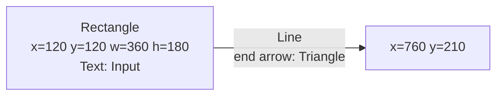
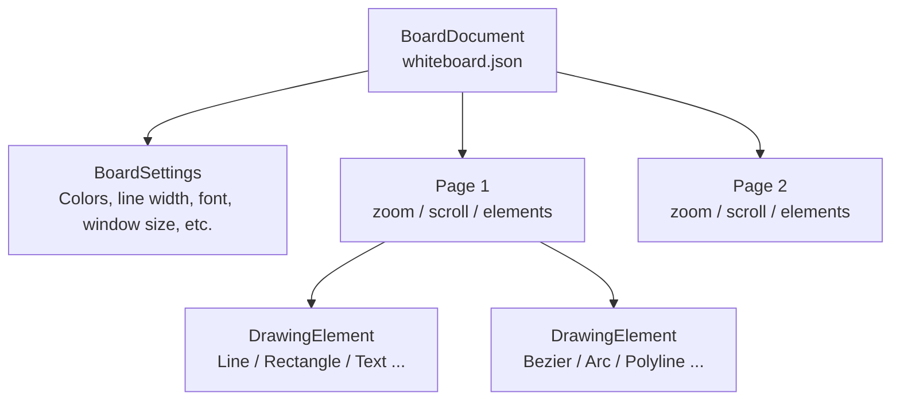
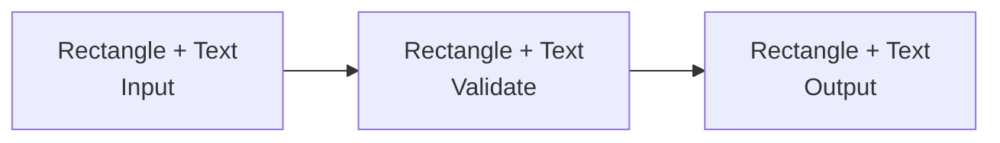
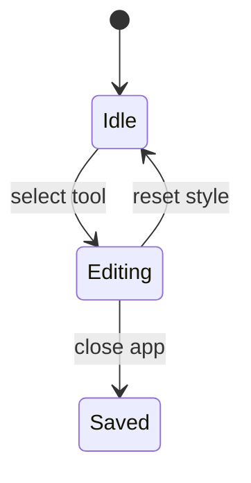

---
genpdf:
  format: book
  title: WhiteboardApp User Guide
  subtitle: A whiteboard for explanatory diagrams
  author: SRA, Inc.
  version: 1.2.0
  date: 2026-09-02
  font_size: 12pt
  page_numbers: true
  copyright: 2026 SRA, Inc. All rights reserved.
  table:
    header_background: "#e8f1ff"
    header_color: "#1f2937"
    border_color: "#cbd5e1"
    border_width: "1px"
    stripe: true
    stripe_background: "#f8fafc"
    cell_padding: "0.45em 0.65em"
    font_size: "0.95em"
    compact: false
    align: left
    header_align: center
    cell_align: left
---

# WhiteboardApp User Guide

## Overview

WhiteboardApp is a Qt Widgets application for explanatory diagrams, technical
notes, and illustrations for online presentations. Place lines, arrows, shapes,
arcs, Bezier curves, and text on a white 1920 x 1080 canvas, then select and edit
them later. Straight lines can connect to shapes, and their endpoints follow
when the connected shapes move.

Its main purpose is to create diagrams that are difficult to re-edit in simple
whiteboards such as Zoom's, while saving them page by page.

| Category | Features |
| --- | --- |
| Drawing | Pen, straight lines, connectors, rectangles, rounded rectangles, ellipses, circles, polylines, Bezier curves, arcs, text |
| Editing | Selection, movement, resizing, rotation, vertex editing, copy, paste, delete, Undo/Redo |
| Style | Line color, fill, line width, corner radius, solid/dotted lines, arrows, fonts, style reset |
| Multiple selection | Rubber-band selection, Ctrl/Command-click to add, grouping, ungrouping |
| Pages | Up to 20 pages, add/delete, previous/next navigation, per-page zoom and scroll position |
| Supporting UI | Color-coded toolbar, click-to-toggle toolbar extension panel, floating action button on the right, shortcut list |
| Storage | Automatic save on exit and restore, image import, PNG/SVG export of the current page |

## Requirements

### Assumed User Knowledge

- Dragging with a mouse or trackpad.
- Basic drawing operations involving shapes, lines, arrows, and text.
- Basic CMake and Qt 6 usage if building from source.

### Environment

| Item | Details |
| --- | --- |
| Application | WhiteboardApp 1.2.0 |
| UI framework | Qt 6 Widgets |
| Build system | CMake 3.16 or later |
| C++ | C++17 |
| Qt components | Core, Gui, HttpServer, Network, Widgets, Test |
| MCP implementation | Minimal JSON-RPC / Streamable HTTP implementation specific to WhiteboardApp |
| macOS build | arm64 / x86_64 universal binary |
| Canvas size | 1920 x 1080 |
| Zoom range | 10% to 400% |
| Maximum pages | 20 |

## Installation or Building

### Build from Source

Build the repository's `whiteboard-app` directory as a CMake project:

```bash
cmake -S whiteboard-app -B whiteboard-app/build
cmake --build whiteboard-app/build
```

`whiteboard-app/VERSION` is the authoritative version source. The CMake project,
application, and MCP `serverInfo.version` use that value. Release changes are
recorded in `whiteboard-app/CHANGELOG.md`.

The root `whiteboard-app.zip` is a generated artifact for local checks and is
not tracked in Git. Official source releases are created at
`whiteboard-app/release/whiteboard-app-<version>-source.zip`, with
`whiteboard-app-<version>/` as the ZIP's top-level directory. Source releases
exclude `DECISIONS.md`, `NEXT.md`, `backlog.md`, `docs/`, and `release/`.

In a macOS environment that bypasses license checks, run:

```bash
QTFRAMEWORK_BYPASS_LICENSE_CHECK=1 cmake --build whiteboard-app/build
```

### Run Tests

```bash
QTFRAMEWORK_BYPASS_LICENSE_CHECK=1 ctest --test-dir whiteboard-app/build --output-on-failure
```

The implementation includes Qt Test unit tests:

| Test | Coverage |
| --- | --- |
| `WhiteboardCoreDrawingTest` | Basic drawing |
| `WhiteboardCoreStyleTest` | Colors, line width/style, arrows, fonts |
| `WhiteboardCoreCurveTest` | Polylines, Bezier curves, opening/closing |
| `WhiteboardCoreSelectionTest` | Selection, movement, copy, groups, connector tracking |
| `WhiteboardCoreDocumentTest` | Saved data, pages, settings, element IDs, connector ID remapping |
| `WhiteboardImageExporterTest` | PNG/SVG bounds, backgrounds, selected elements, SVG IDs, embedded images, extensions, saving |
| `WhiteboardImageImporterTest` | PNG/JPEG/BMP/SVG import, SVG-to-PNG conversion, image-element persistence |
| `WhiteboardImageExportDialogTest` | Export dialog defaults and controls |
| `WhiteboardFloatingActionButtonTest` | Distinguishing FAB clicks and drags |
| `WhiteboardPersistentToolBarTest` | Extension-panel toggling, persistence, repositioning |
| `WhiteboardCanvasCurveTest` | Curve interaction on the canvas |
| `WhiteboardCanvasShapeTextTest` | Shape and text interaction |
| `WhiteboardCanvasSelectionTest` | Canvas selection |
| `WhiteboardMcpTest` | Published tools, batch application, PNG, Undo, input rejection |
| `WhiteboardMcpHttpTest` | Streamable HTTP, sessions, Origin restrictions, diagram application |

### Connect from an MCP Client

On normal startup, WhiteboardApp listens as a local MCP server at
`http://127.0.0.1:8765/mcp`. Register this URL in Codex:

```toml
[mcp_servers.whiteboard]
url = "http://127.0.0.1:8765/mcp"
```

Codex does not launch the application automatically. Start WhiteboardApp first,
then start Codex or reload its MCP connection. The server accepts only loopback
connections. If port 8765 is unavailable, it shows a warning; the whiteboard
itself remains usable.

Do not test connectivity with a plain `GET http://127.0.0.1:8765/mcp`. The server
does not provide a GET SSE stream, so `405 Method Not Allowed` is normal.
Instead, POST a JSON-RPC `initialize` request:

```sh
curl --noproxy '*' -i \
  -H 'Content-Type: application/json' \
  -H 'Accept: application/json, text/event-stream' \
  -d '{"jsonrpc":"2.0","id":1,"method":"initialize","params":{"protocolVersion":"2025-06-18","capabilities":{},"clientInfo":{"name":"curl","version":"1.0"}}}' \
  http://127.0.0.1:8765/mcp
```

A successful response includes `HTTP/1.1 200 OK` and an `Mcp-Session-Id` header.

For clients requiring legacy standard-input/output connections, launch the
executable with `--mcp`. In this compatibility mode, the client starts the
WhiteboardApp process. The server is implemented inside WhiteboardApp; no
external qtmcpserver source tree is required.

The following 16 tools are exposed:

| MCP tool | Purpose | Confirmation required |
| --- | --- | --- |
| `whiteboard/state` | Get current page, navigation availability, lock, selection, Undo/Redo, and elements | No |
| `whiteboard/elements/list` | Get elements and persistent IDs on the current or specified page | No |
| `whiteboard/elements/update` | Batch-update current-page elements by persistent ID | Yes |
| `whiteboard/elements/delete` | Batch-delete current-page elements by persistent ID | Yes |
| `whiteboard/elements/apply` | Add, update, and delete current-page elements in one operation | Yes |
| `whiteboard/pages/list` | Get indexes, element counts, and lock states for all pages | No |
| `whiteboard/page/navigate` | Show the previous or next page | No |
| `whiteboard/page/add` | Add a blank page after the current page | Yes |
| `whiteboard/page/delete` | Delete the current page | Yes |
| `whiteboard/page/lock` | Set the current page's lock state | Yes |
| `whiteboard/diagram/apply` | Apply a diagram in one batch | Yes |
| `whiteboard/page/render` | Get the current page as a 1920x1080 PNG | No |
| `whiteboard/image/export` | Get the current page or selected elements as PNG/SVG data | No |
| `whiteboard/image/save` | Save the current page or selected elements to a PNG/SVG file | Yes |
| `whiteboard/history/undo` | Undo the last change | Yes |
| `whiteboard/history/redo` | Redo an undone change | Yes |

`whiteboard/diagram/apply` supports modes `new_page`, `append_current`, and
`replace_current`. `whiteboard/image/save` requires an absolute path and a matching
`.png` / `.svg` extension. It overwrites an existing file only with explicit
`overwrite: true`. Each batch is one Undo operation. Write requests display a
confirmation dialog; rejecting it leaves the document unchanged. See
`docs/mcp_diagram_capabilities.md` for supported diagrams.

When asking Codex to draw in WhiteboardApp, explicitly request WhiteboardApp's
MCP tools rather than HTML or `visualize`. Example:

```text
Use WhiteboardApp's MCP tools to add a circle with color red, line width 5px,
and radius 50px to the current page. Do not use HTML or visualize.
```

`whiteboard/elements/update` and `whiteboard/elements/delete` validate all IDs
and changes before applying them to the current page. Any nonexistent ID,
duplicate ID, or invalid attribute rejects the entire operation. Each batch
update or deletion is one Undo operation. Element `id` and `type` cannot be
updated. Image elements support updates to `rect`, `rotationDegrees`, and `groupId`.

Element listings and state queries return the document-wide `revision`. Pass
that value as `expectedRevision` for updates, deletions, and combined changes.
If a GUI or other MCP operation has changed the document since reading it, the
stale request is rejected. `whiteboard/elements/apply` accepts up to 500 additions,
updates, and deletions combined and returns mappings from added elements'
`clientId` values to their new persistent IDs.

## Minimal Code Example

Normal users launch and operate the GUI. Developers can use `WhiteboardCore`'s
`BoardModel` to create drawing elements and save them to JSON.

This example adds a rectangle, an arrowed straight line, and text to one page:

```cpp
#include "BoardModel.h"
#include "BoardEnums.h"

#include <QColor>
#include <QPointF>
#include <QRectF>

int main()
{
    BoardModel model;

    model.setSelectedColor(QColor(QStringLiteral("#344054")));
    model.setFillColor(QColor(QStringLiteral("#00000000")));
    model.setStrokeWidth(3);
    model.addRectangle(QRectF(120, 120, 360, 180));

    model.setStartArrowHead(ArrowHead::None);
    model.setEndArrowHead(ArrowHead::Triangle);
    model.addLine(QPointF(480, 210), QPointF(760, 210));

    model.addText(QPointF(150, 155), QStringLiteral("Input"));

    return model.saveToFile(QStringLiteral("whiteboard.json")) ? 0 : 1;
}
```

Resulting layout:



Notes:

- `BoardModel::addLine()` and `addRectangle()` use the current color, line width, line style, and arrow settings at call time.
- A line endpoint over a rectangle, rounded rectangle, ellipse, circle, text, or image connects to that shape.
- `saveToFile()` saves drawings and settings as JSON.
- Selection state is not saved.

## Basic Concepts

### Documents, Pages, and Drawing Elements

Saved data consists of documents, pages, and drawing elements:



| Concept | Description |
| --- | --- |
| `BoardDocument` | Saved unit containing pages, current page, settings, and the next element-ID counter |
| `Page` | One canvas with drawing elements, zoom, scroll position, and lock state |
| `DrawingElement` | A line, shape, text, image, or other element with a persistent ID in saved JSON |
| `BoardSettings` | Current tool, colors, line width, font, window size, and other settings |
| Selection state | Temporary UI state; not saved |

Persistent IDs such as `element-1` and `element-2` are assigned automatically.
Older files without IDs receive them on load without changing appearance,
coordinates, or stacking order. Elements created by copying, pasting, or MCP
receive new IDs distinct from the source. Connected lines store the persistent
IDs of their target shapes.

### Drawing Settings and Selected Objects

The target of color, line width/style, arrow, and font changes depends on selection:

| State | Target |
| --- | --- |
| No object selected | Defaults for the next object |
| Shape or line selected | Selected object's line color, fill, width, style, arrows, etc. |
| Text selected | Selected text's color and font |

## Main Features

### Screen Layout

A white canvas occupies the center. The top toolbar provides drawing, editing,
style, zoom, and page controls.

| Area | Role |
| --- | --- |
| Canvas | Workspace for shapes, lines, and text |
| File menu | Import images; save the current page as PNG or SVG |
| Toolbar | Tools, editing, styles, zoom, and pages; overflow controls appear in an extension panel |
| Floating action button | Vertically draggable on the right; click for Select, Reset, Undo/Redo, Copy, and Paste |
| Page indicator | Current page and total count |
| Help menu | Shortcut list |

### Toolbar Extension Panel

If the window is too narrow for all controls, a downward-arrow extension button
appears at the toolbar's right edge. Click it to display overflow controls below.

- Click again to close it.
- Moving the pointer outside does not close it automatically.
- It stays open after using a tool or setting, allowing further operations.
- Widening the window enough to fit all controls closes it automatically.
- Canvas areas outside the panel still support normal selection, clicking, and dragging.

Page controls appear in this order: page number, previous, next, add, delete,
lock. The lock button is the last toolbar item.

### Tool Selection

Choose a mode with the buttons on the toolbar's left:

| Tool | Shortcut | Purpose |
| --- | --- | --- |
| Select | Ctrl+1 / Command+1 | Select, move, resize |
| Pen | Ctrl+2 / Command+2 | Freehand strokes |
| Eraser | Ctrl+3 / Command+3 | Delete the object at the clicked point |
| Line | Ctrl+4 / Command+4 | Straight lines |
| Rectangle | Ctrl+5 / Command+5 | Rectangles |
| Circle | Ctrl+6 / Command+6 | Circles |
| Text | Ctrl+7 / Command+7 | Text |
| Polyline | Ctrl+8 / Command+8 | Polylines |
| Bezier | Ctrl+9 / Command+9 | Bezier curves |
| Arc | Ctrl+0 / Command+0 | Arcs |

### Creating Shapes and Lines

| Type | Operation | Notes |
| --- | --- | --- |
| Straight line | Drag with Line | Start/end arrows supported |
| Connector | Drag with Line from or onto a shape | Endpoints attach to shape boundaries and follow movement/resizing |
| Rectangle | Drag with Rectangle | Edge handles resize in one direction |
| Rounded rectangle | Drag with Rounded Rectangle | Round sets the corner radius |
| Ellipse | Drag with Ellipse | Edge handles resize in one direction |
| Circle | Drag with Circle | Major and minor diameters stay equal |
| Arc | Drag with Arc | Diameters stay equal; angle handles set start angle and span |
| Pen stroke | Drag with Pen | Creates a freehand stroke |

### Polylines

Each click with Polyline adds a vertex:

| Operation | Result |
| --- | --- |
| Click the canvas | Add a vertex |
| Double-click / Enter | Commit the polyline |
| Ctrl+Enter / Ctrl+Shift+C | Close and commit |
| Esc | Cancel creation |
| Click near the starting point | Close if there are at least three points |
| Ctrl/Command-click an open endpoint | Extend from that endpoint |

### Bezier Curves

Each click with Bezier adds a point through which the curve passes. Curves can
be created with two or more points, including three or more.

| Operation | Result |
| --- | --- |
| Click the canvas | Add a point |
| Double-click / Enter | Commit the curve |
| Ctrl+Enter / Ctrl+Shift+C | Close and commit |
| Esc | Cancel creation |
| Ctrl/Command-click an open endpoint | Extend from that endpoint |

### Text

Click with Text to open a multiline editor:

| Operation | Result |
| --- | --- |
| Ctrl+Enter / Ctrl+Return | Commit text |
| Move focus away from the editor | Commit text |
| Double-click text with Select | Edit existing text |

Editing uses the same color as the committed text. If text is invisible, check
whether Color is white.

### Selection and Movement

Click an object with Select. Selected objects show a bounding frame and handles.

| Operation | Result |
| --- | --- |
| Click an object | Select one object |
| Ctrl/Command-click | Add to selection |
| Drag from empty space | Rubber-band selection |
| Drag a selected object | Move |
| Drag the round handle outside the frame | Rotate |
| Hold Shift while rotating | Rotate in 15-degree increments |
| Double-click a single object's rotation handle | Reset to 0 degrees |
| Arrow keys | Move 1px |
| Delete / Backspace | Delete |

### Resizing and Point Editing

| Target | Operation | Result |
| --- | --- | --- |
| Shape | Drag a corner handle | Resize overall |
| Rectangle, ellipse, circle | Drag an edge handle | Resize perpendicular to that edge |
| Circle, arc | Resize | Keep diameters equal |
| Polyline, Bezier curve | Drag a point handle | Move the point |
| Polyline, Bezier curve | Click a point handle | Select the point, shown in black |
| Selected point | Arrow keys | Move only that point by 1px |
| Line segment | Shift-click | Add a point |
| Point | Shift-click | Delete the point |
| Arc | Drag angle handles | Change start angle and span |

Rotated rectangles, rounded rectangles, ellipses, arcs, and text resize along
their own edges. Multiple selections and groups rotate around the selection's center.

### Copy, Paste, and Groups

| Operation | Shortcut | Description |
| --- | --- | --- |
| Copy | Ctrl+C / Command+C | Copy selected objects |
| Paste | Ctrl+V / Command+V | Paste with a small offset; if no internal copy exists, paste an OS clipboard image |
| Group | Ctrl+G / Command+G | Group selected objects |
| Ungroup | Ctrl+Shift+G / Command+Shift+G | Ungroup |
| Scale Selected Shape | Toolbar | Scale selected objects by a specified factor |

Clicking any member of a group selects the whole group. Multiple objects and
groups can be moved, deleted, copied, pasted, and scaled. When connected lines
and their target shapes are pasted together, lines connect to the pasted shapes.
Pasting a line without its target disconnects that connection.

### Stacking Order

| Operation | Shortcut |
| --- | --- |
| Send backward one level | Ctrl+[ / Command+[ |
| Bring forward one level | Ctrl+] / Command+] |
| Send to back | Ctrl+Shift+[ / Command+Shift+[ |
| Bring to front | Ctrl+Shift+] / Command+Shift+] |

Multiple selections retain their relative stacking order.

### Styles

| Setting | Purpose | With no selection | With a selection |
| --- | --- | --- | --- |
| Color | Line or text color | Next element's line/text color | Shape outline or text color |
| Fill | Fill color | Next supported shape's fill | Selected supported shapes' fill |
| Line | Line width | Next element's width | Selected elements' width |
| Round | Corner radius | Next rounded rectangle's radius | Only selected rounded rectangles |
| Line style | Solid/dotted | Next element's line style | Selected elements' line style |
| Start/end arrow | Endpoint arrows | Next line element's arrows | Selected line elements' arrows |
| Font | Font | Next text object's font | Only selected text |
| Reset Style | Restore standard style | Reset defaults | Reset selected elements' styles |

Arrows can be applied to straight lines, open polylines, Bezier curves, and arcs.
Closed polylines have no endpoints and therefore no arrows.

### Connectors

When creating a straight line, placing a start or end point over a rectangle,
rounded rectangle, ellipse, circle, text, or image connects it to that shape.
Connected endpoints appear on the boundary and follow movement, resizing,
rotation, and scaling.

Drag a connected or disconnected line endpoint onto a shape to reconnect it.
Dropping outside a shape leaves it free. Resizing a line disconnects the endpoint
being manipulated. Deleting a target shape leaves the line in place and removes
only the connection to that shape.

### Pages and Zoom

| Operation | Shortcut | Description |
| --- | --- | --- |
| Previous page | Alt+Left | Go to the preceding page |
| Next page | Alt+Right | Go to the following page |
| Add page | Ctrl+Shift+N / Command+Shift+N | Insert a blank page after the current page |
| Delete page | Ctrl+Shift+Backspace / Command+Shift+Backspace | Delete the current page |
| Zoom Out | Ctrl+- / Command+- | Decrease magnification |
| Zoom In | Ctrl++ / Command++ | Increase magnification |

There can be at most 20 pages. The last remaining page cannot be deleted.
Zoom and scroll position are retained per page.

### Importing Images

Use File → `Import Image...` to import PNG, JPEG, BMP, or SVG into the current
page. Paste inserts OS clipboard images such as screenshots. Supported image
files can also be dragged onto the canvas.

File selection and paste place images at the center of the visible area;
drag-and-drop uses the drop position. Imported images are normal objects and can
be selected, moved, resized, rotated, copied, pasted, grouped, or deleted. Large
images start scaled down to fit the canvas; small images are not enlarged.

SVG files are rasterized to PNG on import rather than decomposed into vector
shapes. Image data is embedded in the saved file, so images remain when
`whiteboard.json` is moved to another host.

Image objects are unaffected by line width/style, fill, arrows, font, and style
reset. Image import, image paste, and image-file drag-and-drop are disabled on locked pages.

### Saving the Current Page as an Image

Use File → `Save Image...` to save the displayed page as PNG or SVG.

1. To save only specific objects, select all of them first.
2. Choose `Save Image...` from File.
3. Choose PNG or SVG and a transparent or white background, then press `Save...`.
4. Choose the destination and filename in the standard file dialog.

| Selection | Exported objects |
| --- | --- |
| Nothing selected | All objects on the current page |
| One or more selected | Only all selected objects |

Output is cropped to the objects' bounds, accounting for line width, arrows,
and rotated shapes. Zoom and scroll position do not affect it. PNG is a raster
image; SVG preserves ordinary drawing elements as vectors and embeds imported
images as `<image>` elements.

The default background is transparent. Selection frames, resize/rotation handles,
rubber bands, and unfinished shapes are excluded. Text being edited is committed
before saving. `Save Image...` is unavailable on empty pages but works on locked pages.

If no extension is provided, `.png` or `.svg` is added according to the selected
format. If the extension and format disagree, the extension takes precedence.
Overwrite confirmation follows the standard file dialog. Failed saves can be
retried with the same settings.

### Floating Action Button

A circular floating action button appears at the canvas's right edge.

| Operation | Description |
| --- | --- |
| Click | Expand/collapse child buttons |
| Drag vertically | Reposition along the right edge |
| Undo / Redo child button | Keep expanded after execution |
| Select / Reset / Copy / Paste child button | Collapse after execution |

Child buttons use a lightweight position-only slide animation. There is no
transparent full-height panel, so the right side of the canvas remains largely accessible.

## Settings

Main settings saved in `BoardSettings` and page data:

| Setting | Default | Range / details |
| --- | --- | --- |
| Tool | Pen | Select, Pen, Eraser, Line, Rectangle, RoundedRectangle, Ellipse, Circle, Polyline, Bezier, Arc, Text |
| Line color | `#344054` | Qt `QColor` |
| Fill | Transparent | Qt `QColor` |
| Line width | 3 | 0 or greater; 0 means no outline |
| Corner radius | 24 | Used for rounded rectangles |
| Line style | Solid | Solid or Dotted |
| Font | Sans Serif 18pt | Used for text |
| Window size | 1850 x 900 | Restored on next launch |
| FAB Y position | Unset | Initially near the bottom-right; saved after movement |
| Start arrow | None | None, Triangle, Open, Diamond |
| End arrow | None | None, Triangle, Open, Diamond |
| Page zoom | 100% | 10% to 400% |
| Page scroll position | (0, 0) | Saved per page |

## Saving and Loading

On exit, the application saves settings, pages, and drawings to `whiteboard.json`.
They are restored on the next launch.

Saved:

- Pages and drawing objects
- Target IDs for straight-line endpoints
- Current page
- Selected tool
- Colors, fill, line width, corner radius, line style
- Arrow settings
- Font
- Per-page zoom
- Per-page scroll position
- Window size
- FAB vertical position

Not saved:

- Selection state
- Uncommitted input in progress
- Undo/Redo history

Storage locations:

| OS | Location |
| --- | --- |
| macOS | `~/Library/Application Support/WhiteboardApp/whiteboard.json` |
| Linux | `~/.local/share/WhiteboardApp/whiteboard.json` |
| Windows | `C:\Users\<username>\AppData\Roaming\WhiteboardApp\whiteboard.json` |

### Exchanging Editable Drawing Data

Choose File → Export Drawing Data… and select All Pages or Current Page to save
a `.whiteboard` file. The entire specified page or pages are exported, not just
the selection. Images are embedded, so separate image files are unnecessary.

To import, choose File → Import Drawing Data… and select the file. Its pages
are inserted in order immediately after the current page; existing drawings
remain. Older autosaved `whiteboard.json` files can also be selected.

- Shapes, text, images, rotation, stacking, groups, connector links, and page locks are preserved.
- Per-page zoom and scroll are preserved; the selected tool and window size remain unchanged.
- The original page stays displayed. The added-page count is reported, and one Undo reverses the entire import.
- Imports that would exceed 20 pages fail instead of truncating pages.
- Import is unavailable when the current page is locked or the document already has 20 pages.
- Export works on locked and empty pages. Text being edited is committed before export.
- Unsupported or damaged files are rejected with an error.
- Text may use a substitute font if the receiving system lacks the original font.

`.whiteboard` is for continued editing. For viewing images, use Save Image… to export PNG/SVG.

## Practical Examples

### Create a Process Flow Diagram

1. Place processing units with Rectangle.
2. Add names with Text.
3. Connect units with Line.
4. Set the end arrow to Triangle.
5. Use dotted lines for secondary flows.
6. Group boxes and labels as needed.



### Create a State Diagram

1. Place states with Circle or Ellipse.
2. Use arrowed Line or Arc elements for transitions.
3. Add event names with Text.
4. Use dotted lines for exceptional transitions.



### Enlarge Part of an Existing Diagram

1. Drag from empty space with Select to rubber-band-select objects.
2. Add objects with Ctrl/Command-click if needed.
3. Run Scale Selected Shape.
4. Enter a scale factor.

Multiple selections scale around the center of their combined bounding rectangle.

## Sample List

| Sample | Purpose | Main features |
| --- | --- | --- |
| Minimal code example | Create and save a rectangle, arrow, and text with `BoardModel` | `addRectangle`, `addLine`, `addText`, `saveToFile` |
| Process flow diagram | Show processing order with boxes, labels, and arrows | Rectangle, Text, Line, Arrow |
| State diagram | Show states and transitions | Circle/Ellipse, Line, Arc, Text |
| Scale multiple objects | Enlarge part of an existing diagram | Rubber band, Scale Selected Shape |

## Shortcut Reference

| Operation | Shortcut |
| --- | --- |
| Select | Ctrl+1 / Command+1 |
| Pen | Ctrl+2 / Command+2 |
| Eraser | Ctrl+3 / Command+3 |
| Line | Ctrl+4 / Command+4 |
| Rectangle | Ctrl+5 / Command+5 |
| Circle | Ctrl+6 / Command+6 |
| Text | Ctrl+7 / Command+7 |
| Polyline | Ctrl+8 / Command+8 |
| Bezier | Ctrl+9 / Command+9 |
| Arc | Ctrl+0 / Command+0 |
| Delete selected | Delete / Backspace |
| Copy | Ctrl+C / Command+C |
| Paste | Ctrl+V / Command+V |
| Group | Ctrl+G / Command+G |
| Ungroup | Ctrl+Shift+G / Command+Shift+G |
| Undo | Ctrl+Z / Command+Z |
| Redo | Ctrl+Y / Ctrl+Shift+Z / Command+Shift+Z |
| Bring Forward | Ctrl+] / Command+] |
| Send Backward | Ctrl+[ / Command+[ |
| Bring to Front | Ctrl+Shift+] / Command+Shift+] |
| Send to Back | Ctrl+Shift+[ / Command+Shift+[ |
| Close selected polyline/bezier | Ctrl+Shift+C |
| Open selected polyline/bezier | Ctrl+Shift+O / Command+Shift+O |
| Previous Page | Alt+Left |
| Next Page | Alt+Right |
| Add Page | Ctrl+Shift+N / Command+Shift+N |
| Delete Page | Ctrl+Shift+Backspace / Command+Shift+Backspace |
| Text Commit | Ctrl+Enter / Ctrl+Return |

## Page Lock

The lock button in the page controls locks the current page. A locked page
allows only selection, copying, page navigation, zooming, and scrolling.
Adding drawings, deleting, pasting, moving, resizing, editing text, changing
styles, grouping, Undo/Redo, and deleting the page are disabled.

## Notes

### Text Is Invisible

Color may be white. Select the text and choose a dark Color, or use Reset Style.

### Shape Outlines Are Missing

A line width of 0 hides the outline. Set Line to 1 or greater.

### Arrows Are Missing

A line width of 0 also hides arrows. Closed polylines have no endpoints and cannot show arrows.

### Fill Does Not Apply

Fill is supported for rectangles, rounded rectangles, ellipses, circles, and
closed polylines. It does not apply to straight lines, open polylines, Bezier
curves, arcs, or text.

### Some State Is Not Saved

Selection, input in progress, and Undo/Redo history are not saved. Commit
polylines, Bezier curves, and text before exiting.

### Changes After Forced Termination

Saving occurs on normal exit or window closure. A forced termination or crash
may lose changes made since the last normal exit.

### macOS Key Labels

Some application instructions say Ctrl. Tool selection, copying, pasting,
grouping, and similar operations also support Command.
